# 不同的概率分布第二部分

> 原文：<https://pub.towardsai.net/different-probability-distributions-part-2-ecd72d8bdc97?source=collection_archive---------1----------------------->

## [概率](https://towardsai.net/p/category/probability)

现在，我们将看到连续变量分布，而在第 1 部分中，我们看到了离散分布。在连续分布中，点概率等于“0 ”,整个范围内的一些概率为“1”。不同类型的连续分布有:
1。均匀分布
2。正态分布
3。指数分布
4。卡方分布
5。伽马分布
6。学生 t 分布
7。f 分布
8。对数正态分布

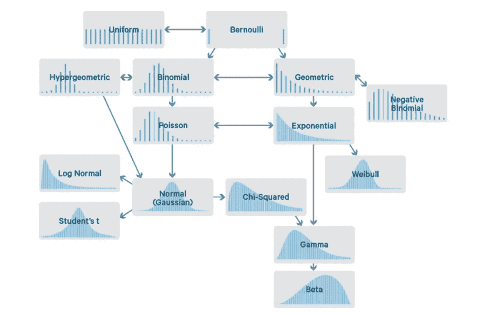

不同的分布

## 均匀分布

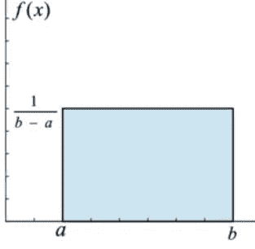

均匀分布

在均匀分布或矩形分布中，数据在给定的间隔内均匀分布，其中 X 取 2 个指定值(a，b)之间的值。
a < X < b 或 X€(a，b)其中 X~U(a，b)
PDF=f(x)=1/(b-a)当 a < X < b 或 0 否则。
曲线下的总面积为 1。
CDF=f(x)=x-a/(b-a)当 a < X < b 和 1 当 x > =b
均值=(b + a)/2
方差=(b-a) /12

## 正态分布

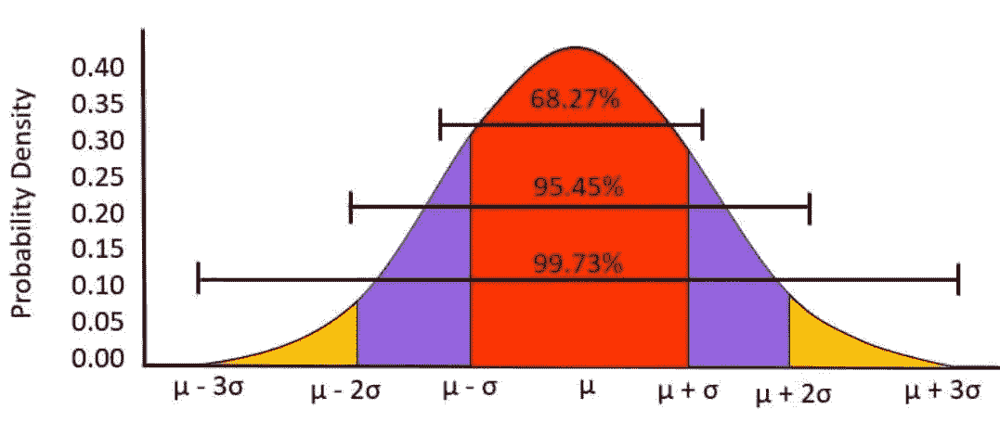

正态分布

这里，数据以对称方式或高斯方式分布在一条钟形曲线中，该曲线平均分为两部分。曲线下的总面积为 1。平均值的变化将使图表向左或向右移动。图形末端永远不会触及基线(渐近线)。
X~N(μ，σ)

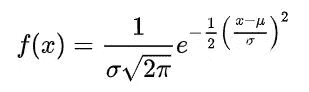

概率分布函数

为了解决这个问题，我们必须把这个分布转换成标准的正态分布。它具有正态分布的所有性质，其中μ为 0，σ为 1。
这里ƶ是一个标准正态变量，等于(x-μ)/σ。
ƶ ~ SND(0，1)
无论何时我们改变σ，图形都会变宽或变细。我们将计算 z 得分，这意味着我们离平均值有多远，我们将从 z 得分表中获得概率值。

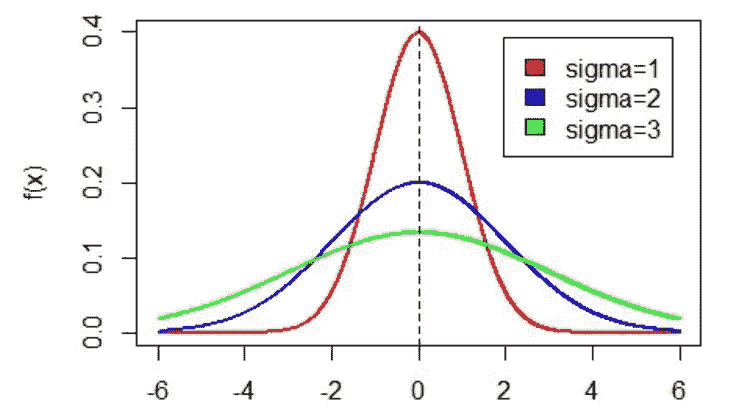

改变σ，图形会变宽或变细

## 指数分布

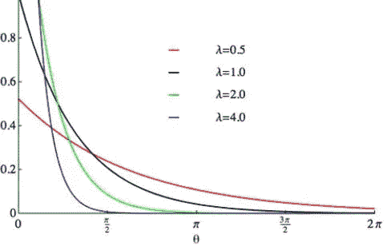

指数分布

指数分布用于模拟某个特定独立事件以恒定的平均速率发生之前的时间。X 是等待时间或事件发生所需的时间。
X~E(λ)
λ是事件发生的速率。

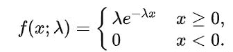

概率分布函数

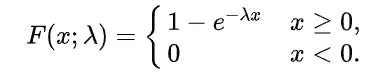

累积分布函数

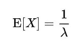

平均

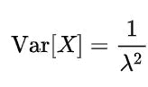

差异

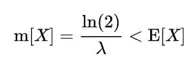

中位数

## 卡方分布

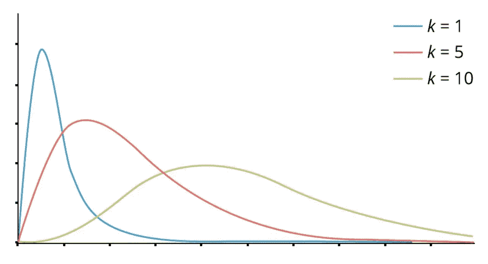

卡方分布

当我们平方标准正态变量时，我们将得到𝞦。它被广泛用于假设检验和寻找置信区间，我们将在以后的文章中看到。这里我们有自由度，也就是“k ”,我们可以通过从可用特征数(n)中减去 1 来得到它。
𝞦(0，∞)和𝞦~n(μ,σ(€)。随着 k 的增加，我们的图形将更加规范化。

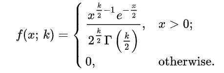

概率分布函数

对于 CDF，我们需要了解伽马分布，因为卡方分布是伽马分布的一个特例。

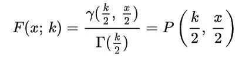

累积分布函数

均值=k
方差=2k

## 伽马分布

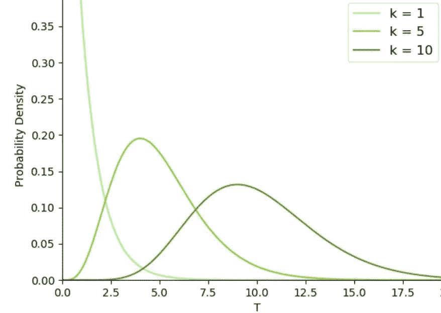

伽马分布

这种分布主要用于模拟事件发生前的等待时间。伽玛、指数、泊松分布是泊松过程的同一个方面。伽玛函数和伽玛分布是两个不同的概念。

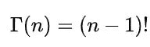

伽马函数

这里我们有两个参数:形状参数α和比例参数β *。*当我们用 1 除以β时，我们将得到一个速率参数。

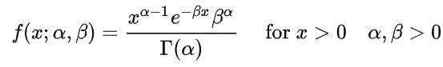

概率分布函数

均值=αβ
方差=αβ

## 学生 t 分布

从总体(正态分布)中抽取一个小样本来得到总体的估计值，我们也不知道总体的标准差。它用于评估[统计显著性](https://en.wikipedia.org/wiki/Statistical_significance)，构建置信区间，以及线性回归分析。

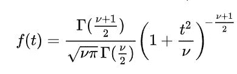

概率分布函数

均值=0
中位数=0
众数=0
方差=N/(N-2)其中 N > 2，N/(N-1)其中 N≥1。

## f 分布

f 分布常用于方差分析。

## 对数正态分布

每当我们有一条偏斜曲线，为了得到一条高斯曲线，我们取它的对数，所以我们得到一条正态曲线，然后这个分布被称为对数正态分布。

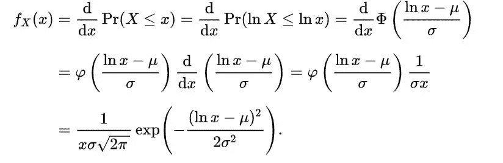

概率分布函数

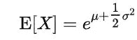

平均

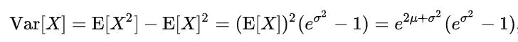

差异

## 结论

我们已经从数据科学的角度讨论了这两种类型的分布，在阅读本文后，我们应该掌握的关于分布的知识将足够用于后续的主题。为了更好地理解，也检查其他文章。