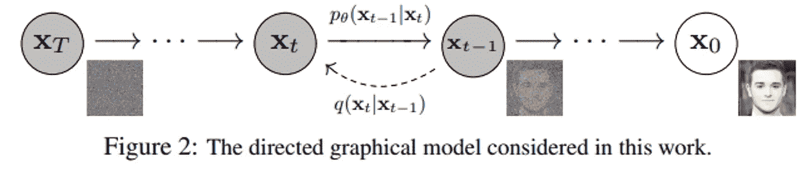
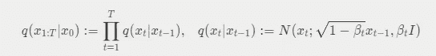
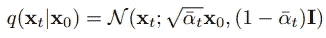
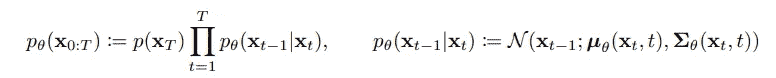
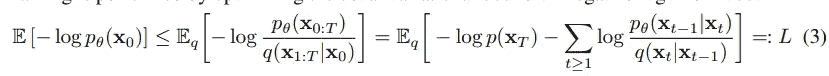
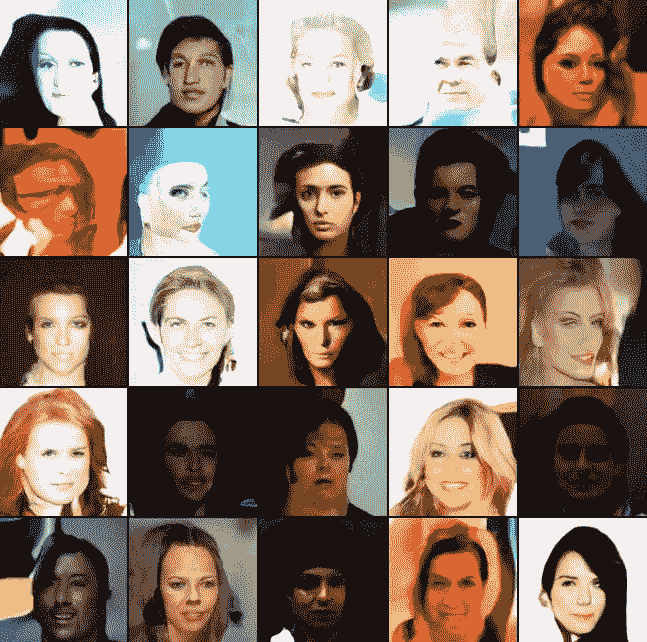

# 扩散模型——我的“第二个？”艺术家。

> 原文：<https://pub.towardsai.net/diffusion-models-my-second-artist-42f8aa0d31ab?source=collection_archive---------3----------------------->

扩散模型是深度学习中最流行的算法之一。它被广泛用于许多应用中，例如图像生成、对象检测和文本到图像的生成。在本文中，我将解释扩散模型是如何工作的(链接到论文[去噪扩散概率模型](https://arxiv.org/pdf/2006.11239v2.pdf)

该算法的主要思想是有两个随机过程:

*   正向过程(扩散过程)
*   翻转过程

其中正向过程是固定的马尔可夫链，反向过程通常是用于生成图像的 Unet。下面将详细介绍这两个过程。

# 这两个过程是详细的

如果你不熟悉随机过程，下面可能会让你头疼。就我所知，我会直观的解释一下。

## 前进的过程

该过程是一个具有高斯转移的固定马尔可夫链，其方差为β1，…，βT。在每个时间步，该过程将向图像添加一个具有给定方差的高斯噪声。

## 直观的解释

假设每个图像是一个数据点，那么你的整个数据集将形成一个分布。给定当前状态 x_t-1，跃迁 q(x_t | x_t-1)告诉我们下一个状态 x_t 的分布。然后，可以通过来自给定分布的递归样本数据来完成正向过程。或者，数学上，我们有封闭的形式:

其中，α t:= 1βt，αt 是 a_0 与 a_t 的累计乘积，然后我们可以根据给定的预定方差从 x_0 直接采样 x_t。而当时间步长 T 足够大时，注意(1-βt) < 1, α¯t will reach to 0\. This means the distribution of x_T will be approximate, a standard multivariate Gaussian.

## The reverse process

This process is our deep learning model, where you sample some random noise and get an image. BUT how does it work? As above I mentioned that, we could treat our dataset as a distribution. Hence, if we find some way to sample a data point from it, we’ll get a real-looking image.

Then the task for our model is to learn to sample the data distribution by trying to reverse the forward process. Particularly, in generating, the inputs of model, x_T, will be in standard Gaussian, then it reverses the process with learned Gaussian transition:

>训练

*   给定一个输入图像，正向过程将采样 x_t
*   然后，采样的 x_t 将馈入模型，并尝试预测图像

然后通过以下方式计算损失:

这可以解释为两个过程的跃迁分布之间的 KL 散度。实际上，这个公式简化为:

有相当多的数学和其他参数来达到这一点，所以我把它留给有兴趣阅读这篇论文的人。

## 为什么是 KL 发散？

KL 散度告诉我们两个分布之间的长距离。我们想要的是使生成的图像的分布类似于数据集中图像的分布。然后，通过最小化 KL 散度，所生成图像的分布将被推向接近真实分布。

*   思考:这不是唯一一个可以判断两个分布有多远的函数。事实上，在训练甘完成类似的任务时，我们有时会使用“推土机距离”(Wasserstein Loss)。但是为什么选择 KLD 呢？

# 训练一个模型生成一张名人脸。

我使用了来自[luci drains/去噪-扩散-pytorch](https://github.com/lucidrains/denoising-diffusion-pytorch) 的优秀作品在 Kaggle 上的 CelebA 数据集上进行训练。[我的笔记本](https://www.kaggle.com/code/minguer/fake-celeb-with-diffusion-models)

谢谢你

这是我第一篇分享实习中获得的知识的文章。希望我在这里分享的可以帮助到别人。如果你觉得这很有帮助，但是有所遗漏，请在评论中分享你的想法。我将非常感激。