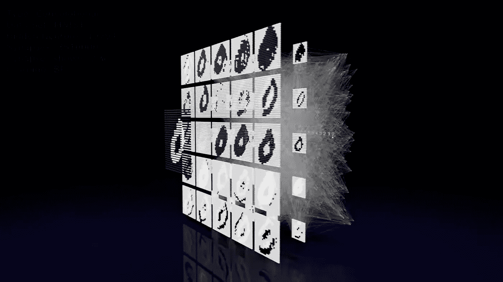
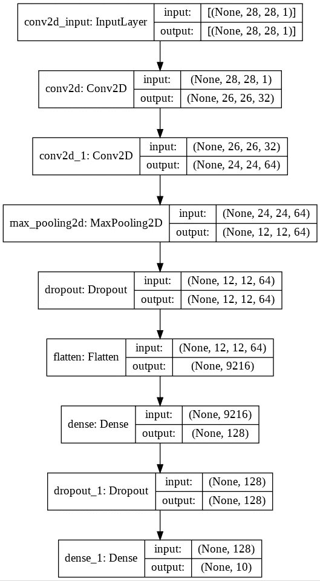
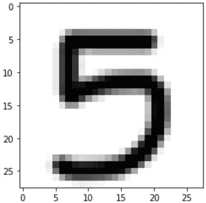

# 使用 CNN，Keras 深度学习框架进行数字分类

> 原文：<https://pub.towardsai.net/digit-classification-using-cnn-keras-deep-learning-framework-3b4cfbafa285?source=collection_archive---------2----------------------->

## [深度学习](https://towardsai.net/p/category/machine-learning/deep-learning)

## 详细的解释和算法，改进了我以前的代码。完整的代码[可在我的回购。](https://github.com/arditoibryan/Projects/blob/master/20200724_Image_Classification/Digit_Classification_2.ipynb)

[**点击这里了解我，我的项目，我的最新文章。**](http://www.michelangiolo.best/)

在 2020 年，我已经发表了一篇关于如何进行数字分类的类似文章。尽管代码和结果几乎相同(毕竟是同一个问题)，但今年，在了解了更多关于深度学习架构的知识后，我对自己的代码有了更多的了解，并进行了更多的改进，引入了新的功能，希望能够解释笔记本的所有组件。



卷积神经网络的 3D 表示

## 最难的概念

在执行图像分类时，有几个元步骤是使用 CNN 时所有类似模型共有的，但在第一次使用时可能会引起一些混淆:

*   导入数据集
*   规范化和反规范化(如果需要)
*   数据扩充

通过使用 **mnist** 库，我已经可以下载完整的 70，000 个 28x28 个一位数的数据集。不幸的是，数据集已经被分割成训练和集合分区(X_train，y_train，X_test，y_test)，我认为这在导入数据集时是一个非常糟糕的做法:在预处理阶段处理整个数据集之前，只有在最后才应该分割数据，因为这是将数据输入模型之前的最后一步。

## 为什么要标准化数据

对于 LSTM 和 CNN，图像需要调整到相同的形状(它们已经是 28x28，但对于更复杂的数据集，这是一个强制性的步骤，您需要使用额外的代码行来执行)。然后，所有编码的像素，可能只有黑白的，也有三维的 RGB，都需要归一化:从[0，255]的范围，要压缩到[0，1]的范围。

```
X_train /= 255
X_test /= 255
```

这是用于标准化图像数据(转换为 NumPy 数组)的标准代码。对于图像来说完美的原因是，在标准化期间，我需要指定用于标准化目的的范围。相反，我更喜欢使用我自己的代码(您可以在图像和数字数据上测试它，结果与允许您执行规范化的 scikit-learn 工具相同)，原因只有一个:您可以从库中找到的所有规范化工具都不能反规范化数据。执行影像分类时，此步骤可能不是必需的，但对于 LSTM 等数值模型，您需要在模型完成后再次对数据进行反规格化。

```
def create_scaler(*args):
  min_d = np.min(args[0])
  max_d = np.max(args[0])
  for partition in args:
    if np.min(partition) < min_d:
      min_d = np.min(partition)
    if np.max(partition) > max_d:
      max_d = np.max(partition)
  return [min_d, max_d]def normalizer(scaler, df):
  min_d = scaler[0]
  max_d = scaler[1]
  normalized_df = (df - min_d) / (max_d - min_d)
  return normalized_dfdef denormalizer(scaler, normalized_df):
  min_d = scaler[0]
  max_d = scaler[1]
  denormalized_df = normalized_df * (max_d - min_d) + min_d
  return denormalized_df
```

我使用这个工具来标准化数据所需要的只是原始数据，我可以手动输入或者使用 create_scaler 发现的 scaler(数据的范围)。为了**反规格化数据**(将其转换回原始形式)，相反，我需要的是规格化版本和缩放器。您将在下面的代码中看到这一点。

## 数据扩充

当训练数据不足时，我们可以人为地创建原始数据集的变体来扩展其大小。例如，如果我想只在 1000 张图像上创建一个模型(就像我通常做的那样)，这就不是一个足够的训练规模。我能做的是通过改变它们的形状和旋转来创建原始图像的变体，只要它们最终都具有相同的大小，以便模型可以接受它们。那 1000 张图片可以变成 20000 张。

因为数字分类在训练集中已经有 60，000 个图像，所以不需要增加数据。

# 让我们编码

## 1.导入库

```
#to import data + preprocessing
import numpy as np
from keras.datasets import mnist
import matplotlib.pyplot as plt
%matplotlib inline#to build the CNN
import tensorflow
from keras.models import Sequential
from keras.layers import Dense, Dropout, Flatten, Conv2D, MaxPooling2D#test on a new image
import imageio
import numpy as np
from matplotlib import pyplot as plt
```

## 2.看着这些数据

```
(X_train, y_train), (X_test, y_test) = mnist.load_data()
print(X_train.shape)
print(X_test.shape)
print(y_train.shape)
print(y_test.shape)
```

## 3.预处理

```
#show one image with label
print(y_train[0])
plt.imshow(X_train[0], cmap='Greys')
plt.show()
```

我现在将塑造数据，使其适合神经网络。在它准备好之后，我还需要对它进行规范化。我使用我自己的定标器是出于一个非常精确的原因，事实上，对于常规的 sklearn 模型，我不能将其反向规格化。虽然这个模型处理的是分类数据，但我不需要逆向缩放，但使用最好的算法总是一个好的实践。

```
#change shape to IMAGES only for CNN input
X_train = X_train.reshape(60000, 28, 28, 1)
X_test = X_test.reshape(10000, 28, 28, 1)
#the labels are already in an acceptable shape#normalize image data only
scaler = create_scaler([0, 255])
X_train_ = normalizer(scaler, X_train)
X_test_ = normalizer(scaler, X_test)
```

我还想包含不推荐使用的代码，这样您就可以看到我使用的代码和我以前想使用的代码之间的区别。

```
#DEPRECATED: normalize, identical to the new method
import numpy as np
X_train = np.array(X_train, dtype=np.float64)
X_test = np.array(X_test, dtype=np.float64)
X_train /= 255
X_test /= 255
```

## 4.美国有线新闻网；卷积神经网络

不幸的是，没有一种简单的方法来创建 CNN。我使用的是 Keras 提供的标准表格。

```
model = Sequential()
model.add(Conv2D(32, kernel_size=(3, 3),
     activation='relu',
     input_shape=(28, 28, 1))) #image size
model.add(Conv2D(64, (3, 3), activation='relu'))
model.add(MaxPooling2D(pool_size=(2, 2)))
model.add(Dropout(0.25))
model.add(Flatten())
model.add(Dense(128, activation='relu'))
model.add(Dropout(0.5))
model.add(Dense(10, activation='softmax')) #number of classesmodel.compile(loss='sparse_categorical_crossentropy',
      optimizer='adam',
      metrics=['accuracy'])batch_size = 128
epochs = 10
```

这是输出:

```
Epoch 1/10
469/469 - 136s - loss: 0.2464 - accuracy: 0.9248 - val_loss: 0.0534 - val_accuracy: 0.9831
Epoch 2/10
469/469 - 135s - loss: 0.0860 - accuracy: 0.9749 - val_loss: 0.0437 - val_accuracy: 0.9864
Epoch 3/10
469/469 - 141s - loss: 0.0638 - accuracy: 0.9806 - val_loss: 0.0355 - val_accuracy: 0.9879
Epoch 4/10
469/469 - 135s - loss: 0.0513 - accuracy: 0.9842 - val_loss: 0.0328 - val_accuracy: 0.9891
Epoch 5/10
469/469 - 135s - loss: 0.0458 - accuracy: 0.9848 - val_loss: 0.0266 - val_accuracy: 0.9918
Epoch 6/10
469/469 - 135s - loss: 0.0370 - accuracy: 0.9880 - val_loss: 0.0291 - val_accuracy: 0.9912
Epoch 7/10
469/469 - 134s - loss: 0.0318 - accuracy: 0.9896 - val_loss: 0.0300 - val_accuracy: 0.9908
Epoch 8/10
469/469 - 134s - loss: 0.0300 - accuracy: 0.9908 - val_loss: 0.0342 - val_accuracy: 0.9905
Epoch 9/10
469/469 - 135s - loss: 0.0278 - accuracy: 0.9914 - val_loss: 0.0299 - val_accuracy: 0.9919
Epoch 10/10
469/469 - 134s - loss: 0.0240 - accuracy: 0.9924 - val_loss: 0.0310 - val_accuracy: 0.9914
313/313 - 6s - loss: 0.0310 - accuracy: 0.9914
Test loss: 0.03104633092880249
Test accuracy: 0.9914000034332275
```

查看模型的摘要总是一个好的做法。我可以使用 Keras 模型类中可用的 summary 方法来做到这一点。

```
#   summarize model_1
#input layer not included
model.summary(line_length=None, positions=None, print_fn=None)Model: "sequential"
_________________________________________________________________
Layer (type)                 Output Shape              Param #   
=================================================================
conv2d (Conv2D)              (None, 26, 26, 32)        320       
_________________________________________________________________
conv2d_1 (Conv2D)            (None, 24, 24, 64)        18496     
_________________________________________________________________
max_pooling2d (MaxPooling2D) (None, 12, 12, 64)        0         
_________________________________________________________________
dropout (Dropout)            (None, 12, 12, 64)        0         
_________________________________________________________________
flatten (Flatten)            (None, 9216)              0         
_________________________________________________________________
dense (Dense)                (None, 128)               1179776   
_________________________________________________________________
dropout_1 (Dropout)          (None, 128)               0         
_________________________________________________________________
dense_1 (Dense)              (None, 10)                1290      
=================================================================
Total params: 1,199,882
Trainable params: 1,199,882
Non-trainable params: 0
_________________________________________________________________
```

还有一种非常有趣的可视化图层的方式:

```
#   summarize model_2
#input layer is included
from keras.utils.vis_utils import plot_model
plot_model(model, show_shapes=True, show_layer_names=True)
```



我现在可以训练模型了。这将需要几分钟的时间，虽然这仍然是一个雏形。通常，更复杂的图像数据需要几个小时，甚至几天来训练:这是云计算能力所必需的。

```
model.fit(X_train_, y_train,
          batch_size=batch_size,
          epochs=epochs,
          verbose=2,
          validation_data=(X_test, y_test))score = model.evaluate(X_test, y_test, verbose=2)
print('Test loss:', score[0])
print('Test accuracy:', score[1])
```

## 5.在图像上测试它

我可以简单地在我已经从 **mnist 数据集**下载的数据上测试模型(这就是我的准确度分数是如何计算的)，但是下载一个非标准化的图像并测试它会很好。

```
im = imageio.imread("[https://i.imgur.com/a3Rql9C.png](https://i.imgur.com/a3Rql9C.png)")#visualize image
gray = np.dot(im[...,:3], [0.299, 0.587, 0.114])
plt.imshow(gray, cmap = plt.get_cmap('gray'))
plt.show()
```



URL 上提供的图像

在我下载了图像之后，我需要对它进行标准化，这样模型就可以在上面工作了。

```
# reshape the image
gray = gray.reshape(1, 28, 28, 1)# normalize image
gray /= 255
```

现在我可以在上面测试模型了。人工智能会识别这个号码吗？

```
#predict digit in x_train
prediction = model.predict(X_test[0].reshape(1, 28, 28, 1))
print(y_test[0], prediction.argmax())5
```

太好了，人工智能识别出这是一个数字 5。