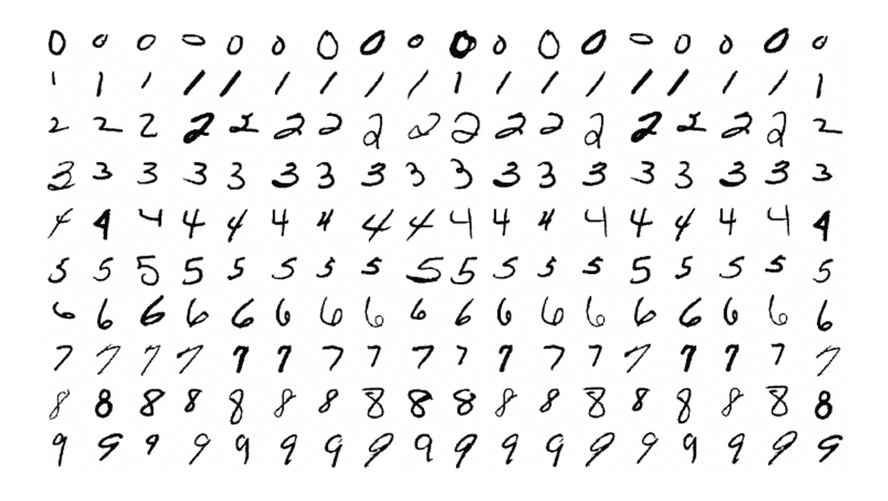
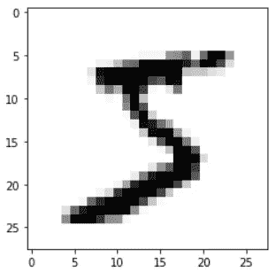

# 使用张量流的数字分类，Keras

> 原文：<https://pub.towardsai.net/digit-classification-using-tensorflow-keras-db16f2ea321e?source=collection_archive---------1----------------------->

## [深度学习](https://towardsai.net/p/category/machine-learning/deep-learning)

## 全部代码可在我的 Github repo 的[获得。来源可以在](https://github.com/arditoibryan/Projects/tree/master/20200724_Image_Classification)[网站](https://www.sitepoint.com/keras-digit-recognition-tutorial/)上找到。

当开始在卷积神经网络上工作时，数字分类是一个经典的练习。深度学习在图像分类上的表现令人难以置信。我曾在网上搜索过类似的教程，但它们中的许多都没有使用标准化的数据集，其他的在代码中有错误或者已经过时，所以我从现有的一个教程中取了一些代码来编写这个详细的指南。



Mnist 数据集中的数字

在整篇文章中，我将使用由 28x28 位数字组成的 mnist 数据集。如果要进行图像分类(比如说猫 vs 狗)，可以使用相同的代码作为基础(虽然这个代码处理的是灰度图像，但还不能适应 RGB)。

## 导入库

```
from keras.datasets import mnist
%matplotlib inline
import matplotlib.pyplot as pltOutput: Using TensorFlow backend
```

## 导入数据

我可以访问这个数据集的最简单的方法是通过访问 **mnist 库**。数据集已经被拆分，可以在四个分区中使用。

```
(X_train, y_train), (X_test, y_test) = mnist.load_data()
print(X_train.shape)
print(X_test.shape)Output:
(60000, 28, 28)
(10000, 28, 28)
```

在检查了训练和测试分区的形状之后，整个数据集由总共 70，000 个数字 28x28 组成。我将使用 60.000 来训练 AI，其余的数据集来衡量准确性。

## 显示数据集中的图像

在开始创建模型之前，我想知道我正在使用哪种数据。本质上，我将所有特征(图像)存储在 **X** 数据集中(训练和测试)，而所有标签存储在 **y** 数据集中(训练和测试)。

```
#show one image with label
#print(y_train[0]) label
plt.imshow(X_train[0], cmap='Greys') #feature/image
plt.show()
```



X_train[0]

## 预处理

预处理阶段允许我为 CNN(卷积神经网络)准备数据。我将首先必须重塑数据添加一个额外的维度，然后将其规范化。

```
#save in the right format for CNN input
X_train = X_train.reshape(60000, 28, 28, 1)
X_test = X_test.reshape(10000, 28, 28, 1)
X_train.shape
```

为了规范化数据，我必须将它转换成浮点类型的 numpy 数组。

```
#normalize
import numpy as np
X_train = np.array(X_train, dtype=np.float64)
X_test = np.array(X_test, dtype=np.float64)
X_train /= 255
X_test /= 255
```

## 创建模型

我从这个来源得到了这个模型。显而易见，主要开发人员已经进行了大量调整，以确定最佳超参数。

```
import tensorflow
from keras.models import Sequential
from keras.layers import Dense, Dropout, Flatten, Conv2D, MaxPooling2Dmodel = Sequential()
model.add(Conv2D(32, kernel_size=(3, 3),
     activation='relu',
     input_shape=(28, 28, 1))) #image size
model.add(Conv2D(64, (3, 3), activation='relu'))
model.add(MaxPooling2D(pool_size=(2, 2)))
model.add(Dropout(0.25))
model.add(Flatten())
model.add(Dense(128, activation='relu'))
model.add(Dropout(0.5))
model.add(Dense(10, activation='softmax')) #number of classesmodel.compile(loss='sparse_categorical_crossentropy',
      optimizer='adam',
      metrics=['accuracy'])batch_size = 128
epochs = 10model.fit(X_train, y_train,
          batch_size=batch_size,
          epochs=epochs,
          verbose=2,
          validation_data=(X_test, y_test))score = model.evaluate(X_test, y_test, verbose=0)
print('Test loss:', score[0])
print('Test accuracy:', score[1])
```

## 培训产出

```
Train on 60000 samples, validate on 10000 samples
Epoch 1/10
 - 152s - loss: 0.2349 - accuracy: 0.9284 - val_loss: 0.0476 - val_accuracy: 0.9844
Epoch 2/10
 - 141s - loss: 0.0860 - accuracy: 0.9742 - val_loss: 0.0369 - val_accuracy: 0.9873
Epoch 3/10
 - 148s - loss: 0.0602 - accuracy: 0.9814 - val_loss: 0.0340 - val_accuracy: 0.9886
Epoch 4/10
 - 141s - loss: 0.0523 - accuracy: 0.9835 - val_loss: 0.0302 - val_accuracy: 0.9899
Epoch 5/10
 - 140s - loss: 0.0436 - accuracy: 0.9866 - val_loss: 0.0313 - val_accuracy: 0.9899
Epoch 6/10
 - 141s - loss: 0.0377 - accuracy: 0.9872 - val_loss: 0.0311 - val_accuracy: 0.9907
Epoch 7/10
 - 140s - loss: 0.0343 - accuracy: 0.9889 - val_loss: 0.0296 - val_accuracy: 0.9911
Epoch 8/10
 - 140s - loss: 0.0295 - accuracy: 0.9902 - val_loss: 0.0279 - val_accuracy: 0.9915
Epoch 9/10
 - 141s - loss: 0.0246 - accuracy: 0.9919 - val_loss: 0.0269 - val_accuracy: 0.9917
Epoch 10/10
 - 140s - loss: 0.0232 - accuracy: 0.9926 - val_loss: 0.0304 - val_accuracy: 0.9913
Test loss: 0.030353095355434654
Test accuracy: 0.9912999868392944
```

正如你所看到的，这个模型有 99%的准确率。

## 预言；预测；预告

使用下面的代码，我可以在测试数据集中输入任何数字并进行预测。

```
#predict digit in x_train
prediction = model.predict(X_test[0].reshape(1, 28, 28, 1))
print(prediction.argmax())
```

## 为什么制作这个教程…

如果网上有这么多？我花了一段时间才找到合适的。例如，如果您遵循我提供的原始来源的所有说明，CNN 将输出一个错误。事实上，标签(可能是因为早期的 TensorFlow 版本)不能 one_hot 编码，但它们必须是数字。

三言两语，我的代码是最新的，会节省你宝贵的时间。