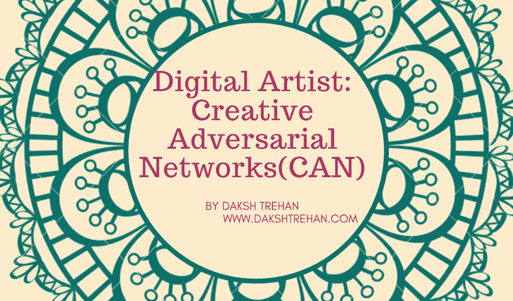
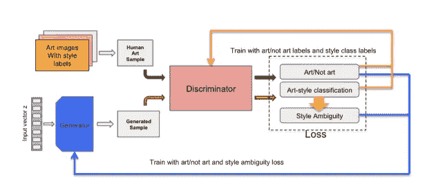
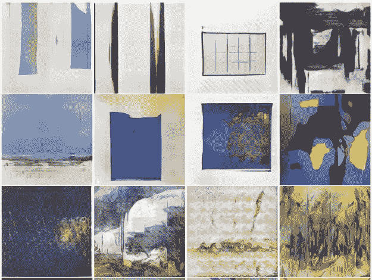

# 数字艺术家:创造性对抗网络(CAN)

> 原文：<https://pub.towardsai.net/digital-artist-creative-adversarial-networks-can-c7c25bea6a20?source=collection_archive---------9----------------------->

## [计算机视觉](https://towardsai.net/p/category/computer-vision)，[深度学习](https://towardsai.net/p/category/machine-learning/deep-learning)

## 一个有趣的方法让人工智能更擅长“伪装”艺术！

在过去的几年里，人工智能确实席卷了人类，机器非常擅长模仿我们告诉它们去做的事情。但人工智能和创造力是相对应的，创造力是核心人工智能领域仍然缺乏的抽象概念。

在过去的几年里，研究人员一直在试图解码机器模仿人类水平智能的能力，以生成创意产品，如笑话、诗歌、问题、绘画、音乐等。整体目标是表明人工智能算法事实上足够智能，可以在不涉及人类艺术家的情况下创作艺术，但在学习过程中会考虑人类的创造性产品。

一些有趣的算法，如[GANs(**G**generate**A**dversarial**N**etworks)](/decoding-science-behind-generative-adversarial-networks-4d188a67d863)已经被引入探索创意空间。去年，GANs 通过生成类似人类的假脸，在人工智能领域掀起了一阵风暴。它实现了隐式技术，也就是说，它在没有数据传递到网络的情况下学习。

gan 构成两个网络，即鉴别器和发生器。生成器的目标是生成“假”图像，鉴别器试图在所提供的训练数据的帮助下破坏由生成器开发的“假”图像。生成器生成随机图像，并请求鉴别器的反馈，即鉴别器发现它是真的还是假的。在镇静时，鉴别器将不能区分随机生成的图像和训练中的实际图像，并且生成器的目标已经完成。生成器和鉴别器彼此独立，但迭代过程有助于鉴别器和生成器不断从彼此的缺点中学习，以生成更好的图像。

甘工作流程，作者设计

让我们推断，我们是在绘画的图像上训练我们的 GAN。生成器的动机是从训练分布中生成图像，以便鉴别器可以将它们标记为“真实的”。最终，生成器将开始模拟现有的艺术，鉴别者将马上被愚弄，模型正在生成新的图像，但这些图像远不能被称为新颖或有创意的。因此，可以得出这样的结论:GANs 在其原始设计中产生创造性想法的能力是有限的。

开发一个可以创造性思考的算法的秘密成分是将他们的创造过程与人类艺术发展联系起来。简而言之，我们试图准确地模仿人类发展艺术的方式。人类终其一生都会接触到各种艺术形式，这是他们对新艺术产生印象的地方，这正是我们希望我们的模型遵循的工作流程。

> 体验和创造。

# “最省力”原则

CANs 源自 GANs，基于 Martindale 的原理，他认为艺术之所以吸引人，是因为它激发了人们的潜能，使之与习惯性相抵触。简而言之，当观众看到一些与历史作品相关的独家作品时，他们就会感受到艺术。但是，唤醒水平必须得到控制，而不是指数增长，以获得负面反应。

该模型的目标是满足“*激发潜能*”，这是指人类的兴奋水平。当一个人睡觉或放松时，觉醒水平最低，而当一个人面临愤怒/危险/暴力时，觉醒水平最高。因此，激发潜力太少会令人厌烦，而激发潜力太多则会引发敌对的局面。冯特曲线可以很好地解释这种情况。

冯特曲线，[来源](https://www.youtube.com/watch?v=TB7izZIWYyw)

此外，如果一个艺术家继续创作类似的作品，那么它会自动降低唤起的潜力，并导致观众的厌恶。这可以得出结论，习惯化建立了一个恒定的压力，以产生更高水平的激发潜力。

该模型试图通过增加“*风格的模糊性*”来提高激发潜力，同时仍然避免远离我们所接受的艺术。易拉罐的架构继承自 GANs，工作流程略有转移。鉴别者被提供了一大套人类经历过的艺术，以及它们相关的风格标签，如文艺复兴、巴洛克、印象主义、表现主义等。该发生器没有类似于 GANs 的训练示例，但被设计为接受来自鉴别器的两个信号。

第一个信号描述了鉴别器是否将生成的图像分类为“艺术或非艺术”。在传统的 GANs 中，该信号将使生成器改变权重，并再次试图通过使其相信艺术来自相同的定制分布来欺骗鉴别器。但在 CANs 中，鉴别器是在一个大的艺术数据集上训练的，它可以准确地区分生成的图像是“艺术还是非艺术”，并且只会要求生成器收敛到已经被接受为“艺术”的图像中。

第二个信号告诉鉴别器将生成的艺术分类到已经定义的类别的准确度。如果生成器可以生成一件可以被视为“艺术”的艺术作品，并且还可以被鉴别器容易地区分为已经定义的类别，那么它通过生成可以被包括在所谓的人类接受的艺术中的一些艺术成功地欺骗了鉴别器。

CAN 工作流程如官方文件所述。

这两个信号彼此相反地工作，第一个信号推动发生器产生可以被接受为“艺术”的艺术，如果它成功，它允许鉴别器容易地对图像进行分类。然而，第二个信号将实质上惩罚发生器这样做，因为动机是生成风格模糊的艺术，即不能被鉴别器容易地分类但仍可被视为“艺术”的东西。这两种信号独立工作，但在相互完善方面发挥着重要作用，就像 GAN 一样。

由易拉罐产生的艺术品，[来源](https://arxiv.org/pdf/1706.07068.pdf)

# 定量验证

在上表中，人类观众试图评价四组艺术品。DCGAN 是一种标准的 GAN，它紧密模仿已有的艺术品，但缺乏创造性。抽象表现主义者数据集是 1945 年至 2007 年之间创作的艺术集合，而 2016 年巴塞尔艺术展则是在 2016 年巴塞尔艺术展上展示的图像。

不出所料，从易拉罐中生成的图像在唤醒潜力技术中排名最高，即新奇、令人惊讶、模糊和复杂。此外，他们更好地愚弄了人类观众，让他们相信艺术是由人类创造的。

# 参考资料:

*   [CAN:通过学习风格和偏离风格规范来产生“艺术”的创造性对立网络](https://arxiv.org/pdf/1706.07068.pdf)
*   [创意对抗网络](https://github.com/mlberkeley/Creative-Adversarial-Networks)
*   [什么是创意对抗性网络(CANs)？](https://hackernoon.com/what-are-creative-adversarial-networks-cans-bb81d09aa235)
*   [CAN(创意对抗网络)—讲解](https://www.kdnuggets.com/2017/07/creative-adversarial-network.html)
*   [PR-122: CAN:创造性对抗网络](https://www.youtube.com/watch?v=TB7izZIWYyw)
*   与 Ahmed Elgammal 的艺术生成的创造性对抗网络— TWiML Talk #265
*   [创造性对抗网络(CAN)和作为艺术家的人工智能](https://medium.com/can-artificial-intelligence-can-be-an-artist/creative-adversarial-networks-can-and-artificial-intelligence-as-artist-fd8a33181c33)

请随意连接:

> 作品集~【https://www.dakshtrehan.com 
> 
> *LinkedIn ~*[*https://www.linkedin.com/in/dakshtrehan*](https://www.linkedin.com/in/dakshtrehan/)

关注更多机器学习/深度学习博客。

> *中等~*[*https://medium.com/@dakshtrehan*](https://medium.com/@dakshtrehan)

# 想了解更多？

[准备好拜 AI 神了吗？](https://medium.com/swlh/are-you-ready-to-worship-ai-gods-818c9b7490dc)
[利用深度学习检测新冠肺炎](https://towardsdatascience.com/detecting-covid-19-using-deep-learning-262956b6f981)
[逃不掉的 AI 算法:抖音](https://towardsdatascience.com/the-inescapable-ai-algorithm-tiktok-ad4c6fd981b8)
[GPT-3: AI 否决开始了？](https://medium.com/@dakshtrehan/gpt-3-ai-overruling-started-15fd603470f2)
[Tinder+AI:一场完美的牵线搭桥？](https://medium.com/towards-artificial-intelligence/tinder-ai-a-perfect-matchmaking-b0a7b916e271)
[使用机器学习的卡通化内幕指南](https://medium.com/towards-artificial-intelligence/an-insiders-guide-to-cartoonization-using-machine-learning-ce3648adfe8)
[强化强化学习背后的科学](https://medium.com/towards-artificial-intelligence/reinforcing-the-science-behind-reinforcement-learning-d2643ca39b51)
[解码生成性对抗网络背后的科学](https://medium.com/towards-artificial-intelligence/decoding-science-behind-generative-adversarial-networks-4d188a67d863)
[了解 LSTM 和 GRU 的](https://medium.com/towards-artificial-intelligence/understanding-lstms-and-gru-s-b69749acaa35)
[用于假人的递归神经网络](https://medium.com/towards-artificial-intelligence/recurrent-neural-networks-for-dummies-8d2c4c725fbe)
[用于假人的卷积神经网络](https://medium.com/towards-artificial-intelligence/convolutional-neural-networks-for-dummies-afd7166cd9e)

> 干杯