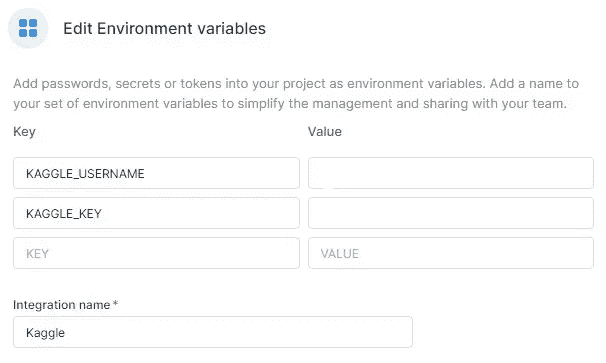
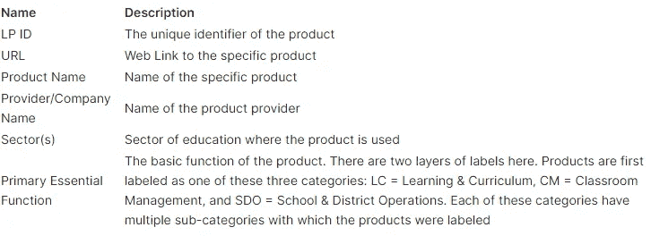
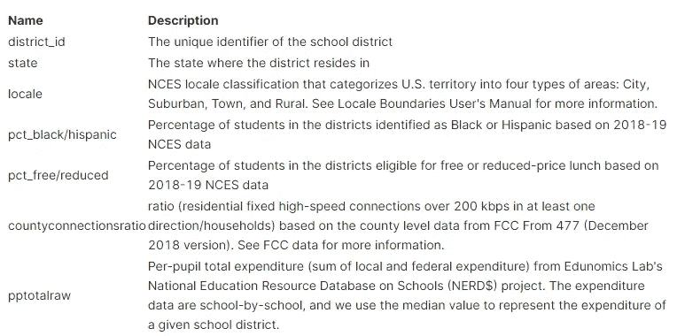
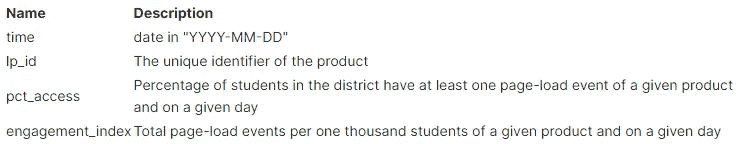

# Covid19 期间的数字学习:完整分析

> 原文：<https://pub.towardsai.net/digital-learning-during-covid19-a-complete-analysis-45c525b1904?source=collection_archive---------0----------------------->

## [数据分析](https://towardsai.net/p/category/data-analysis)

## 使用数据分析工具找出 Covid19 期间数字学习的趋势，以及在线平台如何对临时社区有效。


照片由[对比](https://unsplash.com/@comparefibre?utm_source=medium&utm_medium=referral)[上的纤维](https://unsplash.com?utm_source=medium&utm_medium=referral)不飞溅

# 介绍

在 Covid19 疫情期间，教育系统存在不平衡，大多数学生甚至无法使用教育工具和在线学习平台。迫切需要提出解决方案，通过使用 [LearnPlatform](https://learnplatform.com/) 数据集，我们将找出一些常见的模式，并根据人口统计、地理和可达性确定集群。

# 项目目标

在这个项目中，我们将使用数据分析工具来找出数字学习的趋势，以及它如何对即兴社区有效。我们将在人口统计、互联网接入、学习产品接入和金融等因素上对各区和州进行比较。最后，我们将总结我们的报告，并指出需要我们更多关注的领域，以使美国所有学生都能接受教育。


作者图片

# 数据

该数据集可以在 [Kaggle](https://www.kaggle.com/c/learnplatform-covid19-impact-on-digital-learning) 获得，但需要非商业许可。

**使用该命令更快地下载数据集**

```
!pip install kaggle
!kaggle competitions download -c learnplatform-covid19-impact-on-digital-learning
```

> *不要忘记添加 Kaggle API 密钥👇*



作者图片

我们有三种类型的数据集。

1.  产品数据包含服务名称、公司和教育部门。
2.  地区数据包含人口统计、地点和教育支出。
3.  参与度数据包含学生每天使用不同产品的参与度。

# 产品

产品文件`products_info.csv`包括 2020 年用户最多的前 372 个产品的特征信息。此文件中列出的类别是 Learn Platform 产品分类的一部分。



作者图片

# 加载数据教育产品数据

如我们所见，我们有产品名称、公司和具有主要功能的部门数据。

# 行政区

学区文件`districts_info.csv`包含关于学区特征的信息，包括来自

*   NCES(2018–2019)、
*   联邦通信委员会(2018 年 12 月)，以及
*   教育经济学实验室。



作者图片

# 加载数据区数据

我们有不同的州、地区、教育支出，更重要的是我们有人口统计数据。

# 参与数据

参与度数据在学区级别进行汇总，文件夹`engagement_data`中的每个文件代表一个学区的数据。



作者图片

## 参与数据提取功能

我们的雇佣数据根据*地区 id* 被分成多个`.csv`文件，因此我们需要创建一个 Python 函数来从各个文件中提取数据，并将它们连接成一个文件。

# 加载数据参与数据

我们花了 19 秒从一个文件夹中加载所有文件，现在我们有了包含所有干扰参与数据的数据帧。

# 缺失数据

让我们看看所有三个数据帧中每一列的缺失值

## 绘图缺失功能

该函数帮助我们为所有包含缺失值的数据帧绘制 Altair 条形图。

正如我们可以观察到的，我们的地区数据集在`pp_total_raw,pct_free/reduced,county_connections_ratio`中主要包含缺失值。让我们在下一节一起看看所有缺失的值。

下面的子图显示了所有三个数据集中缺失的值，我们将在下一节中删除它们，因为在没有实际信息的情况下很难替换它们。

# 清理数据

我们将清理地区数据，因为它包含一组值。我们将利用这两个极限。

1.  将列表`pct_black/hispanic`和`pct_free/reduced`转换成浮点数
2.  将列表`pp_total_raw`转换成整数。
3.  由于所有类别的静态值为 0.18 比 1，因此`county_connections_ratio`下降。

# 特征分布可视化

在本节中，我们将发现不同的特性分布。

## 每个州的区

正如我们所见，数据集包含的犹他州和伊利诺伊州的区比任何其他州都多。

# 区域分布

郊区以 59%的比例占主导地位，这也意味着中高阶层的人有更多的机会上网。

# 教育产品提供商

谷歌提供的教育产品比任何接近它的公司都多。

> *简而言之，在线教育由谷歌公司主导*

我们来看看谷歌提供的产品有哪些

# 教育部门分配

教育部门分为三类，PreK-12、高等教育和企业。

> *有些产品是特定于某个部门的，但其他产品则非常普遍。*

正如我们所看到的，PreK 教育以 54%的比例主导着这一分布。

# 包含主要和子类别的主要功能

有三种主要的基本功能。

1.  LC =学习和课程
2.  CM =教室管理
3.  SDO =学校和学区运营。

你可以与 Plotly sunburst 图互动，探索主要类别和子类别的分布。

> *学习产品在这一群体中占有大多数份额，最常见的子类别是数字学习平台。*

# 基本功能子类别分布

我们可以观察所有子类别的分布。

> *内容创作和数字学习在这个市场处于领先地位。*

# 合并三个数据集

我们将合并`LP ID`和`district id`上的所有三个数据集。正如我们所看到的，组合数据集有 18 列，这将有助于我们绘制地理和时间序列图。

# 顶级教育产品

除了维基百科和网飞之外，谷歌产品占据主导地位。网飞为孩子们提供教育内容和指导。

# 每个州种族分布、降低的费用、支出和互联网连接

我们将使用 Pandas 函数来显示一个表，该表显示与人口统计和支出相关的各种特征的平均分布。

# 黑人和西班牙人

我觉得德州的黑人/西班牙裔学生比其他州多，其次是佛罗里达州、密歇根州和明尼苏达州。

# 降低费用或免费教育

明尼苏达州提供 70%的免费或减免学费的教育，紧随其后的是密歇根州和印第安纳州。

# 每个学生的总支出

纽约在教育上的花费比美国任何一个州都多。亚军州是新泽西州和明尼苏达州。

# 教育产品接触学生的时间序列分布

我们将观察基于地区和州的产品访问的时间序列分布。

## 基于区域设置

这些城市受到 Covid19 的打击最大，对学生的影响最大，因为他们必须在家学习，这就是为什么我们可以看到与其他地区相比，2020 年 4 月至 7 月的产品访问率有所下降。暑假期间，学生停止使用教育产品。在郊区，学生比其他地方有更多的机会使用这些工具。总的来说，它们都遵循一个共同的模式。

# 根据排名前五的州

纽约受 Covid19 的影响最大，但这并没有影响学生的在线学习，正如你所看到的，图表在封锁后变得更加一致。

> *总体而言，纽约、威斯康星和印度有更多学生使用这些教育产品。*

# 根据倒数五个州

这很奇怪，因为密歇根州和北卡罗来纳州从 3 月到 8 月底几乎没有产品进入。德克萨斯州也有类似的模式，但他们在 6 月份达到了一个高峰。总体而言，这些底部状态在 2020 年 9 月后变得活跃。

> 奇怪的是，有些州的模式非常奇怪，可能是因为糟糕的教育体系或缺乏意识。

# 地理分析

本节将根据产品访问和参与指数来了解不同的状态。

> *我们无法访问所有州的数据，因此您可能会在地图上看到很多灰色空间。*

# 每个州的教育产品使用情况

纽约州的产品准入分数比其他任何州都高，接下来是橙色州威斯康星、伊利诺伊和印第安纳。这些州的黑人和西班牙裔人口较少可能有联系。让我们在下一部分探讨这个问题。

黑人/西班牙裔人口较少的州之间存在联系，但不是最强的。我可以看到纽约和威斯康星的黑人/西班牙裔人口较少，入学率较高，但当谈到其他有色人种百分比较低的州时，这种情况比比皆是。这个系统对其他种族相当平衡。

# 每个州的参与指数

每个州的参与度分布与产品访问非常相似。合乎逻辑的是，如果学生能够接触到这些产品，这些平台的使用率就有可能增加。

# 关注来自临时社区的人们

在这一部分，我们将重点关注黑人/西班牙裔社区以及免费或减免费用。

## 相互关系

产品访问和参与指数之间有很高的相关性，这意味着如果学生可以访问这些产品，他们可能会每天使用它们。我们还可以看到黑人/西班牙裔和免费/减少教育之间的另一个高度相关性。这意味着政府正在帮助临时搭建的社区获得适当的教育。

# 一年来黑人/西班牙裔产品的使用情况。

下图显示，随着时间的推移，黑人和西班牙裔人口较少的社区与我们之前讨论过的一些排名靠前的州具有相似的模式。让我们比较一下这个图表和混合社区。

随着峰值从 1.4 下降到 1.2，我们可以看到一些变化。这是不同种族群体之间的差距，但与其他国家相比微不足道。我们可以说黑人/西班牙裔社区获得教育产品的机会较少。

# 密码

*   [covid 19 EDA(deepnote.com)期间的数字学习](https://deepnote.com/@abid/Digital-Learning-During-COVID19-EDA-ELSD1M0wSxeJFbYcJ5DsbA)
*   [covid 19 | ka ggle 期间数字学习的演变](https://www.kaggle.com/kingabzpro/evolution-of-digital-learning-during-covid19)
*   [kingabzpro/Digital-Learning-During-covid 19-EDA(github . com)](https://github.com/kingabzpro/Digital-Learning-During-COVID19-EDA)

# 结论

这些数据仅限于少数几个州，我没有发现任何具体证据表明黑人或西班牙裔社区受到不公平待遇。在线教育对所有人来说都相当均衡。我确实看到一些州在产品准入评级方面表现最差，这可能是由于糟糕的决策和缺乏意识。我们可以看到，通过提供完整的生态系统，谷歌正在主导在线教育行业。大多数学前教育学生正在使用这些平台进行数字化学习。郊区有最多的学生接触这些产品，我们可以看到产品接触和参与指数之间有明显的相关性。黑人/西班牙裔和免费教育/减免费用之间也有很高的相关性，这意味着政府正在尽最大努力通过提供免费教育来帮助贫困社区。

> **你可以关注我的** [**LinkedIn**](https://www.linkedin.com/in/1abidaliawan/) **，**[**Twitter**](https://twitter.com/1abidaliawan)**，以及**[**Polywork**](https://www.polywork.com/kingabzpro)**，在那里我每周都会发布我的文章。**