# DIM:通过互信息估计和最大化学习深度表示

> 原文：<https://pub.towardsai.net/dim-learning-deep-representations-by-mutual-information-estimation-and-maximization-2d07498fc8e4?source=collection_archive---------0----------------------->

## [机器学习](https://towardsai.net/p/category/machine-learning)

## 一种新的基于内容的无监督表示学习方法

来源:Pixabay

# 介绍

这是我们关于交互信息系列的第二篇文章。在[以前的文章](https://medium.com/towards-artificial-intelligence/mine-mutual-information-neural-estimation-26f6853febda?source=friends_link&sk=2435c34bc8313bb329dbe2bdbdc78507)中，我们已经看到了如何通过 MINE 估计器最大化两个变量之间的互信息，以及最大化互信息的一些实际应用。在这篇文章中，我们关注的是基于互信息最大化的表征学习。具体来说，我们将讨论一个用于表征学习的对抗性架构和两个其他的互信息最大化目标，这两个目标已经通过实验证明在下游任务中优于 MINE 估计器。

本文分为四个部分。首先，我们简要回顾了挖掘并介绍了另外两种互信息最大化方法，实验表明这两种方法优于挖掘。接下来，我们讨论了传统像素级表征学习方法的不足，揭示了我们最大化互信息进行表征学习的原因。然后，我们将讨论 Deep InfoMax(DIM)的组件以及相应的目标。为了完整性，我们将最终证明基于 JSD 的目标的有效性。

# 互信息最大化方法

MINE 基于 KL 散度的 Donsker-Varadhan 表示(DV)定义了互信息的最大下界:

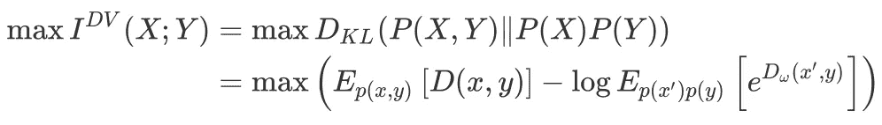

DV 物镜

由于我们主要对最大化互信息感兴趣，而不是它的精确值，作者建议用詹森-香农散度(JSD)代替 KL 散度，从而具有如下目标

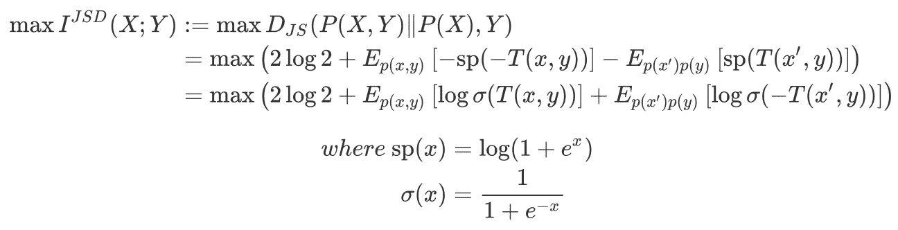

基于 JSD 的目标。我们最终会证明这些

Aaron van den Oord 等人[2]提出的另一个目标 InfoNCE 也可用作互信息的界限:

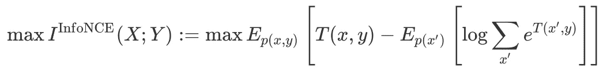

信息目标。这只是噪声对比估计(NCE)。关于它与互信息的联系，请参考使用对比预测编码的表征学习的附录 A.1

**DV、JSD、InfoNCE 的对比**

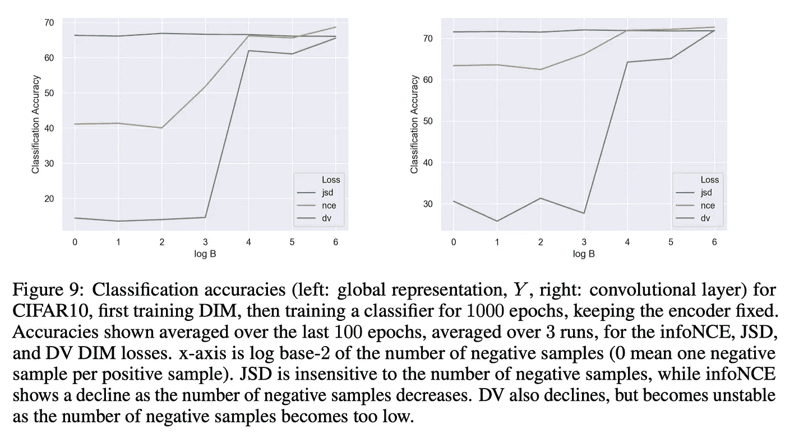

使用不同目标学习表示的分类准确性。来源:通过互信息估计和最大化学习深度表示

MINE(或 DV objective)是一种互信息的估计器，但在实践中，它并没有很好地工作，因为它可能是无界的，并且它的直接梯度是有偏差的(尽管在最初的 MINE 论文中已经提出了缓解这些问题的方法，请参见[我们以前的帖子](https://medium.com/towards-artificial-intelligence/mine-mutual-information-neural-estimation-26f6853febda?source=friends_link&sk=2435c34bc8313bb329dbe2bdbdc78507)以了解更多详细信息)。

实验表明，在三个具有大量负样本的任务中，InfoNCE 目标在下游任务上表现最好，但是随着我们减少用于估计的样本数量，性能会迅速下降。

基于 JSD 的目标对阴性样本的数量不敏感，并且在实践中表现良好。与在第二项中包括正样本的 InfoNCD 不同，从边际乘积中排除正样本提高了下游分类精度。

# 传统像素级表征学习的不足

当信号中只有一小部分比特在语义层面上真正重要时，像素级表示学习算法可能是有害的。当涉及到由生成模型学习的表示时，这样的问题变得更加明显:随着数据的维度变大，生成模型的目标变得受压力支配，以很好地表示所有像素，而它可能不会留下足够的维度来捕捉分布的重要特征。特别是，生成模型必须表示数据中的所有统计可变性以正确生成(或甚至区分),并且这种可变性的大部分可能不重要，甚至对下游任务的表示的适用性有害。

R Devon Hjelm 等人[1]认为，根据信息内容和统计或结构限制，表征学习应该更直接。为了解决第一个质量，作者建议通过最大化互信息来学习无监督的表示。为了解决第二个问题，他们考虑在对习得的表征施加结构约束之前，先进行对抗性匹配。

# 深度信息最大化

Deep InfoMax(DIM)定义了一个编码器网络，它为不同的目标提取了一个高级表示和多个鉴别器。在本节中，我们将浏览所有这些网络，以及它们相应的目标。

## 编码器网络

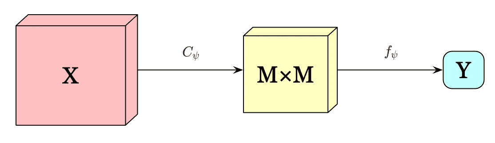

编码器网络

编码器网络， *E_ψ=f_ψ∘ C_ψ，*首先将输入 *X* 编码成一个 *M×* M 特征图，然后将这个特征图汇总成一个高层特征向量， *Y=E_ψ(X)* 。

## 全局互信息最大化

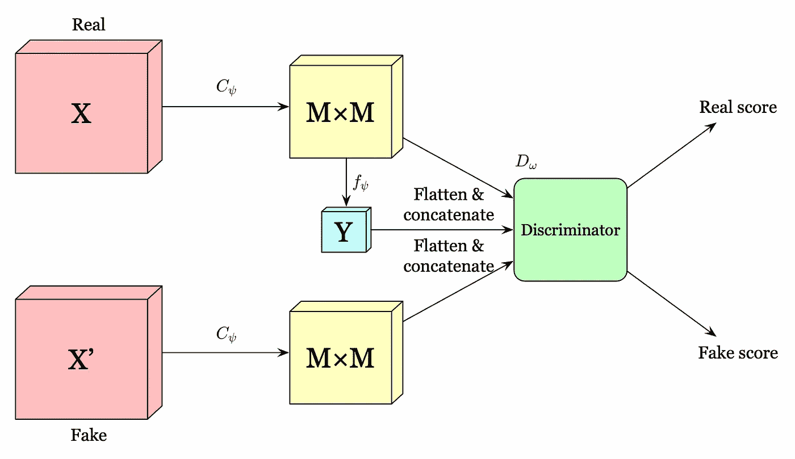

基于互信息最大化的表征学习的全局结构

全局结构首先展平 *M ×M* 特征图，并与 *Y* 连接。然后，我们将其传递给鉴别器 *D_ω* ，以使用以下目标最大化特征图和 *Y* 之间的互信息

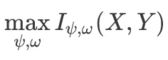

I 可以是第一节中讨论的任何目标函数。

注意，我们可以通过将 *Y* 与同一批中的不同图像组合来生成负样本，以节省额外的计算开销。

## 局部互信息最大化

全局互信息最大化可能引入一些与任务无关的依赖。例如，像素局部的微小噪声对于图像分类是无用的，因此如果最终目标是分类，则表示可能不会受益于该信息。此外，由于高级表示的容量是固定的，所以这种不相关的信息可能会挤出一些有价值的信息。

为了消除不想要的局部噪声，作者建议最大化高层表示 *Y* 和图像局部小块之间的平均互信息(在 *M×M* 特征图中的特征向量)。因为现在高级表示 *Y* 被鼓励与所有补丁具有高度的交互信息，这有利于跨补丁共享的数据的编码方面。实验还验证了直觉，即这鼓励编码器更喜欢跨输入共享的信息，并显著提高分类性能。

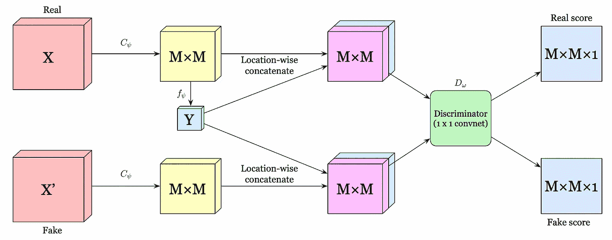

局部互信息最大化的级联卷积结构

作者为本地目标提出了两种不同的架构。第一种，如上图所示，在每个位置将 *Y* 与 *M×M* 特征地图连接起来。然后，使用 *1×1* 卷积鉴别器对位置连接特征图中的每个特征向量进行评分。

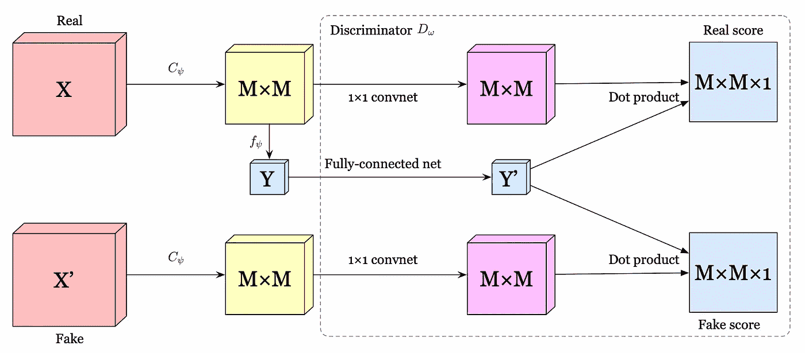

用于局部互信息最大化的编码和点积结构

另一种架构，如上图所示，进一步分别通过卷积网络和全连通网络对 *M×M* 特征图和 *Y* 进行编码。然后，我们在特征映射编码的每个位置处的特征和编码的全局向量*Y’*之间进行点积，以获得分数。

用于局部互信息最大化的目标被定义为

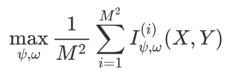

I^i 可以是第一部分中讨论的任何目标函数。

为了减少计算开销，通过在一批中的每个位置独立地混洗特征图来生成伪样本。

## 将表示与先验分布相匹配

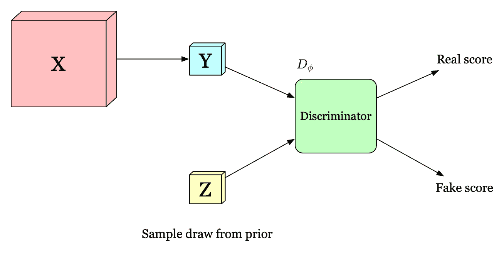

先验匹配

为了满足结构约束(即，将表示与先验分布 *P(Z)* 匹配)，我们定义了一个新的鉴别器，该鉴别器区分输入分布是来自编码器的输出还是来自先验分布。目标只是一个交叉熵

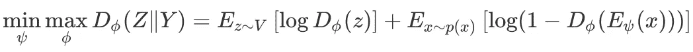

我们之所以对 *Y* 施加结构约束，是因为在逼近先验 *Z* 的过程中，我们期望 *E_ψ* 学习到一个具有一些期望性质的表示，例如独立性和解纠缠性，如果先验 *Z* 固有地拥有这些性质的话。

## 把所有的放在一起

整个 DIM 的目标是

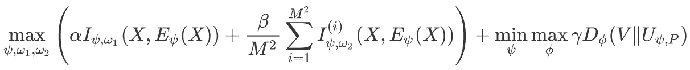

其中 *α* 、 *β* 和 *d γ* 为超参数。下图显示了作者完成的一些消融研究，其中 *y* 轴为 *β* 。特别地，我们可以看到良好的分类性能高度依赖于局部项 *β* ，而良好的重建高度依赖于全局项 *α* 。这与我们在本节中的讨论一致。然而，少量的 *α* 也有助于分类精度，少量的 *β* 改善重建。

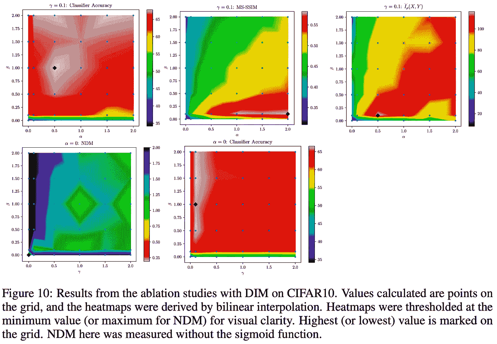

# 补充材料

## JSD 目标有效性的证明

在这一小节中，我们证明

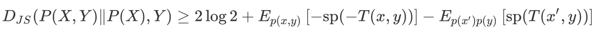

等式 1

首先，我们定义 *f* 散度

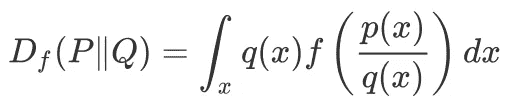

然后我们用[凸共轭](https://en.wikipedia.org/wiki/Convex_conjugate)代替 *f* 函数

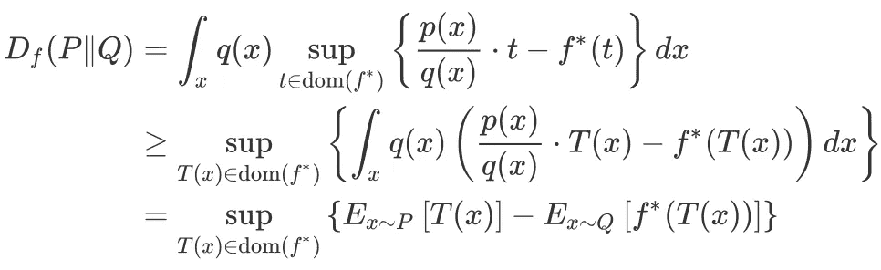

等式 2

第二步产生一个下限，原因有二:1 .因为在交换积分和上确界运算时存在詹森不等式。2.函数类 *T(x)* 可以只包含所有可能的 *t* 的子集。

由于我们的目的是推导詹森-香农散度，我们用*-(x+1)log { 1+0.5x }+xlog x*代替*f(x)*(Sebastian Nowozin 等人【3】)。现在我们推断 *f*(t)*

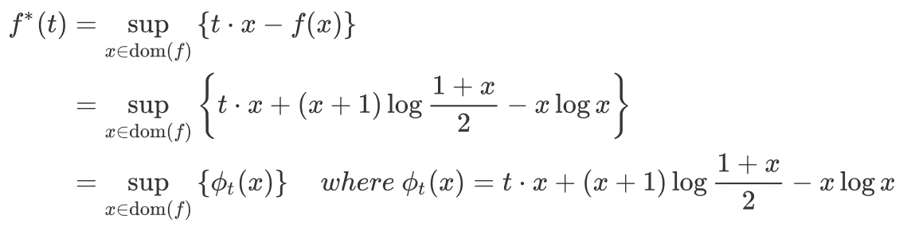

这表明当 *ϕₜ(x)* 处于最大值时，获得了 *f*(t)* ，因此我们将 *ϕₜ(x)* 的导数设置为零，并且具有

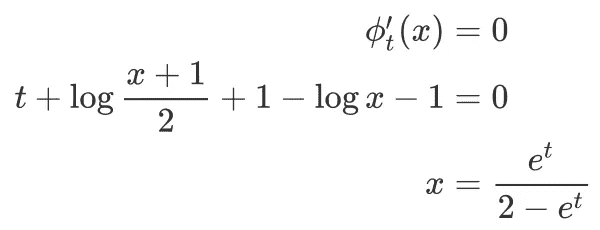

把这个 *x* 粘回 *f*(x* )我们得到

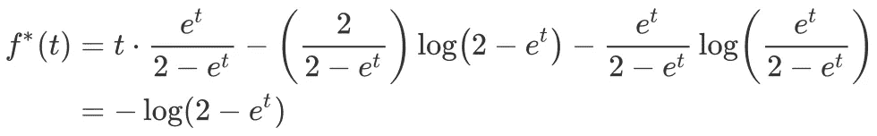

诀窍是，我们用 *log2-log(1+e^{-T'(x)})* 代替等式中的 *T(x)* 。②，那么我们就有了

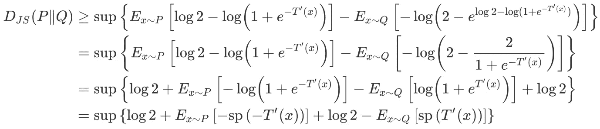

剩下唯一要做的就是用 Eq 中的符号替换相对符号。(1)并且证明完成。

## 参考

1.  通过互信息估计和最大化学习深度表示
2.  Aaron van den Oord 等,《使用对比预测编码的表征学习》
3.  使用变分散度最小化训练生成神经样本