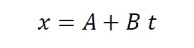
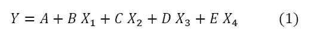
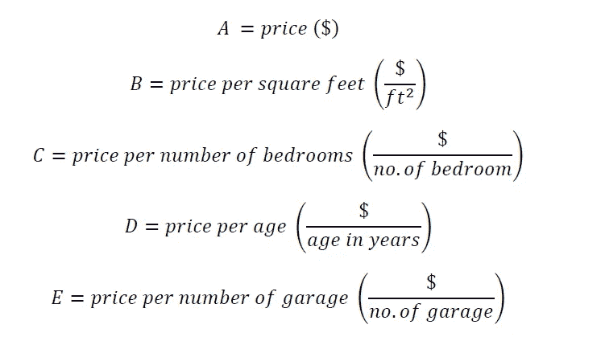
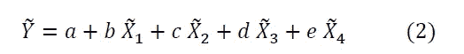
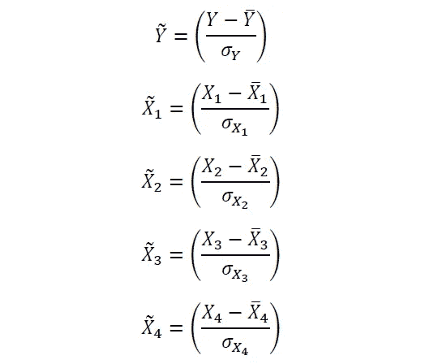
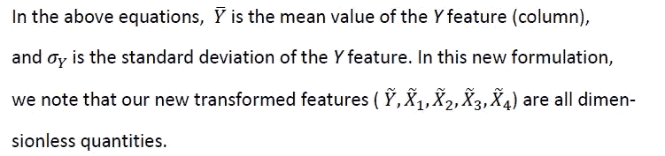

# 机器学习中的量纲分析

> 原文：<https://pub.towardsai.net/dimensional-analysis-in-machine-learning-cd3d3669f5e9?source=collection_archive---------1----------------------->

丹尼尔·法齐奥在 [Unsplash](https://unsplash.com?utm_source=medium&utm_medium=referral) 上的照片

## [机器学习](https://towardsai.net/p/category/machine-learning)

## 不能把苹果和橘子相加。量纲分析在机器学习中至关重要

# 一.导言

量纲分析是物理学中使用的一种技术，用于确保方程的一致性。例如，假设我们有一个等式，由下式给出

其中 *x* 为距离( ***英尺或米***)*t*为时间( ***秒*** )。为了使这个等式一致， *A* 必须有距离单位(**米**)，而 *B* 必须有距离/时间单位( ***米/秒*** )。

在机器学习中，我们经常处理包含不同维度特征的数据集。例如，汽车数据集可以具有诸如汽车长度*(英尺或米) ***汽车质量*** (磅或千克) ***车龄*** (年) ***燃料消耗率*** (每加仑英里数或每升公里数) ***汽车颜色*** (绿色、红色).由于要素来自不同的单位，因此在执行数据分析时一定要小心，因为我们不能将苹果和橘子相加。例如，你不能将你的 ***汽车质量*** 特性栏添加到你的*栏，这将是一个无意义的操作。**

**在本文中，我们讨论了量纲分析在机器学习中的重要性。**

# **二。机器学习中的量纲分析**

**量纲分析在机器学习中是必不可少的，必须用来确保模型方程的一致性和意义。现在让我们用一个例子来说明量纲分析的重要性。**

**假设我们想要建立一个模型来预测房子的价格( *Y* )，该模型基于预测变量，例如 ***房子的面积***(*X1*)***卧室数量***(*X2*)***房龄*** ( *X3* )和 ***车库数量*然后使用多变量回归分析，我们的模型可以在数学上表示为:****

****

**其中系数 *A、B、C、D* 和 *E* 是可以在模型训练期间确定的权重因子(回归系数)。**

**由于特征 *X1* 、 *X2* 、 *X3* 和 *X4* 具有不同的单位( *X1* 是以平方英尺给出的批量面积， *X2* 是卧室数量， *X3* 是以年为单位的年龄， *X4* 是车库数量)，等式(1)能够一致的唯一方式是在回归时这意味着，由于价格变量( *Y* )是成本，例如以美元($)为单位，那么下列条件必须成立:**

****

**一般在训练时，系数 *A* 、 *B* 、 *C* 、 *D* 和 *E* 都是作为数值得到的，但我们必须明白，这些系数都是有明确单位(量纲)的物理量。**

**一般来说，由于用于训练模型的变量在不同尺度上取值，因此在用于训练之前对这些变量进行缩放是很重要的。例如，变量 *X1* 的范围可以从 2000 平方英尺到 10000 平方英尺；变量 *X2* 的范围可以从 1 到 6；变量 *X3* 的范围从 0 到 75 年；而 *X4* 的范围可以从 1 到 3。在这种情况下，为了避免训练过程中的偏差，在训练之前对变量进行缩放是非常重要的。**

**假设我们正在使用 *StandardScaler()* 来缩放我们的特征。在 *StandardScaler* 变换下，我们的新模型现在可以表示为:**

****

**在哪里**

********

**因此，在这个表示中，我们的新回归系数 *a* 、 *b* 、 *c* 、 *d* 和 *e* 也将是无量纲的(无单位的)。**

# **三。总结和结论**

**总之，我们已经讨论了量纲分析在机器学习中的重要性。因为机器学习模型通常被表示为数据集中特征的线性组合，所以始终记住在训练期间获得的权重因子是具有唯一维度(单位)的物理量，例如价格/平方英尺，这一点很重要。我们还表明，通过将您的要素转换到一个所有要素都是无量纲的空间，在训练过程中获得的权重因子也将是无量纲的量。这可以通过缩放变量来实现，例如使用 *StandardScaler()* 估算器。特征缩放还有助于减少学习过程中的偏差。**

# **其他数据科学/机器学习资源**

**[数据科学需要多少数学知识？](https://medium.com/towards-artificial-intelligence/how-much-math-do-i-need-in-data-science-d05d83f8cb19)**

**[数据科学课程](https://medium.com/towards-artificial-intelligence/data-science-curriculum-bf3bb6805576)**

**[进入数据科学的 5 个最佳学位](https://towardsdatascience.com/5-best-degrees-for-getting-into-data-science-c3eb067883b1)**

**[数据科学的理论基础——我应该关心还是仅仅关注实践技能？](https://towardsdatascience.com/theoretical-foundations-of-data-science-should-i-care-or-simply-focus-on-hands-on-skills-c53fb0caba66)**

**[机器学习项目规划](https://towardsdatascience.com/machine-learning-project-planning-71bdb3a44349)**

**[如何组织您的数据科学项目](https://towardsdatascience.com/how-to-organize-your-data-science-project-dd6599cf000a)**

**[大型数据科学项目的生产力工具](https://medium.com/towards-artificial-intelligence/productivity-tools-for-large-scale-data-science-projects-64810dfbb971)**

**[数据科学作品集比简历更有价值](https://towardsdatascience.com/a-data-science-portfolio-is-more-valuable-than-a-resume-2d031d6ce518)**

*****如有疑问和咨询，请发邮件给我*【benjaminobi@gmail.com :****