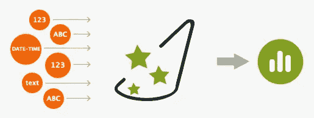
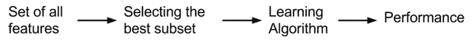
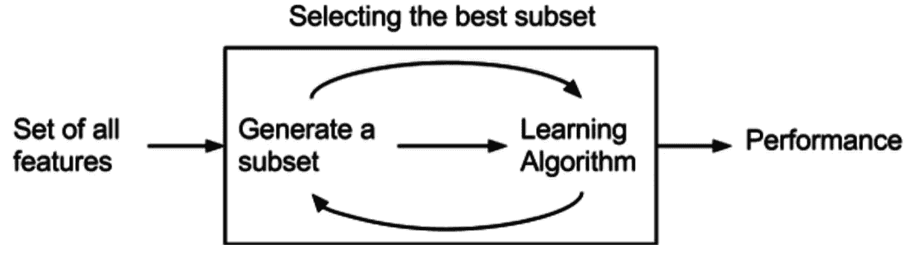
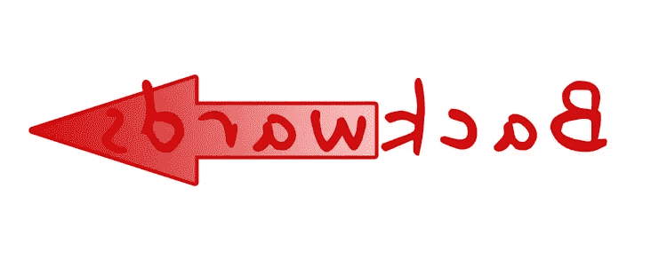
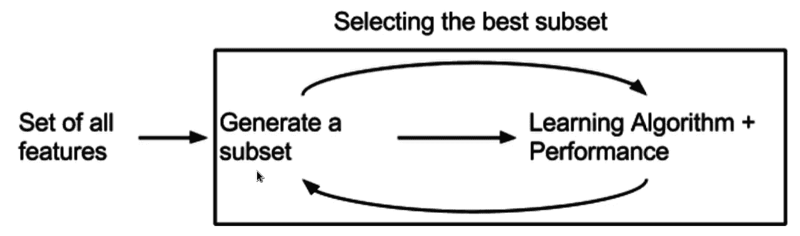

# 降维—特征选择第 1 部分

> 原文：<https://pub.towardsai.net/dimensional-reduction-feature-selection-part-1-d5e4fac63a11?source=collection_archive---------3----------------------->

## [机器学习](https://towardsai.net/p/category/machine-learning)

照片由 [Edu 格兰德](https://unsplash.com/@edgr?utm_source=unsplash&utm_medium=referral&utm_content=creditCopyText)在 [Unsplash](https://unsplash.com/s/photos/selection?utm_source=unsplash&utm_medium=referral&utm_content=creditCopyText) 上拍摄

在上一篇文章中，我们了解了什么是降维，为什么我们需要降维，以及我们有什么样的降维方法/技术。

如果你还没有检查它，那么我建议你检查前一篇文章

 [## 让我们来学习降维

### 降维，或称降维，是将数据从高维空间转换到多维空间

pub.towardsai.net](/lets-learn-about-dimensionality-reduction-df4622f30c84) 

在本文中，我们将了解特性选择方法，为什么我们需要使用它，以及有哪些方法可用于特性选择。

让我们开始吧

> **什么是特征选择**

照片由[帕特里克·福尔](https://unsplash.com/@patrickian4?utm_source=unsplash&utm_medium=referral&utm_content=creditCopyText)在 [Unsplash](https://unsplash.com/s/photos/selection?utm_source=unsplash&utm_medium=referral&utm_content=creditCopyText) 上拍摄

正如我们在上一篇文章中所讨论的，真实世界的数据集可能包含许多不同特征的大量信息，但并不是所有的特征都适合我们的模型，我们只选择“最佳”的特征，这些特征表现良好，具有更高的准确性，并且在“特征选择”中计算开销较少

特征选择是这样一个过程，在这个过程中，我们试图减少特征的数量，只找到对我们的模型有益的相关特征，并为我们开发预测模型提供高准确性。

特征数量的减少也降低了计算成本，并且在某些情况下，还提高了模型的性能。

> **为什么选择功能？**

一些预测建模问题具有大量的变量，这些变量会减慢模型的开发和训练过程。

功能选择有助于

*   它可以提高精确度
*   它降低了计算成本
*   它提高了模型的可理解性，并且我们可以正确地将其可视化
*   它使机器学习模型能够更快地训练
*   它减少了过度拟合

> **特征选择方法**

[https://little ml . files . WordPress . com/2016/07/feature-selection 2 . jpg？w=640](https://littleml.files.wordpress.com/2016/07/feature-selection2.jpg?w=640)

特征选择技术大致分为以下两类

*   **监督技术:**这些技术可用于标记数据，并用于识别相关特征，以提高分类和回归等监督模型的效率
*   **无监督技术:**这些技术可以用于未标记的数据

> **监督特征选择:**

在有监督的特征选择方法中，我们有 3 种方法

*   过滤方法
*   包装方法
*   嵌入式方法

让我们逐一了解它们

> **过滤方法**

[https://en . Wikipedia . org/wiki/Feature _ selection #/media/File:Filter _ methode . png](https://en.wikipedia.org/wiki/Feature_selection#/media/File:Filter_Methode.png)

F 过滤方法选择变量，而不考虑模型。它们仅基于一般特征，如与要预测的变量的相关性。过滤方法抑制最不感兴趣的变量。其他变量将是用于分类或预测数据的分类或回归模型的一部分。这些方法在计算时间上特别有效，并且对过拟合具有鲁棒性。[维基]

这些方法比其他方法(即包装器、嵌入式混合方法)速度更快，计算成本更低。当处理高维数据时，使用过滤方法是很好的，因为它们在计算上更便宜。

这些方法通常用作预处理步骤。特征的选择独立于任何机器学习算法，相反，特征是基于它们在各种统计测试中与结果变量的相关性的分数来选择的。

用于过滤方法的技术

*   单因素分析
*   统计算法
*   卡方检验
*   费希尔评分
*   方差分析
*   交互信息

> **优点:**

*   计算成本更低
*   对目标空间的特征使用相关能力
*   有助于快速筛选

> **包装方法**

[https://en . Wikipedia . org/wiki/Feature _ selection #/media/File:Feature _ selection _ Wrapper _ method . png](https://en.wikipedia.org/wiki/Feature_selection#/media/File:Feature_selection_Wrapper_Method.png)

包装器方法评估变量的子集，与过滤方法不同，它允许检测变量之间可能的相互作用。[维基]

在这里，我们将特征集的选择视为一个搜索问题，其中不同的组合被准备、评估并与其他组合进行比较。

> 包装方法中使用的技术

*   **前进特征选择**

由[盖尔·马塞尔](https://unsplash.com/@gaellemarcel?utm_source=unsplash&utm_medium=referral&utm_content=creditCopyText)在 [Unsplash](https://unsplash.com/s/photos/forward?utm_source=unsplash&utm_medium=referral&utm_content=creditCopyText) 上拍摄的照片

这是一种迭代方法，我们从与目标相关的最佳表现变量开始。接下来，我们选择另一个变量，该变量与第一个选择的变量相结合可提供最佳性能

*   **反向特征消除**

[https://theridgeathleticclub . files . WordPress . com/2012/05/backward-arrow . jpg](https://theridgeathleticclub.files.wordpress.com/2012/05/backwards-arrow.jpg)

T 该方法与正向特征选择方法完全相反。我们从构建模型的所有特征开始。接下来，我们从模型中选择给出最佳评估度量值的变量

包装方法的性能取决于分类器。基于分类器的结果选择特征的最佳子集。

*   **递归特征消除**

It 是一种贪婪优化算法，旨在找到性能最佳的特征子集。它重复地创建模型，并在每次迭代中保留性能最好或最差的特性。它用剩下的特征构造下一个模型，直到所有的特征都用完。然后，它根据要素被消除的顺序对其进行排序。

优点:

*   使用变量组合来确定预测能力
*   找到变量的最佳组合

缺点:

*   在计算上比过滤方法昂贵
*   性能优于过滤方法
*   不建议在大量功能上使用
*   当观察次数不足时，过拟合风险增加。
*   当变量数量很大时，计算时间很长。

> **嵌入方法**

[https://en . Wikipedia . org/wiki/Feature _ selection #/media/File:Feature _ selection _ Embedded _ method . png](https://en.wikipedia.org/wiki/Feature_selection#/media/File:Feature_selection_Embedded_Method.png)

它结合了过滤器和包装器方法的特点，既包含了特征的交互，又保持了合理的计算成本。学习算法利用其自身的变量选择过程，同时执行特征选择和分类，

这些方法中一些最受欢迎的例子是套索和岭回归，它们具有内置的惩罚功能来减少过度拟合

LASSO 回归执行 L1 正则化，它增加了一个等价于系数大小绝对值的惩罚

岭回归执行 L2 正则化，该正则化增加了等价于系数大小的平方的惩罚

我们将通过 Python 实现来详细了解这些方法中的每一个，现在只需要知道这些方法是存在的…

暂时就这样了👏👏。下一篇文章再见。

> **参考:-**

[https://en . Wikipedia . org/wiki/Feature _ select # Filter _ method](https://en.wikipedia.org/wiki/Feature_selection#Filter_method)

[https://www . analyticsvidhya . com/blog/2016/12/introduction-to-feature-selection-methods-with-a-example-or-how-to-select-the-right-variables/](https://www.analyticsvidhya.com/blog/2016/12/introduction-to-feature-selection-methods-with-an-example-or-how-to-select-the-right-variables/)

 [## 功能选择-所有你想知道的- KDnuggets

### 尽管您的数据集可能包含许多不同功能的大量信息，但只选择“最佳”的…

www.kdnuggets.com](https://www.kdnuggets.com/2021/06/feature-selection-overview.html) 

> **看看我以前的文章:**

 [## 让我们来学习降维

### 降维，或称降维，是将数据从高维空间转换到多维空间

pub.towardsai.net](/lets-learn-about-dimensionality-reduction-df4622f30c84)  [## 机器学习自动化…

### "仅仅因为你能使某件事自动化，并不意味着它就应该自动化."

medium.com](https://medium.com/nerd-for-tech/machine-learning-automation-1c112e099005)  [## 基于网页视觉相似性的产品推荐:机器学习项目…

### 众所周知，谷歌、亚马逊、网飞等大型科技公司都在使用推荐系统…

medium.com](https://medium.com/@iamhimanshutripathi0/product-recommendation-based-on-visual-similarity-on-the-web-machine-learning-project-end-to-end-6d38d68d414f)  [## Web 上印度语言(印地语)的自然语言处理(NLP)

### "语言是一个秘密，每个人都可以处理，对我来说，这是美丽的."

medium.com](https://medium.com/datadriveninvestor/natural-langauge-processing-nlp-for-indian-language-hindi-on-web-64d83f16544a)  [## 什么是平衡和不平衡数据集？

### 不平衡数据集到平衡数据集的转换技术及其比较

medium.com](https://medium.com/analytics-vidhya/what-is-balance-and-imbalance-dataset-89e8d7f46bc5)  [## 基于迁移学习的脑肿瘤分类

### 迁移学习的详细解释以及如何使用它进行分类

medium.com](https://medium.com/analytics-vidhya/brain-tumor-classification-transfer-learning-e04f84f96443)  [## 用于分类变量编码的不同类型的特征工程编码技术

### "让我们从现有的功能创建新的功能."

medium.com](https://medium.com/analytics-vidhya/different-type-of-feature-engineering-encoding-techniques-for-categorical-variable-encoding-214363a016fb) 

如果你觉得这篇文章有趣，有帮助，如果你从这篇文章中学到了什么，请鼓掌(👏👏)**并留下反馈。**

**我们连线上**[**Linkedin**](https://www.linkedin.com/in/iamhimanshu0/)**，**[**Twitter**](https://twitter.com/iam_himanshu0)**，**[**insta gram**](https://instagram.com/iamhimanshu0/)**，**[**Github**](https://github.com/iamhimanshu0)**，以及** [**脸书**](https://www.facebook.com/iamhimanshu0) **。**

**感谢阅读！**