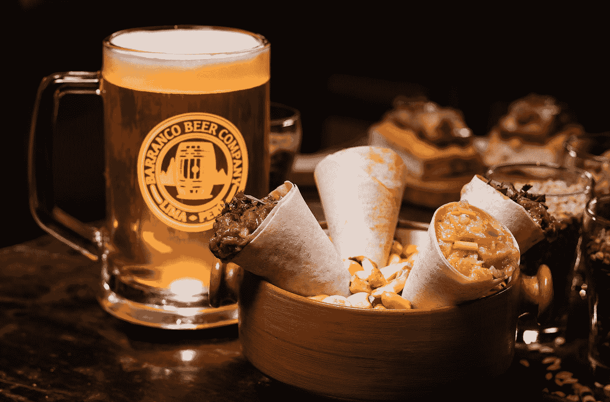
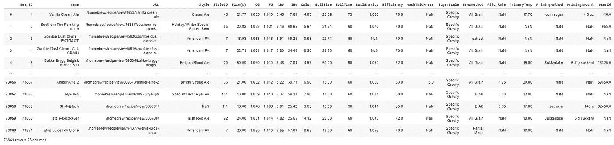
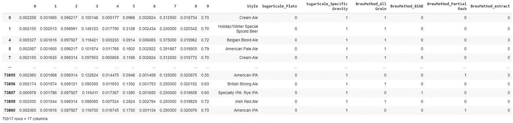

# 利用分类从配料中发现啤酒类型

> 原文：<https://pub.towardsai.net/discovering-beer-type-from-ingredients-using-classification-b2dd8b41e482?source=collection_archive---------2----------------------->

## [机器学习](https://towardsai.net/p/category/machine-learning)

## 使用支持向量机的啤酒分类器:全部代码可在我的 Github repo 获得[。](https://github.com/arditoibryan/Projects/tree/master/20200827_Beer_Recipe_Classifier)

在本文中，我将分析一个包含近 80，000 个样本的数据集中的啤酒配方数据。通过使用监督学习，我将尝试从配方过程中估计啤酒的类型。该数据集已通过链接从 Kaggle [下载。](https://www.kaggle.com/jtrofe/beer-recipes)



照片由[gian Carlo revoledo](https://unsplash.com/@giancarlor_photo?utm_source=medium&utm_medium=referral)在 [Unsplash](https://unsplash.com?utm_source=medium&utm_medium=referral) 上拍摄

# 创建模型的步骤

创建这个模型的大部分时间实际上都花在了预处理数据上。数据集是不完整的，不是时间序列，而是**个独立样本**，我无法使用插值来解决这个问题。

*   导入数据集
*   创建函数
*   预处理(2 个阶段)
*   提取要素和标注
*   剧烈的
*   训练模型
*   性能赋值

## 导入数据集

因为我使用 Google Colab 来执行实验，所以我已经将数据集下载到我的驱动器中，现在我将导入 pandas。

```
import pandas as pd
from sklearn import preprocessing
import numpy as np#   importing dataset
df = pd.read_csv('/content/drive/My Drive/Colab Notebooks/Projects/20200827_Beer_Classifier/recipeData.csv', engine='python')
df
```



原始数据集

在继续下一步之前，我总是有一套预先准备好的函数供以后使用。在这种情况下，我只使用 one_hot 编码。然而，我不想在预处理过程中使用一大块代码，只使用一行代码调用它要舒服得多。

```
#   functions
def one_hot(df, partitions):
  #togliamo le colonne da X
  for col in partitions:
    k = df.pop(col)
    k = pd.get_dummies(k, prefix=col)
    df = pd.concat([df, k] , axis=1)
  return df
```

## 预处理

这个数据集的处理相当困难。我将预处理分为两个独立的阶段。

```
#   preprocessing_1#getting rid of columns I do not need
df = df.drop(['BeerID', 'Name', 'StyleID'], axis=1)
```

看了一下数据后，我去掉了有太多 NaN 和 BeetID 的列，这是啤酒标签到数字的转换。如果我在特征中使用标签的副本，模型将会受到危害。

```
#getting rid of columns with NaN values
df = df.drop(['URL', 'PrimingAmount', 'UserId', 'PrimingMethod', 'PitchRate', 'MashThickness', 'PrimaryTemp'], axis=1)
df = df.dropna(axis=0)
df
```

在预处理的第二步，我需要去掉包含 NaN 值的行。我将和大约。七万个样本。然后，我需要对齐特征和标签的索引。

```
#   preprocessing_2
#saving one_hot columns
df_ = df[['SugarScale', 'BrewMethod', 'Style']]
df_#transform
scaler = preprocessing.MinMaxScaler(feature_range=(0, 1))
df = scaler.fit_transform(df.drop(['SugarScale', 'BrewMethod', 'Style'], axis=1))
df = pd.DataFrame(df)#standardizziamo datasets
df.index = df_.index
df#reattach datasets
df = pd.concat([df, df_], axis=1)
df#one_hot
df = one_hot(df, ['SugarScale', 'BrewMethod'])
df#dropna
df = df.dropna(axis=0)
df
```

## 特征

```
#   features
X = df.copy()
X
```



## 标签

```
#   labels
y = pd.DataFrame(X.pop('Style'))
y
```


## 裂开

现在，我将按照 80:20 的比例将我的模型分为训练集和测试集。

```
from sklearn.model_selection import train_test_splitX_train , X_test, y_train, y_test = train_test_split(X, y, test_size=0.2, random_state=42)
```

## 训练模型

我将使用支持向量机作为模型。这是最常见的分类模型之一。

```
from sklearn import svm
clf = svm.SVC(C=1.2, kernel='linear', degree=3)
clf.fit(X_train, y_train)
```

## 预言；预测；预告

y_pred 是我刚刚在测试集上创建的模型的估计。

```
y_pred = clf.predict(X_test)
```

## 评估性能

为了评估性能，我将比较 y_pred 和 y_test。

```
from sklearn import metrics
print("Accuracy:", metrics.accuracy_score(y_test, y_pred))#Using SyleID as label
#Accuracy: 0.22434812055536743#Using Style as label
#Accuracy: 0.22631877481565513
```

## 结论

自变量对因变量的预测非常糟糕。我尝试了多次调优，并在 Kaggle 上搜索了其他结果，不幸的是，最高的准确率大约是 45%。