# 非平行文本风格转换的非纠缠表征学习

> 原文：<https://pub.towardsai.net/disentangled-representation-learning-for-non-parallel-text-style-transfer-paper-summary-aa862bc46349?source=collection_archive---------0----------------------->

## 论文摘要

## Vineet John、Lili Mou、Hareesh Bahuleyan、Olga Vechtomova

> 解开神经网络的隐藏层让我们对神经网络有更多的控制和理解

[斯蒂夫·约翰森](https://unsplash.com/@steve_j?utm_source=medium&utm_medium=referral)在 [Unsplash](https://unsplash.com?utm_source=medium&utm_medium=referral) 上拍照

在这篇文章中，我将会以一种简单易懂的方式来解释《非平行文本风格转换的表象学习》[1]中所做的工作，并解释该论文中的一些核心观点。这篇论文发表在 ACL 2019 上，这是机器学习领域的领先会议之一。

这篇论文的标题中有两个关键部分，我将在开始这篇论文的实际内容之前直观地解释它们中的每一个。这两个组成部分是解开表征学习和非平行文本风格转移。

# 解开表征学习

想象一下一个自动编码器，你传入一些数据，然后用一些低维的隐藏层重建数据。这种低维表示通常被称为潜在向量，它学习低维空间中的数据表示，并可用于生成原始输入数据。现在，在正常的自动编码器中，潜在向量包含生成原始数据所需的所有信息，但如果我们想要在潜在向量表示的某些部分中分离输入数据的特定属性，该怎么办呢？例如，如果潜在表示是大小为 128 的向量，我们希望向量的前 120 个分量存储关于输入数据内容的信息，后 8 个分量存储关于样式的信息。请注意，数据的内容和样式可以是任何东西，这取决于我们如何定义它们。我们将在本文的后面部分讨论这两个东西的定义。在这一点上，最重要的是理解解缠是什么意思，为了更好地理解，让我们来看一个我刚才解释的可视化表示。

Autoencoder 把潜在空间分为风格空间和内容空间，如文中所述[1]。来源[链接](https://arxiv.org/pdf/1808.04339.pdf)

在上图中，我们看到一个普通的自动编码器，它接受一个输入句子，将其压缩到一个潜在空间，并试图重建原始句子。但是我们也可以看到，潜在向量被分成两个空间:-由 s 表示的风格空间，其应该捕获句子的风格信息(一种可能的风格可以是句子的情感)，和由 c 表示的内容空间，其应该捕获句子的内容信息。

**关键问题:-** 我们在这一点上想要回答的问题是，我们如何训练自动编码器，以便能够在潜在向量表示中分离风格空间和内容空间？

但在我们进入解决方案之前，让我们快速讨论一下我们的第二个组成部分(非平行文本风格转换)，并了解解开潜在空间将如何有助于文本风格转换。

# 非平行文本风格转移

在这一节中，我们看到有两个子组件:-文本风格转移和非平行。我们将分别研究它们。

## 文本风格转换

文本风格转移是指从某个输入文本生成文本，内容与输入文本相同(基本上讲的是与输入文本相同的东西)但风格不同。一个将文本的情感视为风格的明显例子是生成关于一家餐馆的负面评论，而将正面评论作为输入文本，如下所示。

> 输入文本—食物很棒，服务也很出色(正面)
> 
> 输出文本—食物有点糟糕，但员工非常出色(负面)

## 非并行数据

该组件指的是文本风格转换系统可访问的数据类型，并且可以被分类为并行数据和非并行数据。

并行数据是指我们可以访问成对的数据，其中某种风格的输入文本直接映射到不同风格的文本，并且可以访问风格转换系统。一个经典的例子是机器翻译系统，它可以访问两种不同语言相互映射的文本。

非并行数据是指我们只有一个输入文本，但没有从该文本到不同样式的可能文本的映射。

在我们的场景中，我们无法访问并行数据，这是我们甚至希望从属性方面理清潜在空间的主要原因。

## 解缠如何帮助非平行文本风格转换？

由于我们无法访问从一种风格到另一种风格的成对数据映射，我们需要理清思路，将潜在空间分成内容和风格。如果我们能做到这一点，那么从一个输入文本，现在我们有一个潜在的向量表示，分为内容向量和风格向量。要生成风格转换文本，我们需要做的唯一事情是创建一个与输入文本内容向量相同的新的潜在向量，以及一个基于我们的目标风格的新的风格向量，然后使用这个潜在向量来生成我们的输出文本。

现在，我们已经建立了与问题相关的不同部分，让我们继续进行实际的任务，获得解开的潜在向量表示。

# 方法

终于，我们到了。准备好深入研究解决方案，但让我们花点时间快速再看一下关键问题，即— **我们如何训练自动编码器，以便能够在潜在向量表示中分离样式空间和内容空间？**

以样式空间和内容空间为例，我们希望在最后有两个组件，每个组件都有两个相同的步骤，只是稍有改动。

1.**样式空间 s 中的样式信息** —在样式空间 s 中实施样式信息(步骤 1)，并从内容空间 c 中移除任何样式信息(步骤 2)

2.**内容空间 c 中的内容信息** —在内容空间 c 中实施内容信息(步骤 1)，并从样式空间 s 中移除任何内容信息(步骤 2)

我将根据第一个组件描述每一个步骤，然后讨论为执行组件 2 的步骤所做的更改。

## 步骤 1——风格信息的多任务培训

目标:-确保样式信息包含在样式空间 s 中。

在这一步中，我们设计一个神经网络(比如网络 A ),它采用潜在表示的风格空间 s，并试图预测文本的风格。所以，数学上看起来

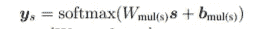

等式 1

在训练该网络时，我们一起训练编码器参数，以便它以帮助网络 A 能够正确预测风格的方式学习潜在表示的风格空间。这整个概念可以概括为给定的损失 fn:-

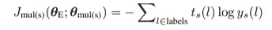

等式 2

因此，本质上，我们训练编码器参数以最小化等式 2，以及自动编码器的正常重建损失，由下式给出

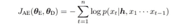

自动编码器重建损失(等式 3)

因此，当我们同时训练自动编码器和网络 A 时，这是一种多任务训练范例。

## 第二步——风格信息的对抗性训练

目标:-确保内容空间 c 没有任何样式信息。

类似于步骤 1，我们设计一个新的神经网络(我们称之为鉴别器)，它现在预测风格信息，但不是来自风格空间 s，而是内容空间 c 作为输入。数学上，神经网络看起来像:-

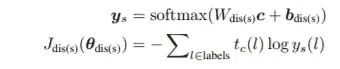

注意:-与步骤 1 相反；我们不一起训练神经网络和编码器参数。

一旦鉴别器被训练，编码器将鉴别器视为其对手(因为它不希望鉴别器能够从内容空间推断样式信息)，并训练编码器参数以使鉴别器更难，如以下损失函数所示:-

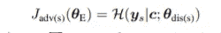

在上面的损失函数中，训练编码器参数，使得学习的内容空间在从内容空间预测风格信息时最大化学习的鉴别器的熵。

因此，在这一点上，我们有一个潜在的表示，它在空间 s 中存储了样式信息，而内容空间 c 没有任何样式信息。

类似地，我们需要一个存储内容信息的内容空间 c 和一个没有任何内容信息的样式空间 s。

我们遵循早先的两步过程，但是现在我们将输入改变为内容空间(c)而不是样式空间，并且网络试图预测内容信息而不是样式信息。这些变化导致步骤 1 和 2 的损失函数如下

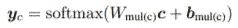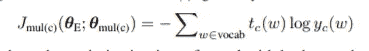

训练内容空间时步骤 1 的神经网络和损失函数

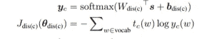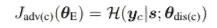

步骤 2 的鉴别器神经网络和对抗性损失函数

# 整体培训流程

综上所述，我们得到的是由自动编码器重构损失、风格空间的多任务损失、风格空间的对抗性损失、内容空间的多任务损失、内容空间的对抗性损失组成的单一损失函数。数学上，这意味着:-

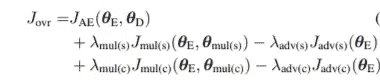

训练自动编码器的总损失

# 如何决定风格和内容？

现在我们已经提出了培训过程，这是方法论的核心，让我们看看如何定义风格和内容。其实你怎么定义这些问题完全取决于你，但是我来给你看看论文作者是怎么定义这两样东西的。

## 风格

在本文中，风格被定义为文本的情感，它已经在输入数据中被标注。

## 内容

这是一个比较棘手的部分，因为对于内容的真正含义没有明确的定义。为此，作者为每个句子提出了一个词袋特征，它计算句子中的内容词的数量与该句子中总词数量的比率。内容词是所有词，不包括停用词和特定于样式的词。

# 可视化样式空间和内容空间

一旦我们训练了系统并学习了内容空间和风格空间，确定潜在表示是否被正确地解开的一种方法是绘制内容空间和风格空间的 tSNE。论文中提供的 tSNE 图如下所示。

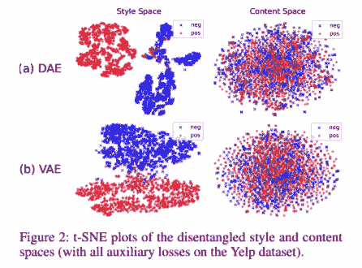

TSNE 情节分为风格空间和内容空间，详见论文[1]。来源[链接](https://arxiv.org/pdf/1808.04339.pdf)

从图中我们可以看到，正面和负面的情感数据在风格空间中是明显分开的，但在内容空间中却不是这样，这正是我们的目标。

图中另一个重要的观察结果是，如果我们使用传统的基于神经网络的确定性自动编码器，潜在空间不像图中数据点之间的大量空白空间那样平滑和连续，而如果我们使用变分自动编码器，我们看到潜在空间是平滑和连续的。

# 结论

我希望在这篇文章里。我可以提供很好的见解，从潜在的表现形式来看，解开意味着什么，以及它如何用于文本风格的转换。我还在文本风格转换领域的一篇论文中讨论了一种方法。要找到更多关于文本风格转换的论文，你可以点击这个[链接](https://github.com/fuzhenxin/Style-Transfer-in-Text)。

# 参考

[1] Vineet John、Lili Mou、Hareesh Bahuleyan 和 Olga Vechtomova。2018.文本风格转换的非纠缠表征学习。arXiv 预印本 arXiv:1808.04339。