# 用 R 中的例子剖析单向方差分析和协方差分析

> 原文：<https://pub.towardsai.net/dissecting-1-way-anova-and-ancova-with-examples-in-r-a3a7da83d742?source=collection_archive---------1----------------------->


彼得·奥勒克萨在 [Unsplash](https://unsplash.com?utm_source=medium&utm_medium=referral) 上拍摄的照片

## [数据科学](https://towardsai.net/p/category/data-science)， [R](https://towardsai.net/p/category/programming/r)

## 通过分析方差得出的均值差异

ANOVA(方差分析)是比较两个以上组的平均值的过程。它也可用于比较两组的平均值。但那是不必要的。只能使用假设检验方法(如 t 检验)来比较两组之间的平均值。

如果您需要复习 t-test 或 z-test，请查看这篇文章:

[](/a-complete-guide-to-confidence-interval-t-test-and-z-test-in-r-for-data-scientists-cd16dd2d0eec) [## 数据科学家置信区间、t 检验和 z 检验完全指南

### 大量的实践练习

pub.towardsai.net](/a-complete-guide-to-confidence-interval-t-test-and-z-test-in-r-for-data-scientists-cd16dd2d0eec) 

本文将集中于使用方差分析(ANOVA)方法比较两个以上组的平均值。**这种方法将一个给定的连续结果的整体可变性分解成几个部分。**

## 单向方差分析

单向 ANOVA 适用于基于一个因子的值定义组的情况。目标是比较各组的平均值。

无论样本均值是否不同，每组均值内的变异量都是比较均值并得出结论时要考虑的重要因素。

> 一般规则是，如果组间的差异小于组内的差异，则组间均值差异的可能性较小。同时，如果组间的差异大于单个组内的差异，则组间的均值可能存在差异。

因此，在方差分析中，我们既需要组间的可变性，也需要单个组内的可变性。通常，方差分析中使用 F 统计量作为检验统计量。F 统计量的公式为:

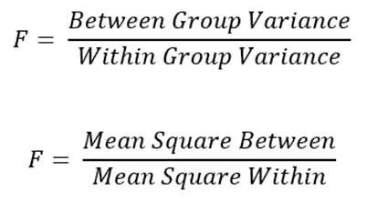

或者，它可以表示为:

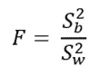

F 统计量公式的分子和分母应该分开分析。

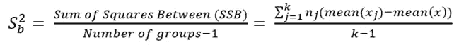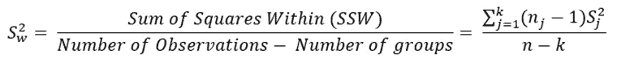

这里 k 是组的数量

n =观察次数

k =组数

nj =每个单独组中的观察次数

Sj =每个单独组的标准偏差

> 提醒一下，标准差的平方就是方差。

在继续讨论之前，让我们使用真实数据集，计算组间方差和组内方差，以便更清楚地理解它:

这里我用 R 来计算。您可以使用任何其他编程语言，甚至 excel。我在这次演示中使用的数据集是 RStudio 中的内置数据集。数据集的名称是“mtcars”。这些是数据集的列名:

```
names(mtcars)
```

输出:

```
[1] "mpg"  "cyl"  "disp" "hp"   "drat" "wt"   "qsec" "vs"   "am"  
[10] "gear" "carb"
```

这里的“cyl”是一个分类变量，有三个唯一值 4、6 和 8。在本文中，我们将检查不同“气缸”的平均“马力”或马力是否不同。

下面是一个箱线图，提供了每个“气缸”的“hp”数据的初步概念:

```
boxplot(hp~cyl, data = mtcars, main = "hp by cyl",
        xlab = "cyl", ylab = "hp")
```

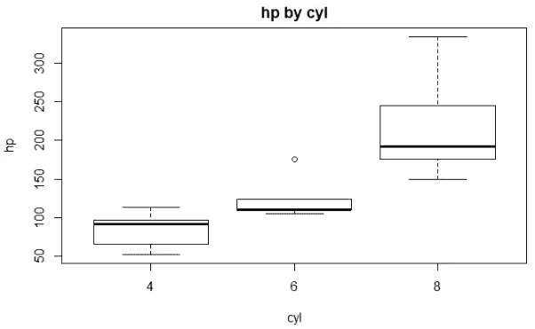

从上面的图片我们可以找到一些信息。也就是说，“气缸 8”似乎具有更高的值，但同时也具有更高的范围。4 和 6 更接近，其中 4 具有较高的可变性，而 6 具有较低的可变性，带有一些异常值。

对于组间方差和组内方差的计算，我们需要以下信息:

a.观察次数:

```
nrow(mtcars)
```

输出:

```
32
```

b.平均“hp”:

```
mean(mtcars$hp)
```

输出:

```
146.6875
```

c.单个“气缸”组的平均“马力”:

```
mtcars %>% group_by(cyl) %>% summarise(mean(hp))
```

输出:

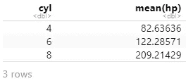

d.单个“气缸”组“hp”的标准偏差:

```
mtcars %>% group_by(cyl) %>% summarise(sd(hp))
```

输出:

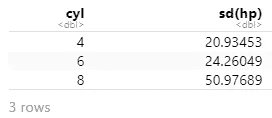

e.每个“气缸”组的“hp”方差:

```
mtcars %>% group_by(cyl) %>% summarise(var(hp))
```

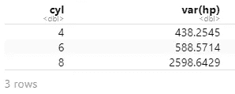

以下是(MSB)之间的均方误差和(MSW)内的均方误差的表达式:

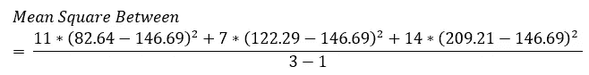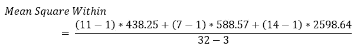

间均方和内均方分别为 52008.23 和 1437.801。

## 推理

对于推断，f 检验是非常常见的，它是从方差分析表中得出的。这也称为全局测试。这个测试让你知道至少两组之间是否有显著差异。

推论归结为三个常见步骤:

1.  设置零假设、替代假设和显著性水平。零假设是一种普遍的信念。在这种情况下，零假设是，所有类型的“气缸”的平均“马力”相等。我们将使用 95%的置信度。这意味着显著性水平为 0.05。

如果我们找不到足够的证据来支持这一主张，我们将拒绝零假设，并接受替代假设。否则，我们将无法拒绝零假设。

另一个假设是，至少两组之间的均值存在差异。

2.从 f 分布中找出适当的值。你可以用 F 表找到它。但是我会用 R 来计算。因为 R 对我来说是可用的，用 qf 函数很容易计算 R。您需要输入三个参数。置信水平和两个自由度。自由度为:k-1 = 3–1 = 2，n-k = 32–3 = 29。

```
qf(0.95, 2, 29)
```

输出:

```
[1] 3.327654
```

> 如果 F 统计量大于或等于 3.33，我们将拒绝零假设。

3.计算 F 统计量

这是用于查找 F 统计量的通用 ANOVA 表:

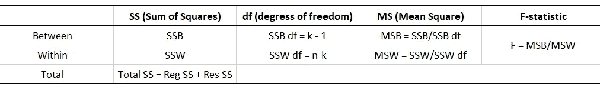

请记住，在上一节中，我们已经计算了(MSB)之间的均方误差和(MSW)之内的均方误差。因此，我们可以像这样简单地计算 F 统计量:

f = MSB/MSW = 52008.23/1437.801 = 36.17

听着，F 值比 3.33 高多了。所以，我们有足够的证据来拒绝零假设。这意味着所有类型的“气缸”的“马力”并不相同。至少有两个群体的手段是不同的。

## 评估各组之间的差异

在上一节中，我们评估了任意两组之间的均值是否存在差异。我们发现确实有。现在，你可能有兴趣知道哪些群体是完全不同的。

以确定我们需要对每一对进行测试。例如，这里有三组不同的“气缸”(4、6 和 8)。因此，一个测试是关于 4 和 6 的平均“hp ”,一个是关于 6 和 8，一个是关于 4 和 8。所以，会有三个测试。有一个公式可以确定需要多少次测试。

> 如果有 k 个组，测试次数将为 k(k-1)/2

像这样的多重比较测试的问题是我们有 alpha*(k(k-1))/2 的机会犯错误。

为了控制测试中的错误数量，每次测试都应该有一个调整。一种非常流行的调整是 Bonferroni 调整，其中每个测试的显著性水平是(alpha/c)。这里 c 是总测试次数。

这里将使用 t-统计量来做这件事。

t 统计量的公式如下:

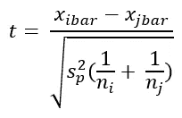

现在我将使用 R 来完成剩下的测试。因为正如我前面提到的，我们现在必须进行几项测试。r 的优秀功能使这项工作变得非常容易。

模型如下:

```
mtcars$cyl = as.factor(mtcars$cyl)m = aov(hp~cyl, data=mtcars)
summary(m)
```

输出:

```
 Df Sum Sq Mean Sq F value   Pr(>F)    
cyl          2 104031   52015   36.18 1.32e-08 ***
Residuals   29  41696    1438                     
---
Signif. codes:  0 ‘***’ 0.001 ‘**’ 0.01 ‘*’ 0.05 ‘.’ 0.1 ‘ ’ 1
```

请注意，我必须将“cyl”列转换为一个因子。如果没有分组列作为因子，最终可能会在成对测试中产生一些错误。

> 看上面的汇总表。之间的均方，内部的均方，F 值和我们之前手动计算的差不多。

现在，可以像这样对所有对进行 t 检验:

```
pairwise.t.test(mtcars$hp, mtcars$cyl, p.adj = "bonferroni")
```

输出:

```
Pairwise comparisons using t tests with pooled SDdata:  mtcars$hp and mtcars$cyl 4       6      
6 0.12    -      
8 1.2e-08 8.7e-05P value adjustment method: bonferroni
```

如果你是第一次，可能会有点难以理解这里的表格。此表给出了所有对中差异的 p 值。组 4 和组 6 的 p 值为 0.12，组 4 和组 8 的 p 值为 1.2e-08，组 6 和组 8 的 p 值为 8.7e-05。

考虑到 alpha 水平为 0.05，我们没有足够的证据证明“气缸 4”和“气缸 6”的平均“hp”相同。因为 p 值是 0.12，大于 p 值。

但有足够的证据来否定“第 4 缸”和第 8 缸的平均“马力”相同的观点。因为 p 值低于 alpha 级别。这对“气缸”6 和 8 也是如此。

还有另一个名为“TukeyHSD”的函数，它给出了每一对均值差异的置信区间以及 p 值。

```
TukeyHSD(m)
```

输出:

```
Tukey multiple comparisons of means
    95% family-wise confidence levelFit: aov(formula = hp ~ cyl, data = mtcars)$cyl
         diff       lwr       upr     p adj
6-4  39.64935 -5.627454  84.92616 0.0949068
8-4 126.57792 88.847251 164.30859 0.0000000
8-6  86.92857 43.579331 130.27781 0.0000839
```

首先可以看到差异，然后是置信区间的下限和上限，以及调整后的 p 值。由于校正方法不同，p 值看起来略有不同。但推论是一样的。使用这里的 p 值，我们也必须拒绝“气缸 4”和“气缸 6”的平均“马力”相同的想法。因为 p 值为 0.09，高于 alpha 级别 0.05。

## 针对另一个变量进行调整

一直以来，我们只使用了一个响应变量和一个解释变量。现在我们来看看如何调整第二个响应变量。这个过程被称为单向变异。

我们将首先使用“car”包中的“Anova”函数来查看“disp”变量是否显著。它还将测试是否至少有一对“cyl”组具有不同的平均“hp”。

```
Anova(lm(hp~cyl+disp, data=mtcars), type=3)
```

输出:

```
Anova Table (Type III tests)Response: hp
            Sum Sq Df F value    Pr(>F)    
(Intercept)  24897  1 16.8314 0.0003189 ***
cyl          13143  2  4.4428 0.0210962 *  
disp           280  1  0.1890 0.6670811    
Residuals    41417 28                      
---
Signif. codes:  0 ‘***’ 0.001 ‘**’ 0.01 ‘*’ 0.05 ‘.’ 0.1 ‘ ’ 1
```

如果你注意到“Anova”函数将线性回归模型作为一个参数。本文不涉及线性回归和方差分析之间的关系。那又是一个长时间的讨论。如果您有兴趣探索更多，请查看这篇文章，其中 ANOVA 表用于推断线性回归模型的信息:

[](https://towardsdatascience.com/detail-explanation-of-simple-linear-regression-assessment-and-inference-with-anova-bb12ff4604d3) [## 简单线性回归的详细解释，评估，和用 ANOVA 的推断

### 一步一步的讨论和例子，手动实现和 R

towardsdatascience.com](https://towardsdatascience.com/detail-explanation-of-simple-linear-regression-assessment-and-inference-with-anova-bb12ff4604d3) 

现在，让我们看看当“disp”变量被控制时，我们之前发现的成对差异将如何改变。“lsmeans”包中的“lsmeans”函数将用于:

```
lsmeans(lm(hp~cyl+disp, data=mtcars), pairwise~cyl, adjust="tukey")
```

输出:

```
$lsmeans
 cyl lsmean   SE df lower.CL upper.CL
 4     90.2 20.9 28     47.4      133
 6    125.1 15.9 28     92.5      158
 8    201.9 19.8 28    161.3      242Confidence level used: 0.95$contrasts
 contrast estimate   SE df t.ratio p.value
 4 - 6       -34.9 21.5 28 -1.625  0.2522 
 4 - 8      -111.7 37.6 28 -2.967  0.0163 
 6 - 8       -76.7 29.5 28 -2.603  0.0377P value adjustment: tukey method for comparing a family of 3 estimates
```

注意每对的 p 值！他们变得多好啊！所有的 p 值都比以前大。像以前一样，对 4，6 的 p 值大于α水平 0.05。所以平均“hp”在这里有很大的不同。但是 4–8 和 6–8 的 p 值比我们之前没有控制任何其他变量的 ANOVA 测试要大得多。它们仍然低于阿尔法水平 0.05，我们将得出结论，我们无法拒绝 4–8 和 6–8 之间的平均“hp”相同的观点。

但是，如果我们认为 alpha 水平为 0.01，那么我们可以拒绝零假设或 4-8 和 6-8 对的平均“hp”相同的想法。因此，调整“disp”变量会显著改变结果。但这并不一定会一直发生。这就是为什么我们必须测试，看看会发生什么。

## 结论

仅仅通过查看三组的箱线图，一些人可能会得出均值不同的结论。或者只是计算数据的平均值，有些人可能会得出结论，它们是不同的。但是使用方差分析，你可能会看到一个不同的结果，就像这个例子。

这个想法是看你是否能把样本概括为总体均值，或者均值的差异是否显著。

这是统计学中一个流行且广泛使用的话题。希望对你有帮助！

欢迎在推特上关注我，喜欢我的 T2 脸书页面。

## 更多阅读

[](https://medium.com/codex/complete-details-of-simple-logistic-regression-model-and-inference-in-r-eedb1c84b65f) [## R 中简单逻辑回归模型和推论的完整细节

### 举例演示

medium.com](https://medium.com/codex/complete-details-of-simple-logistic-regression-model-and-inference-in-r-eedb1c84b65f) [](https://towardsdatascience.com/an-ultimate-data-visualization-course-in-python-for-free-12a5da0a517b) [## 免费的 Python 终极数据可视化课程

### 学习比任何付费课程更多的可视化功能和技术

towardsdatascience.com](https://towardsdatascience.com/an-ultimate-data-visualization-course-in-python-for-free-12a5da0a517b) [](https://towardsdatascience.com/detailed-guide-to-multiple-linear-regression-model-assessment-and-inference-in-r-146845067aa3) [## 多元线性回归模型、评估和推理的详细指南

### 模型开发、解释、方差计算、f 检验和 t 检验

towardsdatascience.com](https://towardsdatascience.com/detailed-guide-to-multiple-linear-regression-model-assessment-and-inference-in-r-146845067aa3) [](https://towardsdatascience.com/a-complete-beginners-guide-to-data-visualization-in-ggplot2-121f1eee23cd) [## ggplot2 中数据可视化的完全初学者指南

### 这是一个丰富的图书馆。今天就开始使用吧

towardsdatascience.com](https://towardsdatascience.com/a-complete-beginners-guide-to-data-visualization-in-ggplot2-121f1eee23cd) [](https://towardsdatascience.com/a-complete-k-mean-clustering-algorithm-from-scratch-in-python-step-by-step-guide-1eb05cdcd461) [## Python 中从头开始的完整 K 均值聚类算法:分步指南

### 还有，如何使用 K 均值聚类算法对图像进行降维

towardsdatascience.com](https://towardsdatascience.com/a-complete-k-mean-clustering-algorithm-from-scratch-in-python-step-by-step-guide-1eb05cdcd461)