# 通过机器学习和人工智能推荐算法提高多样性

> 原文：<https://pub.towardsai.net/diversity-recommender-systems-in-machine-learning-and-ai-a56849c5a256?source=collection_archive---------0----------------------->

## [人工智能](https://towardsai.net/p/category/artificial-intelligence)，[机器学习](https://towardsai.net/p/category/machine-learning)

## 引发社会变革并增加客户终身价值的个性化和发现


根据谷歌图片编译

## 每天你都在被机器学习和 AI 推荐算法影响。

你通过脸书、推特、Instagram 在社交媒体上消费的东西，你在搜索、收听或观看谷歌、Spotify、YouTube 时体验到的个性化，你使用 Airbnb 和 UberEATS 发现的东西，所有这些产品都由机器学习和人工智能[推荐系统](https://en.wikipedia.org/wiki/Recommender_system)提供支持。

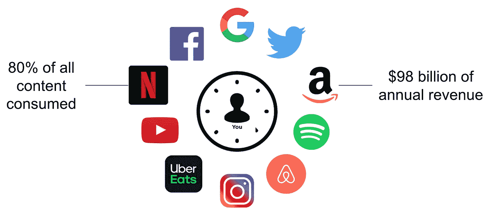

推荐系统影响着我们的日常生活

网飞上消费的所有内容的 80%和亚马逊上 980 亿美元的年收入是由推荐系统驱动的，这些公司继续投资数百万美元来构建这些算法的更好版本。

## 有两种主要类型的推荐系统:

1.  协同过滤:找到与你相似的用户，并根据相似用户的喜好向你推荐一些东西。
2.  基于内容的过滤:利用你过去的历史和行为来提出建议。

还有一种基于混合的推荐系统，它混合了协作和基于内容的过滤。这些机器学习和人工智能算法是我们每天使用的消费产品的动力。

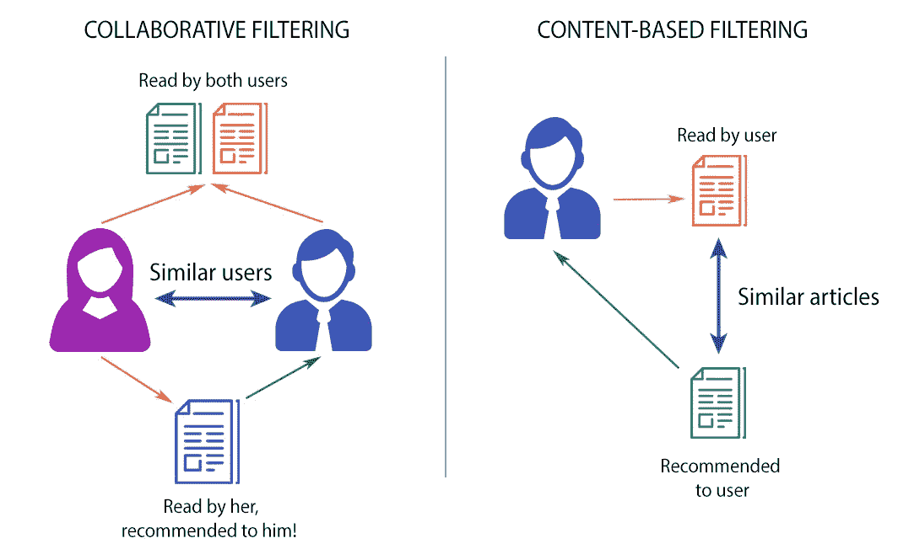

推荐系统如何工作。图片由 [Sanket](https://towardsdatascience.com/brief-on-recommender-systems-b86a1068a4dd) 提供。

## 问题是这些算法从根本上是为了同一个东西而优化的:相似性

推荐算法基于只有相似性才是好的这一关键假设进行优化。如果你喜欢奇幻书，你会被推荐更多奇幻书，如果你喜欢进步政治，你会被推荐更多进步政治。遵循这些算法限制了我们的世界观，我们无法看到新的、有趣的和独特的观点。

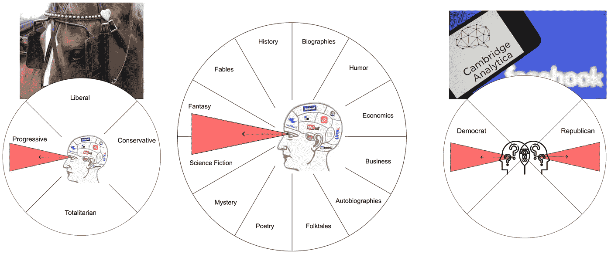

推荐系统让我们陷入一种狭隘的思维

就像一匹戴着眼罩奔跑的马，我们陷入了一个回音室和危险的人工智能反馈回路，在那里算法的输出被重新用来训练模型的新版本。这缩小了我们的思维，强化了偏见。最近的事件，如[脸书-剑桥分析公司数据泄露](https://en.wikipedia.org/wiki/Facebook%E2%80%93Cambridge_Analytica_data_scandal)展示了技术对人类行为的影响及其对个人和社会的影响。

心理学和社会学一致认为:我们害怕我们不知道的东西。当人们变得近视时，就是“我们对他们”的心态产生的时候，也是偏见扎根的时候。美国和世界各地的内乱可以追溯到这些概念。幸运的是，研究还表明，观点的多样性创造了理解和联系。

## 这也是一个商业问题

典型的消费者有 3 到 5 种偏好:

*   3 到 5 本最喜欢的书或电影类型
*   3 到 5 个最受欢迎的音乐类别
*   3 到 5 种不同的时尚风格
*   3 至 5 种首选美食

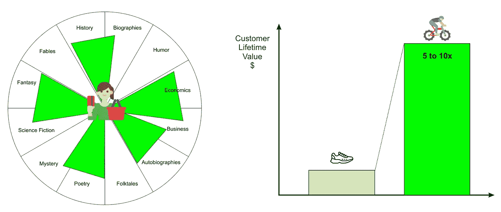

消费者是多样化的

为什么这种多样化的消费者行为没有更好地反映在我们技术的行为中？事实上，如果一家企业能够将客户转变为尝试新的类别，例如将跑步客户转变为新的公路自行车客户，该客户很可能会在新活动中花费 5 到 10 倍的额外费用。对于每一个不同的类别，企业不推荐，这是失去销售和参与。

# 机会:我们如何建立一个更好的推荐系统，使消费者多样化，并增加客户的终身价值？

我们可以从顾客的角度来解决这个问题。让我们把埃隆·马斯克作为一个模范世界公民，他公开表示他从小就喜欢奇幻书籍，并且《T2》中的《指环王》对他有很大的影响。

但如果埃隆继续遵循亚马逊上当今最可见的机器学习算法的建议，他将继续沿着幻想、幻想和更多幻想的道路前进。埃隆还表示，商业书籍塑造了他的世界观，他推荐的是**零比一**。技术应该为每个人提供更多这样的联系，而不是限制。

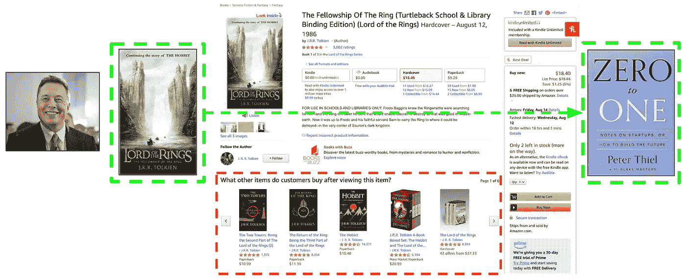

现状导致更多的雷同，那么我们如何更好地匹配客户的利益？图片来自[亚马逊](https://www.amazon.com/)。

*我们如何构建一个推荐引擎，能够像《指环王》一样接受输入书籍，并推荐像《零对一》这样的输出书籍？*

如果我们可以解决像 Elon 这样的个案，那么我们就可以开始看到一个更好的推荐系统如何偏离相似性路径，以创造更有意义的多样性。

# 构建多样性推荐系统

数据科学流程:
1。明确目标
2。收集、探索和清理数据
3。转换数据
4。构建机器学习推荐引擎
5。构建多元化推荐引擎概念验证
6。设计模型
7。商业价值假设和目标启动

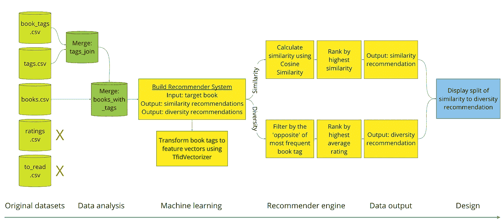

数据科学过程

## 1.定义目标

图书是值得探索的理想行业，因为图书类别和潜在收入之间有明显的区别，不像音乐那样，听新流派的美元价值不太明确。我们的目标是建立一个推荐系统，我们输入一本书，然后输出它:

1.  基于*相似性*的建议，现状算法
2.  基于*多样性*的建议，现状的演变

长期目标是建立一个可以应用于各行各业的推荐系统，使客户能够打开不同发现的大门，并为公司增加客户终身价值。

## 2.收集、探索和清理数据

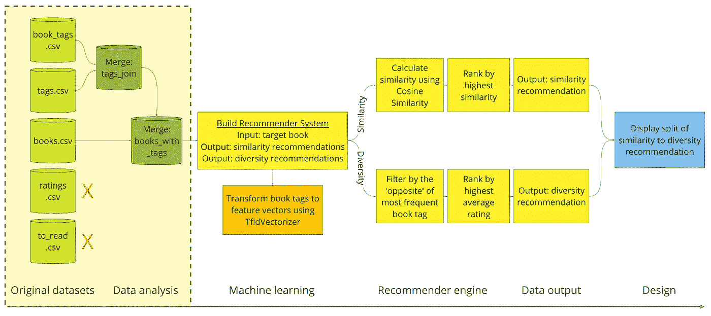

处理数据

Goodreads 提供了一个好的[数据集](https://github.com/allenjiang/Mona-Lisa-AI/tree/master/Books%20Data)。在这里，我们需要确定哪些是有用的，哪些可以删除，以及哪些数据集要合并在一起。

```
**# Load book data from csv**
import pandas as pd
books = pd.read_csv('../data/books.csv')
books
```

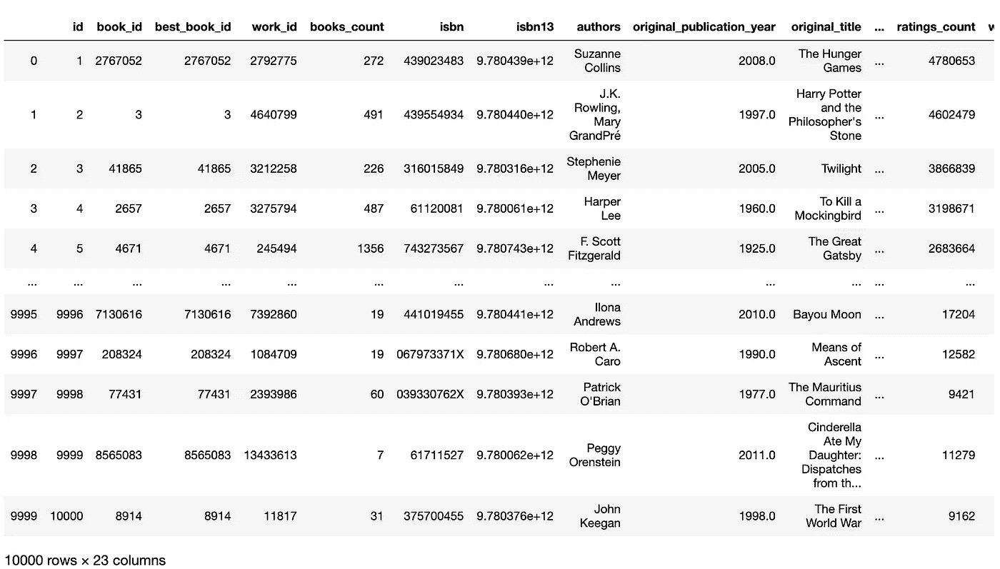

```
**# Explore features**
books.columns
```

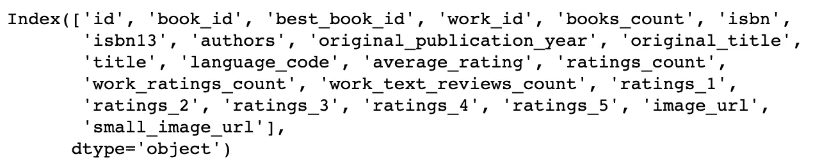

这个数据集中有 10，000 本书，我们希望将“图书标签”作为一个关键特性，因为它有丰富的图书数据来帮助我们进行推荐。这些数据存在于不同的数据集中，因此我们必须进行数据辩论，将数据拼图拼在一起。

```
**# Load tags book_tags data from csv**
book_tags = pd.read_csv('../data/book_tags.csv')
tags = pd.read_csv('../data/tags.csv')# Merge book_tags and tags 
tags_join = pd.merge(book_tags, tags, left_on='tag_id', right_on='tag_id', how='inner')# Merge tags_join and books
books_with_tags = pd.merge(books, tags_join, left_on='book_id', right_on='goodreads_book_id', how='inner')# Store tags into the same book id row
temp_df = books_with_tags.groupby('book_id')['tag_name'].apply(' '.join).reset_index()
temp_df.head(5)**# Merge tag_names back into books**
books = pd.merge(books, temp_df, left_on='book_id', right_on='book_id', how='inner')
books
```

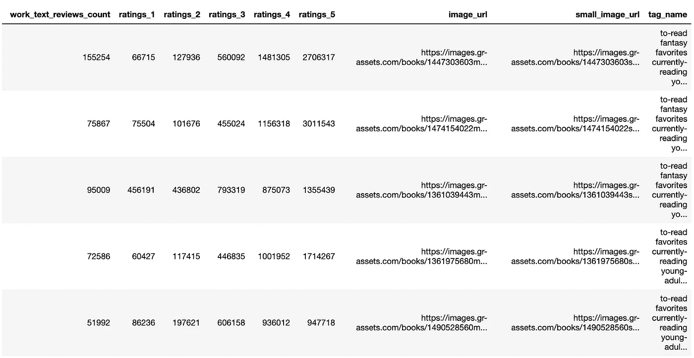

我们现在在一个数据集中有所有的图书标签。

## 3.转换数据

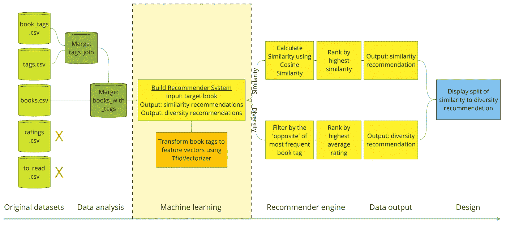

我们的数据集中有 10，000 本书，每本都有 100 个图书标签。这些书标签包含什么？

```
**# Explore book tags**
books['tag_name']
```

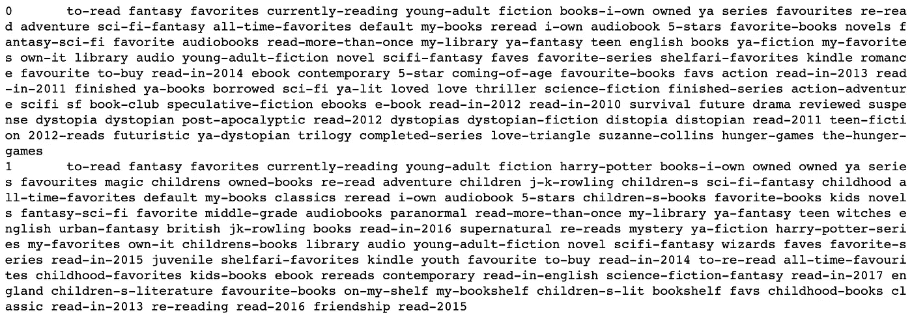

*饥饿游戏和哈利波特与魔法石的标签示例*

我们希望将这些文本转换成数值，这样我们就有了机器学习算法可以理解的数据。TfidfVectorizer 将文本转换为特征向量。

```
**# Transform text to feature vectors**
from sklearn.feature_extraction.text import TfidfVectorizer
tf = TfidfVectorizer(analyzer='word',ngram_range=(1, 2),min_df=0, stop_words='english')
tfidf_matrix = tf.fit_transform(books['tag_name'])
tfidf_matrix.todense()
```

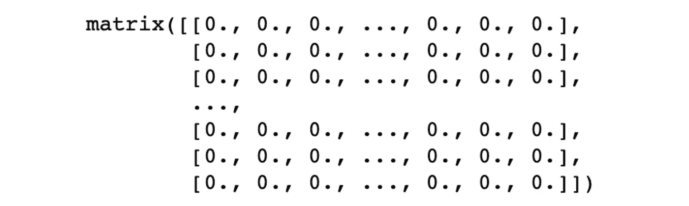

这变成了一个 10000x144268 的矩阵

TF-IDF(术语频率—逆文档频率)计算单词相对于整个文档的重要性。TF 总结了给定单词在文档中出现的频率。IDF 缩减了文档中频繁出现的单词。这允许 TF-IDF 基于关系和加权因子来定义文档中单词的重要性。

## 4.构建机器学习推荐引擎

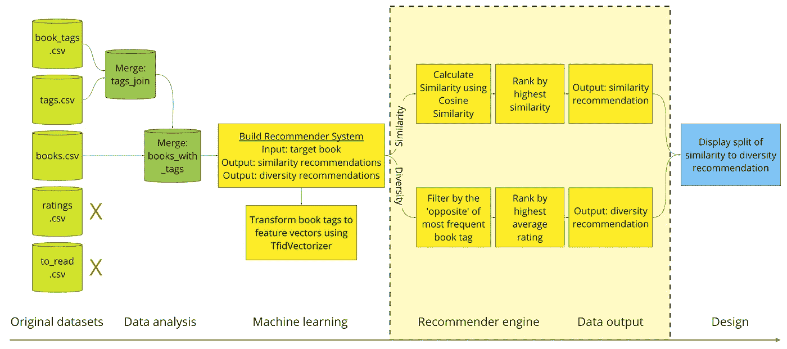

现在我们构建推荐器。我们可以使用余弦相似度来计算表示书籍之间相似性的数值。

```
**# Use numeric values to find similarities**
from sklearn.metrics.pairwise import linear_kernel
cosine_sim = linear_kernel(tfidf_matrix, tfidf_matrix)
cosine_sim
```

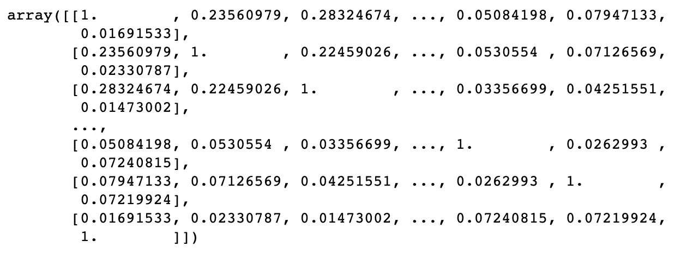

余弦相似性度量在多维空间中投影的两个向量之间的角度的余弦。角度越小，余弦相似度越高。换句话说，这些图书标签之间的距离越近，这本书就越相似。

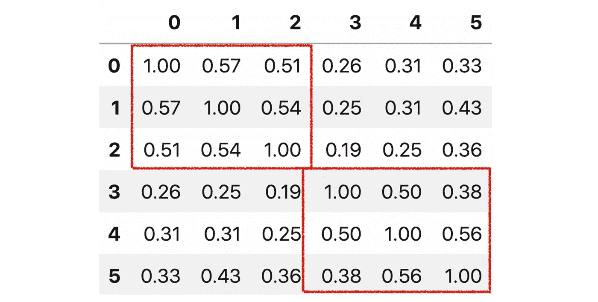

余弦相似矩阵如何工作的例子。图片来自 [machinelearningplus](https://www.machinelearningplus.com/nlp/cosine-similarity/) 。

接下来我们写机器学习算法。

```
**# Get book recommendations based on the cosine similarity score of book tags**# Build a 1-dimensional array with book titles
titles = books['title']
tag_name = books['tag_name']
indices = pd.Series(books.index, index=books['title'])# Function that gets similarity scores
def tags_recommendations(title):
    idx = indices[title]
    sim_scores = list(enumerate(cosine_sim[idx]))
    sim_scores = sorted(sim_scores, key=lambda x: x[1], reverse=True)
    sim_scores = sim_scores[1:11] # How many results to display
    book_indices = [i[0] for i in sim_scores]
    title_df = pd.DataFrame({'title': titles.iloc[book_indices].tolist(),
                           'similarity': [i[1] for i in sim_scores],
                            'tag_name': tag_name.iloc[book_indices].tolist()}, 
                           index=book_indices)
    return title_df
```

这是我们推荐引擎需要的基本代码。这是亚马逊 980 亿美元创收算法和其他类似算法的基础。似乎太简单了。我们可以在这里停下来，或者我们可以扩展我们的代码以显示更多的数据洞察力。

```
**# Get book tags, total tags, and percentage of common tags**
def recommend_stats(target_book_title):

    # Get recommended books
    rec_df = tags_recommendations(target_book_title)

    # Get tags of the target book
    rec_book_tags = books_with_tags[books_with_tags['title'] == target_book_title]['tag_name'].to_list()

    # Create dictionary of tag lists by book title
    book_tag_dict = {}
    for title in rec_df['title'].tolist():
        book_tag_dict[title] = books_with_tags[books_with_tags['title'] == title]['tag_name'].to_list()

    # Create dictionary of tag statistics by book title
    tags_stats = {}
    for book, tags in book_tag_dict.items():
        tags_stats[book] = {}
        tags_stats[book]['total_tags'] = len(tags)
        same_tags = set(rec_book_tags).intersection(set(tags)) # Get tags in recommended book that are also in target book
        tags_stats[book]['%_common_tags'] = (len(same_tags) / len(tags)) * 100

    # Convert dictionary to dataframe
    tags_stats_df = pd.DataFrame.from_dict(tags_stats, orient='index').reset_index().rename(columns={'index': 'title'})

    # Merge tag statistics dataframe to recommended books dataframe
    all_stats_df = pd.merge(rec_df, tags_stats_df, on='title')
    return all_stats_df
```

现在我们把**指环王**输入推荐引擎，看看结果。

```
**# Find book recommendations**
lor_recs = recommend_stats('The Fellowship of the Ring (The Lord of the Rings, #1)')
lor_recs
```

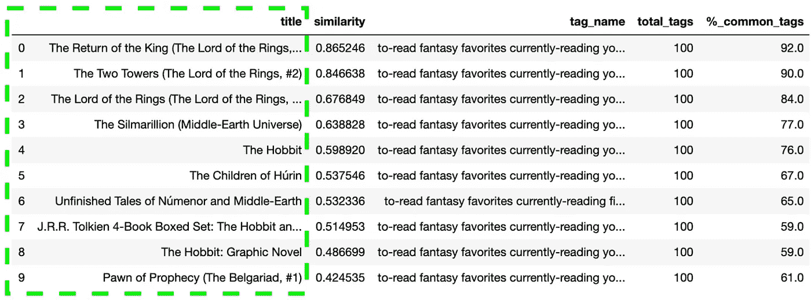

基于图书标签相似度得分的前 10 本推荐图书

我们根据图书标签列出了与《指环王》最相似的 10 本书。这些推荐看起来和亚马逊的网站几乎一样:

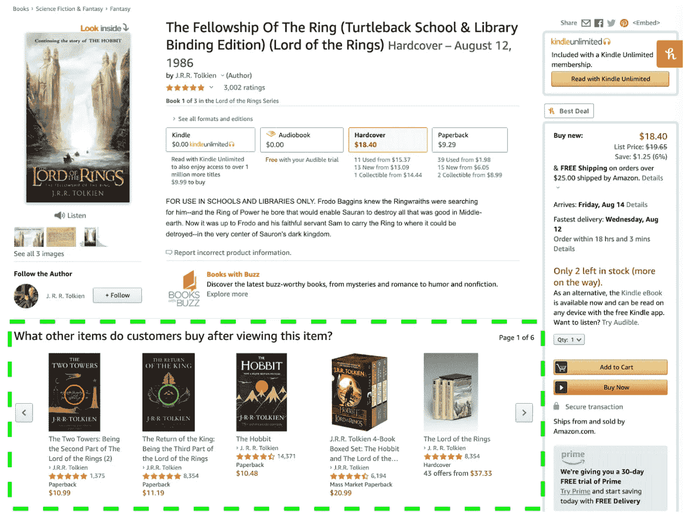

截至 2020 年 8 月的 Amazon.com

成功！制作相似性推荐是第一部分。第二部分是创造多样性。

## 5.构建多样性推荐引擎概念验证

下一部分是进化发生的地方。多样性推荐算法目前还不存在(公开)，所以这门科学将会有一些艺术。除了在研究和数学实验室花费几个月的时间，我们如何建立一个概念证明，可以验证或否定产生多样性建议的可行性？我们来探究一下数据。

由于我们正在通过埃隆马斯克的客户镜头进行逆向工程，并希望推荐者输出零到一，让我们找到这本书相对于《指环王》的定位。

```
**# Find Zero to One book**
lor_recs[lor_recs.title == 'Zero to One: Notes on Startups, or How to Build the Future']
```

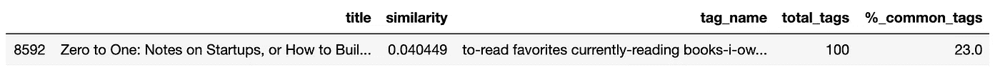

与《指环王》相比，基于相似性，零比一在 10，000 本书中排名第 8，592。相当低。根据算法，这两本书处于光谱的相反两端，一点也不相似。这本书在统计学上处于最低的四分位数，这意味着你和埃隆都不会被推荐这种思想的多样性。

```
**# Calculate statistical data**
lor_recs.describe()
```

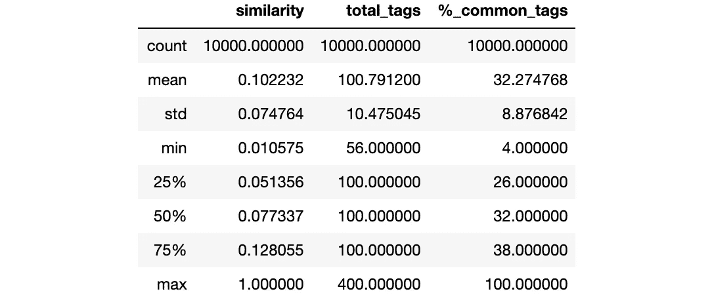

使用箱线图，我们可以更好地形象化这种定位:

```
**# Boxplot of similarity score**
import matplotlib.pyplot as plt
lor_recs.boxplot(column=['similarity'])
plt.show()**# Boxplot of percentage of common tags**
lor_recs.boxplot(column=['%_common_tags'])
plt.show()
```

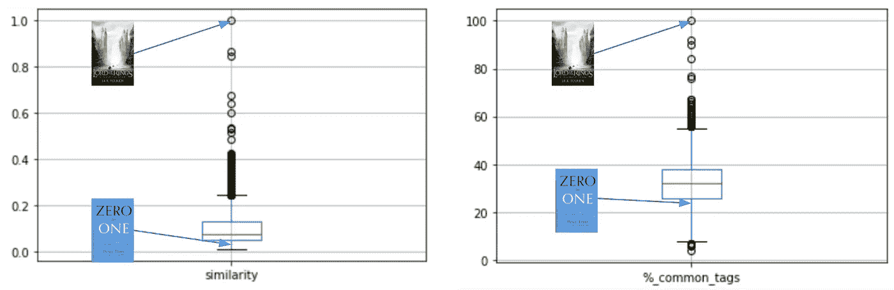

与所有 10，000 本书相比，基于余弦相似性和常见图书标签的定位

根据你自己的知识，你会说这两本书是如此的不同吗？

我们可以进一步探索数据，并使用 NLTK(自然语言工具包)找到最常见的图书标签。首先，我们清理单词，如删除连字符，对单词进行标记，然后删除所有停用的单词。文字清理干净后，我们就可以计算出出现在魔戒图书标签中的前 10 个常用词。

```
# Store book tags into new dataframe
lor_tags = pd.DataFrame(books_with_tags[books_with_tags['title']=='The Fellowship of the Ring (The Lord of the Rings, #1)']['tag_name'])**# Find most frequent word used in book tags**
import matplotlib
import nltktop_N = 10
txt = lor_tags.tag_name.str.lower().str.replace(r'-', ' ').str.cat(sep=' ') # Remove hyphens
words = nltk.tokenize.word_tokenize(txt)
word_dist = nltk.FreqDist(words)stopwords = nltk.corpus.stopwords.words('english')
words_except_stop_dist = nltk.FreqDist(w for w in words if w not in stopwords) 
print('All frequencies, including STOPWORDS:')
print('=' * 60)
lor_rslt = pd.DataFrame(word_dist.most_common(top_N),
                    columns=['Word', 'Frequency'])
print(lor_rslt)
print('=' * 60)
lor_rslt = pd.DataFrame(words_except_stop_dist.most_common(top_N),
                    columns=['Word', 'Frequency']).set_index('Word')
matplotlib.style.use('ggplot')lor_rslt.plot.bar(rot=0)
plt.show()
```

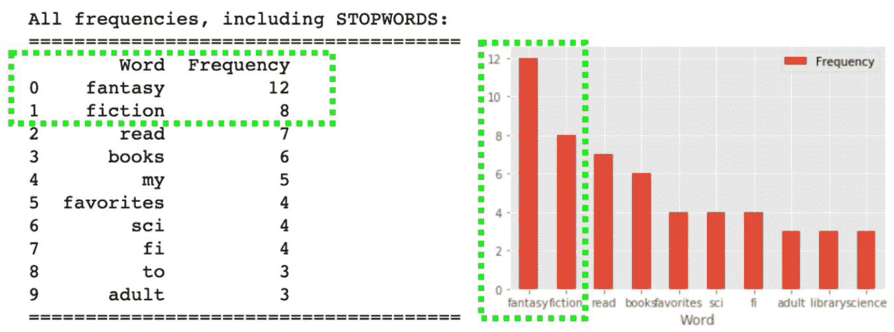

《指环王》标签中最常见的单词

因为我们想要多样性和多样性，我们可以选择最常用的词“幻想”和“小说”，并根据书籍类型的上下文中不同的词进行过滤。这些词可能是非小说、经济学或企业家。

```
**# Filter by unlike words**
lor_recs_filter = lor_recs[(lor_recs['tag_name'].str.contains('non-fiction')) & (lor_recs['tag_name'].str.contains('economics')) & (lor_recs['tag_name'].str.contains('entrepreneurial'))]
lor_recs_filter
```

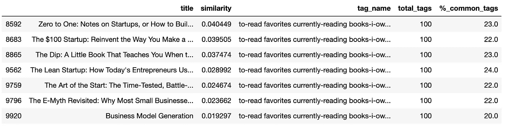

这缩小了列表的范围，只包括在图书标签中包含“非小说”、“经济学”或“企业家”的图书。为了确保向我们的读者推荐一本好书，我们将“average_rating”重新合并到数据集中，并按照最高的平均书籍评级对结果进行排序。

```
**# Merge recommendations with ratings**
lor_recs_filter_merge = pd.merge(books[['title', 'average_rating']], lor_recs_filter, left_on='title', right_on='title', how='inner')**# Sort by highest average rating**
lor_recs_filter_merge = lor_recs_filter_merge.sort_values(by=['average_rating'], ascending=False)
lor_recs_filter_merge
```

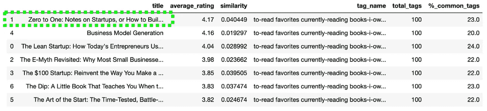

**出现在列表顶部的是什么——零比一**。我们设计了推荐多样性的方式。

只有一个信念的飞跃，但是相当大的一个，把魔戒和零对一联系起来。向前推进的下一步将是以编程方式确定这两本书和其他书之间的关系，以便它变得可重复。驱动这一点的数学和逻辑是什么？当前大多数机器学习和人工智能推荐算法都是基于寻找相似性。我们怎样才能找到多样性呢？

凭直觉，我们可以理解，对奇幻书籍感兴趣的人也可以从学习企业家精神中受益。然而，我们的算法目前不提供这种推动。如果我们能够解决这个问题并构建一个更好的算法，这不仅会极大地帮助客户，还会通过更多的销售和满意的客户来增加公司的收入。首先，我们通过图书行业的领域知识和专业技能来弥合差距。然后，我们将把这一点应用到其他行业。如果你对此有想法，我们来聊聊。这可能会改变游戏规则。

## 5.1 备选分集推荐引擎

这里有一个替代方案。我们可以基于类别进行推荐，而不是基于单本书的标签。规则:每个推荐仍然可以与原书有相似之处，但必须是一个独特的类别。

例如，亚马逊有 5 个结果来显示图书推荐。


截至 2020 年 8 月的 Amazon.com

不是 5 本书的标签与《指环王》相似，而是 5 本书的标签与《指环王》相似，但属于不同的类别，如科幻小说。随后的结果将遵循同样的逻辑。这将使用户看到的书籍类别“多样化”，同时保持一系列的相关性。它会显示:幻想→科幻小说→技术→企业家精神→传记。

在这些类别中，可以根据与初始图书的相似性或用户评级对单本图书进行排名和排序。每个位置都显示了该类别中与原书最相关的书。

槽点 1:奇幻
槽点 2:科幻
槽点 3:科技
槽点 4:创业
槽点 5:传记

这种分类变成了一种分类中的分类，以确保阅读的质量、相关性和多样性。这个概念可以更系统地将《指环王》和《零比一》等书籍联系在一起，最终扩展到不同的产品类型或行业，如音乐。

## 6.设计模型


我们该如何设计呢？我们可以部署我们的算法来分配一定的百分比给多样性推荐的探索，例如 70%相似性和 30%多样性推荐的分割。

一位潜在用户反馈说，他们希望看到“多样性转变”。让我们模拟这个潜在的设计。

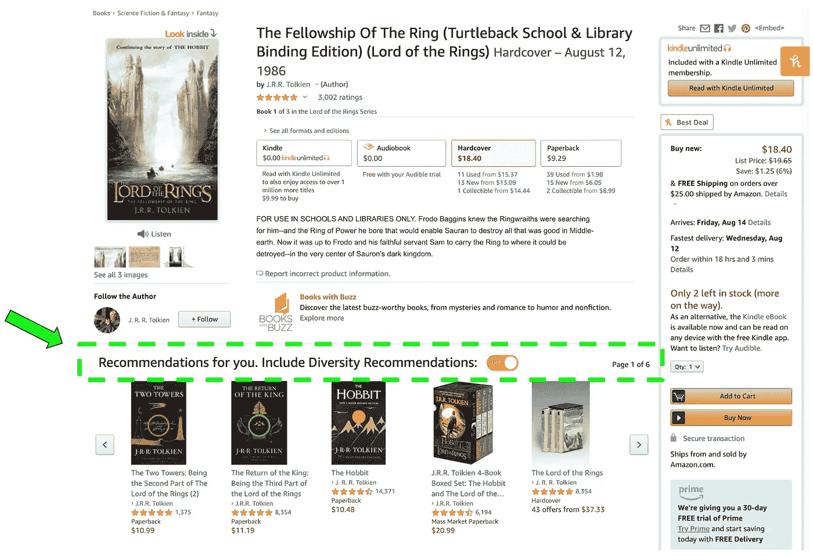

设计带有“多样性推荐”开关的 Amazon.com 模型

一旦客户打开它，我们可以保留 3 本书作为通常的相似性推荐，另外 2 本作为我们的多样性推荐。

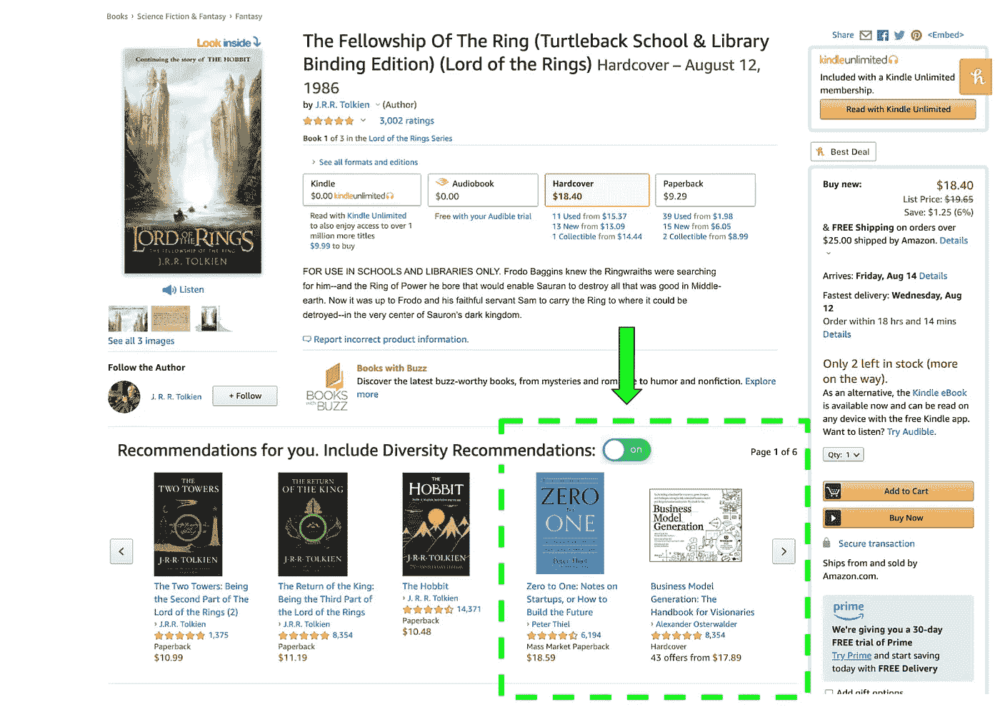

开启分集

在我们的产品指标中，我们将跟踪用户与该开关交互的次数和百分比、访问的产品页面数量的增加/减少、其他后续用户流量行为以及购买推荐书籍或其他产品的转化率。作为潜在客户，你对此有什么想法？

## 7.商业价值假设和目标启动

这个想法背后的潜在商业价值是什么？我们可以先将目标客户范围缩小到美国 Amazon.com 的客户，他们在过去 12 个月中购买了一本书，搜索了奇幻书籍，并购买了多种书籍类别。保守假设:

```
USA customers: 112 million
x book buying customers: 25%
x searches for fantasy: 25%
x buys multiple categories: 25%
= roll out to 1.75 million customersx conversion rate: 10%
= 175,000 customers convertx increase in average annual spend $40
**= $7 million additional annual revenue**
```

2019 年，亚马逊客户的平均支出约为每年 600 美元，亚马逊的年收入为 2800 亿美元。相比之下，这一估计是轻的，这对于初始的首次展示测试来说是很好的。如果我们扩大发布范围，我们将获得更大的潜在价值。让我们扩大我们的覆盖范围，向所有购买了一本书的美国亚马逊客户推广，保守假设为 25%:

```
USA customers: 112 million
x book buying customers: 25%
= roll out to 28 million customersx conversion rate: 10%
= 2.8 million customers convertx increase in average annual spend $40
**= $112 million additional annual revenue**
```

最后，如果我们更积极，假设一半的亚马逊客户可以成为图书购买者，提高转化率，增加年均支出，我们会获得数十亿的额外价值:

```
USA customers: 112 million
x book buying customers: 50%
= roll out to 56 million customersx conversion rate: 20%
= 28 million customers convertx increase in average annual spend $90
**= $1 billion additional annual revenue**
```

潜在的缺陷是，这种新的推荐系统会对客户体验产生负面影响，并降低转化率，从而造成收入损失。这就是为什么最初的客户验证和较小的发布和测试计划是一个很好的起点。

鉴于亚马逊 35%的收入(980 亿美元)是通过推荐系统产生的，商业价值上升非常显著。即使是算法中很小的百分比改进也会带来数百万甚至数十亿的额外收入。

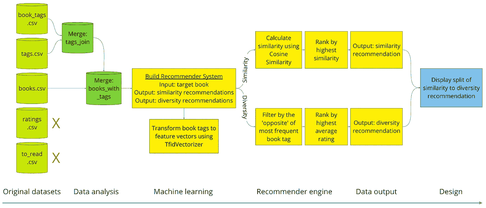

构建推荐系统的端到端数据科学过程

# 下一步是什么？

这一概念验证展示了多样性推荐系统在改善客户体验、解决社会问题、增加重要商业价值方面的潜力，并概述了一个可行的数据科学流程来改进我们的技术。

通过更好的机器学习和人工智能推荐系统，技术可以实现更多样化的思维。当今社会的风气认为相似性是好的，而多样性可能是混杂的。也许这就是为什么今天大多数推荐系统的研究和开发只关注于寻找相似性。如果我们不改变我们的算法，现状将会给我们带来更多的相同。

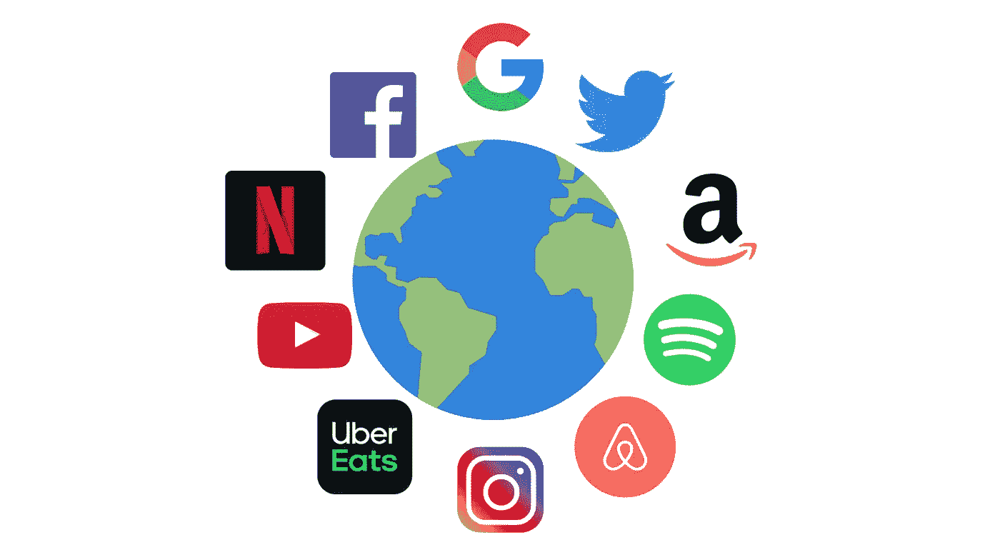

让思想多样化的技术

想象一下这样一个世界，每天影响我们的所有产品都支持思想的多样性。这对你、你的朋友和与你想法不同的人来说会如何改变世界？机器学习和人工智能推荐算法可以成为一个强大的变革代理。如果我们继续追求多元化的道路，我们可以积极地影响我们周围的人和世界。