# 深入钻研深度学习

> 原文：<https://pub.towardsai.net/diving-deep-into-deep-learning-f34497c18f11?source=collection_archive---------2----------------------->

## [深度学习](https://towardsai.net/p/category/machine-learning/deep-learning)，[数据科学](https://towardsai.net/p/category/data-science)

## 深度学习的非传统指南

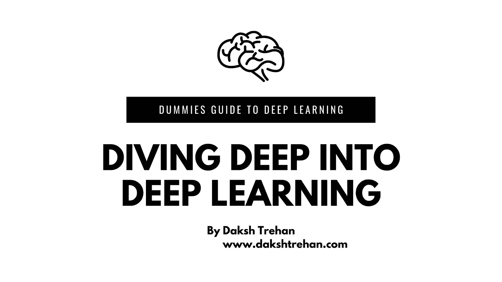

我们生活在一个不断被深度学习算法包围的世界，不管是出于好的还是坏的原因。从网飞推荐系统到特斯拉的自动驾驶汽车，深度学习正在离开我们的生活。这种古怪而简单的技术只需要 4-5 年的训练就可以颠覆整个一千年的人类文明。

你提出这篇文章可能是因为深度学习认为你应该看看。

现在让我们开始吧！

照片由[奥斯汀·尼尔](https://unsplash.com/@arstyy?utm_source=medium&utm_medium=referral)在 [Unsplash](https://unsplash.com?utm_source=medium&utm_medium=referral) 拍摄

# 什么是深度学习？

深度学习是机器学习算法的延伸，它教会计算机做人类自然继承的事情，即通过例子学习。

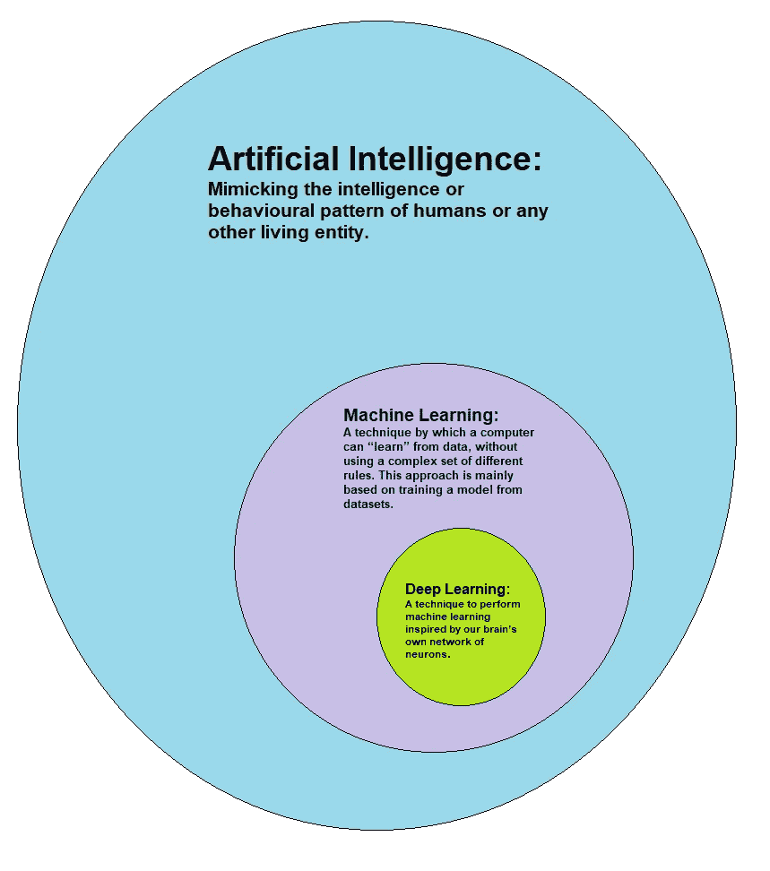

人工智能 vs 机器学习 vs 深度学习，[来源](https://www.wikiwand.com/en/Deep_learning)

## 和机器学习有什么不同？

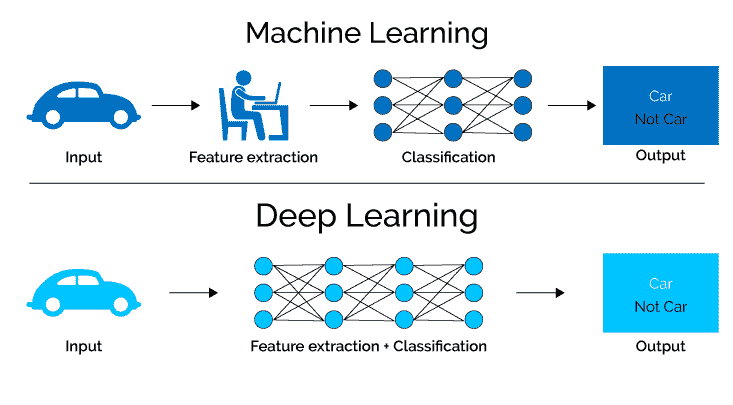

ML vs DL，[来源](https://semiengineering.com/deep-learning-spreads/)

区分机器学习和深度学习的主要因素是数据表示和输出。机器学习算法是为特定任务开发的，而深度学习更多的是基于矩阵不同层的数据表示，其中每一层都利用了前一层提供的输出。

## 深度学习背后的直觉

深度学习的唯一灵感就是模仿人脑。它模仿了人类大脑过滤相关信息的方式。

Robina Weermeijer 在 [Unsplash](https://unsplash.com?utm_source=medium&utm_medium=referral) 上拍摄的照片

我们的大脑由数十亿个生物神经元组成，这些神经元进一步连接到数千个生物神经元，以便共享和过滤信息。**深度学习是一种以适合我们机器的方式重建这种安排的方法。**

> **利用深度学习，我们尝试开发一种人工神经网络。**

在我们的大脑中，我们有*树突、轴突、细胞体、*和*突触间隙。信号在突触的帮助下从轴突(一个神经元的尾部)传递到树突(另一个神经元的头部)。*

一旦树突收到信号，细胞体进行一些处理，然后将信号发送回轴突，修改后的信号再次发送到另一个神经元，这个过程一遍又一遍地重复。

为了在人工神经网络中重现魔力，我们引入了*输入、权重、输出*和*激活*。单个神经元对我们来说毫无用处，但当我们得到一堆神经元时，你可以重现这种魔力。人工神经网络纯粹模仿自然大脑的工作。我们将加权输入馈送到神经层，一些处理发生在产生输出的相同位置，该输出被进一步馈送到下一层，这递归地发生，直到我们到达最后一层。

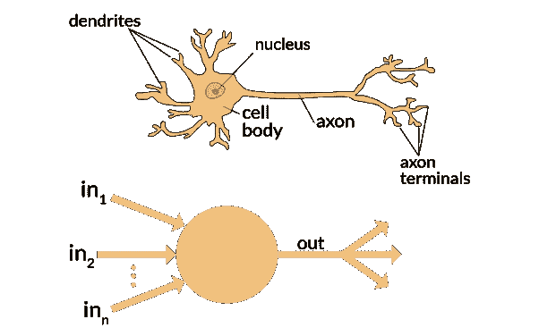

大脑 vs 人工神经网络，[来源](https://www.quora.com/What-is-the-differences-between-artificial-neural-network-computer-science-and-biological-neural-network)

## 神经元的魔力

输入节点显示数字信息。投入越高，决策因素中包含的投入就越多。

基于它的权重，计算激活值并传递给下一个节点。每个节点接收加权和，并基于传递函数对其进行修改。这个过程一遍又一遍地重复，直到我们到达输出层。

# 神经网络是如何工作的？

神经网络是用于分类和预测的多层神经元网络。

它构成三种类型的层 wiz *输入层，隐藏层* & *输出层。*

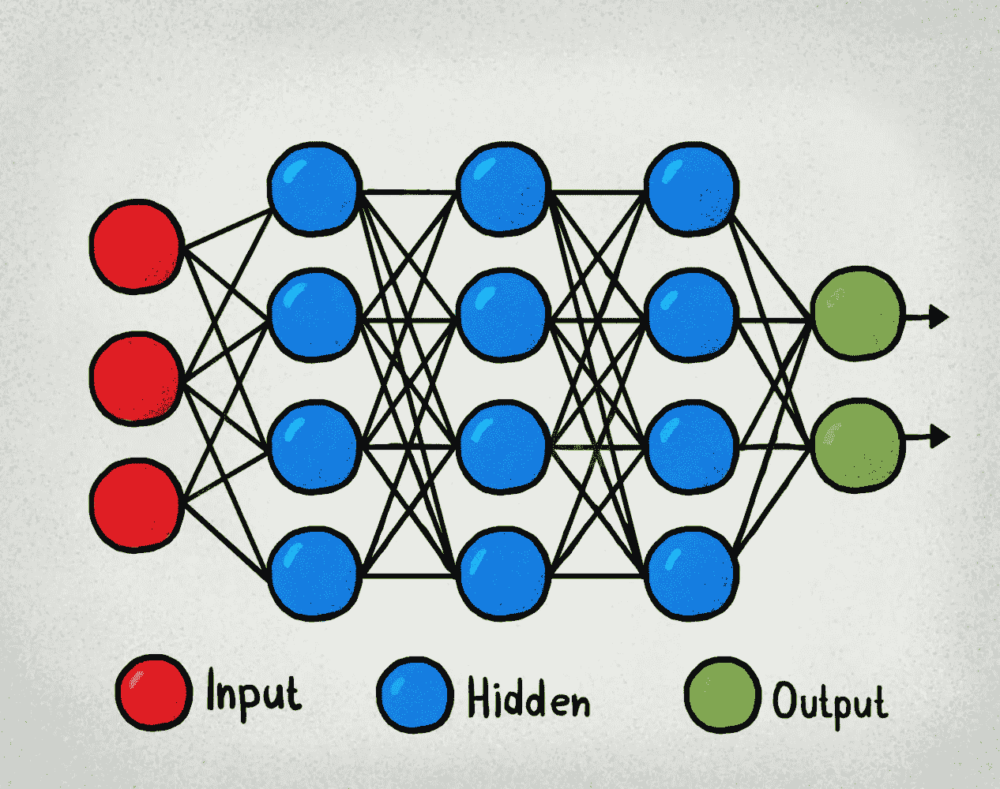

[神经网络结构，来源](https://www.kdnuggets.com/2017/10/7-types-artificial-neural-networks-natural-language-processing.html)

输入层接受 0 到 1 之间的数字，该数字作为输入层(层 1)的激活。

在多类分类的情况下，输出图层由属于每个类的概率组成。具有最大概率的类被视为该特定输入的输出。

在隐藏层中，我们使用不同的激活函数来计算激活，例如 [TanH、Sigmoid、ReLu](https://medium.com/analytics-vidhya/activation-functions-explained-8690ea7bdec9) 。

## 神经网络的工作

一个神经元的输入是前一层所有神经元的加权输出之和。每个输入是当前神经元的权重相关和输入的产物。如果在前一层中有 5 个神经元，则当前层中的每个神经元将具有 5 个不同的权重。

为每个神经元计算一个加权和，然后在挤压成 sigmoid 函数之前将其加到 bias 上。

因此，简而言之，神经元的激活可以被认为是来自前一层的权重和当前输入以及偏置的乘积之和。

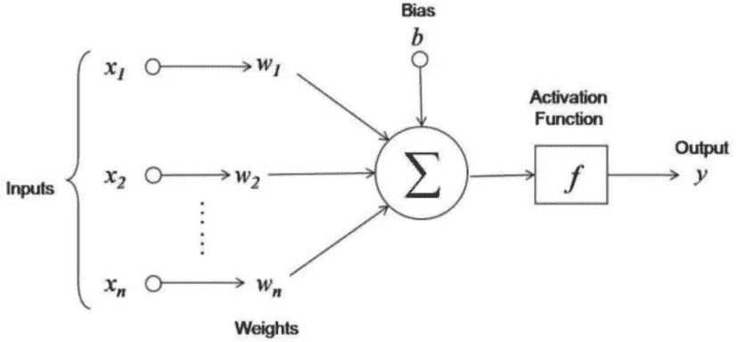

激活功能，[来源](https://www.datacamp.com/community/tutorials/neural-network-models-r)

激活功能将输入信号解码为输出信号。它在 0 到 1 的范围内映射输出值。这是一种表示细胞内潜在放电频率的方法。任何神经元的激活功能越多，其放电能力就越强。

## 我们如何选择隐藏层？

你的模型中隐藏层的数量是一个超参数，即它必须由你来选择。

> 隐藏层数越多== >复杂模型== >过度拟合

假设，我们想建立一个手写数字识别系统。我们输入一些图像，并期望图像中的数字作为我们的输出。

当我们看到一个橙子时，我们的大脑是如何识别它的？它识别其形状像圆形，但我们有几个圆形的水果和物体，接下来它分析其颜色和结构如果它是橙色和粗糙表面的东西，那么我们可以将其归类为橙色水果，但如果它是橙色和光滑的表面，我们可以认为它可能是一个橙色的球。

安妮·普雷布尔在 [Unsplash](https://unsplash.com?utm_source=medium&utm_medium=referral) 拍摄的照片

模仿我们的自然神经网络，人工神经网络试图遵循*划分&征服方法*，即它会将问题划分为进一步的子问题，或者更具体地说，它会将数字划分为进一步的形状以对数字进行分类。

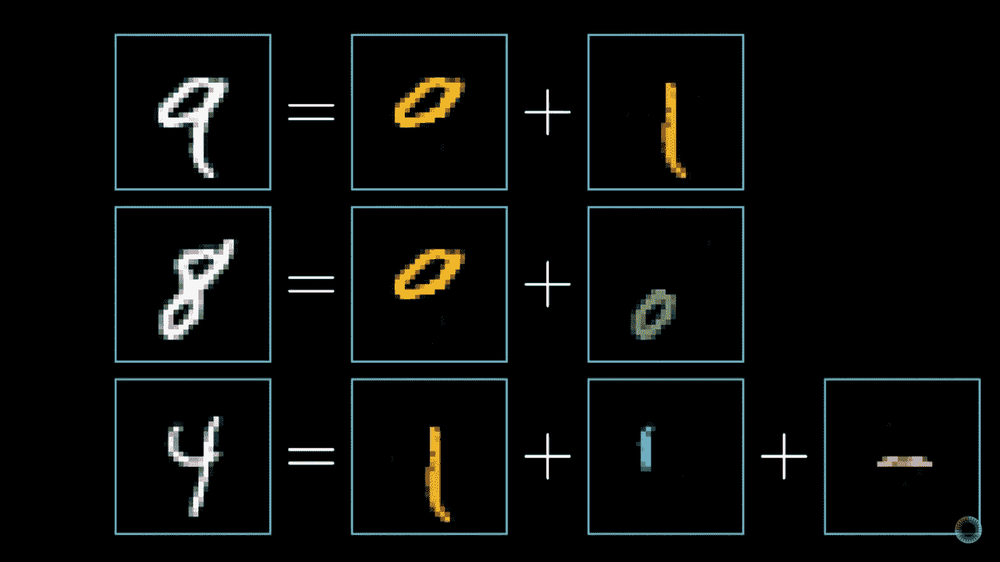

将数字分成更多的子部分，[来源:3Blue1Brown](https://www.youtube.com/watch?v=aircAruvnKk)

每个子部分被期望被每个隐藏层识别。我们可以假设，第一个要识别的隐藏层(-)，下一个要识别的隐藏层(|)，两个子部分相加可以是 7 也可以是 4。第三个隐藏层将第一个和第二个隐藏层的输出相加，并尝试得出每个类别的概率，即 10 个类别(0 到 9)，具有最大概率的类别将被视为输出。

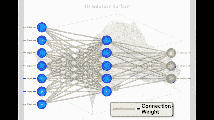

神经网络工作，[来源](https://gfycat.com/discover/neural-networks-gifs)

# 神经网络是如何学习的？

一旦我们的模型训练好了，就该扔一些看不见的数据给它，分析它的性能(代价函数)。

计算其性能的方法是使用均方误差(MSE ),其中我们计算真实值和预测值之差的平方。

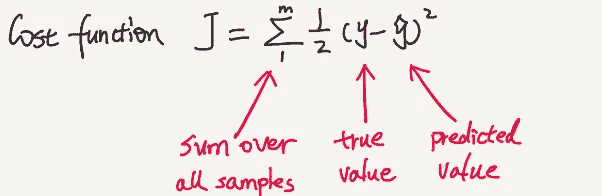

成本函数，[来源](https://www.programcreek.com/2016/07/neural-network-backpropagation-derivation/)

一旦定义了成本函数，我们就可以检查我们的网络有多糟糕。基于成本函数，我们可以指导我们的模型进行一些调整和即兴创作。

**所谓即兴创作，我们指的是学习正确的权重和偏好。**

为了降低损失，我们使用[梯度下降](https://towardsdatascience.com/gradient-descent-explained-9b953fc0d2c)。梯度下降背后的思想是使我们的损失达到全局最小值。

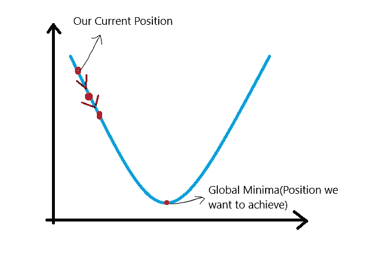

梯度下降算法，[源码](https://wingshore.wordpress.com/2014/11/19/linear-regression-in-one-variable-gradient-descent-contd/)

## 实施梯度下降的步骤

1.  随机初始化值。
2.  更新值。

3.重复直到斜率=0

# 反向传播

反向传播算法可能是神经网络的组成部分。它利用一种叫做*链规则*的方法来有效地训练我们的网络。

现在，在这一点上，我们很清楚，我们的模型肯定是做错了什么，我们需要检查，但是，这实际上是不可能检查每一个神经元。但是，我们挽救模型的唯一可能的方法就是逆行。

如果所有主要的权重增加，不相关的权重减少，我们将得到非常精确的输出。

> 根据赫比恩理论，“一起放电的神经元，连在一起。”

神经网络特别依赖于权重、激活和偏差。为了开发一个有弹性和有效的模型，我们必须改变它们。

## 反向传播的步骤

*   我们计算输出的某些损失，并试图找出是谁造成了这种低效率。
*   为此，我们将回溯整个网络。
*   假设，我们发现第二层(w3h2+b2)对我们的损失负有责任，我们会努力改变它。但是如果我们仔细考虑我们的网络，w3 和 b2 是独立的实体，但是 h2 依赖于 w2、b1 和 h1，h1 进一步依赖于我们的输入，即 x1、x2、x3……，xn。但是由于我们无法控制输入，我们将尝试修改 w1 和 b1。

为了计算我们的变化，我们将使用链式法则。

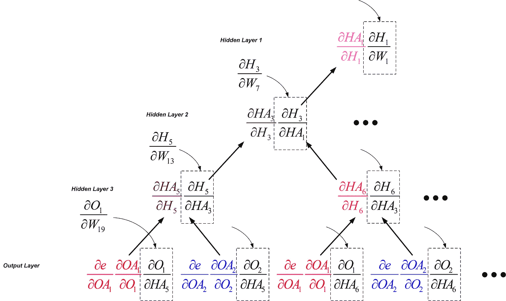

反向传播中的链式法则，[来源](https://dzone.com/articles/the-very-basic-introduction-to-feed-forward-neural)

# 结论

希望这篇文章能帮助你以最好的方式理解深度学习和反向传播，并帮助你实践它。

一如既往，非常感谢您的阅读，如果您觉得这篇文章有用，请分享！

请随意连接:

> *领英~*[https://www.linkedin.com/in/dakshtrehan/](https://www.linkedin.com/in/dakshtrehan/)
> 
> *insta gram ~*[*https://www.instagram.com/_daksh_trehan_/*](https://www.instagram.com/_daksh_trehan_/)
> 
> *Github ~*[https://github.com/dakshtrehan](https://github.com/dakshtrehan)

关注更多机器学习/深度学习博客。

> *中等~*[【https://medium.com/@dakshtrehan】T21](https://medium.com/@dakshtrehan)

# 想了解更多？

[利用深度学习检测新冠肺炎](https://towardsdatascience.com/detecting-covid-19-using-deep-learning-262956b6f981)

[无法逃脱的人工智能算法:抖音](https://towardsdatascience.com/the-inescapable-ai-algorithm-tiktok-ad4c6fd981b8)

[使用机器学习的卡通化内幕指南](https://medium.com/towards-artificial-intelligence/an-insiders-guide-to-cartoonization-using-machine-learning-ce3648adfe8)

为什么你要为乔治·弗洛伊德的谋杀和德里的骚乱负责？

[为什么选择随机森林而不是决策树](https://medium.com/towards-artificial-intelligence/why-choose-random-forest-and-not-decision-trees-a28278daa5d)

[聚类:它是什么？什么时候用？](https://medium.com/@dakshtrehan/clustering-what-it-is-when-to-use-it-a612bbe95881)

[从 k 个最近邻居开始你的 ML 之旅](https://medium.com/@dakshtrehan/start-off-your-ml-journey-with-k-nearest-neighbors-f72a122f428)

[朴素贝叶斯解释](https://medium.com/swlh/things-you-never-knew-about-naive-bayes-eb84b6ee039a)

[激活功能说明](https://medium.com/analytics-vidhya/activation-functions-explained-8690ea7bdec9)

[参数优化解释](https://towardsdatascience.com/parameters-optimization-explained-876561853de0)

[梯度下降解释](https://towardsdatascience.com/gradient-descent-explained-9b953fc0d2c)

[逻辑回归解释](https://towardsdatascience.com/logistic-regression-explained-ef1d816ea85a)

[线性回归解释](https://medium.com/towards-artificial-intelligence/linear-regression-explained-f5cc85ae2c5c)

[确定最适合您的 ML 模型](https://medium.com/datadriveninvestor/determining-perfect-fit-for-your-ml-model-339459eef670)

> *干杯！*