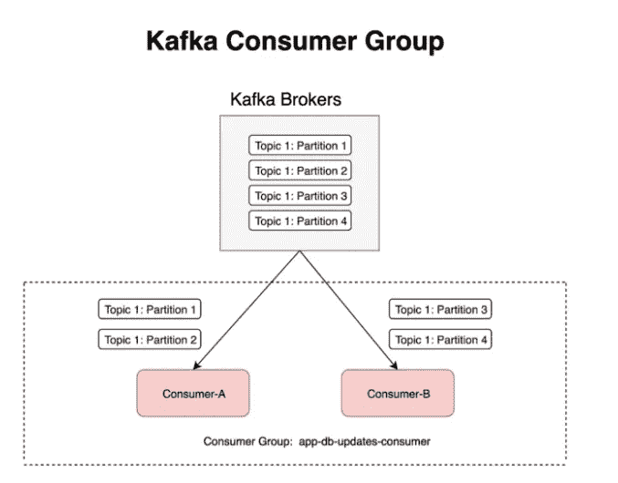
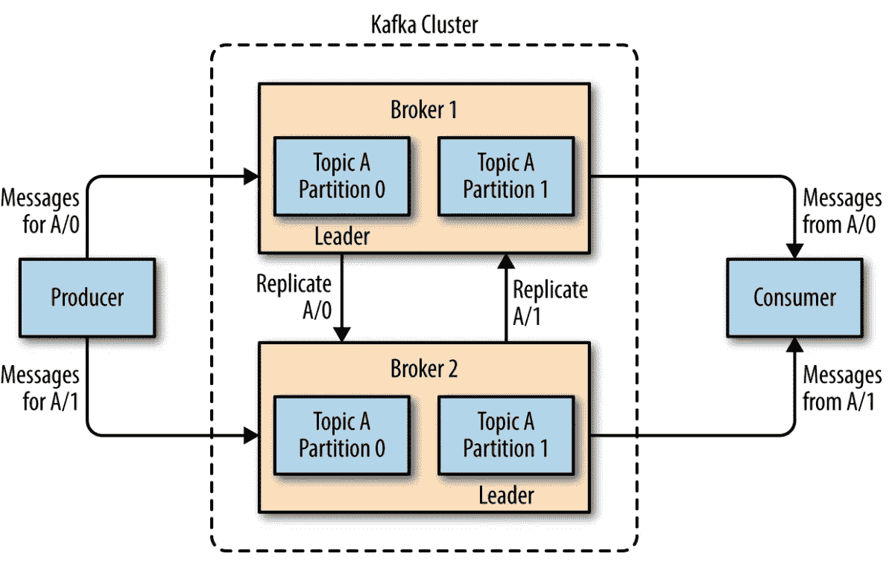
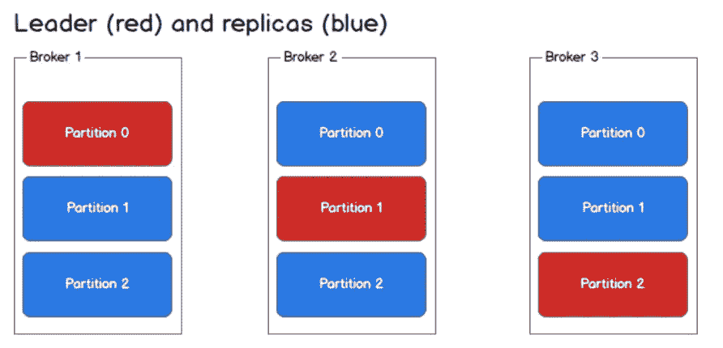
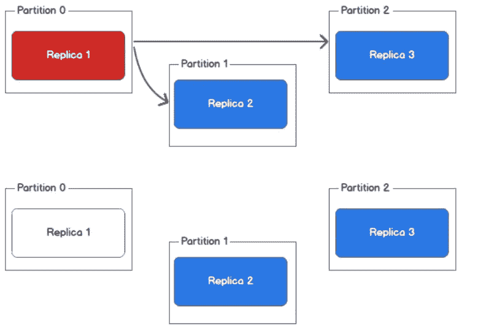
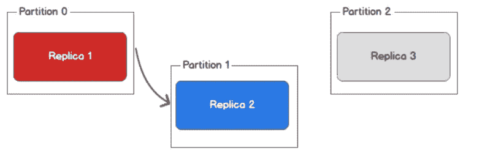
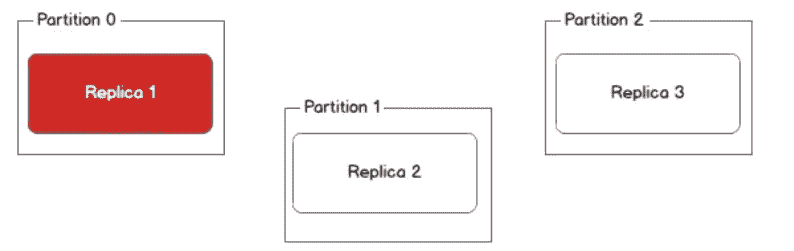
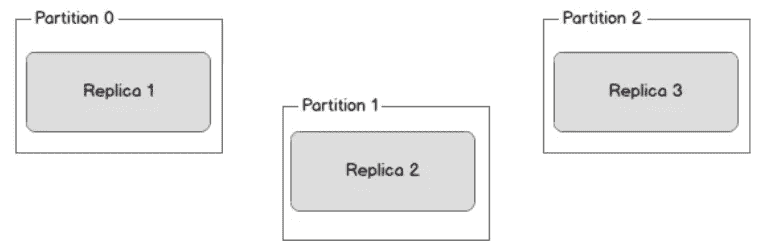

# 深入研究卡夫卡

> 原文：<https://pub.towardsai.net/diving-deep-into-kafka-29160f32d408?source=collection_archive---------0----------------------->

## [编程](https://towardsai.net/p/category/programming)

这篇博客的目的是建立对 Apache Kafka 概念的更多理解，比如主题、分区、消费者和消费者群体。卡夫卡的基本概念在我的 [**前一篇**](https://medium.com/towards-artificial-intelligence/getting-started-with-apache-kafka-beginners-tutorial-d38e3634706c?source=friends_link&sk=2b98454c001fb88527fff8c2217947e2) **中已经涉及。**

## **卡夫卡专题&分区**

正如我们所知，卡夫卡的信息被分类或储存在主题中。简单地说，Topic 可以被理解为一个数据库表。卡夫卡的主题在里面被分解成分区。分区允许我们通过将一个主题的数据分割到多个代理来并行化一个主题，从而为生态系统增加了并行性的本质。

## **幕后**

消息以只追加的方式写入一个分区，并且从头到尾从一个分区读取消息，这是 FIFO 习惯主义。分区内的每个消息都由一个名为 *offset 的整数值来标识。*偏移*是不可变的消息顺序，由 Kafka 维护。对具有多个分区的主题的剖析:*

分区主题

> 数组形式的序列号是 Kafka 维护的偏移值

一些要点:

1.  消息的排序是在分区级别维护的，而不是跨主题。
2.  写入分区的数据是不可变的，不能更新。
3.  Kafka broker 中的每个消息都是消息主题、分区、偏移量、键和值的集合。
4.  每个分区将有一个负责分区中读/写操作的领导者。

**生产者和消费者**

**制作者**创建新的消息，并将其写入 Kafka 经纪人，而不考虑分区。但是，生产者可以在消息密钥和分区的帮助下写入选定的分区，这将生成密钥的散列并将其映射到选定的分区。

消费者阅读来自卡夫卡经纪人的信息。消费者可以订阅一个或多个 Kafka 主题，并以 FIFO 方式阅读消息。消费者在偏移量的帮助下跟踪已经阅读的消息。特定分区中的每条消息都有偏移量，偏移量是一个连续的整数值。借助 offset，消费者可以在不丢失位置的情况下停止或阅读消息。

**消费者**作为**消费群体的一部分。**消费者组基本上是一个或多个消费者的集合，他们共同并行工作，消费来自主题分区的消息。这样，消费消息的水平可伸缩性得到了增强。此外，如果一个使用者出现故障，则使用者组的其他成员会重新平衡正在使用的分区，以接管缺失的成员。

**经纪人和分区**

卡夫卡经纪人在集群内运作。在一个代理集群中，一个代理将被自动选为*控制器。*控制器负责管理操作，比如给代理分配分区、监控代理故障等。

每个代理拥有许多主题分区，每个分区可以是该主题的领导者或复制品。一个分区被分配给多个代理，这会导致分区复制。这在一个分区中提供了冗余的消息，以便在主代理崩溃的情况下，另一个代理接管领导权。

复型过程

对主题的所有读/写操作都经过主题的领导者，领导者相应地用新消息更新副本。如果一个主节点出现故障，一个副本节点将接管新的主节点。

领导者和复制品

**故障管理**

正如我们所知，消息被发送到分区的领导者，领导者负责将消息写入其副本。一旦更新，每个复制品向领导者确认他们已经收到消息并且现在同步。

**红色的领导者**写入蓝色的**副本**

在理想的场景中，当每个代理都可用时，生产者和消费者可以毫无问题地从领导者那里读写。但是如果出了问题呢？

**同步副本仍然存在时，前导失败**。在这种情况下，Kafka 控制器将检测到故障，并从副本池中选出新的领导者。这个过程需要一些时间，直到时间领导不可用的错误是可见的。

领导(红色)故障

一切似乎都是可控的，但如果副本宕机了怎么办？新消息将不再复制到失败的副本，从而变得与领导者不同步。例如，副本 3 停机，它停止接收消息，并且将失去同步。

副本 3 关闭

同样，当副本 2 关闭时，它将停止接收消息。在这个时间点，我们仍然有一个工作副本，它是领导者。

副本 2 关闭

然后领袖倒下了。最坏的情况。

所有副本关闭

在这种情况下，有两种可能的解决方案。首先，等到主服务器启动并开始接收消息，并且所有副本都与主服务器同步。第二，选择一个新的代理作为新的领导者，但是这个新的代理将没有原始领导者倒下时的数据，并且在新的领导者被选出之前发送的新消息将会丢失，因此它将是不同步的，但是一旦被选出，将会有新的消息。

**Kafka 客户端一致性**

消费者只能读取那些已经写入所有副本的消息。作为消费者，有三种方式提供一致性:

1.  **最多一次**:当到达提交间隔时，Kafka 必须提交最后一个读取偏移量，但消费者仍未完成消息处理，并在中间崩溃，这种情况就会发生。因此，当使用者重新启动时，它将从最后提交的偏移量接收消息，可能会丢失一些消息。
2.  **至少一次:**当消费者处理消息并将消息提交给其本地存储并在此时崩溃时，会发生这种情况，但是 Kafka 没有机会将偏移量提交给代理，因为提交间隔还没有过去。因此，当使用者重新启动时，它将从最后一个偏移量开始传递消息。在这种情况下，可能会发生重复的消息传递。这种方式实际上是遵循。
3.  **恰好一次:**在处理消息时，通过将偏移量和消息一起提交给事务系统来跟踪每条消息。在消费者崩溃的情况下，它将从事务系统中读取最后提交的偏移量，并在该点之后开始读取。这不会导致数据重复和数据丢失，但会导致吞吐量下降。

# **总结:**

该博客涵盖了一些深入的 Kafka 主题、分区、消息复制过程、故障管理等。我希望这个博客有助于对阿帕奇卡夫卡有更多的了解。

谢谢

Vivek Chaudhary