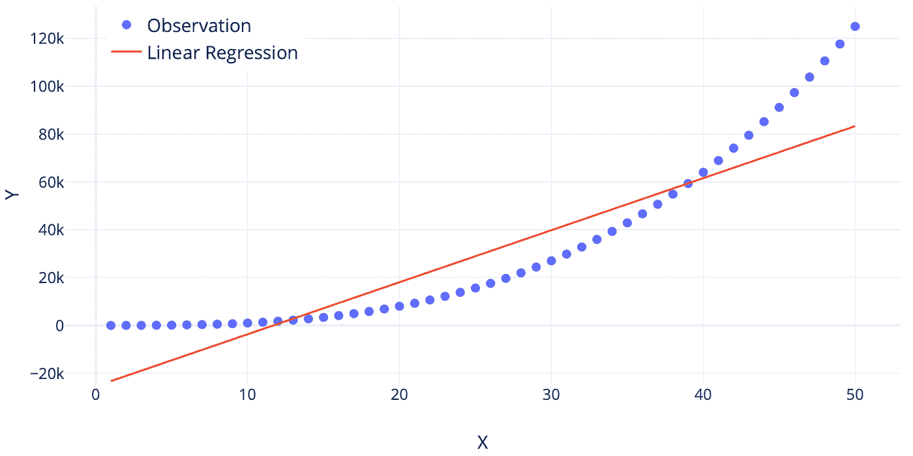
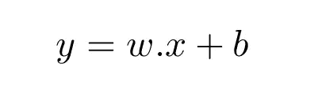
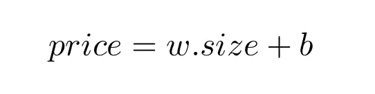
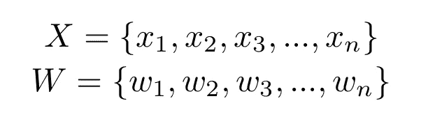
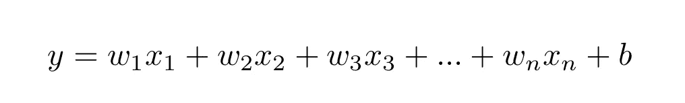
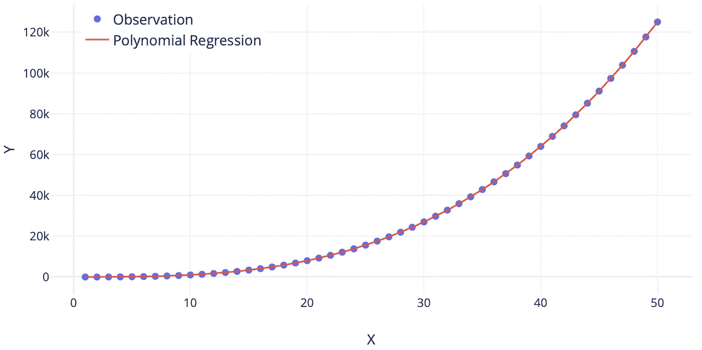
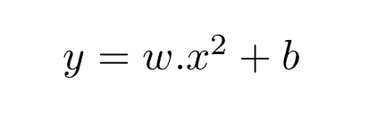
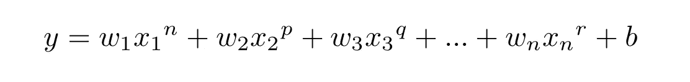
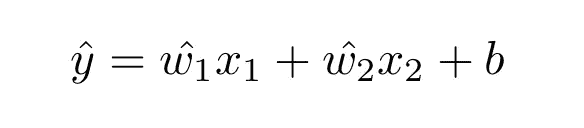
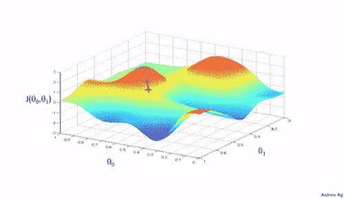

# 深入研究线性回归和多项式回归

> 原文：<https://pub.towardsai.net/diving-deep-into-linear-regression-and-polynomial-regression-34a71a02ade5?source=collection_archive---------0----------------------->

## [机器学习](https://towardsai.net/p/category/machine-learning)

[办公室职员通宵工作插图](https://iconscout.com/illustrations/office)由 [Iconscout 免费赠送](https://iconscout.com/contributors/iconscout)在 [Iconscout](https://iconscout.com/)

在我之前的文章中，我们探索了人工智能的不同分支。我几乎可以肯定，现在您可能想更详细地了解这些分支。不要担心，我肯定会在以后的文章中向这些子集敞开大门。如果你错过了我的帖子，可以在以下链接找到: [**人工智能的分支**](https://jashrathod.github.io/2020-11-24-branches-in-artificial-intelligence-to-transform-your-businesses/) 。

之前我们讨论过机器学习。我们还讨论了它的子集——监督学习、非监督学习和强化学习。在本帖中，我们将讨论监督学习中最基本的算法之一— **回归**。回归可以有多种类型。你可能以前遇到过一些类型的回归，或者可能是第一次听说。特别是，我们将在本文中查看两种类型的回归，即**“线性回归”**和**“多项式回归”**，以及它们的数学公式和 python 代码。

在进入这些类型之前，我们先来了解一下什么是**“回归”。**

> “回归是因变量与一组自变量之间关系强度的一种统计方法。”

迷茫？我们来打个比方理解一下。想象一下，你想买房子。现在，我想你会同意我的观点，房子的价格将取决于房子的大小(以平方米计算)。英尺)和它的位置(可以有更多的参数，房子的价格可以依赖于这些参数，但是为了简单起见，让我们假设这两个是主要的驱动因素。)如果你选择更大的房子，房价自然会飙升，如果你梦想中的家是曼哈顿的顶层公寓，可以看到天际线，那么它会比皇后区的贵得多(嗯，我个人的选择是摩纳哥的家！)

这里，房子的大小和位置将是自变量。顾名思义，改变一个对另一个没有影响，这意味着它们彼此“独立”。房子的价格将是因变量，因为它取决于大小和位置。因此，**“回归分析”**是利用自变量预测因变量的方法。

没有进一步的原因，让我们深入线性和多项式回归。

# **线性回归**

图片由[吴家浩·拉瑟德](https://jashrathod0.wixsite.com/jashrathod)拍摄

线性回归是一种回归分析方法，**假设因变量和自变量之间存在线性关系。这意味着当我们在因变量和自变量之间绘制图表时，会形成一条直线。这是一种解决需要将预测作为连续值的问题的方法。作为最基本的算法，对于我们希望预测连续值的任何任务，这是通常实现的第一个算法。**

在只有一个自变量的情况下，我们称之为**“简单线性回归”** 就这么简单！比方说， *y* 为因变量， *x* 为自变量。设 *w* 为变量的权重， *b* 为偏差(偏差有时可以为零)。权重和偏差只不过是将自变量转换为因变量的值。因此，从数学上来说，

简单线性回归。图片由[吴家浩·拉霍德](https://jashrathod0.wixsite.com/jashrathod/)拍摄

如果你觉得很难理解，就想想我们的类比。房子的价格与房子的大小成比例。所以我们的等式变成了:

用简单线性回归预测房价。图片由[吴家浩·罗德](https://jashrathod0.wixsite.com/jashrathod/)拍摄

在自变量和因变量很多的情况下，我们称之为**“多元线性回归”**所以，设 *X* 为一组 *n* 独立特征， *W* 为 *X* 中每个值的新权重集合。

图片由[吴家浩·拉霍德](https://jashrathod0.wixsite.com/jashrathod/)拍摄

我们的多元线性回归方程为:

多元线性回归。图片由[吴家浩·拉霍德](https://jashrathod0.wixsite.com/jashrathod/)拍摄

相应地，我们也可以修改我们的类比方程。

如果我们同意这种算法的预测，那么我们很乐意去做！简单，容易，可解释。但是一般我们观察到，对于现实世界的问题，情况并非如此。在大多数现实世界的问题中，因变量和自变量之间的关系不是线性的，在这种情况下，通常会发现线性回归表现不佳。

# **多项式回归**

多项式回归。图片由[吴家浩·罗德](https://jashrathod0.wixsite.com/jashrathod/)拍摄

为了解决非线性问题，我们在我们的方法中引入了一个小小的调整— **多项式回归**。这种回归分析方法，自变量可以线性或非线性地依赖于因变量。这有助于我们构建复杂的曲线，有助于设计更合适的现实世界场景表示。

甚至多项式回归也可以分为简单多项式回归和多重多项式回归。简单多项式回归的等式可以给出为:

简单多项式回归。图片由[吴家浩·罗德](https://jashrathod0.wixsite.com/jashrathod/)拍摄

请注意，已经考虑了独立变量的平方。这引入了非线性。

类似地，多元多项式回归的等式可以给出为:

多元多项式回归。图片由[吴家浩·拉霍德](https://jashrathod0.wixsite.com/jashrathod/)拍摄

其中 *n，p，q，r* 可以是引入非线性的整数。

这种方法表现出比线性回归技术更好的性能，因为它能够处理更复杂的关系。但是对于这种方法来说，重要的是我们知道 *X* 和变量 *y* 中的值是如何相关的。如果不知道这一点，就更像是一种尝试和错误。此外，如果没有仔细选择功率，这很容易过度拟合。

# **初始化方程系数**

你可能已经想过，在训练过程之前，给系数 *w* 和 *b* 分配什么值，以及在训练过程中如何优化这些值？如果我们仔细观察，我们会意识到，为了使我们的 ML 模型更好地预测，我们希望在训练过程中估计这些系数。

**分配初始值的过程称为‘初始化’**。有多种方法可以初始化系数。一些常见的初始化有:

1.  零
2.  二进制反码
3.  正态分布
4.  截尾正态分布

为了理解如何在训练过程中优化这些系数，我们需要研究两个概念:*【损失函数】*和*【随机梯度下降(SGD)】*。这些条款可能听起来有点难以承受，但不要担心，我会支持你的！

# **损失函数**

让我们考虑一个有两个独立变量的多元线性回归。我们的等式是:

真正的价值观。图片由[吴家浩·罗德](https://jashrathod0.wixsite.com/jashrathod/)拍摄

在这个等式中， *y* 是真值，而 *wi* 和 *b* 是最佳系数。当我们用次优系数初始化时，我们的结果也会偏离最优结果。因此，在我们获得最佳系数和最佳结果之前，我们的等式将是:

预测值。图片由[吴家浩·拉霍德](https://jashrathod0.wixsite.com/jashrathod/)拍摄

这里，新的 *y，wi，*和 *b* (带帽)为次优值。从现在开始，我们将把 *y* 称为“真值”，把 *y* (帽子)称为“预测值”。

在数学优化和决策理论中,**损失函数可以定义为预测成本的量化表示。真实值和预测值的偏差越大，成本越高，预测越差。**

基于手头的任务类型(回归或分类)，有几种方法来定义损失函数。回归的一些损失函数是:

1.  均方误差损失
2.  均方对数误差损失
3.  平均绝对误差损失

我们将在以后的文章中详细讨论它们。

## **随机梯度下降**

我们需要将 *wi* 和 *b* 优化至最佳系数，从而获得接近实际值的结果。为了做到这一点，我们使用优化器。这些优化器在训练时使用数学函数使系数值更接近最佳值。我们可以使用许多优化器。但是，让我们看一个例子来理解优化器是如何工作的。我们将关注的是随机梯度下降(SGD)。

设 *L* 为损失函数(可以是上面提到的 3 个中的任何一个，甚至可以不是这些)。对此的数学方程式是:

其中 *η* 是步长(也称为学习率),它乘以损失函数相对于正在更新的系数的偏导数。

这个等式的美妙之处在于，在没有任何人工干预的情况下，随着训练的进行，它会优化系数。这是通过最小化损失函数来实现的。因此，这个过程也被称为**“最小化损失函数”。**

[图片来源](https://gfycat.com/angryinconsequentialdiplodocus)

为了清楚地理解这是如何工作的，让我们假设有多个山头，而你正站在其中一个山头上。如果我告诉你到达最底部，你必须一步一步来。尽管有一个条件。在任何给定的时间，你的下一步必须是在该点最陡下降的方向。你下山的方式就是梯度下降的原理！

新加坡元也有一定的负面影响。此外，有许多不同的优化器以不同的方式工作。我们将在今后讨论这些问题。

**目标达成，线性和多项式回归学会了！**

到目前为止，我们学习了线性和多项式回归。

要了解线性和多项式回归如何在**‘房价数据集’**上执行，请查看下面的代码。

# 房价数据集

本教程使用的数据集是**房价预测**。我已经修改过了，让它更容易理解。完整代码(Jupyter 笔记本)和数据集可在以下网址找到:

 [## jashrathod/机器学习系列

### permalink dissolve GitHub 是超过 5000 万开发人员的家园，他们一起工作来托管和审查代码，管理…

github.com](https://github.com/jashrathod/machine-learning-series/blob/master/Linear%20and%20Polynomial%20Regression/Linear%20and%20Polynomial%20Regression.ipynb) 

修改后的数据集 **"data.csv"** 包含 3 个自变量和 1 个因变量。

**自变量:**

*1 层平方英尺* —一层平方英尺
*2 层平方英尺* —二层平方英尺
*年份建造* —原建造日期

**因变量:**

*销售价格* —以美元计算的房产销售价格。(这是你试图预测的目标变量。)

如果您希望处理完整的数据集，可以在以下位置找到:

 [## 房价-高级回归技术

### 预测销售价格并实践特征工程、RFs 和梯度推进

www.kaggle.com](https://www.kaggle.com/c/house-prices-advanced-regression-techniques/) 

让我们马上进入代码！

## 第一步。导入 Python 库

所有库的简短描述:

[日期时间](https://docs.python.org/3/library/datetime.html) —提供处理日期和时间的类。

[sys](https://docs.python.org/3/library/sys.html) —提供对解释器使用或维护的一些变量以及与解释器交互强烈的函数的访问

[pandas](https://pandas.pydata.org/) —一个快速、强大、灵活且易于使用的开源数据分析和操作工具，构建在 [Python](https://www.python.org/) 编程语言之上。

[scikit-learn](https://scikit-learn.org/stable/)——包含了大量用于机器学习和统计建模的高效工具，包括分类、回归、聚类和降维(作为 sklearn 导入)

[数学](https://docs.python.org/3/library/math.html) —提供对 C 标准定义的数学函数的访问

## 第二步。使用 Pandas 将数据集作为数据帧读取

需要首先调用文件 **"data.csv"** ，以使用它来训练我们的模型。我们将其读取为一个**熊猫**数据帧，并将其赋给变量 **df** 。为此，我们将利用 [**read_csv()**](https://pandas.pydata.org/pandas-docs/stable/reference/api/pandas.read_csv.html) 函数。

## 第三步。初始化自变量和因变量

我们现在需要将因变量( *y* )与自变量( *X* )分开。这可以通过运行以下代码来完成:

## 第四步。培训和测试数据

我们的任务需要两组数据，一组用于训练，另一组用于测试。Sklearn 提供了一个函数[**train _ test _ split()**](https://scikit-learn.org/stable/modules/generated/sklearn.model_selection.train_test_split.html)来做到这一点。对于我们打算执行的任务，我们将使用总数据的 80%进行训练，剩余的 20%进行测试。

*X_train* —部分 X 用于训练
*y_train* —部分 y 用于训练
*X_test* —部分 X 用于测试
*y_test* —部分 y 用于测试

## 第五步。线性回归模型

最后，我们的线性回归模型终于来了！变量**“模型”**创建了我们的 [**线性回归**](https://scikit-learn.org/stable/modules/generated/sklearn.linear_model.LinearRegression.html?highlight=linear%20regression#sklearn.linear_model.LinearRegression) 模型的一个实例。在第二行，我们可以看到**【fit】**函数。 [**fit()**](https://scikit-learn.org/stable/modules/generated/sklearn.linear_model.LinearRegression.html#sklearn.linear_model.LinearRegression.fit) 函数真正做的是使用训练数据训练我们的模型。现在我们的模型已经训练好了。我们将使用 [**predict()**](https://scikit-learn.org/stable/modules/generated/sklearn.linear_model.LinearRegression.html#sklearn.linear_model.LinearRegression.predict) 函数来获得对 *X_test* 的预测。这些预测可以与实际值进行比较，以确定我们的模型表现如何。

## 第六步。多项式特征

为了获得多项式相关的特性，scikit-learn 提供了一个名为[多项式特性()](https://scikit-learn.org/stable/modules/generated/sklearn.preprocessing.PolynomialFeatures.html)的函数。如果一个变量 *p* 与 *q* 二次相关，那么 *p* 线性依赖于 *q* 。因此，我们将生成更高功效的特征，并将它们提供给线性回归模型。这将使我们能够实现多项式回归。在下面的代码中，X_poly 将作为新的 X_train，用于训练任务。

## 第七步。多项式回归模型

类似于线性回归，我们使用具有多项式特征的[线性回归](https://scikit-learn.org/stable/modules/generated/sklearn.linear_model.LinearRegression.html?highlight=linear%20regression#sklearn.linear_model.LinearRegression)模型作为输入。

## 第八步。将结果列表

这一步是创建一个新的数据帧，存储两个模型的实际/真实值以及预测值。这是使用函数 [**DataFrame()**](https://pandas.pydata.org/pandas-docs/stable/reference/api/pandas.DataFrame.html) 完成的。

## 第九步。评估指标—均方根误差(RMSE)

我们如何定量评估我们的模型表现如何？为此，我们使用一种叫做“评估指标”的东西，它将预测值和实际值进行比较，并给出一个数字。根据值的高低，我们可以说我们的模型有多好。一个这样的评估标准是**“均方根误差”**或简单的 **RMSE** 。我相信你可能已经研究过了。如果你想了解 RMSE 更多，看看这篇文章:[**【RMSE 到底是什么意思？**](https://towardsdatascience.com/what-does-rmse-really-mean-806b65f2e48e)

通过线性回归得到的 RMSE 是**413955685014**而通过多项式回归得到的是**41356**。48656.66668666666

我知道 RMSEs 太差了。我们将使用完整的数据，执行更好的特征工程，并实施更鲁棒的算法，以在未来获得更好的结果。

我们可以观察到一点，多项式回归的 RMSE 比线性回归的好。因此，**我们可以得出结论，多项式回归通常优于线性回归，因为多项式基本上适合大范围的曲率。**

感谢您的阅读！

有任何问题或建议吗？想和我分享任何想法或观点吗？随时联系我 [**LinkedIn**](https://linkedin.com/in/jash-rathod-902512145) 。随时乐意帮忙！

另外，你可以在 GitHub 的**和我的博客的**上查看其他作品。****

****在那之前，在我的下一篇文章中再见！****