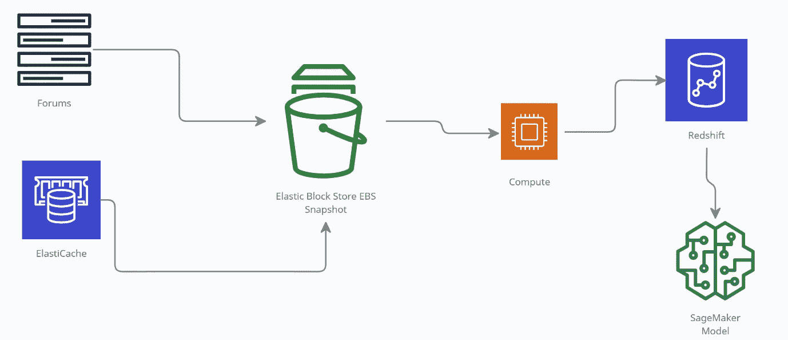
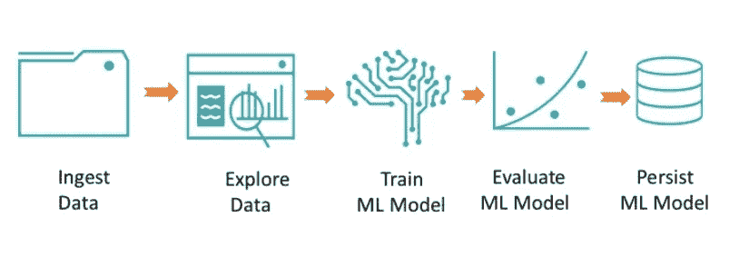
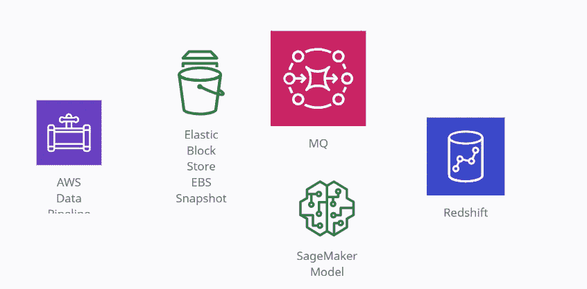
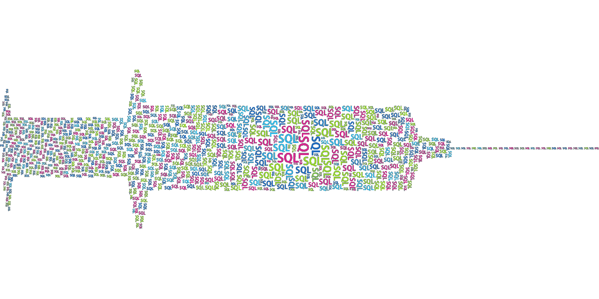
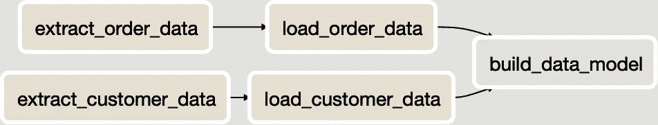
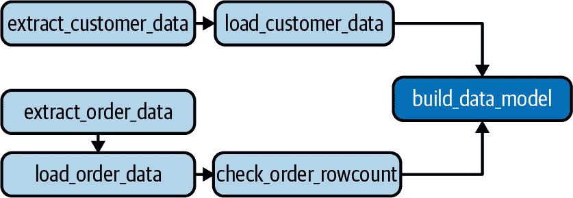
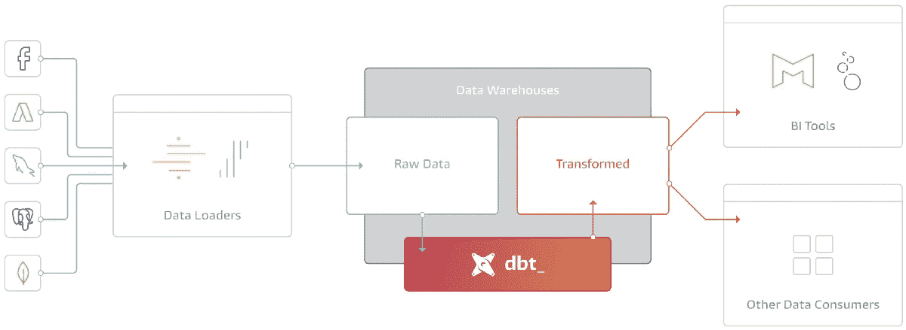
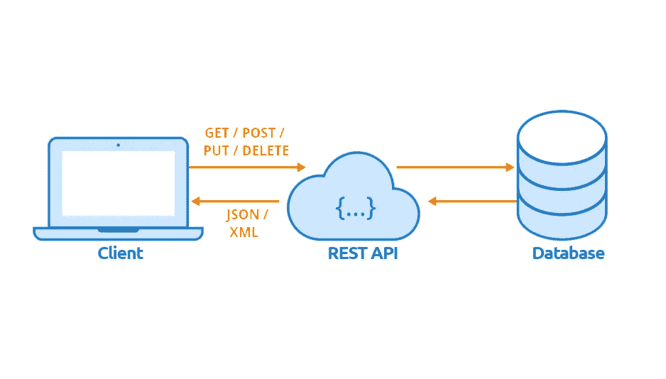

# 深入数据管道——数据工程的基础

> 原文：<https://pub.towardsai.net/diving-into-data-pipelines-b2eb1b8a4923?source=collection_archive---------1----------------------->


来源:引自[埃里克·韦伯](https://unsplash.com/photos/GAVSpEx6ooc)在 [Unsplash](https://unsplash.com/) 上的原创

## [数据工程](https://towardsai.net/p/category/data-engineering)，[社论](https://towardsai.net/p/category/editorial)

## 数据管道介绍。如何，什么，什么时候，为什么？

**作者:** [萨妮娅·帕维兹](https://www.linkedin.com/in/saniya-parveez-b41279157/)，[罗伯特·伊里翁多](https://mktg.best/vguzs)

[](https://members.towardsai.net) [## 加入我们吧↓ |面向人工智能成员|数据驱动的社区

### 加入人工智能，成为会员，你将不仅支持人工智能，但你将有机会…

members.towardsai.net](https://members.towardsai.net) 

T 这篇文章广泛介绍了数据管道的分步解释和代码，介绍了数据工程的基础。数据管道广泛用于数据科学和 [**机器学习**](https://mld.ai/mldcmu) 中，并且在机器学习工作流中至关重要，以整合来自多个流的数据，从而获得商业智能，用于竞争分析和优势。

# 什么是数据管道？

数据管道是一组规则，用于将来自多个源的数据模拟并转换到可以获取新值的目的地。在最简单的形式中，管道可能只从不同的来源提取数据，比如 REST API、数据库、提要、实时流等等。这些被加载到目的地，例如数据仓库中的 SQL 表。数据管道是分析、报告和机器学习能力的基础。

数据管道由多个步骤构成，如数据提取、数据预处理、数据验证、数据存储等。它们可以通过使用多种编程语言和工具来开发。



图 1:一个简单的数据管道流，在这个例子中是 Amazon Web Services(AWS)sage maker。

构建良好的数据管道不仅仅是从数据源中提取数据，并将它们加载到可管理的数据库表或平面文件中供分析师使用。它们对原始数据执行几个步骤，包括清理、结构化、规范化、合并、聚合等等。数据管道还需要其他活动，如对不同基础设施的监控、维护、增强和支持。



图 2:数据管道工作流程。

# ETL 和 ELT

可能没有一种模式像 ETL 和它更现代的兄弟 ELT 一样广为人知。两者都是数据仓库和商业智能中广泛使用的模式。在过去几年中，他们鼓励在生产中运行数据科学和机器学习模型的管道模式。

这两种模式都是数据处理方法，用于将数据输入数据仓库，并使数据对分析师和报告工具有用。*提取*步骤从各种来源收集数据，为加载和转换做准备。*加载*步骤将原始数据(在 ELT 的情况下)或完全转换的数据(在 ETL 的情况下)带到最终目的地——*转换*步骤，来自每个源系统的原始数据被组合和格式化，以帮助分析师、可视化工具或我们的管道所服务的任何用例。

提取和加载步骤的组合通常被称为 ***数据摄取*** *。*

# 数据接收及其接口

术语“数据摄取”指的是从一个数据源提取数据，并将其加载到另一个数据源。数据摄取以实时、批量或两者结合的方式发生(通常也称为**λ架构**)。

当成批接收数据时，会定期按时间间隔安排作业。它与几个源交互和通信，需要几个不同类型的接口和数据结构。

以下是最常见的摄取接口和数据结构:

*   **流处理平台:** RabbitMQ，Kafka。
*   **数据库:** Postgres，MySQL，HDFS，或者 HBase 数据库。
*   数据仓库或数据湖。
*   JSON，CSV，REST API。
*   共享网络文件系统或云存储桶。



图 3:不同的技术堆栈。

## 从 MySQL 数据库中提取数据

我们可以用几种不同的方法从 MySQL 数据库中提取数据:

*   使用 SQL 进行完全或增量提取
*   二进制日志(也称为 binlog)复制

**使用 SQL 进行完全或增量提取**

使用 SQL 的完整或增量提取易于实现，但对于频繁更改的大型数据集，可扩展性较差。

当我们需要将 MySQL 表中的所有列或部分列接收到数据仓库或数据湖中时，我们可以使用完全提取或增量提取。

*   每次运行提取作业时，都会提取表中的每条记录。
*   高容量表可能需要很长时间才能运行。

```
SELECT * FROM Customers
```

**二进制日志(binlog)复制**

二进制日志复制实现起来更复杂，更适合源表中的数据量变化很大的情况，或者需要更频繁地从 MySQL 源接收数据的情况。这也是创建流数据接收[ [2](https://www.oreilly.com/library/view/data-pipelines-pocket/9781492087823/ch04.html) ]的途径。



图 4:word 云中的 SQL。

# 管道编排

编排确保管道中的步骤正确运行，并且这些步骤之间的依赖关系得到适当的管理。流水线步骤总是由 ***引导*** ，这意味着它们以一个或多个任务开始，以一个或多个特定任务结束。这是保证执行路径所必需的。换句话说，它确保任务在其所有相关任务成功完成之前不会执行。

管道图也必须是 ***非循环的*** ，意思是一个任务不能指向之前完成的任务。换句话说，它不能循环回去。如果可以，那么管道可以无休止地运行。



图 5:数据管道中的步骤。

例如，[**Apache air flow**](https://airflow.apache.org/)是一个开源的数据管道任务编排工具，旨在解决数据工程团队面临的日常挑战:如何构建、管理和监控涉及多个相互依赖的任务的工作流。

气流具有出色的配置选项，例如:

*   调度程序。
*   执行人。
*   操作员。

ETL DAG(气流)的图形视图:


图 5: DAG 步骤。

DAG 代码实现:

```
**from** **datetime** **import** timedelta
**from** **airflow** **import** DAG
**from** **airflow.operators.bash_operator** \
  **import** **BashOperator**
**from** **airflow.operators.postgres_operator** \
  **import** **PostgresOperator**
**from** **airflow.utils.dates** **import** days_ago

dag = DAG(
    'elt_pipeline_sample',
    description='A sample ELT pipeline',
    schedule_interval=timedelta(days=1),
    start_date = days_ago(1),
)

extract_orders_task = BashOperator(
    task_id='extract_order_data',
    bash_command='python /p/extract_orders.py',
    dag=dag,
)

extract_customers_task = BashOperator(
    task_id='extract_customer_data',
    bash_command='python /p/extract_customers.py',
    dag=dag,
)

load_orders_task = BashOperator(
    task_id='load_order_data',
    bash_command='python /p/load_orders.py',
    dag=dag,
)

load_customers_task = BashOperator(
    task_id='load_customer_data',
    bash_command='python /p/load_customers.py',
    dag=dag,
)

revenue_model_task = PostgresOperator(
    task_id='build_data_model',
    postgres_conn_id='redshift_dw',
    sql='/sql/order_revenue_model.sql',
    dag=dag,
)

extract_orders_task >> load_orders_task
extract_customers_task >> load_customers_task
load_orders_task >> revenue_model_task
load_customers_task >> revenue_model_task
```

# 管道中的数据验证

当然，即使是设计最好的数据管道，也可能出错。通过对流程、编排和基础设施的良好设计，可以避免或至少减轻一些问题。数据验证也是确保数据质量和有效性的必要步骤，因为在分析中使用未经测试的数据是不安全的。

在管道末端获得数据质量问题并追溯到起点是最糟糕的情况。通过验证管道中的每一个步骤，我们更倾向于在当前步骤而不是前一个步骤中找到根本原因。

为了增强源系统中的质量问题，数据摄取过程本身可能会导致数据质量问题。以下是一些常见的数据摄取风险或摄取的加载步骤

*   增量摄取中的逻辑错误。
*   解析提取文件中的问题。



图 5:数据验证步骤。

在管道的每一步验证数据是至关重要的。即使源数据从管道开始就通过了验证，对在管道末端构建的数据模型运行验证也是一种好的做法。

以下步骤代表了检查该过程的一种方法:

*   确保度量标准在一定的下限和上限内。
*   查看数据模型中的行数增长(或减少)。
*   检查特定指标的值是否存在意外的不稳定性。

可以编写 Python 脚本来执行数据验证，也有几种可用的框架:

*   **dbt:** 它是一个命令行工具，使数据分析师和工程师能够更有效地转换他们仓库中的数据。



图 6: dbt。

*   **张量流数据验证:**张量流数据验证通过将数据统计与模式进行比较来识别输入数据中的任何异常。
*   **雅虎的验证器**

TensorFlow 数据验证(TFDV)可以分析培训和服务，以:

*   计算 [**描述性统计**](https://news.towardsai.net/descriptive-statistics) 。
*   推断一个模式。
*   检测数据异常。

# 维护数据管道的最佳实践

维护数据管道有几个挑战。对于数据工程师来说，最常见的维护挑战之一是处理这样一个事实，即他们接收数据的系统不是静态的。开发人员总是对他们的软件进行修改，要么添加功能，重构代码库，要么修复错误。

当这些更改修改了要接收的数据的模式或含义时，管道就有失败或不准确的风险。现代数据基础设施的事实是，数据是从大量的、多种多样的来源中获取的。很难找到一个放之四海而皆准的解决方案来处理源系统中的模式和业务逻辑变化。因此，构建可伸缩的数据管道需要最佳实践。

以下是一些推荐的最佳实践:

*   添加抽象。
*   维护数据协定。
*   从写模式设计转向读模式设计。

## 为什么要加抽象？

只要可行，在源系统和摄取过程之间包含一个抽象层是非常有用的。源系统所有者也有必要维护或了解抽象方法。

例如:

与其直接从 Postgres 数据库获取数据，不如考虑与数据库所有者合作构建一个 REST API，从数据库中提取数据，并可以通过查询进行数据提取。



图 7: Rest API 与数据库的接口。

## 为什么要维护数据契约？

如果我们直接从源系统的数据库中获取数据，或者通过一些不是专门为我们的提取而设计的方法获取数据，那么创建和维护数据契约对于管理模式和逻辑更改来说是一个技术性较低的解决方案。

从根本上说，数据契约是源系统所有者和从该系统获取数据以用于数据管道的团队之间的书面协议。数据协定可以用文本文档编写，但最好用标准化的配置文件。

示例:

```
{
  ingestion_jobid: "orders_postgres",
  source_host: "my_host.com",
  source_db: "ecommerce",
  source_table: "orders",
  ingestion_type: "full",
  ingestion_frequency_minutes: "60",
  source_owner: "dev-team@mycompany.com",
  ingestion_owner: "data-eng@mycompany.com"
};
```

## 从写模式设计转移到读模式设计

读取时模式是一种模式，其中数据被写入数据湖、S3 桶或其他没有严格模式的存储系统。

例如:

定义系统订单的事件可能被定义为一个 JSON 对象，但是该对象的属性可能会随着时间的推移而改变，因为添加了新的对象或者删除了现有的对象。

因此，在这种情况下，数据的模式在被*读取*之前是未知的，这就是为什么它被称为读取时模式。

读取模式和写入模式的区别:

**写模式**

*   快速阅读。
*   较慢的负载。
*   不敏捷。
*   结构化。
*   错误更少。
*   SQL。

**读取模式**

*   读取速度较慢。
*   快速装载。
*   结构化/非结构化。
*   更多错误。
*   NoSQL。

# 标准化数据接收

当谈到复杂性时，我们接收的系统数量通常不是问题，而是每个系统都不完全相同的事实。

管道维护面临两大挑战:

*   必须编写摄取作业来管理混合的源系统类型(Postgres、Kafka 等)。我们需要获取的源系统类型越多，我们的代码库和维护就越大。
*   相同源系统类型的摄取作业不容易标准化。例如，即使我们只从 REST APIs 获取数据，如果这些 API 没有标准化的分页方式、增量访问数据和其他功能，数据工程师可能会构建“一次性”的获取作业，这些作业不会重用代码和共享可以集中维护的逻辑。

这些是控制的技术方法:

*   尽可能标准化代码，并重用。
*   努力实现配置驱动的数据吸收。
*   考虑我们的抽象。

# 结论

数据管道是一组规则，用于将数据从不同的源移动和转换到可以获得新内容的目标。它们是分析、报告和机器学习能力的基础。

数据管道的复杂性取决于源数据的大小、状态和结构，以及分析项目的需求。在其最简单的形式中，管道可能只从一个源(如 REST API)提取数据，并加载到一个目标(如数据仓库中的 SQL 表)。

数据工程师的目标不仅仅是将数据加载到数据仓库中。数据工程师与数据科学家和分析师密切合作，以了解数据将实现什么，并帮助将他们的需求带入可扩展的生产状态。

数据工程师以确保他们提供的数据的有效性和及时性为荣。这意味着在出现问题时进行测试、发出警报并制定应急计划。而且，是的，最终还是会出问题的！

**免责声明:**本文所表达的观点均为作者个人观点，不代表与作者(直接或间接)相关的任何公司的观点。这项工作并不打算成为最终产品，而是当前思想的反映，同时也是讨论和改进的催化剂。

**除非另有说明，所有图片均来自作者。**

经由[发布**走向 AI** 发布](https://towardsai.net/)

# 进一步阅读

[](/state-of-the-art-data-labeling-with-a-true-ai-powered-data-management-platform-18d973f7af78) [## 通过真正的人工智能数据管理平台实现最先进的数据标签

### 深入了解大型非结构化数据集的数据标注工作流的真正一流自动化

pub.towardsai.net](/state-of-the-art-data-labeling-with-a-true-ai-powered-data-management-platform-18d973f7af78) [](/gradient-descent-algorithm-for-machine-learning-python-tutorial-ml-9ded189ec556) [## 使用 Python 教程的机器学习(ML) 101 的梯度下降

### 使用 Python 深入研究机器学习(ML)的梯度下降算法的教程

pub.towardsai.net](/gradient-descent-algorithm-for-machine-learning-python-tutorial-ml-9ded189ec556) [](/google-colab-101-tutorial-with-python-tips-tricks-and-faq-7689bd4d24b4) [## 使用 Python 的 Google Colab 101 教程—提示、技巧和常见问题

### 关于如何将 Google Colab 与 Python 结合使用的深入教程，以及 Colab 的技巧、诀窍和常见问题

pub.towardsai.net](/google-colab-101-tutorial-with-python-tips-tricks-and-faq-7689bd4d24b4) 

# 参考资料:

[1]詹森·布朗利。2020.“机器学习中的 4 类分类任务”。机器学习精通。[https://machine learning mastery . com/types-of-class ification-in-machine-learning/。](https://machinelearningmastery.com/types-of-classification-in-machine-learning/)

[2]《数据管道袖珍参考》。2021.奥赖利在线学习。[https://www . oreilly . com/library/view/data-pipelines-pocket/9781492087823/ch04 . html](https://www.oreilly.com/library/view/data-pipelines-pocket/9781492087823/ch04.html.)

[](https://ws.towardsai.net/shop) [## 店铺↓ |走向 AI

### 发布最好的技术、科学和工程|社论→https://towardsai.net/p/editorial |订阅→…

ws.towardsai.net](https://ws.towardsai.net/shop) [](https://members.towardsai.net/) [## 加入我们吧↓ |面向人工智能成员|数据驱动的社区

### 加入人工智能，成为会员，你将不仅支持人工智能，但你将有机会…

members.towardsai.net](https://members.towardsai.net/) [](https://sponsors.towardsai.net/) [## 赞助商|了解如何成为《走向人工智能》的赞助商

### 无论你是想以一种吸引读者的方式突出你的产品，吸引高度相关的利基受众，还是…

sponsors.towardsai.net](https://sponsors.towardsai.net/)