# 探究泊松分布和泊松过程

> 原文：<https://pub.towardsai.net/diving-into-the-poisson-distribution-and-poisson-process-f5dadc104402?source=collection_archive---------1----------------------->


来源: [Unsplash](https://unsplash.com/photos/HCPPV-LxlDU)

## [数据科学](https://towardsai.net/p/category/data-science)，[社论](https://towardsai.net/p/category/editorial)，[统计](https://towardsai.net/p/category/statistics)

## 泊松分布和泊松过程在概率和统计中起什么作用，它在现实生活中是如何使用的？

**作者:**萨妮娅·帕维斯，[罗伯托·伊里翁多](https://mktg.best/vguzs)

[](https://members.towardsai.net/) [## 加入我们吧↓ |面向人工智能成员|数据驱动的社区

### 加入人工智能，成为会员，你将不仅支持人工智能，但你将有机会…

members.towardsai.net](https://members.towardsai.net/) 

在这篇文章中，我们将深入探讨泊松过程和泊松分布。我们将展示一些相关的统计概念，然后是真实世界的案例场景和 Python 实现的例子。请务必在 [**Google Colab**](https://colab.research.google.com/drive/1u-t6oSxbMd2FrzaIMimXnPMR5dfV6Gel#scrollTo=iJv5zZrbEQcZ) 或 [**Github**](https://github.com/towardsai/tutorials/tree/master/poisson-distribution-process) 上查看本教程的全部实现。

> 在本文中，我们使用自然语言优化来优化读者的体验和感受。请让我们知道你是否有任何反馈，你是否希望看到更多的这种优化。

泊松分布可选地从二项式分布导出。它是统计相关工作中使用的概率分布，用于事件发生的概率很小的情况。所以用分布来描述稀有事件的行为[ [1](https://www.uvm.edu/~statdhtx/StatPages/More_Stuff/PoissonBinomial/PoissonBinom.html) ]。

当我们在一组时间、区域、长度等内观察事件的计数时，会发生许多实验情况。它是一种离散的概率分布，在统计工作中应用广泛。它用于事件发生概率较小的情况，即事件很少发生[ [2](https://www.math.kit.edu/stoch/~last/seite/lectures_on_the_poisson_process/media/lastpenrose2017.pdf) ]。

1837 年**的法国数学家**西蒙·泊松**之后，泊松分布开始出现，第一次应用是**描述普鲁士军队中被马踢死的人数**[11](https://en.wikipedia.org/wiki/Poisson_distribution)。**

泊松分布的等式可以描述为:


图 1:泊松分布的方程式

> *其中，* ***P(X = X)****代表获得* ***x*** *成功次数的概率。* ***m = NP****表示* *参数的分布。* ***e = 2.71828****形成了自然对数的* *【基数】* [*3*](https://online.stat.psu.edu/stat414/lesson/12/12.1) *。*

在这个等式中，e 是微积分中著名的安伯，如下所示:


图 2:指数极限方程。

总而言之:

泊松分布用于计数，即查看事件是否随着时间的推移以一致的速率发生。泊松分布给出了 **X** 在时间 **T** 内发生的事件数量的概率。

**举例**:

泊松分布模型计算出下个月新英格兰女性新增 SARS 病例的数量。该分布表示所有可能的新病例数的概率，从 **0** 到**无穷大**。

因此，将上述示例定义到泊松分布方程中:

设 **X** =下月新增病例数 **X~** 泊松(λ)，则 X = k(特殊计数)的概率为:


图 3:萨尔斯计数的泊松分布方程

**举例:**

假设一种病毒的发病率为每年千分之一。假设人群成员独立受影响，求 k=0，1，2 [ [4](https://www.gs.washington.edu/academics/courses/akey/56008/lecture/lecture4.pdf) ]时，1 万人群(随访 1 年以上)中出现 k 例的概率。

> **期望值(平均值**)= l = . 001 * 10000 = 10

因此，根据以下计算，预计该人群中每年会出现 10 例新病例:

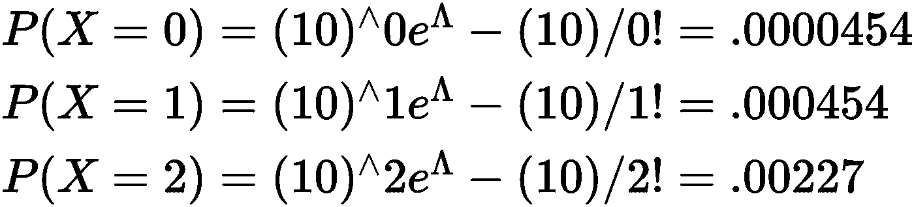

图 4:新的分布案例。

## 泊松分布的使用

以下是泊松分布实用的一些例子:

*   在统计质量控制期间，统计一个或几组产品的缺陷数量。
*   在生物学领域，计算细菌的数量。
*   在保险中，计算潜在伤亡人数。
*   统计交通繁忙的高速公路上因交通事故造成的损失。
*   去统计爱点一年的自杀人数。
*   收集到达电子商务门户的客户数量。
*   计算光纤电缆中特定测量中的缺陷数量。
*   计算在给定时间内检测到的放射性粒子的数量。
*   计算在一定曝光时间内到达 CCD 像素的光子数。
*   (如天文观测)。
*   计算一小时内候诊室里的病人数量。
*   计算每月打电话投诉服务或产品的客户数量。

我们可以使用泊松点方法，因为在该时间间隔内发生的事件数量反映了任何固定时间间隔的泊松分布。另一方面，随后事件之间的时间长度遵循指数分布，这表明泊松分布和指数分布[ [1](https://www.uvm.edu/~statdhtx/StatPages/More_Stuff/PoissonBinomial/PoissonBinom.html) ]之间有密切的数学关系。

# 计算泊松分布的步骤

计算泊松分布的步骤如下:

**第一步:根据观察到的频率数据计算平均值:**


图 5:平均值的计算。

**第二步:获得 e^-m 的值。如果问题陈述中没有给出 e^-m 的值，那么—**

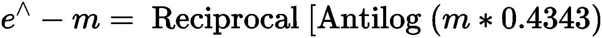

图 6:e^-m 的价值

**第三步:使用泊松分布计算 0、1、2、3 或 x 成功的概率—**


图 7:泊松分布的等式

因此，泊松实验有两个特性:

*   对于任意两个等长的区间，发生的概率是相同的。
*   任何间隔中的发生或不发生独立于任何其它间隔中的发生或不发生。

泊松分布与二项式分布密切相关，如下表所示:

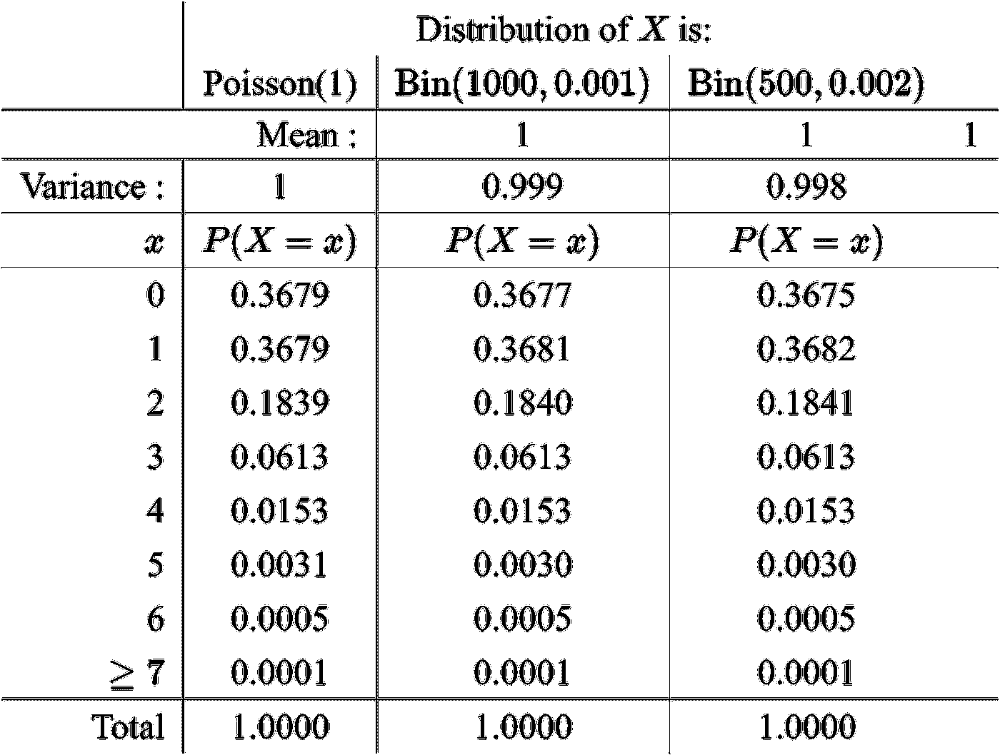

图 8:泊松分布和二项式分布

**从图 8 中的表格观察:**

在表格上方的三列概率中，条目和值是相同的。事实上，任何概率栏都可以很好地近似其他栏中的条目。因此，在许多情况下，泊松分布可以用来近似二项式分布。

# 基于泊松分布的计算

泊松分布方程回答了几个问题。例如，基于泊松分布的问题陈述如下所示:

假设尼日利亚一年中出现的蛇咬伤病例数呈泊松分布，平均为 6 例。

一年内发生以下情况的概率是多少:

*   被蛇咬伤的人数会是 7？
*   被蛇咬伤的人数会少于 2？
*   2 年内发生 10 起咬人案件的概率是多少？
*   一个月内，不发生蛇咬案件的概率有多大？

**解决方案:**

设 X =一年中蛇咬伤的病例数:

*X ~泊松(6) → (λ = 6)*

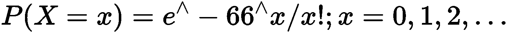

图 9:解决方案。

基于图 9 所示的语句:

## 被蛇咬伤的人数会是 7？

将值 7 代入等式:


图 10:获得 7 次蛇咬伤几率的等式

因此，蛇咬伤案例数将为 7 = **0.13768**

## 被蛇咬伤的人数会少于 2？

将值 2 代入等式—


图 11:被蛇咬伤的人数会少于 2？

因此，被蛇咬伤的人数将少于 2 = **0.01735**

## 2 年内发生 10 起咬人案件的概率是多少？

让 Y =两年内蛇咬伤的病例数

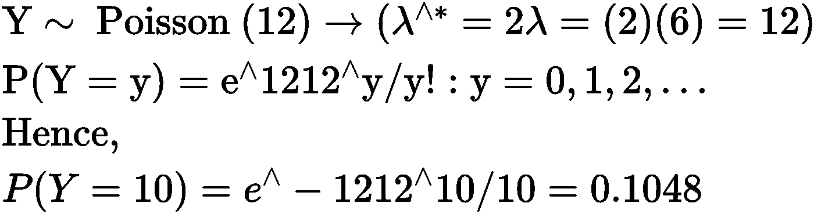

图 12:两年内被蛇咬伤的个案数目

因此，在 2 年内，将有 10 个咬伤案例的概率= **0.1048**

# 一个月内，不发生蛇咬案件的概率有多大？

设 W =一个月内蛇咬伤的病例数。

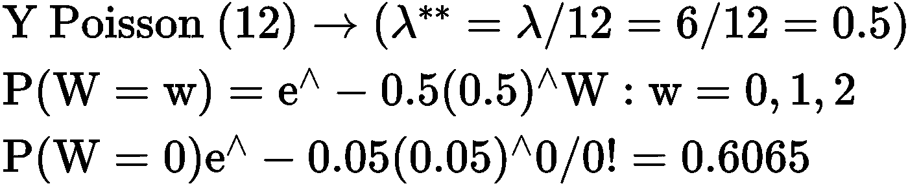

图 13:一个月内被蛇咬伤的人数。

因此，一个月内没有蛇咬伤的概率= **0.6065**

## Python 实现

导入所有必需的包:

```
import math
```

计算阶乘的方法:

```
def factorial(n):
   if n == 0 or n == 1:
     return 1
   else:
     return n * factorial(n-1)
```

计算泊松分布的方法:

```
def poisson_distribution(mean,k):
  temp=((mean**k)*(math.e **(-mean)))/factorial(k)   return temp
```

泊松分布方法的执行:

```
poisson_dist = poisson_distribution(2,7)
poisson_dist
```

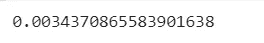

图 14:泊松分布的结果。

二项分布

二项分布是我们期望在 n 次试验中有几次成功的概率分布，其中 P(任何一次试验的成功)= p。

它是由

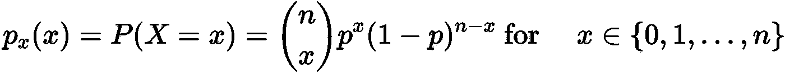

图 15:二项式公式。

泊松和二项式的关系

泊松分布用于以每时间间隔λ的速率对平均罕见事件进行建模。可以用 p℃0 和 n℃∞来描述“罕见”事件。取这些极限值，使得λ= NP—概率为 p [ [5](https://www.coursehero.com/file/p4ctrla/P-%E2%84%A6-1-For-where-A-i-are-disjoint-This-property-is-called-countable-additivity/) ]的 n 次成功的二项式分布模型。

为了更好地了解这两种分布之间的联系，考虑在 **nn** 试验中看到 x 次成功的二项式概率，以及上面提到的成功概率 pp，如下所示。

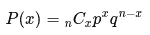

图 16:考虑 nn 试验中 x 成功的概率。

让我们用λλ表示二项分布的期望值 **npnp** 。注意，这意味着:

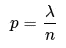

图 17:二项式的期望值。

其中 q = 1-p

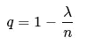

图 18: q = 1 — p。

根据λλ，nn 和 xx 重写 P(x)P(x ),我们得到

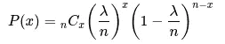

图 19:重写等式。

使用标准公式计算 nn 个事物的组合，每次取 xx 个

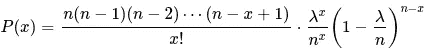

图 20:使用标准公式。

接下来，我们在第一个分数的分子中正好有 x 因子。让我们在第一个和第二个分数之间交换分母，分裂 nx [ [7](http://www.stat.yale.edu/~pollard/Courses/241.fall97/Poisson.pdf) 。

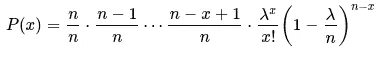

图 21:交换分母。

将最后一个因子分成两部分

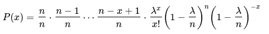

图 22:分解因子。

最后，我们得出了这个等式。

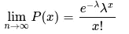

图 23:最终方程。

# 二项式的泊松近似

二项式和泊松分布都是离散概率分布。

总的来说:

***如果 n 大(n > 70)而 p 小(比如说< 0.1)，那么 Bin(n，p)可以近似为 Po(λ)，其中λ = np***

当我们知道确切的分布时，为什么还要使用近似的分布呢？

*   准确的分布可能很难处理。
*   确切的分布可能有太多的细节。通过使用近似分布，我们专注于特定的事情[ [6](http://www.stats.ox.ac.uk/~filippi/Teaching/psychology_humanscience_2015/lecture5.pdf) ]。

## 问题陈述

电视组装部门正在进行缺陷分析，以了解给定缺陷电视的缺陷数量。从过去的质量和审计数据可以看出，一台有缺陷的电视平均有 12 个缺陷。

计算:

*   有缺陷的笔记本电脑正好有 5 个缺陷的概率。
*   有缺陷的笔记本电脑少于 5 个缺陷的概率。

## 解决办法

导入所有重要的必需包:

```
import numpy as np
import scipy.stats as stats
import matplotlib.pyplot as plt
```

获取所有号码:

```
n = np.arange(0,30)n
```


图 24:泊松分布的数字

在审核过程中，平均标记了 12 个缺陷，因此:

比率= 12

```
rate = 12poisson = stats.poisson.pmf(n,rate)poisson
```

泊松:

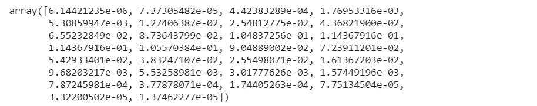

图 25:泊松分布数组。

概率:

```
poisson[5]
```

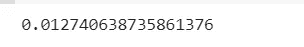

图 26:概率。

```
poisson[0] + poisson[1] + poisson[2] + poisson[3] + poisson[4]
```

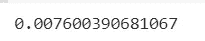

图 27:概率。

概率绘图:

```
plt.plot(n,poisson, 'o-')plt.show()
```

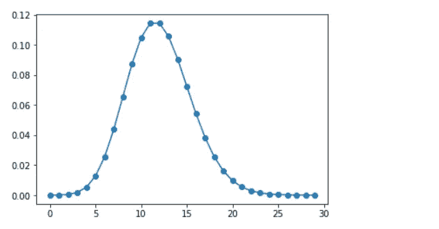

图 28:概率的表示。

## 图示

下图显示了泊松分布的图形表示:

分配 **a = 10**

计算 n 在 int 时间到达的概率:


图 29:计算时间 t 内 n 个到达的概率。

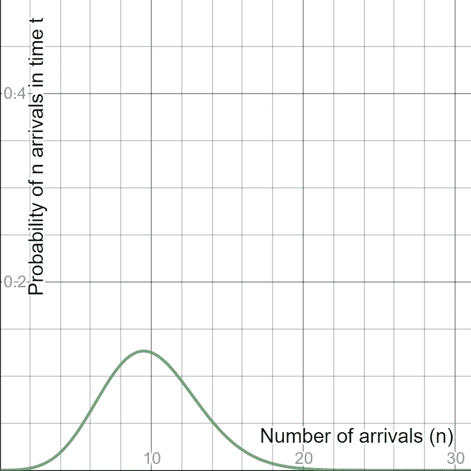

图 30:泊松分布的图形表示。

平均值= 5 的泊松分布图

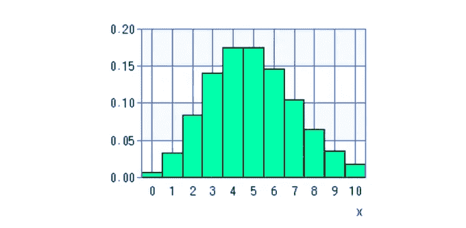

图 31:泊松分布图。

# 结论

在实际应用中，泊松分布主要用于决定一个事件是否可能发生的概率，了解它通常发生的频率，预测一个事件在给定的时间间隔内可能发生的次数，以及其他应用[ [8](https://www.stat.berkeley.edu/~aldous/Real-World/book_april_2015.pdf) ]。

例如，一家保险公司使用泊松分布来进行风险分析，以预测在预定义的时间跨度内车祸和事故的数量)。基于这种计算，公司决定汽车保险定价——分布决定哪种模型计算在内，例如购买的保单数量、提出的索赔数量等等。).

在这种情况下，不适合将其视为连续变量并应用，即线性回归。因此，采用通用建模方法并将分布指定为泊松分布是一种离散分布。

它的连续等价于指数分布，它模拟了任意两个事件之间的间隔。一个事件只能以发生或不发生来衡量。也就是说，变量只能用整数来度量。事件的部分发生不是模型的一部分[ [9](https://www.coursehero.com/file/78018138/poissondocx/) ]。

这个过程是排队论的核心[[10](https://www.cs.cmu.edu/~harchol/PerformanceModeling/book.html)]——排队是发生的事件，排成一条线或队列。例如，尽管大多数服务器的容量足以在一个工作日为大量的人提供服务，泊松分布可以帮助预测和防止一天中特定时间的长队。

**免责声明:**本文所表达的观点仅代表作者个人观点，不代表与作者(直接或间接)相关的任何公司的观点。这项工作并不打算成为最终产品，而是当前思想的反映，同时也是讨论和改进的催化剂。

**除非另有说明，所有图片均来自作者。**

通过[发布**走向 AI** 发布](https://towardsai.net/)

# 资源

[**Github 资源库**](https://github.com/towardsai/tutorials/tree/master/poisson-distribution-process) 。

[**Google Colab 实现**](https://colab.research.google.com/drive/1u-t6oSxbMd2FrzaIMimXnPMR5dfV6Gel#scrollTo=iJv5zZrbEQcZ) **。**

# 参考

[1]“泊松和二项分布”。2021.戴维·豪威尔，Uvm.Edu。[https://www . uvm . edu/~ stat dhx/stat pages/More _ Stuff/poisson binomial/poisson binom . html](https://www.uvm.edu/~statdhtx/StatPages/More_Stuff/PoissonBinomial/PoissonBinom.html.)

[2]泊松过程讲座，Gunter Last 和 Mathew Penrose，KIT —亥姆霍兹协会中的研究型大学，[https://www . math . KIT . edu/stoch/~ Last/seite/lections _ on _ The _ Poisson _ Process/media/lastpenrose 2017 . pdf](https://www.math.kit.edu/stoch/~last/seite/lectures_on_the_poisson_process/media/lastpenrose2017.pdf)

[3]宾夕法尼亚州立大学埃伯利科学学院，《概率论导论》，【https://online.stat.psu.edu/stat414/lesson/12/12.1 

[4]第四讲:随机变量与分布，约书亚·基，华盛顿大学，[https://www . GS . Washington . edu/academics/courses/akey/56008/Lecture/Lecture 4 . pdf](https://www.gs.washington.edu/academics/courses/akey/56008/lecture/lecture4.pdf)

[5]二项式与泊松分布的关系，Dragan Benjevic，STA 257，多伦多大学，[https://www . course hero . com/file/P4 ctrla/P-% E2 % 84% A6-1-For-where-A-I-is-disjoint-This-property-is-called-countable-additivity/](https://www.coursehero.com/file/p4ctrla/P-%E2%84%A6-1-For-where-A-i-are-disjoint-This-property-is-called-countable-additivity/)

[6]泊松分布，牛津大学统计系 Sarah Filippi，[http://www . stats . ox . AC . uk/~ Filippi/Teaching/psychology _ human science _ 2015/lecture 5 . pdf](http://www.stats.ox.ac.uk/~filippi/Teaching/psychology_humanscience_2015/lecture5.pdf)

[7]泊松近似，大卫·波拉德，耶鲁大学，[http://www . stat . Yale . edu/~波拉德/Courses/241 . fall 97/泊松. pdf](http://www.stat.yale.edu/~pollard/Courses/241.fall97/Poisson.pdf)

[8]关于机会和不可预测性:关于数学概率和现实世界之间联系的讲座。，大卫·奥尔德斯，2021。Stat.Berkeley.Edu。[https://www . stat . Berkeley . edu/~ Aldous/Real-World/book _ April _ 2015 . pdf .](https://www.stat.berkeley.edu/~aldous/Real-World/book_april_2015.pdf.)

[9]“泊松。Docx —如果给出了每单位时间\/每页\/每英里骑行等发生事件的平均概率，并要求您计算|路线英雄”。2021.Coursehero.Com。[https://www.coursehero.com/file/78018138/poissondocx/.](https://www.coursehero.com/file/78018138/poissondocx/.)

[10]“计算机系统的性能建模和设计:排队论的应用”。2021.Cs.Cmu.Edu。[https://www . cs . CMU . edu/~ har CHOL/performance modeling/book . html](https://www.cs.cmu.edu/~harchol/PerformanceModeling/book.html.)

[11]泊松分布，维基百科，【https://en.wikipedia.org/wiki/Poisson_distribution 