# 差分神经网络

> 原文：<https://pub.towardsai.net/dnc-differential-neural-network-3cfd82d0d99e?source=collection_archive---------0----------------------->

## [机器学习](https://towardsai.net/p/category/machine-learning)

## DNC 的详细演练

由[菲利普·卡森伯格](https://unsplash.com/@fantasyflip?utm_source=unsplash&utm_medium=referral&utm_content=creditCopyText)在 [Unsplash](https://unsplash.com/s/photos/computer?utm_source=unsplash&utm_medium=referral&utm_content=creditCopyText) 上拍摄的照片

# 介绍

在[之前的文章](https://medium.com/towards-artificial-intelligence/neural-turing-machines-eaada7e7a6cc?source=friends_link&sk=4e4ef671ea6220b57e3b279430678539)中，我们讨论了神经图灵机(NTMs)，它引入了一个外部存储器来维护信息以供以后检索。在这篇文章中，我们进一步讨论一种更复杂的方法，即差分神经计算机(DNC)。DNC 建立在与 NTMs 相同的理念上——两者都旨在通过向神经网络提供对外部存储器的读写访问，来结合神经和计算处理的优势。另一方面，它以更复杂和灵活的交互机制改进了 NTMs，这使得它可能比 NTMs 更强大。

# 差分神经计算机综述

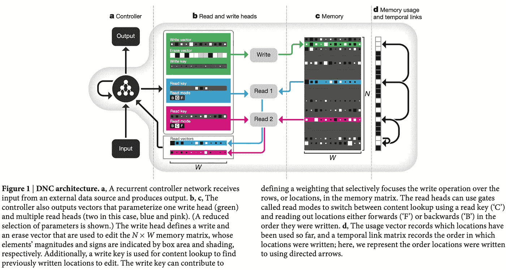

来源:Graves 等人，使用具有动态外部存储器的神经网络的混合计算

原始论文中的上图展示了 DNC 的整体架构。下图进一步详细描述了其内部结构。

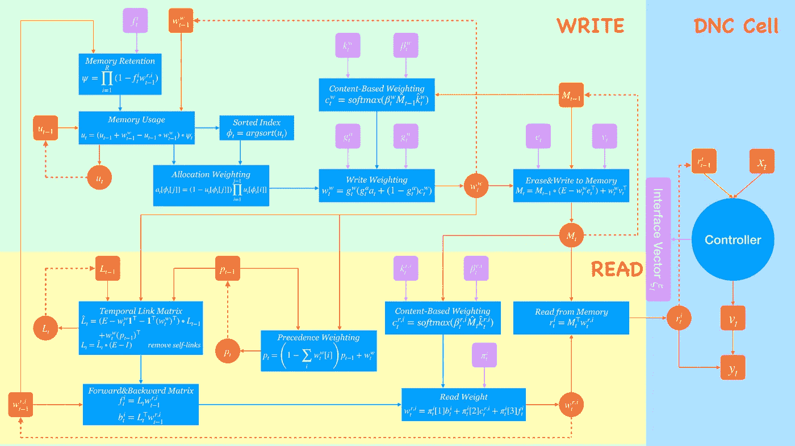

DNC 的内部结构。紫色方块中的符号来自界面向量；橙色方块中的代表 DNC 以前的状态；红色方块表示当前状态。蓝色矩形中定义了操作

我们首先简要介绍 DNC 单元中的各个部分，稍后将进行详细讨论。

*   *控制器*(通常为 LSTM 单元)接收来自环境的输入以及先前的读取向量，并发出输出向量和接口向量，后者负责与写入和读取模块的交互。
*   写模块通过集成基于内容的查找和分配机制来操纵存储器矩阵。前者通过测量输入写密钥和存储器条目之间的相似性来生成权重，而后者基于每个存储器位置的使用来生成权重。
*   read 模块对三种类型的内存进行加权:由 read 键指示的基于内容的内存，以及按向前和向后写入顺序的临时内存。我们使用基于内容的查找来处理第一种类型的存储器，其余的使用时间链接机制，该机制利用一种可学习的相邻矩阵来跟踪顺序。

# 控制器网络

我们将控制器总结为三个步骤

1.在每个时间步长 *t* ，控制器网络接收来自环境(或数据集)的输入向量 ***x*** *_t∈R^X* 以及来自存储器矩阵 ***M* 的一组 *R* 读取向量***r****_ { t-1 }、…、****r****_{t-1}^r***

2.然后它连接读取和输入向量以获得单个控制器输入向量***X****_ t =[****X****_ t；***_ { t-1 }；…，****r****【_{t-1}^r】*并通过它深入 LSTM 架构:*

*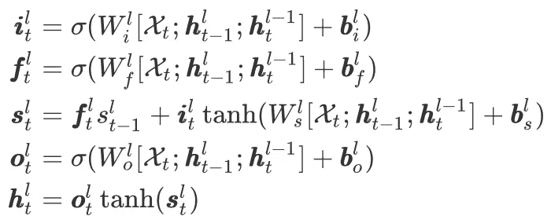*

**l* 是层指数， *𝜎(x)* 是 logistic sigmoid 函数， ***h*** *_t^l，****I*******f****_t^l，****s **h⁰_t=0* 为全*师*；***h****_0^l=****s****_0^l=0*为全 *l* 。这些只是常规 LSTM 堆栈的组件；这里没有什么新东西。******

**3.控制器发出一个输出向量***v****_ t*，定义为**

**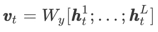**

**输出向量***v****_ t*然后与当前读取向量结合，以产生最终输出——用于强化学习的动作分布，或用于监督学习的预测分布**

**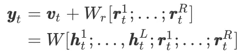**

**第二步，我们将 *W_y* 和 *W_r* 组合成一个单层 *W***

**这种安排允许 DNC 在刚刚被读取的存储器上调节其输出尺寸。**

**控制器还产生一个接口向量*𝜉_t∈r^{(w\times r)+3w+5r+3 }*，定义为**

**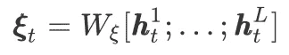**

**接口向量在当前时间步长对其与内存的交互进行编码，类似于上一篇文章中讨论的 NTMs，但使用不同的机制来构建读写权重。**

# **演说**

## **界面参数**

**在我们描述接口向量 *𝜉_t* 如何与形状 *N⨉W* 的外部存储器交互之前，我们将其细分如下:**

**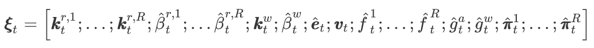**

**然后用各种函数处理具有^的组件，以确保它们位于正确的域中。之后，我们有下面的标量和向量集:**

**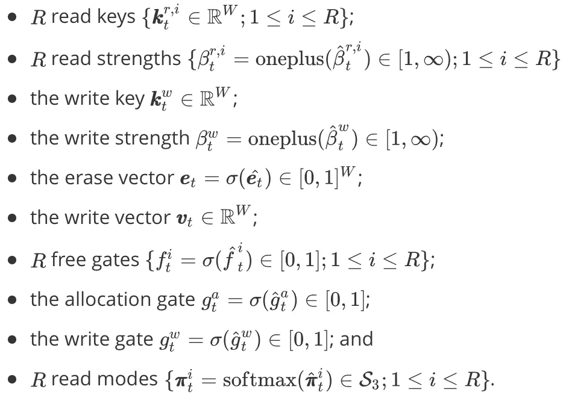**

**其中 oneplus 函数和单位单纯形 *S_N* 定义如下:**

**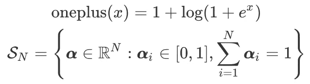**

**我们进一步引入了在 *N* 个位置上的加权空间，它与单位单纯形 *S_N* 的唯一不同之处在于𝛼不一定总和为 1。**

**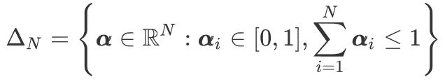**

## **阅读和写作的快速浏览**

**我们把读写权重的计算***w****_t^{r,1},…、****w****_t^{r,r}、****w****_t^w*推迟到下一小节。现在，我们假设这些权重已经计算过了。读取和写入向量的计算方式与在 NTMs 中相同**

**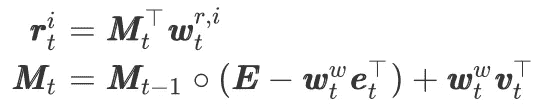**

**∘表示逐元素乘法，而 ***E*** 是一个一的 *N⨉W* 矩阵。**

**值得注意的是，上面使用的权重不一定总和为 1。**

## **存储器编址**

**如前所述，系统使用基于*内容的寻址*和*动态内存分配*的组合来确定*将*写入内存的何处，并使用基于*内容的寻址*和*临时内存链接*的组合来确定*将*读取至何处。这些机制都由“接口参数”一节中定义的接口向量进行参数化，描述如下。**

## **基于内容的寻址**

**作为 ntm，读写头分别使用基于内容的寻址来进行关联调用和修改内存中的现有向量。重要的是，这使得仅部分匹配存储器位置的内容的密钥仍然能够被用于强烈关注该位置。因此，它允许一种形式的模式完成，由此通过读取存储位置恢复的值包括密钥中不存在的附加信息。**

**我们通过具有放大余弦相似性的 softmax 函数来计算内容权重**

**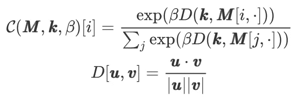**

**其中 ***k*** 和 *𝛽* 分别是读/写键和读/写强度。我们可以将这种计算矢量化为**

****

***\帽子* ***M*** 是 ***M*** 带*L2*-规格化行和*\帽子* ***k*** 是*L2*-规格化**

## ***动态存储分配***

***为了允许控制器根据需要释放和分配内存，Graves&Wayne 等人开发了一种“自由列表”内存分配方案的可区分模拟方案，通过在链表中添加和删除地址来维护可用内存位置的列表。***

***1.控制器发出一组自由门 *f_t^i* ，每个读取头一个，决定最近读取的位置是否可以被释放。***

***2.我们从自由门计算内存保持向量 *𝜓_t ∈[0,1]^N* ，它表示每个位置有多少不会被自由门释放:***

***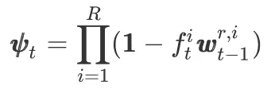***

***乘法表示保留概率的交集。***

***3.内存使用向量可以定义为***

***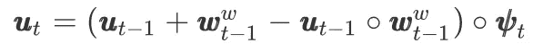***

***用***u****_ 0 = 0*和***u****_ t*∈*【0,1]^n*。直观地说，如果位置已经被自由门(𝜓_t[i]≈1)保留，并且已经在使用(**_ { t-1 }*≈***1***)或者刚刚被写入(***【w****【_{t-1}^w】*≈***1***)。使用自由门只能随后减少使用量(因为括号中的内容总是大于或等于**_ { t-1 }*假定***w****_{t-1}^w≥****0***—它等于*u _ { t-1 }*也可以将括号内的部分作为集合联合运算，其中**_ { t-1 }*和***w****_{t-1}^w*是两个集合，而**_ { t-1 }*∘***w**********

***4.一旦**_ t*被确定，空闲列表 *𝜙_t∈Z^N* 通过以使用的升序排序存储器位置的索引来定义。****

***5.用于提供新的写入位置的分配权重 ***a*** *_t∈ 𝛥_N* 定义为***

***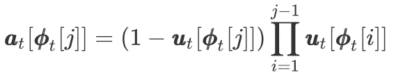***

***直观地说，分配权重**_ t[**_ t[j]]*与比𝜙 *_t[j]* 有更多可用空间的位置的使用率成正比——这些位置的使用率越高，*【𝜙_t[j】*分配的内存越多——与*【𝜙_t[j】*本身的使用率成反比。前者保证总是用更多的可用空间填充位置。****

***正如作者所指出的，步骤 4 中的排序操作会在排序顺序发生变化的地方导致不连续。当计算梯度时，我们忽略这些不连续性，因为它们似乎与学习无关。***

***值得注意的是，分配机制独立于内存大小(事实上，接口向量中的所有元素都是独立的)，这意味着 DNC 可以被训练为使用一种大小的内存来解决一个任务，并在以后升级到更大的内存，而无需重新训练。***

## ***写入权重***

***现在，我们将基于内容的寻址和动态内存分配结合起来，形成写入权重。我们使用前一时间步的内存来计算内容权重***

***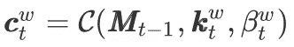***

***写权重可以写为***

***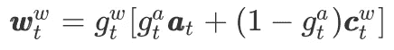***

***分配门*g_t^a∈[0,1】*控制插值，写门*g_t^w∈[0,1】*决定将多少数据写入内存。***

## ***时间记忆链接***

***到目前为止，我们讨论的机制没有存储关于存储位置被写入的顺序的信息。然而，在许多情况下，保留这些信息是有用的:例如，当必须按顺序记录和检索一系列指令时。Graves&Wayne 等人提出跟踪连续修改的存储位置，从而使 DNC 能够按照书写顺序恢复序列。这是按如下方式完成的***

***1.我们首先引入一个优先权重***p****_ t ∈𝛥_n*，其中元素***p****_ t【I】*表示位置 *i* 最后被写入的程度。我们通过递推关系定义***p****_ t*:***

***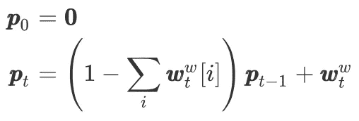***

******w****是写权重****

****注意， ***p*** *_t* 是基于当前时间步的写权重 ***w*** *_t^w* 更新的:如果*𝛴_i****w****_t^w[i]≈0*，这意味着在当前时间步几乎没有任何写操作发生，那么***p****_ t*反之，如果*𝛴_i****w****_t^w[i]≈1*，前面的先后顺序几乎被取代，那么***p**_ t*≈***w****_t^w*。******

****2.现在我们定义时态链接矩阵***L****_ t*，其中***L****_ t【I，j】*表示在位置 *j* 被写入之后位置 *i* 被写入的程度(可以将其视为相邻矩阵的变体)。每次修改一个位置时，我们都希望更新链接矩阵，以删除该位置的旧链接，并从上次写入的位置添加新链接。这是通过以下递归关系实现的****

****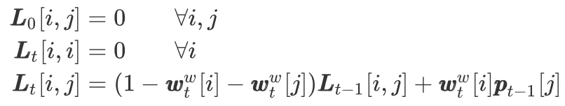****

****我们排除了自链接，因为不清楚如何跟踪从一个位置到其自身的转换。值得注意的是，我们在上面的更新中使用了前一时间步的优先权重，这是合理的，因为定义了链接矩阵***L****_ t*。我们可以将上述过程矢量化如下****

****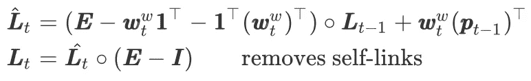****

*******E*** 是个 1 的矩阵， ***I*** 是个单位矩阵。****

***在继续之前，我们先花点时间理顺一下*(1-****w****_t^w[i]-****w****【_t^w[j】*。*-****w****【_t^w[i】*说我们对内存槽 *i* 写的越多，我们保留相应的链接条目就越少。特别是，当**【_t^w[i]=1】*时，我们不再保留关于***l****_ { t-1 }【I，j】*和我们的新***l****_ t【I，j】*完全依赖于***w****【_t^w[i】******w****【_t^w[j】*的合理性以类似的方式工作:写入的内存槽 *j* 越多，位置 *j* 处的内存越新，相应的链接条目应该保留得越少。当***w****_t^w[j]=1*时，即位置 *j* 的内存被新的写向量完全刷新时，所有的 ***L*** *_t[，j】*被复位。******

***3.我们现在基于时间链接矩阵为读取头 *i* 指定前向加权***f****_t^i∈𝛥_n*和后向加权***b****_t^i∈𝛥_n****

******

******w****_{t-1}^{r,i}*是从上一时间步读取的第 *i* 个权重***

***直观地说，前向加权指定了磁头在前一次读取之后以顺序写入顺序将要读取的内容，后向加权指定了以相反的写入顺序读取的内容。***

***另外，Graves&Wayne 等人提出了一种减少链路矩阵开销的技巧。我省略了它，因为我不太确定它是否值得我们去矢量化更新。***

## *****读取权重*****

***每个读取头利用一个读取模式向量 *𝜋_t^i∈S_3* 对后向权重**t105】bt107】t108】_t^i 前向权重**t111】f**t114】_t^i 和内容读取权重***c****_t^{r,i}=c(****m********

***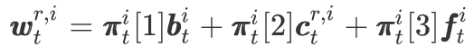***

# ***结束***

***就是这样。这是一次长途旅行；希望你喜欢。如果你碰到一些错误或者有一些顾虑，欢迎留言/评论。***

# *****参考文献*****

***亚历克斯·格雷夫斯、格雷格·韦恩、马尔科姆·雷诺兹、蒂姆·哈雷、伊沃·达尼埃尔卡、阿格尼耶斯卡·格拉布斯卡-巴尔维什卡、塞尔吉奥·戈麦斯·科尔梅纳雷霍、爱德华·格雷芬斯特特、蒂亚戈·拉马尔霍、约翰·阿加皮乌、阿德里亚·普伊格多姆内奇·巴迪亚、卡尔·莫里茨·赫尔曼、尤里·兹沃斯、格奥尔格·奥斯特罗夫斯基、亚当·该隐、海伦·金、克里斯托弗·萨默菲尔德、菲尔·布伦松、科拉雷·卡武克库奥卢和戴密斯·哈萨比斯。2016."使用具有动态外部存储器的神经网络的混合计算."**自然**538(7626):471–76。【https://doi.org/10.1038/nature20101\. ***

***欣，卡罗尔。2016."可微分神经计算机的实现和优化."[https://web.stanford.edu/class/cs224n/reports/2753780.pdf.](https://web.stanford.edu/class/cs224n/reports/2753780.pdf.)***

***代号:[https://github.com/deepmind/dnc](https://github.com/deepmind/dnc)***