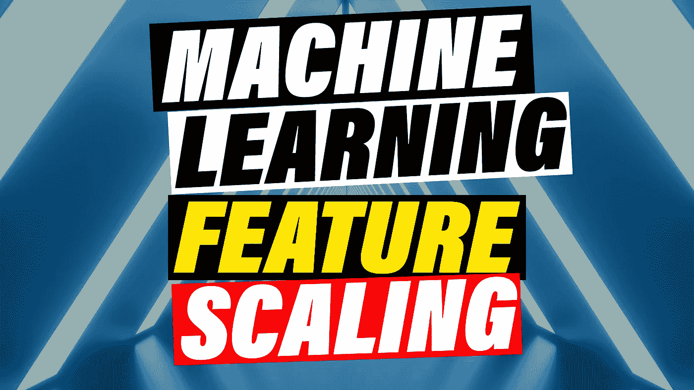
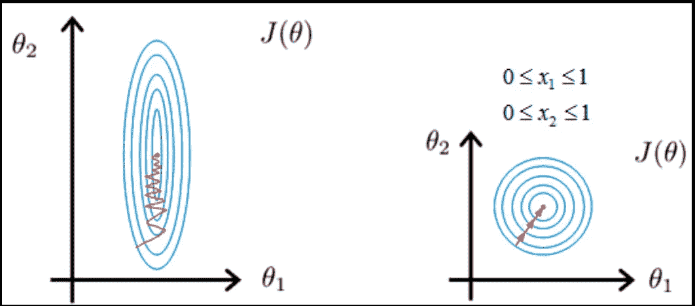
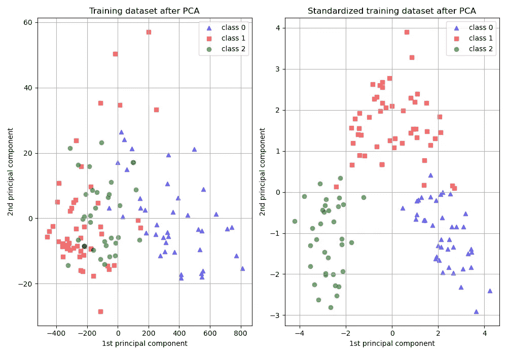
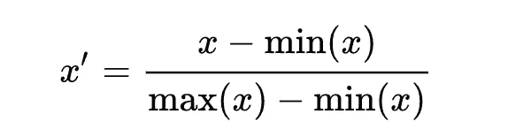
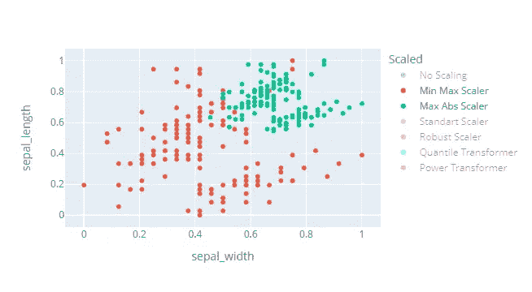
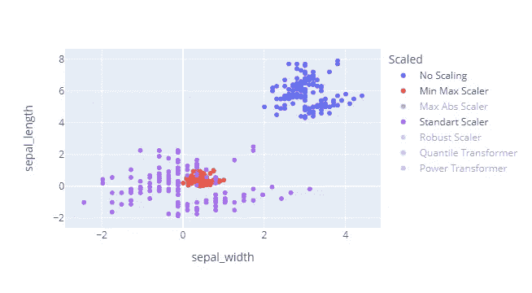
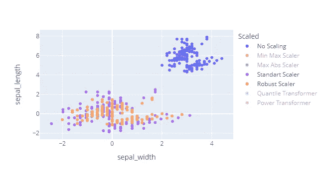
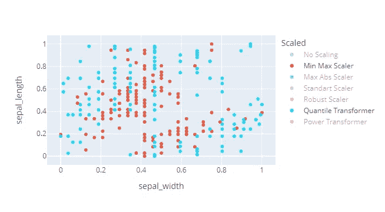
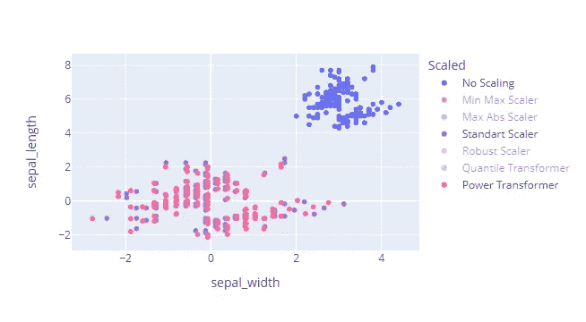
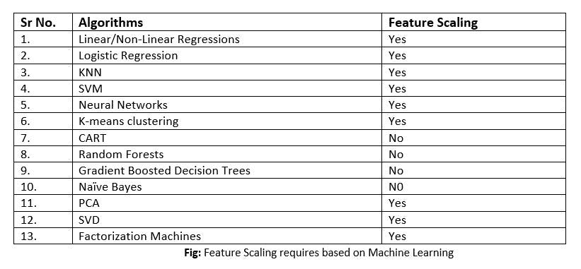

# 你甚至[功能]规模？

> 原文：<https://pub.towardsai.net/do-you-even-feature-scale-d65c8e29e27a?source=collection_archive---------5----------------------->

## [机器学习](https://towardsai.net/p/category/machine-learning)

## 特征缩放完全指南

图片由作者创作，背景图片许可证由作者通过 [Envato](https://elements.envato.com/3d-illustration-tunnel-with-bright-lights-on-the-l-D2L2E6Y) 持有

特征缩放对于大多数机器学习算法来说至关重要。它们不仅对更好的结果很重要，而且对极大地提高你的开发速度也很重要。在本文中，我们将研究围绕这一关键机器学习技术的最重要的问题。

*   什么是特征缩放？
*   为什么特性缩放很重要？
*   使用哪种特征缩放算法？
*   如何在 Python 中进行要素缩放？
*   哪些机器学习算法受益于特征缩放？
*   你什么时候进行特征缩放？

> **本文以问题集的形式呈现。请随意跳过您已经非常熟悉的部分**

# 1.什么是特征缩放？

特征缩放是实现相同目标的不同方法的集合。他们对数字进行透视，将一组数字转换成另一组数字，更容易被各种机器学习算法处理。最简单的例子是 Max Abs 定标器。你只需将每个数据点除以绝对最大值。使得所有的数字都在-1 和 1 之间。

> x_i' = x_i / max(x)

因为这听起来很复杂，想象一下地球上所有的人不再用年来测量他们的年龄。相反，我们称年龄最大的为一号，以了解你的年龄。你只需用你活的天数除以他活的天数。比如我 28*365 天，最老的人 122*365

> 28 / 122 = 0.23

# 2.为什么特性缩放很重要？

两个主要原因，

*   当数据被缩放时，许多算法收敛得更快
*   当数据被缩放时，一些算法可以更好地工作和执行

例如，让我们考虑神经网络和梯度下降可能如何执行。

来自 [Stackoverflow](https://stackoverflow.com/questions/26225344/why-feature-scaling-in-svm) 的图像解释了渐变下降比例与非比例

在左侧，我们直观地看到，使用特征缩放时，通向全局最小值的路径比右侧的路径长得多。因为速度是至关重要的，所以要确保缩放你的数值变量。

为了直观地理解为什么有时算法需要特征缩放才能正确执行，让我们看看 scitlearn 的这个 PCA 例子。

图片来自 [Sklearn](https://scikit-learn.org/stable/auto_examples/preprocessing/plot_scaling_importance.html#sphx-glr-auto-examples-preprocessing-plot-scaling-importance-py)

左边是 PCA 在没有特征缩放的情况下的表现，右边是标准缩放后的表现，我们将在后面详细讨论。我们直观地看到，这些类在视觉上分离得更好。其原因是，当多个变量处于不同的尺度时，算法不会将它们**视为同等重要的**。差异越大的变量越重要，这意味着它们在决策中的权重越大。在“哪些算法需要特征缩放？”我们将努力更好地了解您何时需要它。

对于任何数据科学家来说，理解并能够解释为什么需要功能扩展都是至关重要的，如果你想了解更多关于你在机器学习/数据科学面试中可能会看到的潜在问题，请查看我关于这一主题的视频。

关于机器学习面试问题的视频

除非您确定您的算法不会受到影响，否则 Key takeaway 会缩放您的数据。

# 3.要使用哪个功能缩放？

虽然有许多算法可供您使用，但我们将很快介绍最常见的 6 种算法，并看看它们如何直观地在图中执行。

我创建了这个互动的情节，让你可以更好地玩和理解不同的缩放。让我们一个一个地检查它们。

点击不同的缩放器来关闭或打开它们，绘图由作者创建

## MaxAbsScaler 和 Min Max Scaler

我们已经讨论过的 Max Abs scaler。最小-最大缩放器基本上是从每个数据点减去最小值，然后除以最大值和最小值之差。这将把所有的数字放在 0 和 1 之间。这两个缩放器在方差很小的情况下工作得很好，在有异常值的情况下不应该使用它们。一般来说，从这里开始，更喜欢任何一个定标器。

公式最小最大缩放器

## 标准缩放器

最常见的定标器类型，将所有数据集中在 0 附近，然后以标准偏差为步长。这种类型的缩放器假设您正在处理正态分布的数据，并且异常值不太离谱，因此请确保仅在那时使用它。计算非常简单，它减去平均值，然后除以标准差。

正如我们所看到的，这导致了消极和积极的价值观。而且数据的解读也很容易。例如，当下面的值为 1 时，这意味着它距离平均值有 1 个标准偏差。这对于识别异常值特别有用，因为当你看到像 10 这样的值浮动时，你会变得怀疑。

> 如果您的数据是正态分布的，那么偏离平均值 10 倍的标准偏差是不太可能的

Min-Max、StdScaler 和无缩放的比较

## 鲁棒定标器

这有点相同，但在处理异常值的意义上有所不同。不是减去平均值，而是减去中值，不是除以标准差，而是根据四分位数范围进行缩放。如果您认为您正在处理大量异常值，并且在投入生产之前值得在一些实验中检验，那么这一点尤其有用。

## 分位数变压器定标器

这在数学上变得有点复杂了。您需要知道的是，分位数转换器将您的数据转换为正态分布，这对于比较具有不同单位类型(如千克和摄氏度)的两个数据列非常有用，但它是以非线性方式进行的，这可能会导致一些数学问题。

## 电力变压器定标器

是一系列用于使数据更加高斯化的变换。当我们必须处理倾斜特征时，幂变换非常有用，并且我们的模型对分布的对称性敏感，例如 K-最近邻。在下面的设置中，我们看到，与标准定标器相比，这并没有太大的变化，因为我们的数据已经很大程度上遵循正态分布。

虽然存在一些更奇特的缩放方法，但我认为这些是您想要测试的最常见的方法。恭喜你，现在你已经掌握了你需要知道的 90%的知识。

# 如何在 Python 中进行要素缩放

使用 pandas 和 sklearn 可以非常容易地实现功能缩放。您可以在 sklearn.preprocessing 包中找到所有相关的缩放器。它们都实现了两个方法。Fit()和 Tranform()。拟合方法从数据中学习超参数。超参数用于标准定标器，例如简单的平均值和标准偏差。变换方法简单地将定标器应用于数据。

> 重要提示:请确保保存好您的定标器，例如，用 Pickle 保存，以便以后在您进行预测时检索

# 哪些算法需要特征缩放？

这一切都很棒，但现在让我们看看我们真正关心的是什么。哪些算法需要它执行得更好？

如上所述，在有疑问的情况下，简单地使用特征缩放总是，它很少伤害。但是因为它的实现和运行可能是一个耗时的步骤。我们可以更细致地观察它。

根据经验法则，基于规则的算法(如随机森林和大多数基于树的算法)不需要进行特征缩放，因为它们在值的点处分裂，并且样本的实际大小不影响它们的决策。所有其他算法都受益于缩放，无论是速度还是实际性能。

显示哪些最大似然算法需要特征缩放的表格

# 你什么时候进行特征缩放？

训练前简答。但这很重要，让我们想象一个例子，我们试图预测我还能活多少天。正如我之前提到的，我的年龄是，如果我们的 MinMaxScale 在 0.28 左右，那么模型的输出将会是一个奇怪的值，我希望是 0.5。你需要把这个数字转换回人类的数字，这就是为什么你需要存储你的特征缩放算法。并调用方法 inverse _ tranform()回溯到 0.5*128 = 64 年。

还有一个细节，请确保只在训练数据上训练它，而不是在整个数据上缩放，因为否则您会隐式地向您的模型显示您的训练集，并且可能会得到不切实际的性能结果。这是一个很常见的错误，很多人都没有想太多

# 结论

现在，您已经了解了开始进行功能缩放真正需要了解的所有内容，并且离掌握机器学习又近了一步。细节问题和特征缩放可以产生显著的改进，同时易于实现。因此，一定不要让它未经测试。

如果你喜欢这篇文章，我会很高兴在 Twitter 或 LinkedIn 上联系你。

一定要看看我的 [YouTube](https://www.youtube.com/channel/UCHD5o0P16usdF00-ZQVcFog?view_as=subscriber) 频道，我每周都会在那里发布新视频。