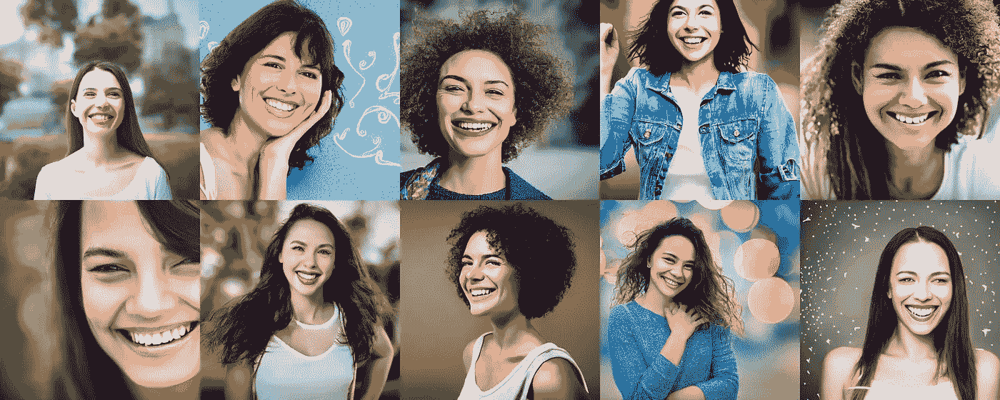
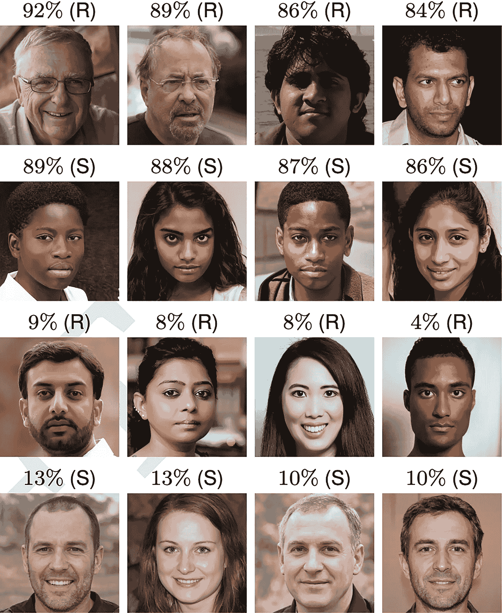
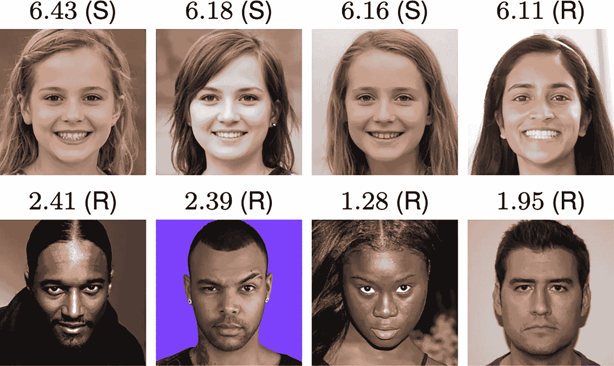

# 你信任这些笑脸吗？可能是的，因为人工智能生成了它们！

> 原文：<https://pub.towardsai.net/do-you-trust-these-smiling-faces-probably-yes-because-ai-generated-them-432dc2b1463a?source=collection_archive---------4----------------------->

来源:人工智能生成的脸由[我的稳定扩散创作](https://www.instagram.com/mystablediffusioncreations/)

## 根据研究，人们越来越相信人工智能生成的人脸比人类更值得信任。这是一个严重的问题。

(人类)面部是最丰富的信息来源之一，毫秒级曝光足以建立对个人属性(如可信度)的隐含判断。

现在，在人工智能图像生成器的时代，我们很难区分人工智能制作的人脸和真实的人脸，可能是时候开始推动防止“深度假货”的措施了。

这些天来，我一直在研究人工智能(如果没有技术行业成千上万名伟大女性的工作，这项技术就不会存在)如何被用来创建或重新解释基于文本输入的图像(你可以在这里阅读**)，我甚至创建了一个艺术项目，使用 [**AI 重新想象技术历史上最重要的 10 位女性的肖像**](/this-is-how-ai-reimagined-10-women-who-changed-the-world-of-technology-2dd776753986) 。**

**但与此同时，我一直在研究人工智能生成的文本、声音、图像和视频是如何被用于“复仇色情”、欺诈和宣传的，我明白这种情况需要社区给予更严重的关注。**

**幸运的是，重要的研究已经完成；例如，兰卡斯特大学的索菲·南丁格尔博士和加州大学伯克利分校的哈尼·法里德教授分别进行了一项研究，他们要求参与者区分最先进的合成人脸和真实人脸，并对人脸引起的信任程度进行评级。研究表明，人工智能生成的人脸不仅非常逼真，而且几乎无法区分**

**根据这项研究，对人工智能生成的****人脸**的真实感的评估显示，合成引擎已经穿越了恐怖的山谷，能够制作出比真实人脸更难以区分——也更可信——的人脸。****

****研究人员对人们无法识别人工智能生成的图像的影响表示严重关切。****

********

****[图 1](https://www.pnas.org/doi/full/10.1073/pnas.2120481119#fig01) — *准确分类最多(顶部和中上部)和最少(底部和中下部)的真实(R)和合成(S)人脸。来源:* [AI 合成的人脸与真实人脸难以区分，更值得信赖](https://www.pnas.org/doi/full/10.1073/pnas.2120481119)****

****在第一个实验中，315 人将来自 800 人小组的 128 张脸分类为真实的或人工智能生成的。他们的**准确率为 48%** ，接近 50%的几率表现率。在实验中，AI 学会了合成越来越真实的人脸，直到鉴别器无法将它们与真实人脸区分开来(参见[图 1](https://www.pnas.org/doi/full/10.1073/pnas.2120481119#fig01) ，例如真实(R)和合成(S)人脸)。****

****第二个实验涉及 219 名新志愿者，他们被告知如何对面孔进行分类并得到反馈。他们从与第一次试验相同的 800 张人脸集合中分类了 128 张人脸，但是尽管他们进行了训练，准确率只提高到了 **59%** 。****

****研究人员想看看可信的观点是否能帮助个人识别假照片。****

****第三个实验让 223 人评估来自同一组 800 张面孔中的 128 张面孔的可信度，按照 1(非常不可信)到 7(非常可信)(非常可信)的等级对他们进行评级。****

****人工智能生成的****人脸**的平均评分比真实人脸的平均评分高**7.7%**，这是一个统计上的显著差异。******

********

*****四个最值得信任(顶部)和四个最不值得信任(底部)的面孔及其在 1(非常不值得信任)到 7(非常值得信任)范围内的信任等级。平均而言，合成人脸比真实人脸更可信。来源:* [AI 合成的人脸与真实人脸难以区分，更值得信赖](https://www.pnas.org/doi/full/10.1073/pnas.2120481119)****

****此外，研究发现，微笑的脸更有可能被判断为可信，但由于 65.5%的真实脸和 58.8%的人工智能生成的脸微笑，面部表情无法解释为什么人工智能生成的脸比人类的脸更可信。****

****研究人员认为，合成脸更值得信任，因为它们类似于普通脸，而普通脸也更值得信任。****

****研究人员还指定了创建和共享合成图像的基本标准，以保护公众免受“深度伪造”的影响。****

****例如，可以在图像和视频生成网络中加入强水印，以提供可靠识别的下游方法。****

****也有必要重新考虑对公众非常宽容的做法，以及不受约束地向任何人发布代码以纳入任何应用程序，因为对这一强大技术的访问民主化带来了最严重的威胁。****

********

****来源:人工智能生成的脸由[我的稳定扩散创作](https://www.instagram.com/mystablediffusioncreations/)****

# ****结论****

****是时候问问我们自己，人工智能生成的****面孔**是否能产生同样的可信度判断。如果不是，可信度可能有助于区分真实的和人工智能生成的 **面孔**。******

****最危险的影响之一是，在一个任何图像或视频都可能被伪造的数字世界，任何令人不舒服或不受欢迎的记录的有效性都可能受到质疑。****

****也许最令人担忧的事情是，像这样的研究可以科学地向我们表明，人工智能生成的人脸比真实的人脸更值得信任。****

****图形和视觉社区是时候像其他科学和工程领域一样，制定和采用有效的指南来创建和分发人工智能生成的媒体和技术，其中包括针对研究人员、出版商和媒体分销商的坚实的道德指南。****

# ****你可能想读的其他文章。****

*   ****[**我们正在见证人工智能的下一次进化吗？**](/are-we-witnessing-the-next-evolution-of-artificial-intelligence-264f251ea06d)****
*   ****[**这 10 个算法可以改变你的生活——如果你和数据打交道**](/these-10-algorithms-can-change-your-life-if-you-work-with-data-ff544657922d)****
*   ****[**快速浏览稳定扩散的开源架构。**](https://medium.com/codex/a-quick-look-under-the-hood-of-stable-diffusion-open-source-architecture-2f07fc1e729)****
*   ****[**5 个非常实用的方法人工智能可以帮助提高你公司的生产力**](/5-very-practical-ways-ai-can-help-to-improve-your-companys-productivity-f4d5dcd0b30c)****
*   ****[**这 9 篇研究论文正在改变我今年对人工智能的看法。**](https://medium.com/illumination/these-9-research-papers-are-changing-how-i-see-artificial-intelligence-this-year-cd8ba548f785)****

# ****链接、资源和参考资料****

*   ******Sophie J. Nightingale** 等，人工智能合成的人脸与真实人脸难以区分，更加可信，*美国国家科学院院刊* (2022)。[DOI:10.1073/PNAS . 2120481119](http://dx.doi.org/10.1073/pnas.2120481119)****
*   ****ORC |目录。[https://Dartmouth . smart catalogiq . com/current/orc/Departments-Programs-understand/psychology-and-Brain-Sciences/PSYC-psychology-and-Brain-Sciences/PSYC-51-02](https://dartmouth.smartcatalogiq.com/current/orc/Departments-Programs-Undergraduate/Psychological-and-Brain-Sciences/PSYC-Psychological-and-Brain-Sciences/PSYC-51-02)****
*   ****研究人员发现人工智能生成的人脸比真实人脸更可信。[https://tech xplore . com/news/2022-02-ai-generated-worthy-real-deep-fakes . html](https://techxplore.com/news/2022-02-ai-generated-trustworthy-real-deep-fakes.html)****
*   ****新研究显示，人工智能生成的面孔比真实面孔更可信。[https://English . aawsat . com/home/article/3484011/ai-generated-faces-more-trust-real-ones-new-study](https://english.aawsat.com/home/article/3484011/ai-generated-faces-more-trustworthy-real-ones-new-study)****

# ****你可能想读的其他文章。****

*   ****[**我们正在见证人工智能的下一次进化吗？**](/are-we-witnessing-the-next-evolution-of-artificial-intelligence-264f251ea06d)****
*   ****[**这 10 个算法可以改变你的生活——如果你和数据一起工作**](/these-10-algorithms-can-change-your-life-if-you-work-with-data-ff544657922d)****
*   ****[**快速浏览稳定扩散的开源架构。**](https://medium.com/codex/a-quick-look-under-the-hood-of-stable-diffusion-open-source-architecture-2f07fc1e729)****
*   ******人工智能可以帮助提高公司生产力的 5 个非常实用的方法******
*   ******[**这 9 篇研究论文正在改变我今年对人工智能的看法。**](https://medium.com/illumination/these-9-research-papers-are-changing-how-i-see-artificial-intelligence-this-year-cd8ba548f785)******

# ****你愿意支持我吗？****

*****为了获得无限的故事，你也可以考虑* [*注册*](https://medium.com/@jairribeiro/membership) *成为一个中等会员，只需 5 美元。此外，如果您使用我的链接* [*注册*](https://medium.com/@jairribeiro/membership) *，我将收到一小笔佣金(无需您额外付费)。*****

**** [## 通过我的推荐链接加入媒体- Jair Ribeiro

### 阅读我分享的每一个故事(以及媒体上成千上万的其他作者)。你的会员费直接支持其他…

medium.com](https://medium.com/@jairribeiro/membership)****