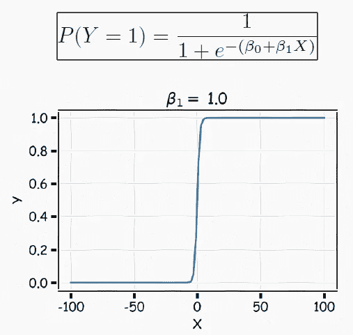
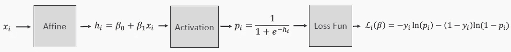
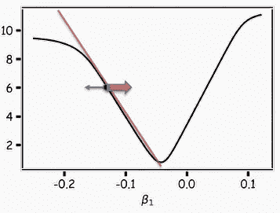
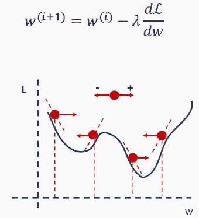
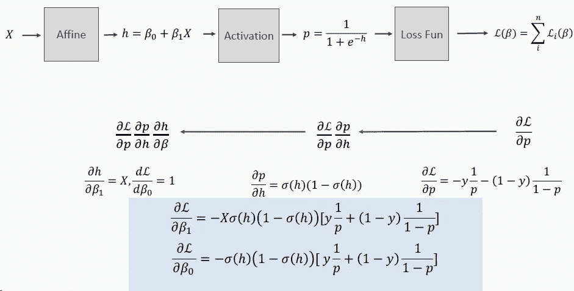
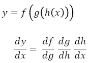
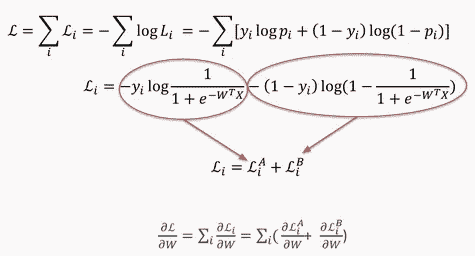
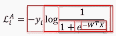
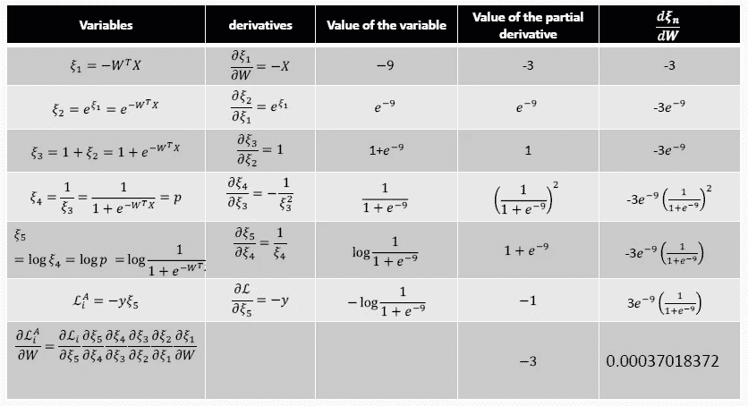
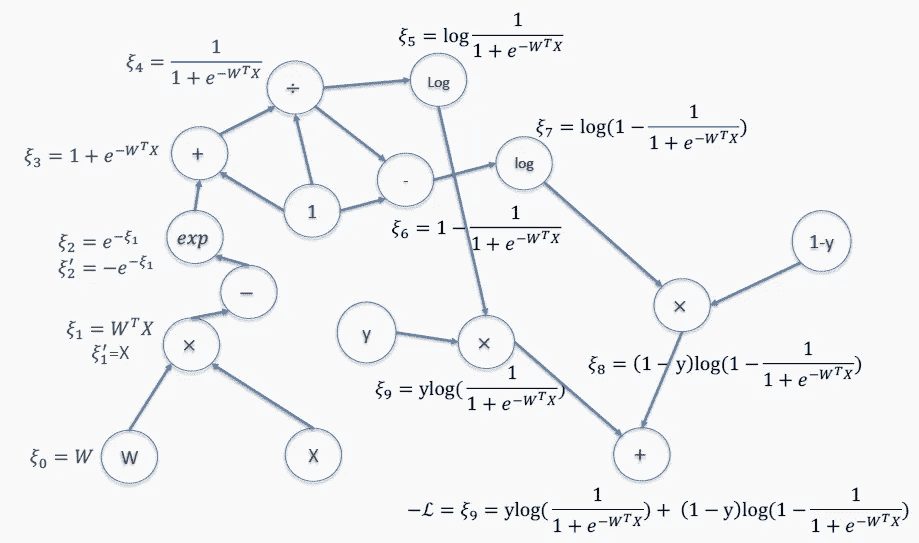

# 你理解梯度下降和反向传播吗？大多数人不知道。

> 原文：<https://pub.towardsai.net/do-you-understand-gradient-descent-and-backpropagation-most-dont-929d65f57a6c?source=collection_archive---------2----------------------->

## [机器学习](https://towardsai.net/p/category/machine-learning)

## 机器学习中一种常用优化算法背后的简单数学直觉。

二元分类在机器学习中非常常见。这是进入梯度下降和反向传播的黑暗世界的一个很好的例子。

米哈伊尔·瓦西里耶夫在 [Unsplash](https://unsplash.com/photos/UqFyM-LOgQc) 上的照片

# 逻辑回归中的梯度下降

我们记得，在用于二进制分类的神经网络中，输入经过仿射变换，并且结果被馈送到 sigmoid 激活中。因此，输出是 0 或 1 之间的值，即预测正类或负类的可能性。

下面我们看到这个分类输出的表达式 *P(Y=1)* 。注意，预测器 *X* 上的仿射变换取决于两个参数 *β0* 和 *β1* 。

s 形逻辑函数

在训练期间，对于任何输入 *Xi* ，神经网络可以计算似然 *Pi* 并将其与真实值 *Yi* 进行比较。通常使用**二进制交叉熵**计算误差。它的作用与用于回归的均方误差相同。

二元交叉熵测量预测值 *Pi* 与真实值 *Yi* (为 0 或 1)的距离。下面给出用于计算二元交叉熵 *Li* 的公式。

二元交叉熵损失函数。

如你所见，损失取决于权重 *β0* 和 *β1。*在梯度下降优化器选择了随机权重后，它挑选一个随机的 *Xi* ，然后向前传递以计算损失。

如果我们使用的是基本梯度下降，优化器会对所有输入数据点重复这种计算，如果我们使用的是随机版本，优化器只会对少量数据重复这种计算。总损失是将所有单项损失相加得出的。

在优化器计算出总损失后，它将计算权重的导数。基于导数的符号，它将正向或负向更新权重。

二元交叉熵函数的偏导数。

我们知道，我们想要向导数的相反方向前进，我们知道，我们想要向导数成比例地前进一步。**学习率** λ是控制每个权重 *W* ( *β0* 或β1 )的比例。

权重在梯度下降期间更新。

# 逻辑回归中的反向传播

如上图所示，更新权重需要计算每个权重损失的偏导数。

我们如何计算导数？嗯，我们可以用高中数学来做这个。

在下图中，我们尝试计算 *β0* 和 *β1* 的交叉熵损失函数的导数。

如何手工计算偏导数？

对于只有一个神经元的网络来说，这是一个很好的解决方案。但是想象一下我们在深度学习中通常会遇到的有数百个神经元的网络。我打赌你不想计算结果导数。

即使你成功地做到了这一点，你也必须在每次网络结构改变时更新你的公式，哪怕只是一点点。这就是**反向传播**发挥作用的地方。

反向传播算法最初是在 20 世纪 70 年代提出的，但直到 1986 年 Geoffrey Hinton 的一篇论文才充分认识到它的重要性。

反向传播使用**链规则**，这是编写嵌套函数导数的方便的助记符。

例如，如果我们有一个网络，其中一个神经元馈入第二个神经元，最后馈入第三个神经元以获得输出。总损失函数 *f* 是前两个神经元的损失函数 *g* 的函数，类似地， *g* 是第一个神经元的损失函数 *h* 的函数。

连锁法则。

当我们从输入开始计算每个神经元的输出直到最后一个神经元时，我们也已经计算了导数的微小分量。

在上面的例子中，我们可以在向前通过第一个神经元时计算出 *dh/dx* 。

接下来，我们可以通过第二个神经元向前计算 *dg/dh* 。

最后，我们开始计算 *df/dg* 向后通过神经元，并通过重用所有已经计算的元素。

这就是反向传播这个名字的由来。这种技术有几种实现和风格。为了简单起见，我们在这里保持简单。

为了说明链式法则和反向传播是如何工作的，让我们回到具有 sigmoid 激活的 1-神经元网络的损失函数。

损失函数被定义为二进制交叉熵，它可以被分成两部分 A 和 B，如下所示。

二元交叉熵损失函数。

让我们仔细看看损失函数的 A 部分。它可以分成几个块，在下图中用红框突出显示。

二元交叉熵损失函数的第一部分。

反向传播要求计算该函数在任何给定数据点 *X* 处对任何给定权重 *W* 的导数。

这是通过计算每个块的导数并用链式法则把它们放在一起完成的。

下面我们来看看这对于 *X=3* 和 *W=3* 是如何工作的。

反向传播期间进行的计算。

我们所需要的是能够计算小块(上面称为变量)的导数。

这种块是已知的，因为激活函数通常是已知的。它们可以是 s 形的、线形的、ReLu 形的等等。

这些是导数已知的可微函数。你可以在这里找到最新激活功能[的完整列表](https://towardsdatascience.com/activation-functions-neural-networks-1cbd9f8d91d6)。

因此，上述计算可以在运行时使用计算图来构建。

Keras 等高级 API 可以查看您的网络架构和每个神经元使用的激活函数，以在模型编译期间构建计算图。

该图在训练期间用于执行正向传递和反向传播。

交叉熵损失函数的计算图的示例如下所示。

Keras 生成的计算图示例。

# 结论

理解梯度下降和反向传播是如何工作的，是理解深度学习为什么完美工作的重要一步。在本文中，我展示了二元分类环境中的学习过程。

米哈伊尔·瓦西里耶夫在 [Unsplash](https://unsplash.com/photos/AOCrhDG6O08) 的照片

感谢阅读。