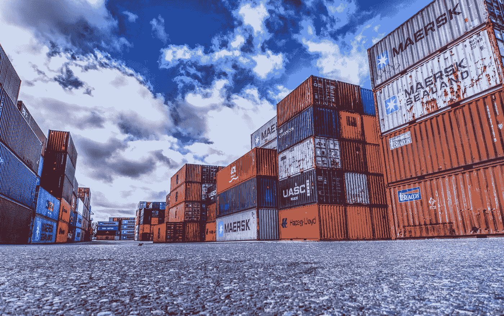
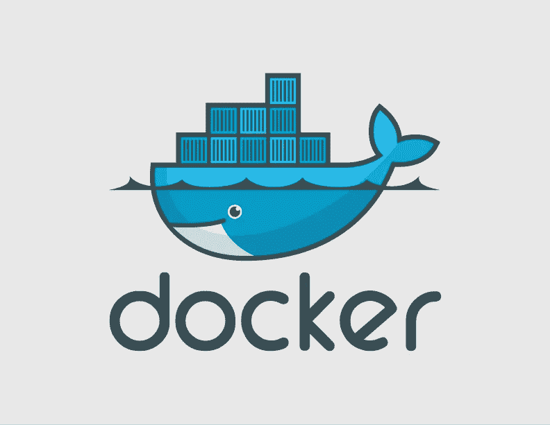
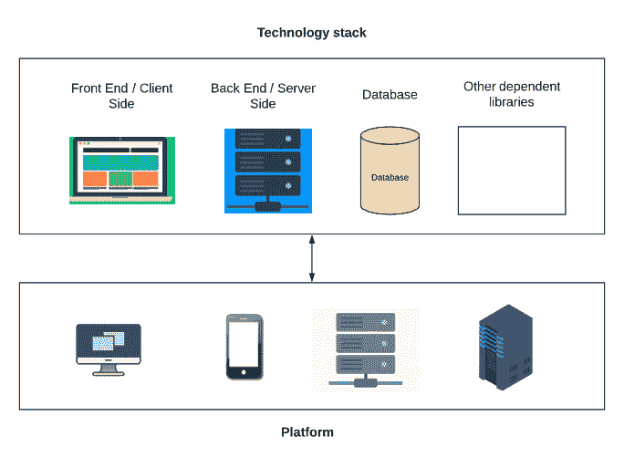
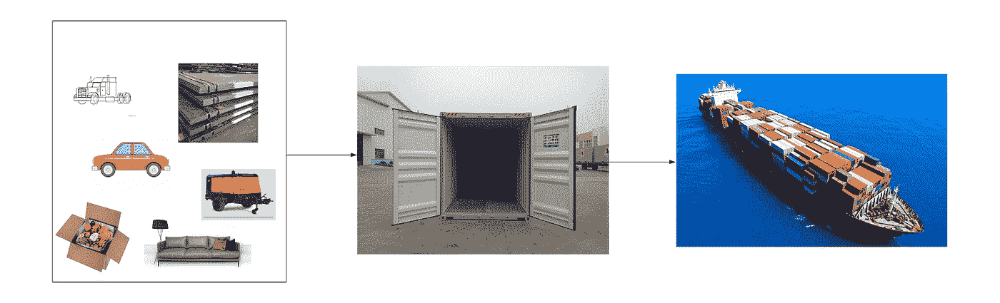
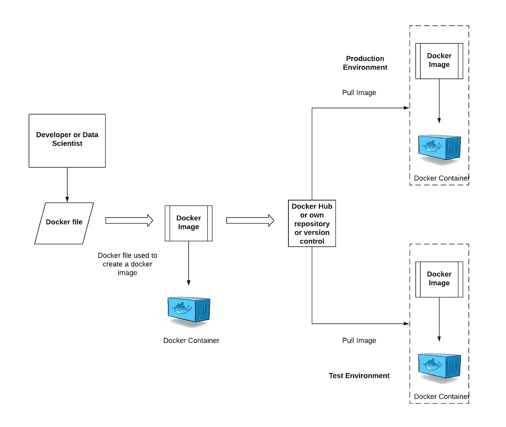

# Docker —数据科学家的容器化

> 原文：<https://pub.towardsai.net/docker-container-and-data-scientist-bae208ce8268?source=collection_archive---------0----------------------->

图片由来自 [Pixabay](https://pixabay.com/?utm_source=link-attribution&utm_medium=referral&utm_campaign=image&utm_content=3118783) 的 [Markus Distelrath](https://pixabay.com/users/distelAPPArath-2726923/?utm_source=link-attribution&utm_medium=referral&utm_campaign=image&utm_content=3118783) 提供

## [数据科学](https://towardsai.net/p/category/data-science)

## 码头集装箱化浅析

数据科学家来自不同的背景。在当今的敏捷环境中，快速响应客户需求并交付价值是非常重要的。更快的价值为客户带来更多的成功，从而为组织带来更多的成功。

信息技术总是面临着巨大的压力，需要提高灵活性并加快向业务部门交付新功能的速度。*一个特别的压力点是以典型数字化转型所要求的频率和即时性部署新的或增强的应用代码。从表面上看，这个问题并不简单，而且还因基础设施挑战而变得更加复杂。* *挑战，比如为开发团队提供一个平台需要多长时间，或者构建一个充分模拟生产环境的测试系统有多困难(ref:*[*IBM*](https://www.ibm.com/cloud/blog/the-benefits-of-containerization-and-what-it-means-for-you)*)。* Docker 和 Containers 在 2013 年出现，它塑造了软件开发，并正在引起云计算世界的结构性变化。

数据科学家自给自足并参与持续的部署活动至关重要。构建有效的模型需要多次迭代部署。有能力进行小的改变并经常部署和测试是非常重要的。根据我最近收到的询问，我想写这篇博客来帮助人们理解 Docker 和容器是什么，以及它们如何促进持续部署和帮助业务。

在这篇博客中，我写的是关于 Docker 的内容，包括以下内容。

1.  我们什么时候需要码头工人？
2.  Docker 在数据科学领域的运营情况如何？
3.  Docker 是什么？
4.  Docker 是如何工作的？
5.  使用 Docker 的优势

# 我们为什么需要 Docker？

这在我们的工作中多次发生；无论何时你开发一个模型，代码，或者构建一个应用程序，它总是在你的笔记本上工作。然而，当我们试图在生产或测试环境中运行相同的模型或应用程序时，它会带来一些问题。这是因为开发人员平台和生产平台之间的计算环境不同。例如，您可以使用 Windows 操作系统或任何升级的软件，而在生产中，他们可能使用 Linux 操作系统或不同的软件版本。

在现实世界中，开发者的系统和生产环境应该是一致的。然而，这很难实现，因为每个人都有自己的偏好，不能强迫他们统一使用。这就是 Docker 介入并解决这个问题的地方。

# Docker 在数据科学领域的运营情况如何？

在数据科学或软件开发生命周期中，Docker 进入部署阶段。

> Docker 使部署过程变得非常简单和高效。它还解决了与部署应用程序相关的任何问题。

# Docker 是什么？

参赛:ibexa.co

Docker 是全球领先的软件容器[平台](https://www.emergingtechnology.co.nz/docker-containers-services)。让我们举一个真实的例子，正如我们所知，数据科学是一个团队项目，需要与其他领域协调，如客户端(前端开发)、后端(服务器)、数据库、运行模型的另一个环境/库依赖关系。该模型不会单独部署，它将与其他软件应用程序一起部署，以获得最终产品。

从上图中，我们可以看到具有不同组件的技术堆栈和具有不同环境的平台。我们需要确保技术堆栈中的每个组件都应该与每一个可能的硬件(平台)兼容。实际上，由于每个组件的计算环境不同，使用所有平台变得很复杂。这是业界的主要问题，我们知道 Docker 可以解决这个问题。 ***但如何？***

让我们再举一个来自航运业的实际用例。

每个人都知道轮船可以把各种货物运送到不同的国家。你有没有注意到出货的产品尺寸不一样？每艘船运载所有类型的产品。但是，每种产品都没有单独的船只。我们可以从上面的图片中看到有一辆汽车，食品，卡车，钢板，压缩机，家具。所有这些产品在性质、大小、包装等方面都不同。有些物品易碎，有些需要不同的包装，如食品、家具等。，以及它将如何运送等。这是一个复杂的问题，航运业使用 ***集装箱解决了这些问题。*** 无论是什么物品，我们唯一需要做的就是将物品包装好，保存在集装箱内。集装箱有助于航运业轻松、安全、高效地出口货物。

现在让我们来解决我们的问题。我们也有类似的问题。我们有不同的组件(技术栈)，而不是项目，解决方案是在 Docker 的帮助下使用 ***容器*** 。

> Docker 是一个通过使用容器以更简单的方式帮助创建、部署和运行应用程序的工具。

容器帮助数据科学家或开发人员将应用程序与它需要的所有部分打包在一起，比如库和其他依赖项，并作为一个包进行部署。

更简单地说，开发人员和数据科学家将所有的软件、模型和组件打包到一个名为 Container 的盒子中，Docker 将负责将这个容器运送到不同的平台。你看，开发人员和数据科学家显然关注代码、模型、软件及其依赖项，并将其放入容器中。他们不需要担心部署到 Docker 可以处理的平台上。机器学习算法有几个依赖项，Docker 帮助自动下载和构建这些依赖项。

# Docker 是如何工作的？

开发人员或数据科学家将定义所有的需求(软件、模型、依赖等)。)在一个名为**的 Docker 文件**中。换句话说，就是用于创建 Docker 映像的一系列步骤。

**Docker Image —** 这就像一份食物食谱，包含了制作一道菜的所有配料和程序。简而言之，它是一个包含所有软件应用程序的蓝图，以及在 Docker 上运行该应用程序所需的依赖关系。

**Docker Hub** —我们可以保存和查找所有 Docker 图片的官方在线存储库。我们可以在 Docker hub 中只保留一个 Docker 图像作为免费版本，并且需要订阅以保存更多图像。请参考[这里的](https://www.docker.com/products/docker-hub)

当运行 Docker 映像时，我们可以获得 Docker 容器。Docker 容器是 Docker 映像的运行时实例，这些映像可以存储在名为 Docker hub 的在线云存储库中，也可以存储在自己的存储库或任何版本控制中。现在，可以在任何环境(测试或生产或任何环境)中提取这些映像来创建 Docker 容器。然后，我们所有的应用程序都在测试和生产环境的容器中运行。现在，我们的测试和生产环境都与相同，因为它们运行在相同的 Docker 容器中。

# 使用 Docker 的优势

## 1.只构建一次应用程序

在 Docker 中，我们可以为任何环境只构建一次应用程序。不需要为不同的环境构建单独的应用程序。它节省时间。

## 2.轻便

在我们测试了我们的容器化应用程序之后，我们可以将它部署到 Docker 正在运行的任何其他系统上，并且它将完全像我们测试它时那样运行。

## 3.版本控制

我们可以在 Docker 中做版本控制。Docker 有内置的版本控制，可以提交对 Docker 映像的更改并对其进行版本控制。

## 4.自主的

每个应用程序都在自己的容器中工作，不会干扰任何其他应用程序。这是一个很大的优势，因为它不会给应用程序带来任何问题。它让人们安心。

使用 Docker，我们可以将所有软件及其依赖项打包到容器中。Docker 将确保所有这些都部署在每一个可能的平台上，并且在每一个系统上都能正常工作。因此，Docker 使部署变得更加容易和快速。

我将在下一篇博客中写关于 Docker 命令，如何将 ML 模型 Docker 化。

感谢阅读。请继续学习，并关注更多内容！

你也可以在 [KDnuggets 上阅读这篇文章。](https://www.kdnuggets.com/2020/06/docker-containerization-data-scientists.html)