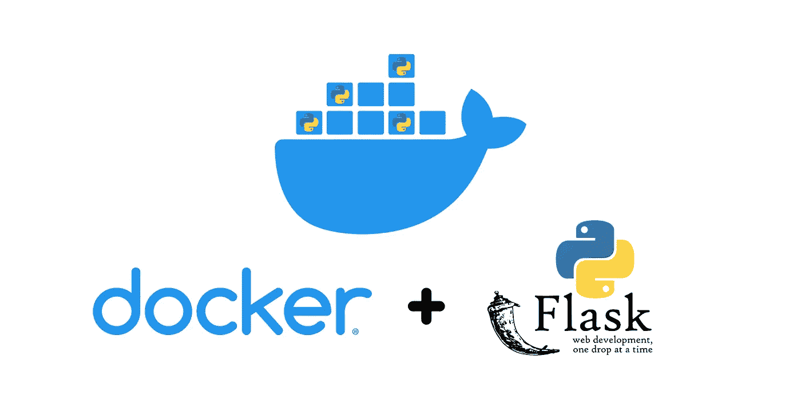

# Docker + Flask |对 Python API 进行 Dockerizing

> 原文：<https://pub.towardsai.net/docker-flask-dockerizing-a-python-api-168d3899f482?source=collection_archive---------0----------------------->

## [编程](https://towardsai.net/p/category/programming)



[容器是目前软件开发中最热门的趋势之一。它不仅使创建、部署和运行应用程序变得更加容易，而且通过使用容器，您可以确信您的应用程序可以在任何机器上运行，不管您创建和测试的代码与您的机器有什么不同。](https://www.docker.com/)

在本教程中，我们将向您展示如何轻松对接一个 Flask API。我们将使用这个 [Python Rest API 示例](https://predictivehacks.com/python-rest-api-example/)。这是一个简单的 API，给定一个图像 URL，它返回图像的主色。

我们强烈建议使用 [Conda](https://predictivehacks.com/working-with-anaconda-environments/) 或 pip 创建一个新的 python 环境，这样您就可以轻松地创建您的 **requirements.txt** 文件，其中包含您在项目中使用的所有库。

我们将要 dockerize 的 Flask API 使用了两个。py 文件。

# 颜色. py

```
import PIL
from PIL import Image
import requests
from io import BytesIO
import webcolors
import pandas as pd
import webcolors

def closest_colour(requested_colour):
    min_colours = {}
    for key, name in webcolors.css3_hex_to_names.items():
        r_c, g_c, b_c = webcolors.hex_to_rgb(key)
        rd = (r_c - requested_colour[0]) ** 2
        gd = (g_c - requested_colour[1]) ** 2
        bd = (b_c - requested_colour[2]) ** 2
        min_colours[(rd + gd + bd)] = name
    return min_colours[min(min_colours.keys())]
def top_colors(url, n=10):
    # read images from URL
    response = requests.get(url)
    img = Image.open(BytesIO(response.content))
    # convert the image to rgb
    image = img.convert('RGB')

    # resize the image to 100 x 100
    image = image.resize((100,100))

    detected_colors =[]
    for x in range(image.width):
        for y in range(image.height):
            detected_colors.append(closest_colour(image.getpixel((x,y))))
    Series_Colors = pd.Series(detected_colors)
    output=Series_Colors.value_counts()/len(Series_Colors)
    return(output.head(n).to_dict())
```

# main.py

```
from flask import Flask, jsonify, request
app=Flask(__name__)
#we are importing our function from the colors.py file
from colors import top_colors
@app.route("/",methods=['GET','POST'])
def index():
    if request.method=='GET':
#getting the url argument       
        url = request.args.get('url')
        result=top_colors(str(url))
        return jsonify(result)
    else:
        return jsonify({'Error':"This is a GET API method"})
if __name__ == '__main__':
    app.run(debug=True,host='0.0.0.0', port=9007)
```

正如我们之前所说的，我们必须创建 requirements.txt 文件。我们在激活项目环境后使用 pip 冻结命令。

```
pip freeze > requirements.txt
```

如果您打开 requirements.txt，您应该会看到列出了项目所需的所有库。

```
certifi==2020.6.20
chardet==3.0.4
click==7.1.2
Flask==1.1.2
idna==2.10
itsdangerous==1.1.0
Jinja2==2.11.2
jsonify==0.5
MarkupSafe==1.1.1
numpy==1.19.2
pandas==1.1.3
Pillow==8.0.1
python-dateutil==2.8.1
pytz==2020.1
requests==2.24.0
six==1.15.0
urllib3==1.25.11
webcolors==1.4
Werkzeug==1.0.1
```

# 归档

让我们开始整理过程。我们只需要创建一个名为 Dockerfile 的新文件。然后我们会在里面添加几行代码。

Dockerfile 文件由定义如何构建映像的简单命令组成。第一行是我们的基本图像。有很多图像可以使用，比如 Linux，预装 Python 的 Linux，以及专门为数据科学项目制作的库或图像。你可以在 [docker hub](https://hub.docker.com/) 探索它们。我们将使用 Python:3.8 图像。

```
FROM python:3.8
```

然后，我们需要从我们的主机复制所需的文件，并将其添加到容器的文件系统中。为了简单起见，我们将不添加任何子文件夹。

```
FROM python:3.8

COPY requirements.txt ./requirements.txt
COPY colors.py ./colors.py
COPY main.py ./main.py
```

然后我们必须安装库，所以我们必须添加 pip install 命令来运行。

```
FROM python:3.8

COPY requirements.txt ./requirements.txt
COPY colors.py ./colors.py
COPY main.py ./main.py

RUN pip install -r requirements.txt
```

最后，我们必须使用 **CMD** 指定在容器中运行什么命令。在我们的例子中是 **python main.py** 。

```
FROM python:3.8

COPY requirements.txt ./requirements.txt
COPY colors.py ./colors.py
COPY main.py ./main.py

RUN pip install -r requirements.txt

CMD ["python", "./main.py"]
```

# 如何构建映像并运行容器

要构建 docker 映像，您需要转到 Dockerfile 所在的工作目录，并运行以下命令。

```
docker build -t your_docker_image_name -f Dockerfile .
```

你只是建立你的形象！下一步是运行我们的容器。这里棘手的部分是端口的映射。第一个是我们将使用的本地端口，第二个是 API 在我们的容器中运行的端口。

```
docker run -d -p 5000:9007 your_docker_image_name
```

如果一切正常，在浏览器中点击以下按钮，您应该会得到响应。

```
[http://localhost:5000/?url=https://image.shutterstock.com/z/stock-photo-at-o-clock-at-the-top-of-the-mountains-sunrise-1602307492.jpg](http://localhost:5000/?url=https://image.shutterstock.com/z/stock-photo-at-o-clock-at-the-top-of-the-mountains-sunrise-1602307492.jpg){
burlywood: 0.1212,
cornsilk: 0.0257,
darksalmon: 0.229,
darkslategrey: 0.0928,
indianred: 0.1663,
lemonchiffon: 0.021,
lightsalmon: 0.0479,
navajowhite: 0.0426,
rosybrown: 0.097,
wheat: 0.0308
}
```

你成功了！您刚刚对 Flask API 进行了对接！就这么简单。


# Docker 的一些有用命令

获取正在运行的容器的列表

```
docker container listCONTAINER ID        IMAGE               COMMAND              CREATED             STATUS              PORTS                    NAMES
fe7726349933        image_name          "python ./main.py"   About an hour ago   Up About an hour    0.0.0.0:5000->9007/tcp   eager_chaum
```

如果要停止容器，请从 previews 命令中获取容器 id 的前 3–4 个字符，并运行以下命令

```
docker stop fe77
```

获取 API 的日志

```
docker logs fe77
```

*最初发表于*[*【https://predictivehacks.com】*](https://predictivehacks.com/how-to-use-docker-for-flask-api/)*。*