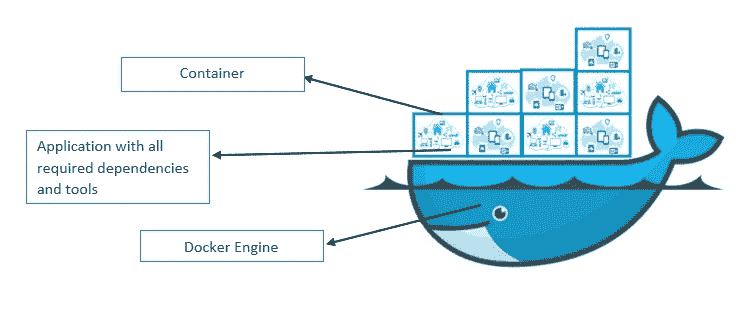
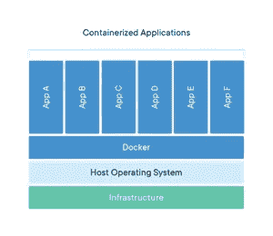
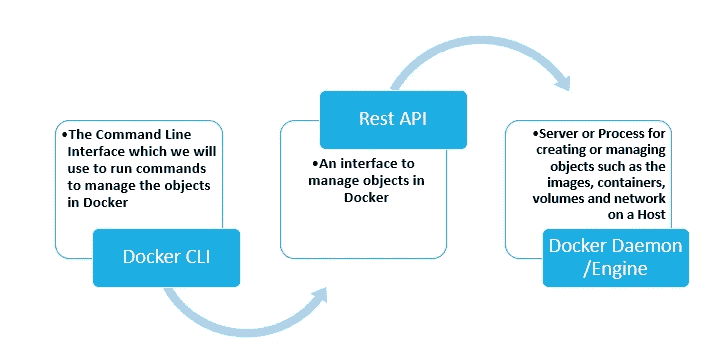
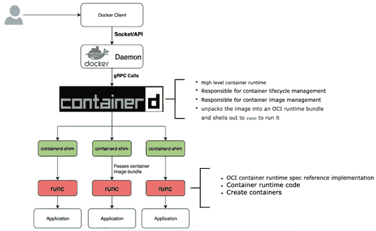
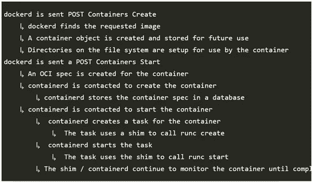

# DOCKER——向创新世界运送集装箱！！

> 原文：<https://pub.towardsai.net/docker-shipping-containers-to-the-innovative-world-6fd11a255e51?source=collection_archive---------0----------------------->

## [技术](https://towardsai.net/p/category/technology)

## 操作系统级虚拟化和可移植性

图片[来源](https://shantunparmar.in/what-is-a-docker-container-the-benefits-of-a-docker-container/)

大局！

云中“创新的兴起”改变了过去地面上的工作方式。

用云实现 DevOps 这一改变游戏规则的想法也指出了一系列问题，如应用程序的可移植性、安全性等。

让我们从头开始……

**旧 IT 时代**

*   每台服务器只能运行一个应用程序
*   在新应用程序的情况下，购买超大的新服务器

**虚拟机**

*   引入了虚拟机(VM)
*   硬件级虚拟化[单个主机操作系统中的多个来宾操作系统]
*   虚拟机>多个应用程序可以在一台服务器上运行[每个操作系统一个应用程序]

**容器**

*   操作系统级虚拟化
*   超便携

在过去，公司浪费了大量的资金和资源来维护和设置超大型服务器，这些服务器有时只能运行其潜在容量的 5–10%。

作为这个问题的解决方案，引入了 ***“虚拟化”*** 的概念，该概念提出了将专用客户操作系统隔离到在主机操作系统上运行的应用的思想。VMs 在更大程度上解决了服务器容量浪费的问题，因为现在我们有了一种在新应用程序出现时利用服务器空闲容量的方法。不再浪费资本和产能。

嗯，在我们的世界里 ***“没有什么是完美的！”虚拟机也是如此。随着时间的推移，虚拟机的一个主要缺陷被证明是“其与专用操作系统紧密耦合的特性”，每个操作系统都会消耗一些 CPU、RAM 和存储，而剩余的未消耗容量可以有效地用于支持更多的应用程序。与此同时，虚拟机还面临着其他挑战，如高启动时间和复杂的可移植性。***

图像[来源](https://www.docker.com/sites/default/files/d8/2018-11/container-vm-whatcontainer_2.png)

在操作系统上实现可移植性和效率的进一步增强作为“*”进入游戏。*

*容器化是一种将软件[应用程序代码及其所有依赖项]打包到一个名为“ ***容器*** ”的标准单元的技术，它使应用程序能够获得急需的可移植性，以便在这个不断发展的云时代发挥作用。*

*单个主机上的所有容器共享单个操作系统，该操作系统释放系统资源，如 CPU、RAM 和存储。仅使用所需的资源运行使得容器可以快速启动。它们也很容易携带。*

**

*图像[来源](https://www.docker.com/sites/default/files/d8/styles/large/public/2018-11/container-what-is-container.png?itok=vle7kjDj)*

*Linux 容器*

*现代容器的根源是在 Linux 世界。为了实现容器化，Linux 使用了内核名称空间、cgroups 和联合文件系统等概念。名称空间是 Linux 内核的一个特性，它限制一组进程的可见性[隔离],而 cgroups(也称为控制组)负责限制和测量系统上正在运行的一组进程的总资源。例如，如果 app1 需要来自 OS 的 20%的资源，则 cgroup 将为要为 app1 创建的容器测量和限制这些资源。*

*终于！码头工人来了…*

*Docker 是一个平台，它使我们能够创建、打包和运行松散绑定容器的应用程序。*

**

*图片[来源](https://shantunparmar.in/what-is-a-docker-container-the-benefits-of-a-docker-container/)*

*“标准冲突”的解决方案…*

*伴随着每一个革命性的想法，关于标准和创新的无止境的热烈讨论不应该被忽视。为了让 docker 和它的竞争对手在图像和容器运行时格式标准上保持一致，一个轻量级的敏捷委员会成立了，来管理容器标准***【OCI——开放容器倡议】*** 。"*

* [## 用 Python 实现 RNN 和 LSTM 的比特币价格预测

### 使用深度学习预测比特币价格

pub.towardsai.net](/bitcoin-price-prediction-with-rnn-and-lstm-in-python-f912d57c483e) 

**OCI 发布了两个规范**

*   图像规格
*   运行时规范

说到技术问题！！码头建筑

Docker 帮助我们创建容器形式的隔离环境，我们可以在其中运行我们的应用程序，而不会受到共享相同主机操作系统的其他硬件和软件实体的任何干扰。

Docker 引擎的主要组件是 Docker CLI(我们机器上的 Docker)，Rest API(接口)，Docker 守护进程。

Docker 的幕后！

图像[来源](https://miro.medium.com/max/1050/1*c3AiZFHuib7FUGyINzkEag.png)

参考最近的 docker 架构，docker 采用了五个*元素【姑且称之为勇士。毕竟，他们为我们做了这么多工作]* 在一个结构化的层次结构中工作，以实现 docker 提供的功能。

五名码头战士是…

*   码头客户
*   Docker 守护进程
*   集装箱 d
*   集装箱垫片
*   runc

勇士们接受考验！！

我们首先根据我们的应用程序及其特定需求编写一个 ***Dockerfile*** ，就像一个创建完整应用程序映像的菜谱。

一个命令将 ***Dockerfile*** 转换为 ***图像****不可变实体，根据 Dockerfile 指令*分成不同的层，这些图像存储在 ***docker hub*** (默认)。

当我们执行一个命令时，比如说，使用 ***Docker CLI*** 按图像名称创建一个容器。它将该命令转换成一个***restful API***，该 API 进一步与 ***Docker 守护进程*** 通信。

***守护进程*** 获取映像名称并检查映像在本地系统上的可用性。如果映像不在本地系统中，它会从 ***注册表*** (默认为 Docker Hub 或任何提到的私有注册表)下载映像。现在，准备好映像后，它使用 gRPC 调用对 ***containerd*** 进行调用。

***containerd*** 在这里充当管理程序，它将下载的映像转换成 OCI 兼容包。然后，该捆被传递到 ***容器-垫片*** 。

***container d-shim***激活 ***runc*** ，它通过与内核上的名称空间和 cgroups 进行交互来创建容器，并通过让***container d-shim***管理一个正在运行的容器来退出容器，直到它停止。

图像[来源](https://nanikgolang.netlify.app/post/containers/)

因此，要让容器在后端运行，需要做这么多工作。

现在，请允许我用我们最喜欢的答案来结束这个显而易见的问题 Docker 中的容器是什么？

***“容器是应用图像的运行实例”***

我希望你喜欢这篇文章。通过我的 [LinkedIn](https://www.linkedin.com/in/data-scientist-95040a1ab/) 和 [twitter](https://twitter.com/amitprius) 联系我。

# 推荐文章

[1。NLP —零到英雄与 Python](https://medium.com/towards-artificial-intelligence/nlp-zero-to-hero-with-python-2df6fcebff6e?sk=2231d868766e96b13d1e9d7db6064df1)
2。 [Python 数据结构数据类型和对象](https://medium.com/towards-artificial-intelligence/python-data-structures-data-types-and-objects-244d0a86c3cf?sk=42f4b462499f3fc3a160b21e2c94dba6)3 .[Python 中的异常处理概念](/exception-handling-concepts-in-python-4d5116decac3?source=friends_link&sk=a0ed49d9fdeaa67925eac34ecb55ea30)
4。[为什么 LSTM 在深度学习方面比 RNN 更有用？](/deep-learning-88e218b74a14?source=friends_link&sk=540bf9088d31859d50dbddab7524ba35)
5。[神经网络:递归神经网络的兴起](/neural-networks-the-rise-of-recurrent-neural-networks-df740252da88?source=friends_link&sk=6844935e3de14e478ce00f0b22e419eb)
6。[用 Python](https://medium.com/towards-artificial-intelligence/fully-explained-linear-regression-with-python-fe2b313f32f3?source=friends_link&sk=53c91a2a51347ec2d93f8222c0e06402)
7 全面讲解了线性回归。[用 Python](https://medium.com/towards-artificial-intelligence/fully-explained-logistic-regression-with-python-f4a16413ddcd?source=friends_link&sk=528181f15a44e48ea38fdd9579241a78)
充分解释了 Logistic 回归 8。[concat()、merge()和 join()与 Python](/differences-between-concat-merge-and-join-with-python-1a6541abc08d?source=friends_link&sk=3b37b694fb90db16275059ea752fc16a)
的区别 9。[与 Python 的数据角力—第一部分](/data-wrangling-with-python-part-1-969e3cc81d69?source=friends_link&sk=9c3649cf20f31a5c9ead51c50c89ba0b)
10。[机器学习中的混淆矩阵](https://medium.com/analytics-vidhya/confusion-matrix-in-machine-learning-91b6e2b3f9af?source=friends_link&sk=11c6531da0bab7b504d518d02746d4cc)*