# 人工智能伦理:识别你的种族和性别

> 原文：<https://pub.towardsai.net/does-a-machine-know-your-gender-based-on-your-tweets-43b14740fd54?source=collection_archive---------2----------------------->

## [人工智能伦理学](https://towardsai.net/p/category/ethics)，[自然语言处理](https://towardsai.net/p/category/nlp)

## 探索自然语言处理(NLP)和机器学习

# AI 可以根据一条推文确定你的性别吗？

为什么这是一个重要的问题？最终，这是回答伦理问题的垫脚石:**我们应该教人工智能来检测你的种族吗？这是一个类似的问题:如果我们有完全的判断力，我们会教我们的孩子识别某人的种族吗？**


图片来自 unsplash.com/@heyerlein

作为这些工具的创造者和使用者，我们有责任以类似于我们强制执行安全带和速度限制的方式来监管人工智能。

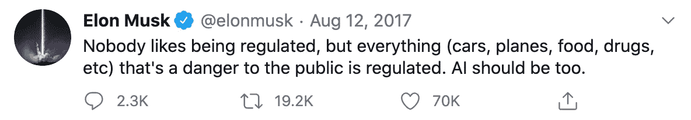

埃隆马斯克谈人工智能监管。

在通往人工智能伦理的道路上，我们可以首先探索**人工智能简单地根据文本**预测你的性别的能力。我们不会使用语音或面部识别，因为这太容易了。

为了增加经济价值，对性别进行分类的商业案例有哪些？

*   更好的客户细分:公司可以通过正确识别客户和提供更个性化的营销来降低和优化广告成本。
*   更好的电子商务体验:在像时尚这样的行业，识别正确的性别可以改善客户体验，允许零售商根据您的需求定制建议，并可以增加销售额。
*   更好的推荐引擎:一些算法是基于客户的相似性，将性别作为一个关键变量。它可以帮助你找到兴趣小组(即妈妈或爸爸)，性别特定的话题(即怀孕)，或电影，音乐或书籍中潜在的娱乐偏好。
*   商业道德:公司越来越需要调整和应对社会问题。新一代的品牌认知可能会导致客户的显著增长或流失，例如，社交媒体公司和一个人使用该产品的“信任感”。

但是，我们真的可以只根据文本来检测性别吗？让我们用自然语言处理和机器学习来探索这一点。以下是 6 条公众人物的推特语录。


图片来自 unsplash.com/@mr_fresh

**你能比机器更好地猜出性别吗？**

1.  “但是即使你害怕，你也必须做你梦想做的事情。”(男的还是女的？)
2.  *“我最大的宝贝今天 11 岁了！我为她成为的善良、艺术、好奇、敏感、聪明、有同情心的人感到骄傲。时间过得真快。在我们最喜欢的地方吃家庭晚餐”(男的还是女的？)*
3.  毫无疑问，我们现在的处境可能很糟糕，但照片中的年轻人很快就会掌权，他们想要什么非常清楚(男的还是女的？)
4.  “今天是世界卫生日，我们深深地感谢我们所有的医疗专业人员。他们仍然每天冒着极大的风险为我们付出一切，我们对他们的勇敢和服务感激不尽。”(男的还是女的？)
5.  *“为什么是现在？需求日益迫切，想在有生之年看到影响。我希望这能激励其他人做类似的事情。生命太短暂了，所以让我们今天就尽我们所能去帮助现在的人们。”(男的还是女的？)*
6.  *“不喜欢别人假装喜欢的东西，不要觉得自己傻。”(男的还是女的？)*

# 利用 Twitter 数据构建性别预测机器学习模型

步骤:
1。获取 Twitter 数据
2。清洁数据
3。造一个模型
4。预测性别
5。讨论后续步骤

## 1.获取 Twitter 数据

```
**# Import libraries**
import json
import pprint
import tweepy as tw
import pandas as pd**# Connect to Twitter API**
path_auth = '[your file path to twitter API keys]'
auth = json.loads(open(path_auth).read())
pp = pprint.PrettyPrinter(indent=4)my_consumer_key = auth['my_consumer_key']
my_consumer_secret = auth['my_consumer_secret']
my_access_token = auth['your_access_token']
my_access_token_secret = auth['my_access_token_secret']auth = tw.OAuthHandler(my_consumer_key, my_consumer_secret)
auth.set_access_token(my_access_token, my_access_token_secret)
api = tw.API(auth)type(api)
```

上传一个想要的 Twitter 用户列表，标注他们的性别:0 =男性，1 =女性。

```
**# Upload list of desired Twitter users**
# Gender classification: 0 = male, 1 = female
users = pd.read_csv('../Data/twitter-users.csv')
users.sample(20)
```

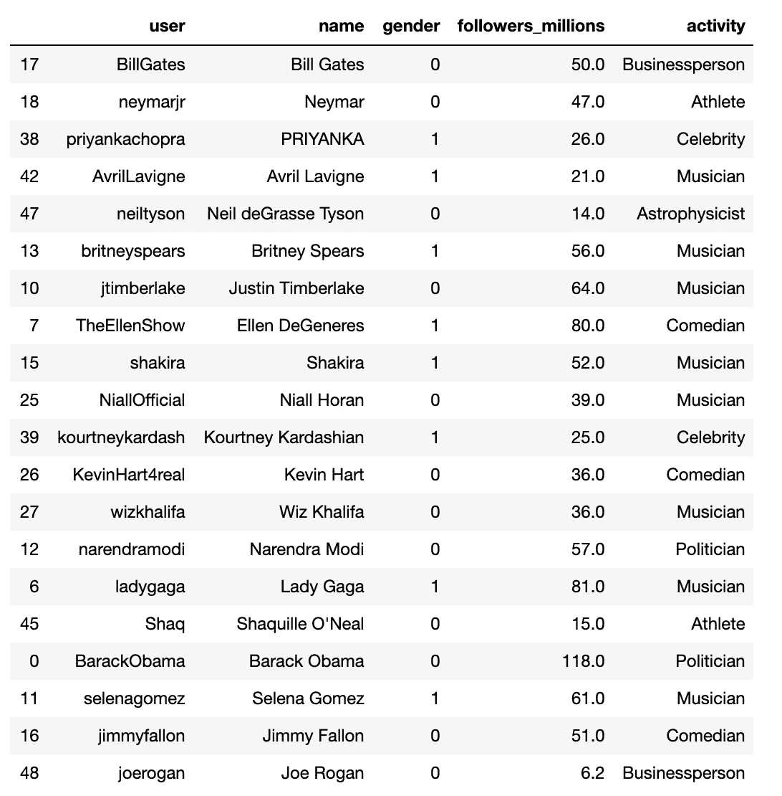

基于追随者数量、性别多样性和职业的用户选择。数据集中总共有 50 个 Twitter 用户。

使用 Twitter API 从用户那里获取 Tweets 并创建一个 DataFrame。

```
**# Get collection of tweets and store into a new dataframe**
list = []for index, row in users.iterrows():
    tweets = api.user_timeline(screen_name=row['user'], count=200, include_rts=False)
    users_text = [[tweet.user.screen_name, tweet.text, row['gender']] for tweet in tweets]
    tweet_text = pd.DataFrame(data=users_text, 
                        columns=["user", "text", "gender"])
    list.append(tweet_text)**# Merge the list  **  
tweets = pd.concat(list)
tweets
```

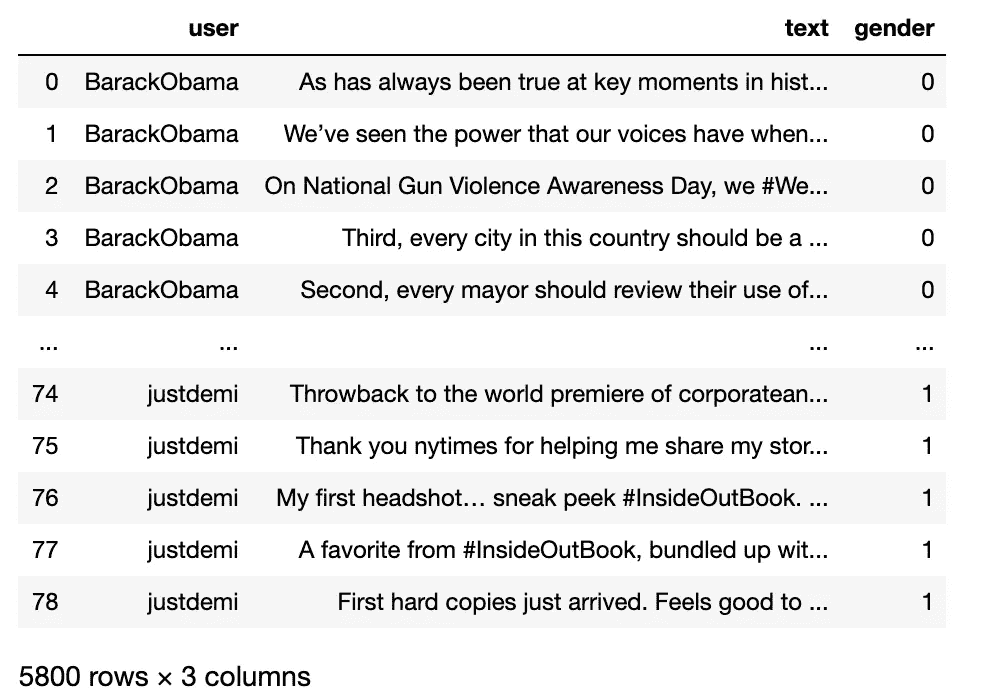

请注意，我们现在有了每条推文的性别，可以用来训练模型。

```
**# Check percentages for each gender**
# 0 = male, 1 = female
tweets.gender.value_counts(normalize=True, sort=False)
```

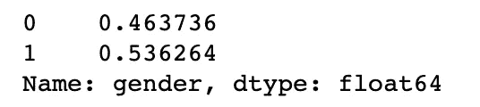

数据是围绕着一个均匀的性别分布，这可能会改变，因为我们清理文本。

## 2.干净的数据

删除文本中任何对示范教学不必要的内容。

```
**# Import libraries**
import numpy as np
import re
import spacy
from matplotlib import pyplot as plt**# Clean text**
def clean_text(text):
    # Reduce multiple spaces and newlines to only one
    text = re.sub(r'(\s\s+|\n\n+)', r'\1', text)
    # Remove double quotes
    text = re.sub(r'"', '', text)return texttweets['clean_text'] = tweets['text'].apply(clean_text)**# Remove hyperlinks**
tweets['clean_text'] = tweets['clean_text'].str.replace('http\S+|[www.\S+'](http://www.\S+'), '', case=False)**# Remove patterns**
def remove_pattern(text,pattern):

    # re.findall() finds the pattern i.e [@user](http://twitter.com/user) and puts it in a list for further task
    r = re.findall(pattern,text)

    # re.sub() removes [@user](http://twitter.com/user) from the sentences in the dataset
    for i in r:
        text = re.sub(i,"",text)

    return texttweets['clean_text'] = np.vectorize(remove_pattern)(tweets['clean_text'], "@[\w]*") # Removes all @
tweets['clean_text'] = np.vectorize(remove_pattern)(tweets['clean_text'], "&amp;") # Removes all &
tweets['clean_text'] = np.vectorize(remove_pattern)(tweets['clean_text'], "#[\w]*") # Removes all #**# Remove stop words and apply lemmatization**
nlp = spacy.load('en')def convert_text(text):
    sent = nlp(text)
    ents = {x.text: x for x in sent.ents}
    tokens = []
    for w in sent:
        if w.is_stop or w.is_punct:
            continue
        if w.text in ents:
            tokens.append(w.text)
        else:
            tokens.append(w.lemma_.lower())
    text = ' '.join(tokens)return texttweets['clean_text'] = tweets['clean_text'].apply(convert_text)
tweets.sample(15)
```

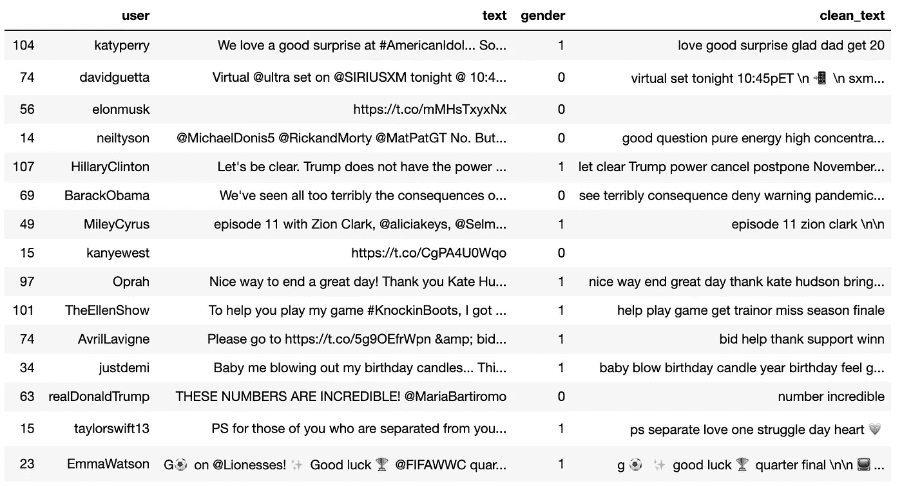

“clean_text”列显示了对原始“text”列的更改。请注意超链接、@、标签是如何被移除的，以及一些单词是如何被词条化的。

仍有一些文本需要清理。

```
**# Remove punctuation, numbers, and special characters**
tweets['clean_text'] = tweets['clean_text'].str.replace("[^a-zA-Z#]", " ")**# Remove short words less than 3**
tweets['clean_text'] = tweets['clean_text'].apply(lambda x: ' '.join([w for w in x.split() if len(w)>3]))# Count the length of characters
tweets['clean_length'] = tweets['clean_text'].apply(len)**# Remove rows where character length <= 20**
tweets = tweets[tweets.clean_length > 20]
tweets.sample(n=15)
```

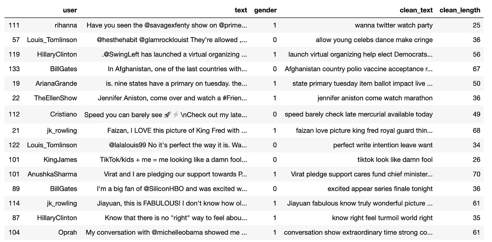

符号，文字< 3 characters, and total text length of ≤ 20 have been removed.

## 3\. Build Model

We can use Bag-of-words to build a model. There are other methods too, such as using Term Frequency–Inverse Document Frequency (TF-IDF).

```
**# Import libraries**
from sklearn.feature_extraction.text import CountVectorizer
from sklearn.model_selection import train_test_split
from sklearn.linear_model import LogisticRegression
from sklearn.metrics import f1_score**# Bag-of-words features**
bow_vectorizer = CountVectorizer(stop_words='english')**# Bag-of-words feature matrix**
bow = bow_vectorizer.fit_transform(tweets['clean_text'])
df_bow = pd.DataFrame(bow.todense(), columns=bow_vectorizer.get_feature_names())
df_bow
```

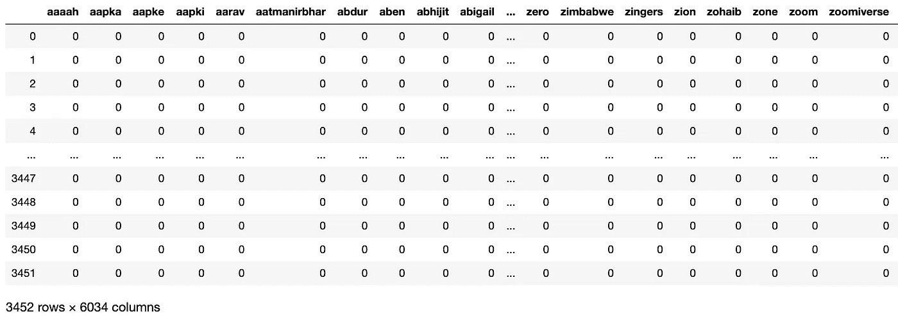

To the machine, all the words become vectorized and treated as numbers. This becomes similar to running a prediction model on any other dataset, such as predicting housing prices.

```
**# Splitting the data into training and test set**
X = df_bow
y = tweets['gender']**# Use Bag-of-words features**
X_train_bow, X_test_bow, y_train_bow, y_test_bow = train_test_split(X, y, test_size=0.20)
```

For the initial prediction, we can use Logistic Regression. There are other models too, such as Decision Tree or XGBoost.

```
**# Fitting on Logistic Regression model**
logreg = LogisticRegression()
logreg.fit(X_train_bow, y_train_bow)
prediction_bow = logreg.predict_proba(X_test_bow)**# Calculating the F1 score**
# If prediction is greater than or equal to 0.5 than 1, else 0
# Gender, 0 = male and 1 = female
prediction_int = prediction_bow[:,1]>=0.5
prediction_int = prediction_int.astype(np.int)**# Calculating F1 score**
log_bow = f1_score(y_test_bow, prediction_int)
log_bow
```

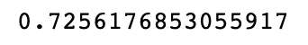

The F1 score measures the test’s accuracy. This score shows that a meaningful prediction can be made.

## 4\. Predict Gender

After training the model and achieving a workable accuracy score, it’s time to predict the gender of these 6 tweets from the beginning.

1.  *“但是即使你害怕，你也必须做你梦想做的事情。”*
2.  *“我最大的宝贝今天 11 岁了！我为她成为的善良、艺术、好奇、敏感、聪明、有同情心的人感到骄傲。时间过得真快。在我们最喜欢的地方吃家庭晚餐"*
3.  毫无疑问，我们现在的处境可能很糟糕，但照片中的年轻人很快就会掌权，他们想要什么非常清楚
4.  “今天是世界卫生日，我们深深地感谢我们所有的医疗专业人员。他们仍然每天冒着极大的风险为我们付出一切，我们对他们的勇敢和服务感激不尽。”
5.  *“为什么是现在？需求日益迫切，想在有生之年看到影响。我希望这能激励其他人做类似的事情。生命太短暂了，所以让我们今天就尽我们所能去帮助现在的人们。”*
6.  *“不喜欢别人假装喜欢的东西，不要觉得自己傻。”*

导入上面的数据，并给予它与训练数据相同的单词包处理。

```
**# Import testing set**
testset = pd.read_csv('Data/twitter-test.csv')**# Bag-of-words feature matrix**
bow = bow_vectorizer.transform(testset['text'])
df_bow_test = pd.DataFrame(bow.todense(), columns=bow_vectorizer.get_feature_names())
df_bow_test
```

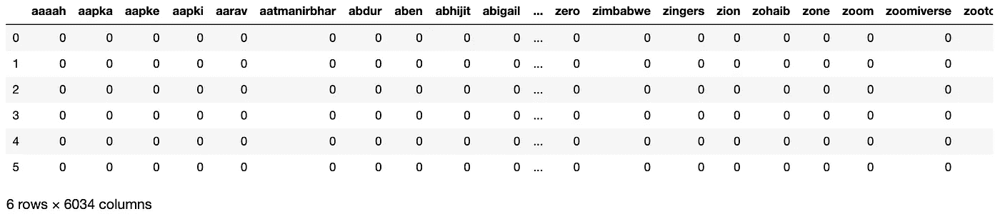

注意这个数据帧也有 6034 列，就像训练数据一样。

现在用逻辑回归来预测性别。

```
**# Predict probability**
z = df_bow_test
pred_prob = logreg.predict_proba(z)
pred_prob = pd.DataFrame(data=pred_prob, columns=['percentage_0', 'percentage_1'])**# Predict classification**
pred = logreg.predict(z)
pred = pd.DataFrame(data=pred, columns=['predicted_gender'])**# Store into the same DataFrame**
result = pd.concat([testset, pred, pred_prob], axis=1, sort=False)
result**# 0 = male, 1 = female**
```

**结果:**

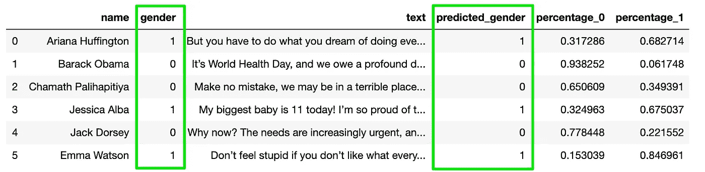

左边的“性别”列是真正的标签,“预测性别”是机器的预测。“percentage_0”和“percentage_1”是文本为 0 或 1 的概率。

**机器 100%准确预测性别。与机器相比，你做得怎么样？**

## 5.后续步骤

该模型仍可通过多种方式进行改进，以获得更高的准确性:

*   使用术语频率-逆文档频率(TF-IDF)进行特征提取。
*   将词袋和 TF-IDF 特征与不同的模型结合使用:逻辑回归、决策树、XGBoost。
*   优化超参数。
*   使用神经网络进行更好的自然语言处理。

当然，你可以用不同的词或者中性的措辞来欺骗机器。但是这有什么意义呢？如果一台机器可以仅根据文本来判断你的性别，如果我们给它更多关于你的声音、面部识别、身体特征、信用卡交易、购物购买、社交媒体行为或你的社交图的数据，会发生什么？

如果你推断出这一点，给定正确的数据，机器可以像人类一样甚至更好地检测你的年龄、社会经济地位、性别、心理健康和种族。

人工智能正处于这样一个阶段，我们今天所做的事情将对未来产生巨大的雪球效应，这可能会变得不可逆转。以流行/摇滚音乐为例，它起源于 20 世纪 50 年代，并成为一种全球现象。

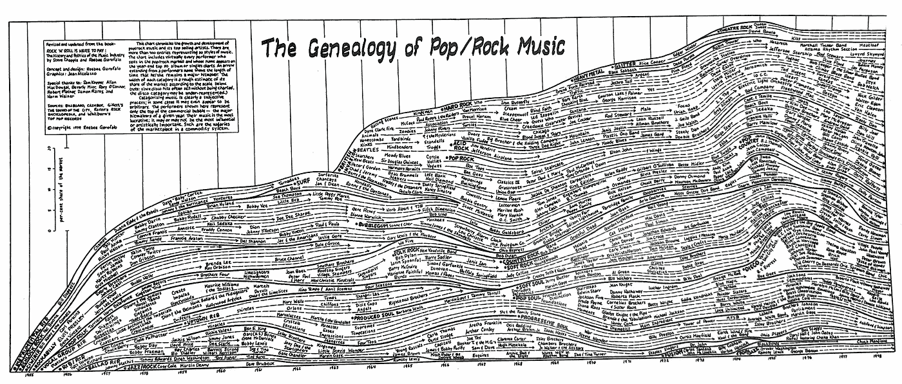

当我们缩小画面时，我们看到流行/摇滚音乐在世界各地传播了几代人。资料来源:reebee.net/rock-genealogy.

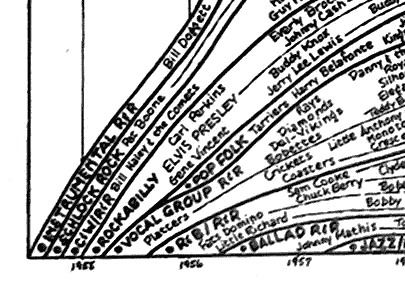

但是当我们放大时，我们看到巨大的增长确实是从像猫王这样的小种子开始的。这就是我们今天在技术和人工智能方面所处的位置。

我们可以建造、设计和使用技术，不管是好是坏。这个决定取决于我们作为它的创造者和使用者。但是，有我们应该强制执行的规则、条例或道德规范吗？例如，如果可以选择，我们应该教我们的机器检测某人的种族吗？这对人类是好是坏？如果我们做，或者不做，50 年后会发生什么，或者有没有另一种方式来思考这个问题？