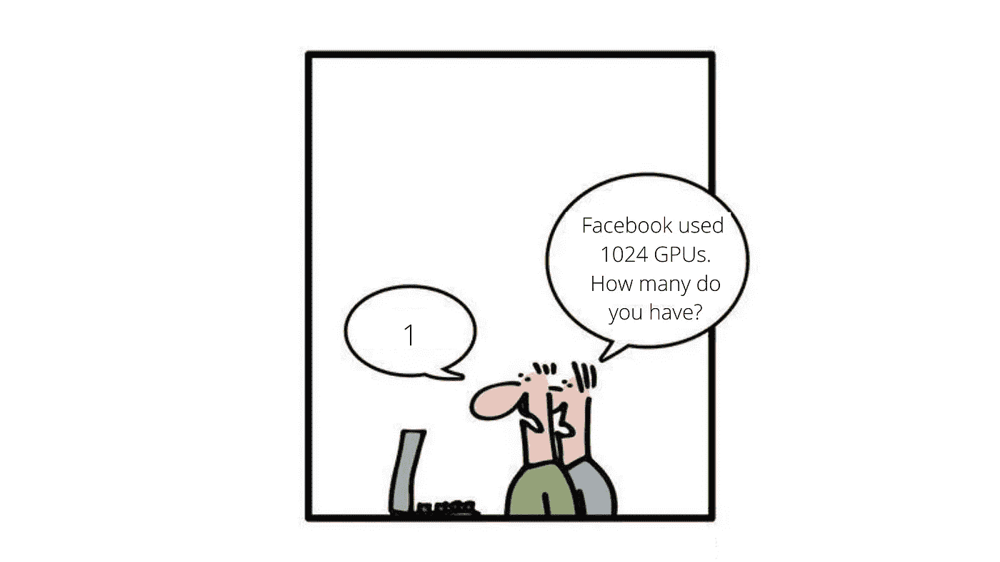
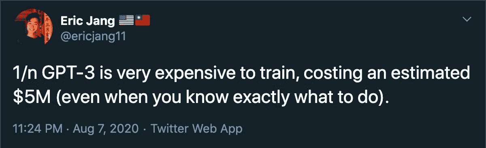
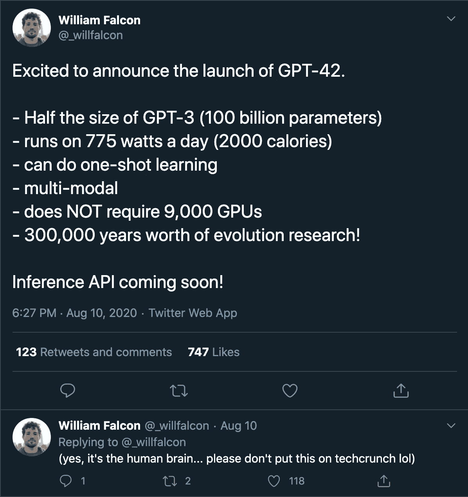

# 不要被 NLP 研究淹没

> 原文：<https://pub.towardsai.net/dont-be-overwhelmed-by-nlp-c174a8b673cb?source=collection_archive---------0----------------------->

## [自然语言处理](https://towardsai.net/p/category/nlp)

## 如何应对 NLP 中正在进行的大量研究，这些研究对你来说可能是不可行的

-由[geek-and-poke.com](http://geek-and-poke.com/)下 [CC-BY-3.0](https://creativecommons.org/licenses/by/3.0/)

# 这是怎么回事？

> NLP 是新的计算机视觉

有大量文本数据集可用；像谷歌、微软、脸书等巨头已经将他们的注意力转向自然语言处理。

使用**成千上万**超级昂贵的 TPU/GPU 的模型，使它们对大多数人来说不可行。

> **这让我焦虑！**(我们会回来的)

让我们从这些推文的角度来看问题:

**推文 1:**

**推文 2:** *(阅读后面的推文)*

# 后果？

大约在过去一年中，以下知识成为主流:

*   《变形金刚》之后是《改革家》、《龙成形家》、《GTrXL》、《林成形家》等。
*   伯特之后是 XLNet，罗伯塔，阿尔伯特，伊莱克特，巴特，T5，大鸟，和其他人。
*   模型压缩由 DistilBERT、TinyBERT、BERT-of-thesews、Huffman 编码、运动修剪、PrunBERT、MobileBERT 等扩展。
*   甚至引入了新的标记化:字节对编码(BPE)、单词片段编码(WPE)、句子片段编码(SPE)等等。

这仅仅是冰山一角。

> 所以当你试图理解和实现一个模型的时候，一堆新的更轻更快的模型已经出现了。

# 如何应对？

答案很简单:

> 你不需要知道一切，只知道什么是必要的，使用什么是可用的

# 理由

我把它们都读了一遍，意识到大多数研究都是类似概念的重复。

说到底(含糊地说):

*   重整器是变形器的散列版本，longfomer 是变形器的基于卷积的对应物
*   所有的压缩技术都试图整合信息
*   从 BERT 到 GPT3 的一切都只是一个语言模型

# 优先级->管道优先于准确性

> 在跳到其他可以使用的东西之前，学会有效地使用可用的东西

实际上，这些模型只是一个更大的管道中的一小部分。

> 你的第一直觉不应该是在训练更好的模型方面与科技巨头竞争。
> 
> 相反，你的第一直觉应该是使用可用的模型来构建一个端到端的应用程序，这个应用程序解决了一个实际问题。

现在如果你觉得模型是你应用的性能瓶颈；重新训练该模型或切换到另一个模型。

请考虑以下情况:

*   巨大的深度学习模型通常需要数千个 GPU 小时来训练。
*   当您考虑超参数调优(HP 调优)时，这增加了 10 倍。
*   惠普调试像伊莱克特模型这样高效的东西也需要一两周的时间。

# 实际场景->真正的加速

以问答系统为例。鉴于有数百万份文档，对于这项任务来说，像 ElasticSearch 这样的工具比新的问答模式(相对而言)更重要。

在生产中，你的管道的成功将(不仅)取决于你的深度学习模型有多棒，还取决于:

*   **推断时间的潜伏期**
*   **结果的可预测性和边界情况**
*   微调的容易程度
*   在相似数据集上重现模型的容易程度

Robolox 在[的博客](https://blog.roblox.com/2020/05/scaled-bert-serve-1-billion-daily-requests-cpus/)中漂亮地提到，像 DistilBERT 这样的东西可以扩展到处理十亿个查询。

> 而新模型可以将推理时间减少 **2x-5x** 。
> 
> 像[量化](https://www.mathworks.com/company/newsletters/articles/what-is-int8-quantization-and-why-is-it-popular-for-deep-neural-networks.html)，剪枝和使用 [Onnx](https://medium.com/microsoftazure/accelerating-model-training-with-the-onnx-runtime-519d75a97166#:~:text=ONNX%20Runtime%20is%20a%20performance,in%20high%2Dscale%20production%20scenarios.) 这样的技术可以减少推理时间 **10x-40x** ！

# 亲身经历

我正在开发一个事件提取管道，它使用了:

*   4 种不同的基于变压器的模型
*   1 个基于 RNN 的模型

酪整个管道的核心是:

*   WordNet
*   框架网
*   Word2Vec
*   正则表达式

还有。我的团队主要关注的是:

*   **从 PPT、图像&表格中提取文本**
*   **清洗&预处理文本**
*   **结果可视化**
*   弹性搜索的优化
*   Neo4J 的信息格式

# 结论

拥有一个性能一般的管道比拥有一个只有几个优秀模块的非功能性管道更重要。

克里斯托弗·曼宁(Christopher Manning)和安德鲁·吴(Andrew NG)都不知道这一切。他们只知道需要什么，什么时候需要；很好。

所以，对自己要有现实的期望。

> 谢谢大家！