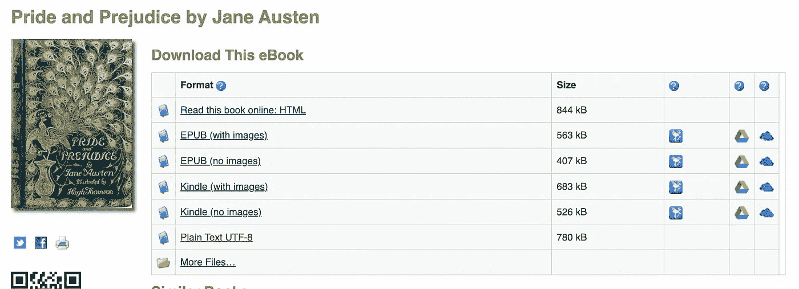
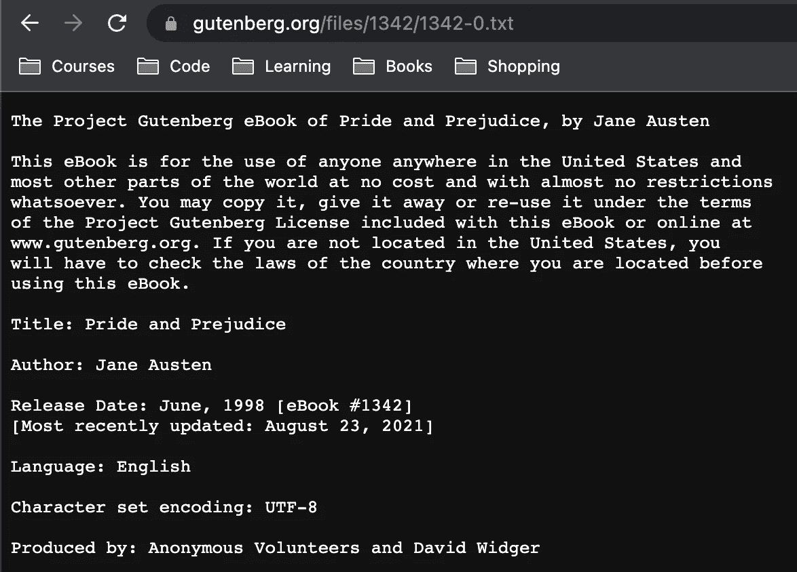

# 使用 Python 在公共领域下载图书

> 原文：<https://pub.towardsai.net/download-books-in-the-public-domain-w-python-728d198f421d?source=collection_archive---------3----------------------->

## 古腾堡计划指南


图片由 [Florencia Viadana](https://unsplash.com/@florenciaviadana) 从 [Unsplash](https://unsplash.com/photos/1J8k0qqUfYY) 拍摄

这篇文章将提供一个关于从古腾堡项目收集开源书籍数据的全面指南。这些图书文件对任何想在 NLP 中做一个很酷的项目的人都很有用，比如图书摘要、翻译、分类、推荐等。下面是本文的结构:

> ***免责声明:*** *本文仅出于教育目的。我们不鼓励任何人抓取网站，尤其是那些可能有条款和条件反对此类行为的网站。*

## 目录

*   什么是古腾堡计划？
*   解决方案架构
    -需求
*   履行
*   结束语
*   资源

# 什么是古腾堡计划？

古登堡计划是一个集中的开源数据库，致力于提供公共领域的免费书籍。

> 术语“公共领域”是指不受知识产权法(如版权、商标或专利法)保护的**创造性材料**。这些作品属于公众，而不是个人作者或艺术家。任何人都可以未经许可使用公共领域的作品，但是没有人可以拥有它。
> -【1】[https://fair use . Stanford . edu/overview/public-domain/welcome/](https://fairuse.stanford.edu/overview/public-domain/welcome/)

他们是一个旨在继续电子书创作和发行的基金会。请注意，我将向您展示如何从古腾堡知识库中一次抓取一本书，而不是整个知识库。出于多种原因，我将避免这样做:

1.  你会被屏蔽 IP。
2.  他们的书库由数千本书组成，搜集所有这些需要你的电脑有大量的内存。
3.  本文的目的是让你开始接触一些真实世界的文本数据，比如一本书，帮助用户熟悉 web 抓取，以及一个很酷的数据集来做一些 NLP。

如果你仍然对获取所有古腾堡书籍数据感兴趣，有一种比网络搜集更简单的方法， [KiwiX](https://wiki.kiwix.org/wiki/Content) 免费提供这种资源，以及许多其他数据源，如维基百科，如果你有内存，可以很容易地下载。


参考 [Kiwix](https://wiki.kiwix.org/wiki/Content) 免费下载古登堡计划的所有书籍[3]。图片由作者提供。

# 解决方案架构

这里的过程相当简单，我们将向您想要抓取的 URL 发出请求，通过 BeatifulSoup 获取与请求相关联的 soup 对象，然后将文本内容保存在一个 results 文件夹中。

## 要求

```
Python=3.8.8
bs4>=4.9.3
```

如果你没有安装 bs4 包，这里的[是通过命令行安装的库文档。](https://pypi.org/project/bs4/)

# 履行

上面定义的函数将向提供的 URL 发出请求，读取和解码内容，并创建与之相关的 soup 对象。如果结果目录不存在，mkdir 函数将创建一个结果目录。要获得与您感兴趣的图书相关的 URL，您可以在古腾堡计划中搜索图书的名称。对于本文，我们将获取与简·奥斯汀的[傲慢与偏见相关的内容。](https://www.gutenberg.org/ebooks/1342)


在古登堡计划主页上搜索你感兴趣的书。图片由作者提供。

搜索并选择图书后，选择纯文本 UTF-8 选项，如下所示。



选择与图书关联的纯文本 UTF-8 选项。图片由作者提供。

与下面的网页相关联的 URL 是我们将要点击的那个。



我们要抓取内容的 URL。图片由作者提供。

上面定义的函数将在结果目录中创建一个文本文件，并写入与 soup 对象相关的文本内容。

# 结束语

本文旨在提供一个脚本，用于从古腾堡项目中抓取公共领域中的图书数据。同样，如果你试图抓取他们的整个数据库，你会被 IP 封锁，你可以通过 [Kiwix](https://wiki.kiwix.org/wiki/Content) 公开下载他们的数据。

如果您想在一个 [Jupyter](https://github.com/vatsal220/medium_articles/blob/main/scrape_gutenberg/scrape.ipynb) 笔记本/脚本中跟随本教程，您可以在这里查看与本文[相关的 GitHub 资源库。](https://github.com/vatsal220/medium_articles/tree/main/scrape_gutenberg)

如果你想转型进入数据行业，并希望得到经验丰富的导师的指导和指引，那么你可能想看看最敏锐的头脑。Sharpest Minds 是一个导师平台，导师(他们是经验丰富的实践数据科学家、机器学习工程师、研究科学家、首席技术官等。)将有助于你的发展和学习在数据领域找到一份工作。点击查看[。](https://www.sharpestminds.com/?r=vatsal-patal)

# 资源

*   [1][https://fair use . Stanford . edu/overview/public-domain/welcome/](https://fairuse.stanford.edu/overview/public-domain/welcome/)
*   [2]https://www.gutenberg.org/
*   [3]https://wiki.kiwix.org/wiki/Content

如果你喜欢这篇文章，下面是我写的其他文章，你可能也会感兴趣:

[](https://towardsdatascience.com/recommendation-systems-explained-a42fc60591ed) [## 推荐系统解释

### 用 Python 解释和实现基于内容的协同过滤和混合推荐系统

towardsdatascience.com](https://towardsdatascience.com/recommendation-systems-explained-a42fc60591ed) [](https://towardsdatascience.com/comprehensive-guide-to-github-for-data-scientist-d3f71bd320da) [## 面向数据科学家的 GitHub 综合指南

### 通过 UI 和命令行为数据科学家提供的 GitHub 教程

towardsdatascience.com](https://towardsdatascience.com/comprehensive-guide-to-github-for-data-scientist-d3f71bd320da) [](https://towardsdatascience.com/active-learning-in-machine-learning-explained-777c42bd52fa) [## 机器学习中的主动学习解释

### Python 中主动学习管道的直觉和实现

towardsdatascience.com](https://towardsdatascience.com/active-learning-in-machine-learning-explained-777c42bd52fa) [](https://towardsdatascience.com/text-summarization-in-python-with-jaro-winkler-and-pagerank-72d693da94e8) [## 用 Jaro-Winkler 和 PageRank 实现 Python 中的文本摘要

### 用 Jaro-Winkler 和 PageRank 构建一个文本摘要器

towardsdatascience.com](https://towardsdatascience.com/text-summarization-in-python-with-jaro-winkler-and-pagerank-72d693da94e8) [](https://towardsdatascience.com/link-prediction-recommendation-engines-with-node2vec-c97c429351a8) [## 使用 Node2Vec 的链接预测推荐引擎

### 在 Python 中使用节点嵌入进行链接预测

towardsdatascience.com](https://towardsdatascience.com/link-prediction-recommendation-engines-with-node2vec-c97c429351a8)