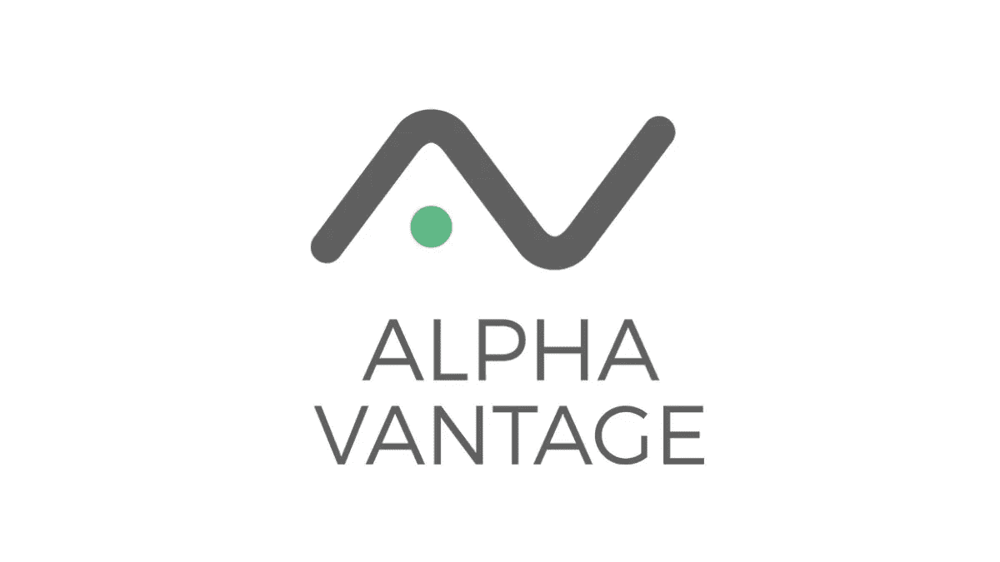
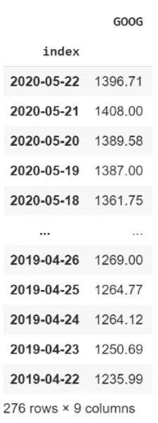

# 用 Alpha Vantage 下载历史股票价格

> 原文：<https://pub.towardsai.net/downloading-historical-stock-prices-with-alpha-vantage-688edad46a6d?source=collection_archive---------3----------------------->

## 金融

## 版本 2.0，对我之前的代码做了一些改变。

Alpha Vantage 是一个可能的在线工具，你可以使用代码下载股票历史数据。这个网站为你提供了一个个人 API 密匙，你可以用它来下载有限的数据量(每天最多 500 次免费请求，还不错)。



阿尔法优势

请随意查看[我的前一篇文章](https://medium.com/towards-artificial-intelligence/stock-downloader-api-a9e95c913363)，其中包含我的代码的不推荐版本，以及对我选择 alpha vantage 而不是许多其他 API 金融提供商的原因的深入分析。

## 为什么用代码下载股票

如果你必须下载一只股票，你可以很容易地使用雅虎财经网站。然而，当您每天运行分析时，您需要已经导入到代码中的大量新数据，希望避免任何手动干预。这就是为什么在您的环境中直接下载股票的几行代码会变得很方便。

## 导入库

```
!pip install alpha_vantagefrom alpha_vantage.timeseries import TimeSeries
import pandas as pd
```

## 使用您的 API 密钥

要获得免费的 API 密匙，你只需在这个网站上[申请即可。不像许多其他网站，它只会问你的电子邮件，而不是完全注册。不幸的是，目前如果不通过 API，你无法下载任何历史股票数据，原因很简单，对于网站来说，大规模的程序是昂贵的。雅虎财经等工具已弃用。](https://www.alphavantage.co/)

```
#credentials
def download_stock(tag):
  key = 'your key'
  ts = TimeSeries(key)
  stock, meta = ts.get_daily(symbol=tag, outputsize='full')
  return stock, meta
```

## 创建函数

我现在将创建一系列函数。这些函数将创建一个空数据框，我将在其中下载我的股票数据。当我开始下载股票时，我会打电话给它。

```
import timedef get_index(tag):
  df_, _ = download_stock(tag)
  df_ = pd.DataFrame(df_)
  df_ = df_.transpose()
  df_ = df_.loc['2020-09-10':'2019-09-10']
  df_ = df_['1\. open']
  df_ = pd.DataFrame(df_)#extract index and return it as series
  df_ = df_.reset_index()
  return df_['index']#moduli di download
def stock(tag, df_to_add):
  #passimo come df_to_add il database di stock già creato
  try:
    df_, _ = download_stock(tag)
    df_ = pd.DataFrame(df_)
    df_ = df_.transpose()
    df_ = df_.loc['2020-09-10':'2019-09-10']
    df_ = df_['1\. open']
    df_ = pd.DataFrame(df_)
    df_.columns = [tag]
    df_ = df_[tag].values.astype(float)
    df_ = pd.concat([df_to_add, pd.DataFrame(df_)], axis=1)
    return df_, 'Successful'
  except:
    return df_to_add, 'Error'
```

# 下载算法

我终于可以开始下载数据了。为了方便起见，您可以在 **tag_list** 中添加您想要的股票列表，只需确保将列表的第一个元素保持为**‘Skip’**，因为第一次调用将简单地创建空数据集的结构，而不填充任何信息。

```
##Stock Downloader#se lo volgiamo in più tranches, invece di utilizzare timers lo spezziamo
tag_list = ['Skip', 'GOOG']#questo scarica il giusto index, OVVERO IL TIMESTAMP
index = get_index(tag_list[1])
index = pd.DataFrame(index) #conta come 1 richiesta
index#csv of remaining stocks
empty = pd.DataFrame()
df, _ = stock(tag_list[0], empty) #solo per la prima si utilizza empty
for k in range(1, len(tag_list)):

  #print stock you are ATTEMPTING to download now
  print('Iteration:', k, 'Trying to download:', tag_list[k])

  #diciamo di aggiungere al database creato il nuovo download
  #se ci sono problemi da None e non viene aggiunto nulla
  df, result = stock(tag_list[k], df)
  print('Iteration:', k, result)
```

## 暂停算法

在每次请求之间暂停算法是非常重要的。您的代码可以运行得非常快，并且大多数服务器，即使您使用自己的 API 密钥，也会确保限制您的请求，甚至在您发出太多请求时阻止您。这就是为什么我将使用**时间库**对每个请求进行 4 秒钟的快速暂停。

```
#every 4 stock pause 70 seconds
  if k%4 == 0:
    time.sleep(70)#renaming the columns with tag_list
df.columns = tag_list[1:]
dfdf1 = df.copy()#reattach index
total = pd.concat([index, df1], axis=1)
total = total.set_index('index')
totaltotal.to_csv('GOOG.csv')
```



数据帧的快照

我只使用了 ticker GOOG，但是你可以在 **tag_list** 中使用任意多的 ticker。