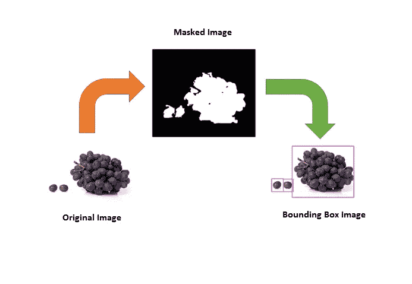
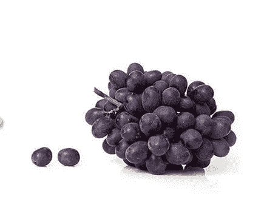
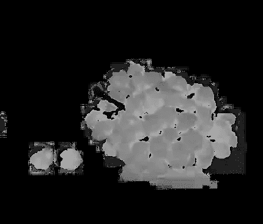
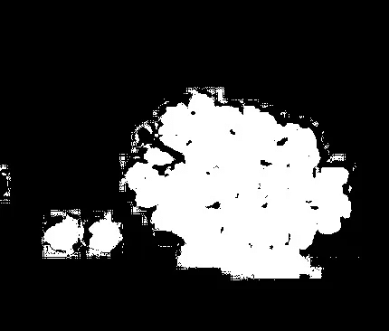
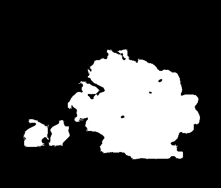
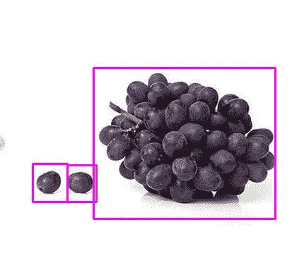

# 图像处理中的包围盒绘制方法

> 原文：<https://pub.towardsai.net/drawing-bounding-box-method-in-image-processing-ec7487393cfa?source=collection_archive---------0----------------------->

## [计算机视觉](https://towardsai.net/p/category/computer-vision)

## 用 OpenCV 实现图像中物体的标注



边界框对对象进行了注释。作者的照片

## 介绍

在本文中，我们将讨论图像处理中的注释。注释的概念用于突出显示图像中的对象和对象总数。

如下所示，在以下步骤中解释了注释对象的过程:

## 步骤 1:阅读和协调 RGB

这一步包括在处理计算机视觉应用的 OpenCV 库的帮助下读取原始图像。

导入必要的库

```
import numpy as np
import imutils
import cv2
```

***numpy*** 用于对图像像素进行数值运算。“ ***imutils*** ”用于帮助 OpenCV 的图像预处理功能。 ***cv2*** 是一个计算机视觉库。



原图。作者的照片

从工作目录中读取图像文件。

```
image = cv2.imread('bg5.png') #reads the image
```

OpenCV 的要点是它读取 BGR 格式的图像，我们需要将其转换成 RGB 格式。

```
rgb_image = cv2.cvtColor(image, cv2.COLOR_BGR2RGB)
```

## 步骤 2:图像处理中的颜色空间和二值阈值

颜色空间用于获得二值化阈值的良好灰度图像。这里，我们使用 HSV 颜色空间。

```
hsv_image = cv2.cvtColor(rgb_image, cv2.COLOR_RGB2HSV)
h, s, v = cv2.split(hsv_image)#it is used to save the h component image
cv2.imwrite('H.jpg',h)
```



H 分量图像的灰度图像。作者的照片

现在，我们将做二进制阈值

```
ret, th1 = cv2.threshold(h,180,255, cv2.THRESH_BINARY+cv2.THRESH_OTSU)
kernel = np.ones((1,1), dtype = "uint8")/9
bilateral = cv2.bilateralFilter(th1, 9 , 75, 75)
erosion = cv2.erode(bilateral, kernel, iterations = 1)cv2.imwrite('mask_erosion.jpg',erosion)
```



掩码或二进制图像。作者的照片

[](/types-of-binary-image-processing-threshold-in-opencv-with-python-2f9b7f8795f9) [## 用 Python 实现 OpenCV 中二值图像处理阈值的类型

### 图像分割方法分析

pub.towardsai.net](/types-of-binary-image-processing-threshold-in-opencv-with-python-2f9b7f8795f9) 

## 第三步:找到噪声，并将其从图像中移除

在上面的图像中，我们可以看到有许多噪声以小白区域的形式出现在图像中，我们需要从图像中移除这些小白区域以获得完美的二值图像。

```
#finding the area of all connected white pixels in the image
pixel_components, output, stats, centroids =
        cv2.connectedComponentsWithStats(erosion, connectivity=8)
```

当我们在图像中使用连通分量方法时，它将图像中的白色和黑色对象分开。我们只是希望白色像素对象被删除，并忽略黑色像素。

```
area = stats[1:, -1]; pixel_components = pixel_components - 1
```

现在我们将从图像中移除小的白噪声。

```
min_size = 1000#your answer image
img2 = np.zeros((output.shape))#Removing the small white pixel area below the minimum size
for i in range(0, nb_components):
    if area[i] >= min_size:
        img2[output == i + 1] = 255
        cv2.imwrite('img2.jpg',img2)
```



很好的二值图像。作者的照片

## 第四步:找出物体轮廓的面积

现在，我们得到了好的二进制图像。是时候找出图像中白色像素的轮廓/面积了，因为我们知道白色像素是我们的目标。

```
img3 = img2.astype(np.uint8)       
# find contours in the thresholded image
cnts = cv2.findContours(img3.copy(), cv2.RETR_EXTERNAL,
                        cv2.CHAIN_APPROX_SIMPLE)cnts = imutils.grab_contours(cnts)
print("[INFO] {} unique contours found".format(len(cnts)))
```

[](/data-preprocessing-concepts-with-python-b93c63f14bb6) [## Python 中的数据预处理概念

### 一种为机器学习估值器准备数据的稳健方法

pub.towardsai.net](/data-preprocessing-concepts-with-python-b93c63f14bb6) [](/understand-time-series-components-with-python-4bc3e2ba1189) [## 用 Python 理解时间序列组件

### 机器学习中预测模型的基本概念及实例

pub.towardsai.net](/understand-time-series-components-with-python-4bc3e2ba1189) 

## 步骤 5:注释对象

在这一步中，我们将用边界框标注对象。

```
# For making box around the Grape Bunch  
for j in cnts:
    rect = cv2.boundingRect(j)
    x,y,w,h = rect
    cv2.rectangle(image, (x,y),(x+w,y+h),(255,0,255),2) cv2.imwrite('result.jpg',image)
```



输出图像。作者的照片

## 结论:

图像中物体的标注在农业、机器人视觉、环境等领域有着非常有用的应用。

我希望你喜欢这篇文章。通过我的 [LinkedIn](https://www.linkedin.com/in/data-scientist-95040a1ab/) 和 [twitter](https://twitter.com/amitprius) 联系我。

# 推荐文章

[1。NLP —零到英雄用 Python](https://medium.com/towards-artificial-intelligence/nlp-zero-to-hero-with-python-2df6fcebff6e?sk=2231d868766e96b13d1e9d7db6064df1)
2。 [Python 数据结构数据类型和对象](https://medium.com/towards-artificial-intelligence/python-data-structures-data-types-and-objects-244d0a86c3cf?sk=42f4b462499f3fc3a160b21e2c94dba6)
3。[Python 中的异常处理概念](/exception-handling-concepts-in-python-4d5116decac3?source=friends_link&sk=a0ed49d9fdeaa67925eac34ecb55ea30)
4。[用 Python 进行主成分分析降维](/principal-component-analysis-in-dimensionality-reduction-with-python-1a613006d531?source=friends_link&sk=3ed0671fdc04ba395dd36478bcea8a55)
5。[用 Python 全面讲解 K-means 聚类](https://medium.com/towards-artificial-intelligence/fully-explained-k-means-clustering-with-python-e7caa573176a?source=friends_link&sk=9c5c613ceb10f2d203712634f3b6fb28)
6。[用 Python 充分解释了线性回归](https://medium.com/towards-artificial-intelligence/fully-explained-linear-regression-with-python-fe2b313f32f3?source=friends_link&sk=53c91a2a51347ec2d93f8222c0e06402)
7。[用 Python](https://medium.com/towards-artificial-intelligence/fully-explained-logistic-regression-with-python-f4a16413ddcd?source=friends_link&sk=528181f15a44e48ea38fdd9579241a78)
充分解释了 Logistic 回归 8。Nengo:一个新的神经网络构建和部署工具。[与 Python 的数据角力—第一部分](/data-wrangling-with-python-part-1-969e3cc81d69?source=friends_link&sk=9c3649cf20f31a5c9ead51c50c89ba0b)10。[机器学习中的混淆矩阵](https://medium.com/analytics-vidhya/confusion-matrix-in-machine-learning-91b6e2b3f9af?source=friends_link&sk=11c6531da0bab7b504d518d02746d4cc)