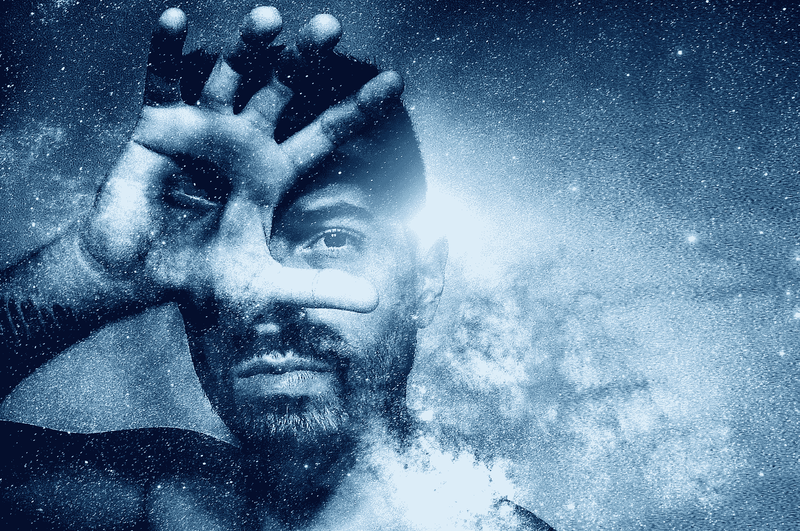
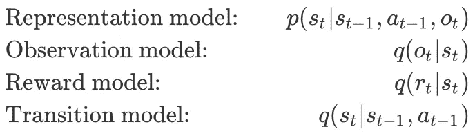
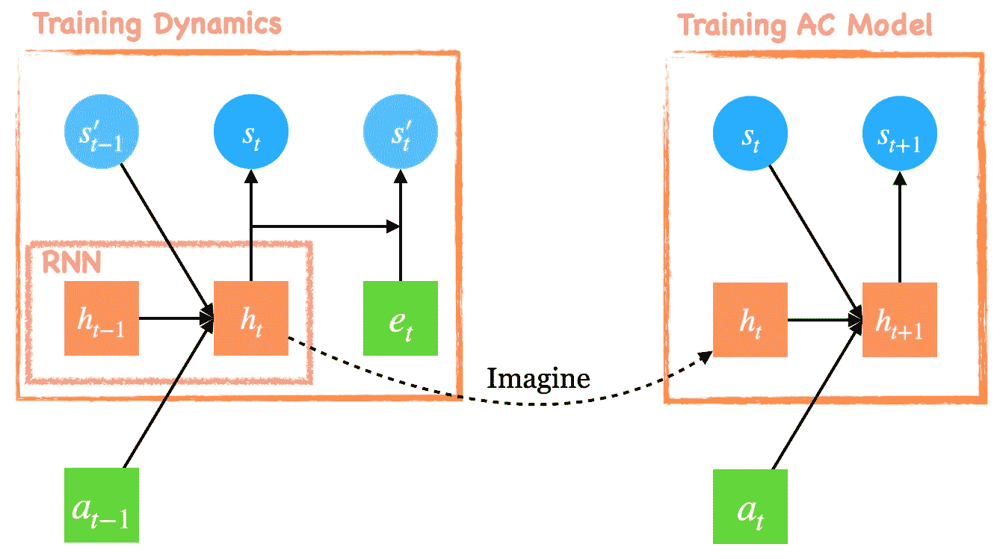
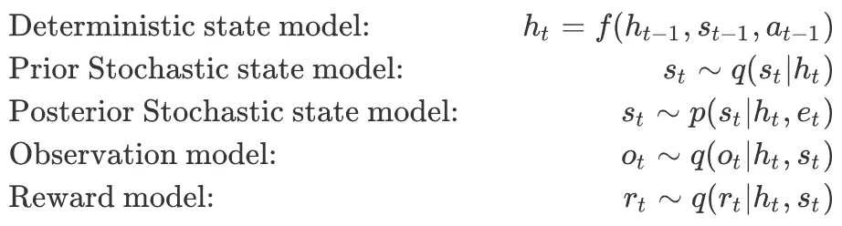
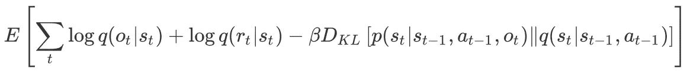
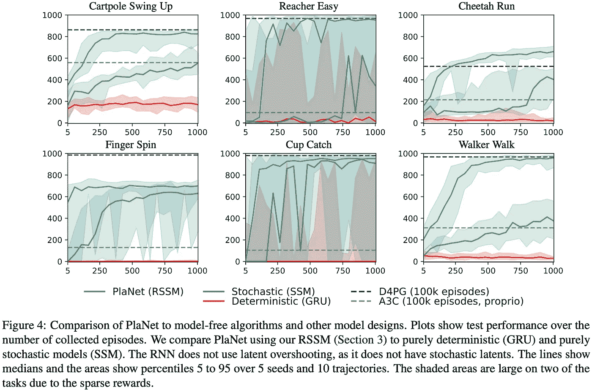
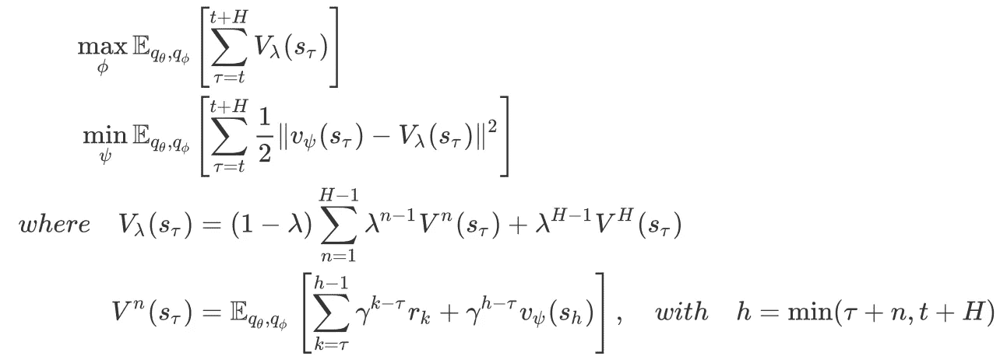

# Dreamer:一个基于模型的强化学习代理

> 原文：<https://pub.towardsai.net/dreamer-8b5a42acebbf?source=collection_archive---------2----------------------->

## 强化学习

## 简要介绍一种基于模型的强化学习算法

图片来自[皮克斯拜](https://pixabay.com/?utm_source=link-attribution&utm_medium=referral&utm_campaign=image&utm_content=2682017)的莱安德罗·德·卡瓦略

我们讨论一种基于模型的强化学习代理，称为 Dreamer，由 Hafner 等人在 DeepMind 提出，它在各种基于图像的控制任务上实现了最先进的性能，但需要的样本比当代的无模型方法少得多。

## 概观

梦者由三部分组成:

*   **动力学学习:**作为一种基于模型的 RL 方法，Dreamer 学习由四个部分组成的动力学模型:表征模型、转移模型、重建模型、奖励模型。
*   **行为学习:**基于动力学模型，梦想家学习一种演员-评论家架构，以最大化*想象轨迹*上的回报。
*   **环境交互:**造梦者使用动作模型与环境交互，进行数据收集。

在这篇文章的其余部分，我们将把我们的注意力集中在前两部分，因为最后一部分很快就会变得明显。

## 动力学学习

梦想家将动态表现为一个由以下部分组成的连续模型

所有这些模型都由具有高斯头部的(去)卷积/全连接网络来参数化。

在本文的其余部分，我们将转换模型称为先验模型，将表示模型称为后验模型，因为后者额外取决于观察结果。

图一。单个时间步长中的递归状态空间模型(RSSM)。h 是确定性状态，s 是先验随机状态，s '是后验随机状态。

像它的前身 PlaNet 一样，Dreamer 采用递归状态空间模型(RSSM)作为世界模型，它将状态空间分为随机和确定性组件。图 1 显示了 RSSM 模型是如何在一个时间步长内展开的。在训练动力学模型时，RNN 将来自前一时间步的动作 *a_{t-1}* 和后验随机状态*s’_ { t-1 }*作为输入，并输出确定性状态 *h_t* 。确定性状态 *h_t* 然后被 a)馈送到具有单个隐藏层的 MLP 中，以计算先前的随机状态*s _ t*；b)与图像嵌入 *e_t* 连接，并馈入另一个单层 MLP 以计算后验随机状态。之后，我们使用 *h_t* 和*s’_ t*的串联作为起始潜变量来重构图像、奖励等。数学上，我们可以把世界模型分成以下几个部分。

实际上，f 是一个 RNN，所有的分布都是高斯分布，参数由相应的网络产生。

也可以将 RSSM 模型视为序列 VAE，其中时间步 *t* 处的潜在变量通过转移模型与前一时间步 *t-1* 的潜在变量相关联。这给了我们下面的变分证据下界(ELBO)目标。

训练动力学模型的目标，其中𝛽正则化从 o_t 到 s_t 的信息

最大化这个目标导致模型状态预测观察和奖励的顺序，同时限制在每个时间步提取的信息量。这鼓励模型通过尽可能依赖于在先前时间步骤提取的信息来重建每幅图像，并且仅在必要时从当前图像访问附加信息。结果，信息正则化器鼓励模型*学习长期依赖性*。

在我们继续之前，值得强调的是确定性和随机状态模型服务于不同的目的:确定性部分可靠地保留跨许多时间步骤的信息，基于此，随机部分建立环境的紧凑信念状态。后者尤其重要，因为环境对代理人来说通常是部分可观察的——图 4 显示，没有随机部分，代理人什么也学不到！

从:梦想到控制:通过潜在想象学习行为

## 行为学习

梦想家在行为学习的状态空间上训练演员-批评家模型。更具体地说，梦想家首先根据代理人过去的经验，从一些真实的模型状态 *s_𝜏* 开始想象轨迹，遵循过渡模型 *q(s_{t+1}|s_t，a_t)* 、策略 *q(a_t|s_t)* 和奖励模型 *q(r_t|s_t)* —见右图 1。注意，在想象过程中，RNN 把先前的随机状态作为输入，因为没有给出更多的观察。然后，我们通过最大化沿着这些轨迹的预期回报来训练演员-评论家模型，目标如下

其中，𝜃是动态模型的参数，𝜙、𝜓分别是动作模型和价值模型的参数。V_𝝀(s)是 TD(𝝀的𝝀-return)，其中𝝀控制 n 步目标的权重

其实这些 RL 物镜的选择还是挺出彩的。我曾试图将一些其他非政策方法应用于梦想家学习的潜在空间，如 retrace(𝝀的 SAC)，因为我认为世界模型(即动力学、奖励和折扣模型)引入的函数逼近误差可能会导致对想象轨迹的不准确预测，从而削弱 AC 模型的性能。然而，实验结果表明了一个相反的故事:从想象的轨迹学习在学习速度和最终表现方面优于在潜在空间应用偏离策略的方法。这是因为从想象的轨迹学习提供了更丰富的训练信号，促进了学习过程；如果我们减少想象轨迹的长度 *H* 到 *1* ，做梦者的表现比将 SAC 应用于潜在空间更差。

# 参考

丹尼尔·哈夫纳，蒂莫西·莉莉卡普，吉米·巴，穆罕默德·诺鲁齐。通过潜在想象学习行为。2020 年的 ICLR

亚历山大·阿莱米、伊恩·费希尔、约书亚·狄龙、凯文·墨菲。深度变化的信息瓶颈。在 2017 年的 ICLR

# 感谢

我要特别感谢 Danijar Hafner 对代码的讨论。