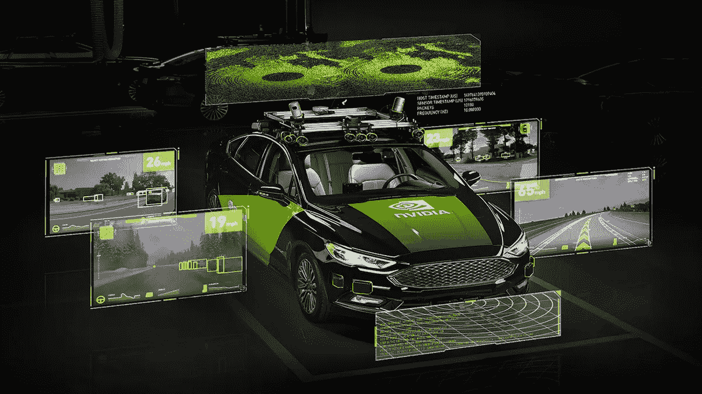

# 驾驶开发者日——关于自动驾驶汽车的第一次会议

> 原文：<https://pub.towardsai.net/drive-developer-days-the-1-conference-on-autonomous-vehicles-5b5571e0c7dd?source=collection_archive---------4----------------------->

来源:[英伟达驱动大会](https://www.nvidia.com/en-us/gtc/topics/self-driving-cars/)

## [自动驾驶汽车](https://towardsai.net/p/category/self-driving-cars)

## 一系列关于安全可靠的自动驾驶汽车开发的深度讲座

自动驾驶汽车是当今人工智能最复杂的挑战之一，将 AVs 推向市场需要在端到端解决方案中共享大量知识和专业知识。

对于那些不知道的人来说，NVIDIA 主要是因为为计算机和游戏提供显卡(GPU)而被认可，但近年来由于高处理硬件的改进，**该公司已经成为汽车行业在人工智能开发方面的重要合作伙伴，人工智能是自动驾驶汽车开发的基础部分。**

毕竟，新一代自动驾驶汽车需要巨大的计算能力，这意味着与谈论发动机或车辆传动装置一样重要的是，对于自动驾驶汽车来说，谈论其硬件和软件将是最基本的。

# 从数据中心到道路

这就是为什么在数据中心，自动驾驶汽车诞生和成长的地方。这是汽车的深度神经网络(DNNs)学习如何检测物体和感知周围环境的地方，也是自动驾驶软件可以在数百万虚拟英里上进行测试和验证的地方。

一旦 dnn 经过训练和验证，自动驾驶汽车就需要令人信服的计算硬件和软件来实现真正的智能。

此外，我们还需要硬件在环、基于云的解决方案，以便在虚拟环境中进行高效、经济、安全的测试，涵盖从日常驾驶到罕见甚至危险情况的各种场景，这比现实世界中可能出现的场景要多得多。

# 自动驾驶汽车开发平台

NVIDIA DRIVE autonomous vehicle(AV)平台是一个全栈解决方案，用于高度自动化的监控驾驶，并逐步发展为完全自主操作。

它提供了主动安全，自动驾驶和停车，以及从 2+级到 5 级的人工智能驾驶舱功能。

NVIDIA 驱动平台包括:

*   一台车载电脑(**驱动 AGX** )。
*   完整的参考架构(**驱动 Hyperion** )。
*   一个端到端的仿真平台( **DRIVE Sim** )。
*   深度神经网络(DNN)训练平台(DGX)。

这些平台还包括强大的软件开发工具包(SDK)，有助于加速自动驾驶汽车的开发(AVs)。

NVIDIA DRIVE Level 2+解决方案由两个 **NVIDIA Orin** 片上系统、主动安全、自动驾驶、停车应用和另一个 AI 驾驶舱功能提供支持。

它还配备了 **NVIDIA DRIVE Hyperion** 传感器套件，允许开发人员测试他们的 AV 平台。

**驱动 Hyperion** 包括以下功能:

*   +8 个摄像头
*   5 部雷达
*   12 个超声波传感器可以 360 度全方位感知场景，生成全面的环境模型。
*   3 个用于驾驶员和乘员监控的内部感应摄像头。

**NVIDIA DRIVE 软件堆栈**是开发和部署尖端 AV 应用的完整解决方案，包括:

*   感觉
*   本地化
*   绘图
*   规划和控制
*   驾驶员监控
*   自然语言处理

该平台还包含 **NVIDIA DRIVE OS** ，这是一个用于加速计算的安全操作系统， **NVIDIA DriveWorks SDK** 是一个全面的中间件 SDK。

**NVIDIA DRIVE AV** 和 **DRIVE IX** 堆栈包括 DNNs 和高级算法模块，用于感知、映射、规划和智能驾驶舱功能。

**NVIDIA DRIVE Level 2+** 解决方案在 **NVIDIA DRIVE** 基础设施上经过培训和验证，这是一个基于统一计算架构的精确端到端开发流程。

这一切都始于英伟达 DGX T21 系统，该系统允许精简、大规模的 DNN 培训和优化。

开发人员可以利用 GPU 和人工智能的力量，训练 dnn 进行自动车辆感知、规划、控制等。

**NVIDIA DRIVE Constellation**和 **NVIDIA DRIVE Sim** 平台提供了一个虚拟试验场，具有几乎无限多种驾驶条件，用于在车辆的相同硬件上测试和验证 dnn。

当与 **DRIVE AV** 解决方案结合使用时， **DRIVE Infrastructure** 为持续改进创造了一个持续的开发周期。

这种软件定义的车辆平台还为最终用户提供持续改进。汽车制造商可以在汽车的整个生命周期内通过无线更新来提供新的功能和能力，扩大客户的满意度，并创建新的变革性商业模式。

去年， **NVIDIA** 推出了 **DRIVE AGX Orin** ，这是一个非常先进的软件定义平台，由我们新的 **Orin** 片上系统(SoC)提供支持。

它实现了 200 TOPS 接近上一代 SoC Xavier 的 7 倍性能-并且它可以管理同时在自动驾驶汽车和机器人中运行的大量深度神经网络和应用程序。

# NVIDIA DRIVE 开发者日——自动驾驶汽车会议

如果你有兴趣了解更多关于自动驾驶汽车的技术和发展的信息，并看看人工智能驱动的交通工具的未来是什么样子，英伟达将于 2021 年 4 月 20 日至 22 日举办最重要的虚拟会议之一，深入探讨安全可靠的自动驾驶汽车的发展。

Nvidia Drive 对于汽车开发人员来说将是一个激动人心的事件。它将以涵盖端到端 AV 计算管道所有方面的互动会议为特色，由一些**英伟达**的核心汽车架构师和开发工程师领导。

如果您已经是 **NVIDIA DRIVE** 的客户之一，您还将有机会参加关于我们自己的自动驾驶汽车开发流程的更深入的会议。

在 **GTC2021** 举行的 **NVIDIA DRIVE 开发者日**包括由我们的核心汽车架构师和开发工程师主持的互动会议，涵盖端到端自动驾驶汽车计算管道的所有方面。

与会者将是第一批看到人工智能车辆最新进展的人，并了解更多有关用于创建更安全、更高效交通的工具和平台的信息。

参加 **DRIVE Developer Day** 的与会者将学习如何使用高级学习工具来加速数据中心的 **DNNs** 培训，还将学习如何使用迁移学习和联合学习来简化培训流程，并在不危及其专有信息的情况下利用不同的数据源。

与会者还将了解通过 NGC 提供的 **DRIVE AV** perception 和 **DRIVE IX** 智能驾驶舱 AI 模型，这些模型经过优化，可以在 **DRIVE AGX** 平台上运行，他们还将了解如何使用 **NVIDIA DRIVE Hyperion** 传感器开发平台在车辆中验证这种硬件和软件，这是一种可以改装到车辆上并与 DRIVE AGX 硬件一起运行的传感器套件。

每场会议都将由 NVIDIA**的工程团队领导，这些团队推动这些计划，并有几次网络中断与专家一对一会面，让与会者深入了解我们如何实现人工智能驾驶。**

NVIDIA DRIVE Developer Days 将包括八场关于安全可靠的自动驾驶汽车开发的**深度讲座**，包括:

*   **驱动 OS** & **DriveWorks** 中间件
*   **驱动 AV** 自主车栈
*   **驱动奥林**，飞马&亥伯龙
*   **驱动 Sim** 和**星座**进行 AV 测试和验证
*   **英伟达 DGX** 和 **EGX** 用于 DNN 培训

这些特别会议在预定时间免费进行，有现场问答，也可点播。检查会话列表:

 [## 登录— #1 人工智能大会| GPU 技术大会|英伟达

### 编辑描述

gtc21.event.nvidia.com](https://gtc21.event.nvidia.com/playlist/1_o3c0ycr8/204678603) 

您可以点击下面的链接免费注册:

 [## GTC 21 自动驾驶汽车会议

### 了解 GPU 技术如何为更安全、更愉快的驾驶体验铺平道路，并最终实现…

www.nvidia.com](https://www.nvidia.com/en-us/gtc/topics/self-driving-cars/) 

# 还有一件事…

如果你有兴趣阅读关于自动驾驶技术和机会的文章，下面的文章会让你感兴趣:

*   [分析自动驾驶汽车治理生态系统:决策者指南](https://medium.com/predict/analyzing-the-autonomous-vehicle-governance-ecosystem-a-guide-for-decision-makers-d0ccea14e702)
*   [测量共享和电动自动驾驶汽车(SAEV)对城市交通的影响](https://jairribeiro.medium.com/measuring-the-effects-of-shared-and-electric-autonomous-vehicles-saev-on-urban-mobility-417b404128e4)。
*   自动驾驶汽车:500 亿美元的颠覆机会
*   [沃尔沃集团和 Aurora 宣布在自动驾驶交通领域建立合作关系](https://medium.com/predict/volvo-group-and-aurora-announced-a-partnership-on-autonomous-transportation-e0d625300a8b)。
*   这就是自动驾驶卡车将如何重塑运输行业。
*   [在无人驾驶卡车竞赛中领先的 18 家公司和初创公司](https://medium.datadriveninvestor.com/18-companies-and-startups-that-are-leading-the-race-for-the-autonomous-trucks-4ba5a50e6dee)
*   [自主车辆来了！你准备好了吗？](https://jairribeiro.medium.com/just-published-my-newsletter-about-autonomous-vehicles-8798d27fe9c3)
*   [2021 年，5000 辆自动驾驶卡车将在中国上路](https://medium.datadriveninvestor.com/5-000-autonomous-trucks-will-hit-the-roads-in-china-in-2021-4e13ab17b54e)

# 参考

*   [神经网络和深度学习简介](https://medium.com/@societyofai/introduction-to-neural-networks-and-deep-learning-6da681f14e6)
*   [NVIDIA DRIVE AV 软件](https://www.nvidia.com/en-us/self-driving-cars/drive-platform/software/)
*   [英伟达驱动基础设施](https://www.nvidia.com/en-us/self-driving-cars/infrastructure/)
*   [英伟达驱动星座](https://developer.nvidia.com/drive/drive-constellation)
*   [英伟达驱动 AGX](https://developer.nvidia.com/drive/drive-agx)
*   [英伟达驱动 EGX](https://www.nvidia.com/en-us/data-center/products/egx/)
*   [英伟达驱动 Hyperion](https://developer.nvidia.com/drive/drive-hyperion)
*   [NVIDIA 驱动 Sim 卡](https://www.nvidia.com/en-us/self-driving-cars/drive-constellation/)
*   [英伟达奥林](https://nvidianews.nvidia.com/news/nvidia-introduces-drive-agx-orin-advanced-software-defined-platform-for-autonomous-machines)
*   [用于自动驾驶汽车的 NVIDIA 驱动软件堆栈](https://www.nvidia.com/en-us/self-driving-cars/drive-platform/software/)
*   [英伟达驱动操作系统](https://developer.nvidia.com/drive/driveos)
*   [NVIDIA DriveWorks SDK](https://developer.nvidia.com/drive/driveworks)
*   [NVIDIA 驱动程序 IX](https://www.nvidia.com/en-us/self-driving-cars/drive-ix/)
*   [NVIDIA 驱动级别 2+](https://developer.nvidia.com/sites/default/files/akamai/drive/drive-product-brief.pdf)

如果你想了解自动驾驶汽车和人工智能的最新进展，可以在 Medium 上关注我。