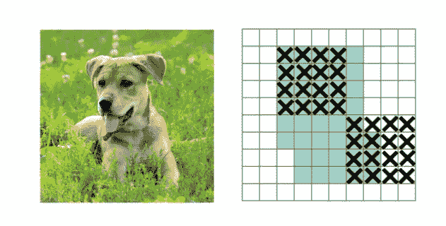
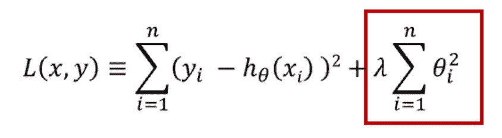
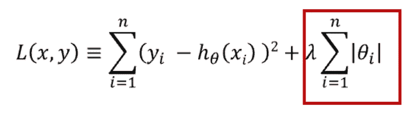
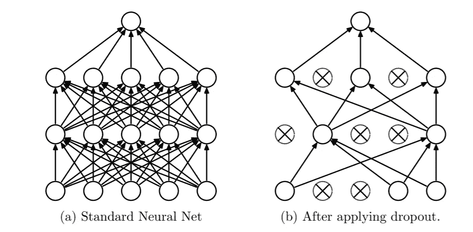
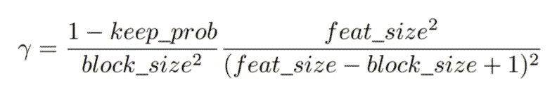
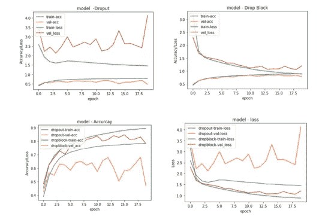

# DropBlock:一种新的正则化技术

> 原文：<https://pub.towardsai.net/dropblock-a-new-regularization-technique-e926bbc74adb?source=collection_archive---------1----------------------->

## [深度学习](https://towardsai.net/p/category/machine-learning/deep-learning)

## 探索 DropBlock，一种新的卷积神经网络正则化技术



[DropBlock:卷积网络的正则化方法](https://arxiv.org/pdf/1810.12890.pdf)

在这里我们将探索

*   ***一种正则化技术和不同的正则化技术，如 L1、L2 正则化、剔除和空间剔除。***
*   ***什么是 DropBlock，和 Dropout*** 有什么不同
*   ***比较 CIFAR-10 数据集上的 Dropout 和 DropBlock 结果***

> 正则化是在深度神经网络中实现的策略，它将减少泛化误差而不是训练误差，以便不仅在训练数据上，而且在新的未知输入上表现良好。

**effective 正则化器显著降低了方差，同时不会过度增加偏差，从而防止过拟合**。

我们使用[正则化](https://medium.com/datadriveninvestor/l1-l2-regularization-7f1b4fe948f2)技术，如 L1 和 L2，以减少过度拟合，惩罚损失函数，或正则化技术，如[漏失](https://medium.com/analytics-vidhya/neural-network-and-dropouts-b6690c869a18)和空间漏失，这阻碍了模型的复杂性。

神经网络中正则化方法背后的原理是将噪声注入到神经网络中，以避免过拟合训练数据。

## **L2 正规化**

L2 正则化通常被称为**权重衰减或岭回归，或吉洪诺夫正则化**。这种正则化策略**驱动权重变小，但不使它们为零**，并且进行非稀疏求解。



L2 正则化

**L2 项是一个权重矩阵的所有平方权重值的总和**。

**L2 对异常值并不稳健**，因为以红色突出显示的平方项放大了异常值的误差差异，正则化项试图通过惩罚权重来解决这个问题。

## L1 正则化

L1 正则化也被称为 **L1 范数或拉索**。 **Lasso 生成一个简单、可解释的模型，并包含输入特征的子集**。

**在 L1 范数中，我们将参数收缩为零**。当输入要素的权重接近零时，会导致稀疏 L1 范数。在大多数输入的稀疏解决方案中，要素的权重为零，极少数要素的权重不为零。**无关紧要的输入特征权重为零，而有用的特征被赋予非零权重**。



L1 常模

**L1 正则化惩罚权重的绝对值**，如上所示。

## 拒绝传统社会的人

**Dropout 是一种减少过度拟合的技术，我们在神经网络中随机丢弃隐藏和可见的单元。当我们在神经网络中删除一个单元时，**我们暂时从网络中删除这个单元，连同它所有的输入和输出连接，如下所示。



来源:[https://www.cs.toronto.edu/~hinton/absps/JMLRdropout.pdf](https://www.cs.toronto.edu/~hinton/absps/JMLRdropout.pdf)

当我们将退出应用于神经网络时，它是一个由所有退出后幸存的单元组成的稀疏网络。

## 空间辍学

**卷积神经网络使用丢弃的另一种方法是从卷积层**中丢弃整个特征图，然后在汇集过程中不使用。

**空号掉线比掉线好，但比掉线差**

## 辍学的弊端

*   **卷积层的丢弃允许信息在不同层之间流动，因为单元被随机丢弃**。特征在卷积层中是空间相关的。当我们在神经网络中随机丢弃单元时，输入信息仍然可以流向下一层，导致模型过拟合。
*   **Dropout 主要用于卷积网络的全连接层。**

## 什么是 DropBlock，它与 Dropout 有什么不同？

> DropBlock 是一种结构化的删除形式，用于正则化卷积网络，其中要素地图的连续区域中的单元被一起删除。

**Drop Block 受剪切数据扩充方法**的启发，其中部分输入图像被置零。因此， **DropBlock 丢弃相关区域中的特征。网络必须从别处寻找证据来配合数据。**

教孩子识别不同动物的图像时。我们隐藏不同动物图像的一小部分，从而确保孩子将注意力集中在不同的动物特征上，以识别它们，从而进行有力的学习。

应用相同的前提，DropBlock 删除连续的区域，以删除某些语义信息，如面部、腿部、尾部等。从而强制剩余单元学习用于分类输入图像的其他特征。

## **滑车工作**

**DropBlock 有两个主要参数**

*   **block_size** :即将被丢弃的块的**大小。当 block_size = 1 时，DropBlock 类似于 dropout，当 block_size 覆盖整个要素地图时，drop block 类似于 SpatialDropout。 **Block_size 应小于或等于特征图的大小。****
*   **γ:控制掉落多少激活单位**



**keep_prob 是和传统辍学一样保持一个单位的概率，其值在 0.75-0.95 之间**。

**feat_size 是特征图的大小**

对于我们定义了 DropBlock 的每个特征映射，随机抽样二进制掩码。二进制掩码 M 将具有值 0 或 1。

对于二进制掩码的每个零位置 M(i，j)，创建一个中心为 M(i，j)的空间正方形掩码，宽度和高度将等于 block_size。将正方形中 M 的所有值设置为零。

如果 block_size 设置为 5，我们以神经元为中心分块一个 5 乘 5 的小块，如下所示。


**下拉块中的屏蔽取样**。来源: [DropBlock:卷积网络的一种正则化方法](https://arxiv.org/pdf/1810.12890.pdf)

## 跌落滑车的强度

**DropBlock 从每一层中屏蔽掉部分信息，迫使每一个神经元学习不同的图像特征，帮助模型很好地泛化，避免过拟合**。由 DropBlock 正则化的模型学习多个判别区域，而不是只关注一个判别区域。

最好**在训练过程中初始设置小的掉线率，然后在训练过程中随着时间线性增加**。

与 DropBlock 相比，drop block 在提高 ImageNet 分类准确性方面展示了强大的实证结果。

丢失是不够的，因为卷积图层中的相邻区域具有很强的相关性，并且随机丢失一个单元仍允许信息流经相邻单元。

## DropBlock 和 Dropout 的异同

与 dropout 不同，DropBlock 根据 block_size 和γ 随机删除层中的一个神经元。

DropBlock 在丢弃语义信息方面更有效，因此比 Dropout 更健壮。用 DropBlock 训练的模型需要学习空间分布的表示，因为 DropBlock 有效地移除了连续区域中的语义信息。因此，用大块大小训练的模型移除了更多的语义信息，导致更强的正则化。

**DropBlock 可应用于卷积层和全连接层，而** Dropout 主要用于卷积网络的全连接层。

类似于 dropout，我们**在推理过程中不应用 DropBlock。**

## CIFAR-10 上的 drop 和 DropBlock 比较

这里我们创建两个具有相似架构和超参数的 CNN 模型，但是一个模型使用 dropout，另一个模型使用 sDropBlock。最后，我们比较了两种模型的训练和验证数据集在准确率和损失方面的差异。

**导入所需的库**

```
**import tensorflow as tf
from keras.datasets import cifar10
from keras.preprocessing.image import ImageDataGenerator
import numpy as np
from tensorflow.python.keras import backend as K**
```

**创建 DropBlock 类**

*   **block_size** :即将被丢弃的块的**大小。**
*   **keep_prob 是像传统辍学一样保持一个单位的概率。**keep _ prob 的值介于 0.75 和 0.95 之间，并且**将与 features_size 和 block_size 一起用于计算 gamma(γ)以控制丢弃多少激活单元**

```
**class DropBlock2D(tf.keras.layers.Layer):**
    """See: [https://arxiv.org/pdf/1810.12890.pd](https://arxiv.org/pdf/1810.12890.pd)
    """**def __init__(self,
                 block_size,
                 keep_prob,
                 sync_channels=False,
                 data_format=None,
                 **kwargs):**
        """Initialize the layer.
        :param block_size: Size for each mask block.
        :param keep_prob: Probability of keeping the original feature.
        :param sync_channels: Whether to use the same dropout for all channels.
        :param data_format: 'channels_first' or 'channels_last' (default).
        :param kwargs: Arguments for parent class.
        """
        **super(DropBlock2D, self).__init__(**kwargs)
        self.block_size = block_size
        self.keep_prob = keep_prob
        self.sync_channels = sync_channels
        self.data_format = data_format
        self.supports_masking = True
        self.height = self.width = self.ones = self.zeros = None****def build(self, input_shape):
        if self.data_format == 'channels_first':
            self.height, self.width = input_shape[2], input_shape[3]
        else:
            self.height, self.width = input_shape[1], input_shape[2]
        self.ones = K.ones((self.height, self.width), name='ones')
        self.zeros = K.zeros((self.height, self.width), name='zeros')
        super().build(input_shape)****def get_config(self):
        config = {'block_size': self.block_size,
                  'keep_prob': self.keep_prob,
                  'sync_channels': self.sync_channels,
                  'data_format': self.data_format}
        base_config = super(DropBlock2D, self).get_config()
        return dict(list(base_config.items()) + list(config.items()))****def compute_mask(self, inputs, mask=None):
        return mask****def compute_output_shape(self, input_shape):
        return input_shape****def _get_gamma(self):**
        """Get the number of activation units to drop"""
       ** height, width = K.cast(self.height, K.floatx()), K.cast(self.width, K.floatx())
        block_size = K.constant(self.block_size, dtype=K.floatx())
        return ((1.0 - self.keep_prob) / (block_size ** 2)) *\
               (height * width / ((height - block_size + 1.0) * (width - block_size + 1.0)))****def _compute_valid_seed_region(self):
        positions = K.concatenate([
            K.expand_dims(K.tile(K.expand_dims(K.arange(self.height), axis=1), [1, self.width]), axis=-1),
            K.expand_dims(K.tile(K.expand_dims(K.arange(self.width), axis=0), [self.height, 1]), axis=-1),
        ], axis=-1)
        half_block_size = self.block_size // 2
        valid_seed_region = K.switch(
            K.all(
                K.stack(
                    [
                        positions[:, :, 0] >= half_block_size,
                        positions[:, :, 1] >= half_block_size,
                        positions[:, :, 0] < self.height - half_block_size,
                        positions[:, :, 1] < self.width - half_block_size,
                    ],
                    axis=-1,
                ),
                axis=-1,
            ),
            self.ones,
            self.zeros,
        )
        return K.expand_dims(K.expand_dims(valid_seed_region, axis=0), axis=-1)****def _compute_drop_mask(self, shape):
        mask = K.random_binomial(shape, p=self._get_gamma())
        mask *= self._compute_valid_seed_region()
        mask = tf.keras.layers.MaxPool2D(
            pool_size=(self.block_size, self.block_size),
            padding='same',
            strides=1,
            data_format='channels_last',
        )(mask)
        return 1.0 - mask****def call(self, inputs, training=None):****def dropped_inputs():
            outputs = inputs
            if self.data_format == 'channels_first':
                outputs = K.permute_dimensions(outputs, [0, 2, 3, 1])
            shape = K.shape(outputs)
            if self.sync_channels:
                mask = self._compute_drop_mask([shape[0], shape[1], shape[2], 1])
            else:
                mask = self._compute_drop_mask(shape)
            outputs = outputs * mask *\
                (K.cast(K.prod(shape), dtype=K.floatx()) / K.sum(mask))
            if self.data_format == 'channels_first':
                outputs = K.permute_dimensions(outputs, [0, 3, 1, 2])
            return outputs****return K.in_train_phase(dropped_inputs, inputs, training=training)**
```

**创建 CIFAR-10 训练和测试数据集**

```
**def normalize(X_train,X_test)**:
        #normalizes inputs for zero mean and unit variance
        # it is used when training a model.
        # Input: training set and test set
        # Output: normalized training set and test set according to the training set statistics.
      **  mean = np.mean(X_train,axis=(0,1,2,3))
        std = np.std(X_train, axis=(0, 1, 2, 3))
        X_train = (X_train-mean)/(std+1e-7)
        X_test = (X_test-mean)/(std+1e-7)
        return X_train, X_test****(x_train, y_train), (x_test, y_test) = cifar10.load_data()
x_train = x_train.astype('float32')
x_test = x_test.astype('float32')
x_train, x_test = normalize(x_train, x_test)
y_train = tf.keras.utils.to_categorical(y_train, 10)
y_test = tf.keras.utils.to_categorical(y_test, 10)**
```

**构建辍学 CNN 模型**

这个模型有 4.97 米的参数

```
**def build_dropout_model():**
        # Build the CNN for 10 classes with massive dropout and weight decay**model = tf.keras.Sequential()
        weight_decay = 0.0005
        x_shape = (32,32,3)
        num_classes=10

        model.add(tf.keras.layers.Conv2D(64, (3, 3), padding='same',input_shape=x_shape,
                         kernel_regularizer=tf.keras.regularizers.l2(weight_decay)))
        model.add(tf.keras.layers.Activation('relu'))
        model.add(tf.keras.layers.BatchNormalization())
        model.add(tf.keras.layers.Dropout(0.4))
        model.add(tf.keras.layers.MaxPooling2D(pool_size=(2, 2)))
        model.add(tf.keras.layers.Conv2D(128, (3, 3), padding='same',kernel_regularizer=tf.keras.regularizers.l2(weight_decay)))
        model.add(tf.keras.layers.Activation('relu'))
        model.add(tf.keras.layers.BatchNormalization())****model.add(tf.keras.layers.MaxPooling2D(pool_size=(2, 2)))****model.add(tf.keras.layers.Dropout(0.4))****model.add(tf.keras.layers.Conv2D(256, (3, 3), padding='same',kernel_regularizer=tf.keras.regularizers.l2(weight_decay)))
        model.add(tf.keras.layers.Activation('relu'))
        model.add(tf.keras.layers.BatchNormalization())
        model.add(tf.keras.layers.Dropout(0.4))****model.add(tf.keras.layers.Conv2D(512, (3, 3), padding='same',kernel_regularizer=tf.keras.regularizers.l2(weight_decay)))
        model.add(tf.keras.layers.Activation('relu'))
        model.add(tf.keras.layers.BatchNormalization())
        model.add(tf.keras.layers.Dropout(0.4))
        model.add(tf.keras.layers.MaxPooling2D(pool_size=(2, 2)))
        model.add(tf.keras.layers.Conv2D(512, (3, 3), padding='same',kernel_regularizer=tf.keras.regularizers.l2(weight_decay)))
        model.add(tf.keras.layers.Activation('relu'))
        model.add(tf.keras.layers.BatchNormalization())
        model.add(tf.keras.layers.Dropout(0.4))

        model.add(tf.keras.layers.MaxPooling2D(pool_size=(2, 2)))
        model.add(tf.keras.layers.Flatten())
        model.add(tf.keras.layers.Dense(512,kernel_regularizer=tf.keras.regularizers.l2(weight_decay)))
        model.add(tf.keras.layers.Activation('relu'))
        model.add(tf.keras.layers.Dropout(0.5))
        model.add(tf.keras.layers.Dense(num_classes))
        model.add(tf.keras.layers.Activation('softmax'))
        return model**
```

## 建筑工地

DropBlock CNN 模型也有 4.97M 参数

```
**def build_droblock_model():**
        # Build the Dropblock CNN network of vgg for 10 classes with massive dropout and weight decay **model = tf.keras.Sequential()
        weight_decay = 0.0005
        x_shape = (32,32,3)
        num_classes=10**

       ** model.add(tf.keras.layers.Conv2D(64, (3, 3), padding='same',input_shape=x_shape,                         kernel_regularizer=tf.keras.regularizers.l2(weight_decay)))
        model.add(tf.keras.layers.Activation('relu'))
        model.add(tf.keras.layers.BatchNormalization())
        model.add(DropBlock2D(block_size=3, keep_prob=0.75))**        
       ** model.add(tf.keras.layers.MaxPooling2D(pool_size=(2, 2)))
        model.add(DropBlock2D(block_size=3, keep_prob=0.2))
        model.add(tf.keras.layers.Conv2D(128, (3, 3), padding='same',kernel_regularizer=tf.keras.regularizers.l2(weight_decay)))
        model.add(tf.keras.layers.Activation('relu'))
        model.add(tf.keras.layers.BatchNormalization())
        model.add(DropBlock2D(block_size=3, keep_prob=0.75))****model.add(tf.keras.layers.Conv2D(256, (3, 3), padding='same',kernel_regularizer=tf.keras.regularizers.l2(weight_decay)))
        model.add(tf.keras.layers.Activation('relu'))
        model.add(tf.keras.layers.BatchNormalization())
        model.add(DropBlock2D(block_size=4, keep_prob=0.8))****model.add(tf.keras.layers.MaxPooling2D(pool_size=(2, 2)))****model.add(tf.keras.layers.Conv2D(512, (3, 3), padding='same',kernel_regularizer=tf.keras.regularizers.l2(weight_decay)))
        model.add(tf.keras.layers.Activation('relu'))
        model.add(tf.keras.layers.BatchNormalization())
        model.add(DropBlock2D(block_size=3, keep_prob=0.8))
model.add(tf.keras.layers.MaxPooling2D(pool_size=(2, 2)))
model.add(tf.keras.layers.Conv2D(512, (3, 3), padding='same',kernel_regularizer=tf.keras.regularizers.l2(weight_decay)))
        model.add(tf.keras.layers.Activation('relu'))
        model.add(tf.keras.layers.BatchNormalization())
        model.add(DropBlock2D(block_size=3, keep_prob=0.8))
model.add(tf.keras.layers.MaxPooling2D(pool_size=(2, 2)))
        model.add(DropBlock2D(block_size=3, keep_prob=0.9))
model.add(tf.keras.layers.Flatten())
model.add(tf.keras.layers.Dense(512,kernel_regularizer=tf.keras.regularizers.l2(weight_decay)))
        model.add(tf.keras.layers.Activation('relu'))
        model.add(tf.keras.layers.BatchNormalization())****model.add(tf.keras.layers.Dense(num_classes))
        model.add(tf.keras.layers.Activation('softmax'))
        return model**
```

**创建模型**

```
**model_dropout = build_dropout_model()
model_dropblock = build_droblock_model()**
```

**编译模型**

```
**opt = tf.keras.optimizers.Adam(lr=0.001)**# Compile Dropout Model
**model_dropout.compile(optimizer=opt, loss=tf.keras.losses.categorical_crossentropy, metrics=['accuracy'])**# Compile Dropblock Model
**model_dropblock.compile(optimizer=opt, loss=tf.keras.losses.categorical_crossentropy, metrics=['accuracy'])**
```

**创建检查点和提前停车**

```
**checkpoint_dropout = tf.keras.callbacks.ModelCheckpoint("dropout_model.h5", monitor='val_accuracy', verbose=1, save_best_only=True, save_weights_only=False,mode='auto', save_freq='epoch')y****checkpoint_dropblock = tf.keras.callbacks.ModelCheckpoint("dropBlock_model.h5", monitor='val_accuracy', verbose=1, save_best_only=True, save_weights_only=False,mode='auto', save_freq='epoch')****early =  tf.keras.callbacks.EarlyStopping(monitor='val_accuracy', 
                                          min_delta=0, 
                                          patience=20, 
                                          verbose=1, mode='auto')**
```

**拟合辍学模型**

```
**history = model_dropout.fit(x_train, y_train, epochs=20, batch_size=64, 
                    validation_data=(x_test, y_test), 
                    verbose=1,
                    validation_steps=10,
                    validation_batch_size=32,
                    callbacks=[checkpoint_dropout,early])**
```

**安装下拉模块型号**

```
**history_2 = model_dropblock.fit(x_train, y_train, epochs=20, batch_size=64, 
                    validation_data=(x_test, y_test), 
                    verbose=1,
                    validation_steps=10,
                    validation_batch_size=32,
                    callbacks=[checkpoint_dropblock,early])**
```

最后，比较了 drop 和 DropBlock 模型的精度和损耗。



Dropout 和 DropBlock 模型精度和损耗比较

我们可以看到，DropBlock 模型在 20 个时期的最佳验证精度约为 84.68%，而 Dropout 模型的最佳验证精度为 68.1%。

Dropout 模型的最低验证损失为 2.4066，DropBlock 模型的最低验证损失为 1.0977。

因此，在数据集、架构和超参数相似的情况下，DropBlock 优于 Dropout。

## 结论:

DropBlock 是一种结构化的退出形式，受剪切数据扩充的启发。它有助于正则化卷积网络，其中特征图的连续区域中的单元被放在一起，迫使神经元学习不同的图像特征。这有助于模型更好地泛化，避免过度拟合。

## **参考文献:**

[DropBlock:卷积网络的正则化方法](https://arxiv.org/pdf/1810.12890.pdf)

[https://www . deep learning book . org/contents/regulation . html](https://www.deeplearningbook.org/contents/regularization.html)

[退出:防止神经网络过度拟合的简单方法](https://www.cs.toronto.edu/~hinton/absps/JMLRdropout.pdf)

[https://github . com/CyberZHG/keras-drop-block/blob/0 edc5 e 3f 3021 C5 f 40722078 c 7 c 23 e 09 e 2 b 475 a 58/keras _ drop _ block/drop _ block . py](https://github.com/CyberZHG/keras-drop-block/blob/0edc5e3f3021c5f40722078c7c23e09e2b475a58/keras_drop_block/drop_block.py)