# DS 101:面向公民数据科学家的 Alteryx

> 原文：<https://pub.towardsai.net/ds-101-alteryx-for-citizen-data-scientists-bc03134d84e2?source=collection_archive---------1----------------------->

## [数据科学](https://towardsai.net/p/category/data-science)

## *如何利用 Alteryx 的强大功能来分析您的数据，而无需编程*

背景图片由[杰洛特](https://pixabay.com/photos/web-network-technology-developer-3963945/)

这些天来，大多数公司都在向“ [C *itizen 数据科学家*](https://www.techopedia.com/definition/32025/citizen-data-scientist#:~:text=A%20citizen%20data%20scientist%20is%20a%20role%20that,to%20be%20data%20science%20or%20business%20intelligence%20experts.) ”的概念迈进，向主题专家(SME)提供工具来创建他们自己的机器学习模型。这种方法的优势在于，它提供了对结果的有意义的解释，并且在数据科学家和 SME 之间的转换中不会丢失任何东西。

虽然一些公民数据科学家接受了 Python 和 R 的培训来开发模型，但这些语言需要某种程度的编码，有些人可能不太适应。像 JMP、Knime 和 Alteryx 这样的数据建模平台提供了编程的替代方案，并帮助您通过使用它们内置的功能来开发机器学习模型。在这篇文章中，让我们讨论使用 [Alteryx](https://www.alteryx.com/designer-trial/free-trial?utm_medium=cpc&utm_source=bing&utm_campaign=NA_Search_Demgen_Mixed_Brand_New_AO&utm_keyword=alteryx&msclkid=9c7c9e5629bd16620d54c1696891b3b1) 建模。

这里我们将使用的方法是' *SEMMA* '方法。*代表*样本*，*探索*，*修改*，*模型*，以及*评估*。这是由最大的统计和商业智能软件生产商之一的 SAS 研究所开发的一系列步骤。正如我以前的[文章](https://medium.com/swlh/data-science-101-using-decision-trees-with-python-78d7a4f17699)一样，我将使用[波士顿房产 2019](https://data.boston.gov/dataset) 数据集用 Alteryx 建模。*

*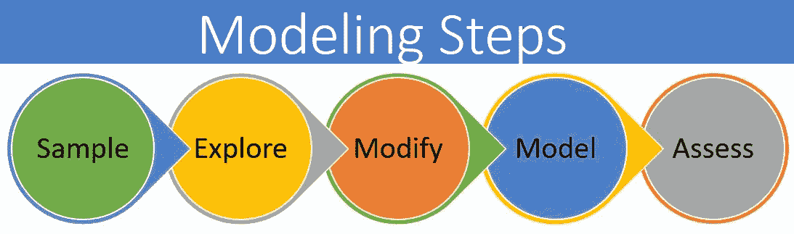*

## *步骤 1 —样本:*

*该过程从[数据采样](https://en.wikipedia.org/wiki/Sampling_(statistics))开始，即选择合适的数据集进行建模。数据集应该足够大，以包含足够的信息来有效地建模，但也应该足够小，以有效地使用。*

*在“*样本*阶段，我们将把数据加载到 Alteryx 中，按照*属性类型= 101* (单户住宅)进行过滤，并删除分析不需要的列(如姓名、地址和与单户住宅无关的行)。*

*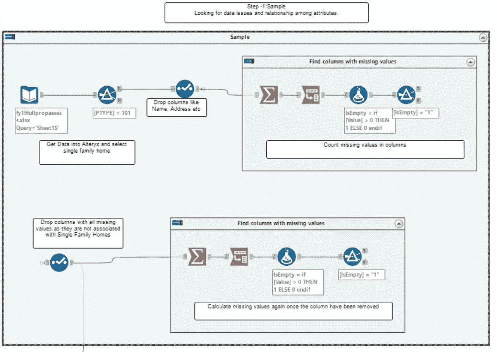*

*使用 Alteryx 的示例数据。使用 Alteryx 工具-输入数据，过滤和选择*

*使用输入数据工具，我将把 excel 数据集导入 Alteryx。接下来使用过滤器工具将对只包含 PTYPE = 101 的行进行排序，如下所示。*

*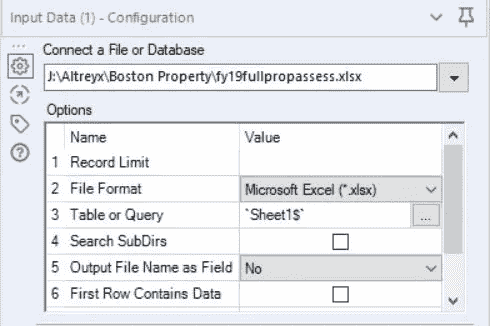**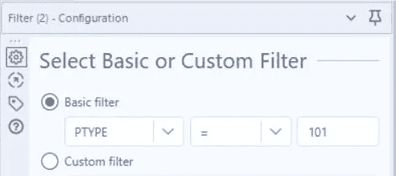

选择数据和过滤器属性类型 101* 

*接下来，选择分析所需的行。(删除 ST_Name、Owner 等字段)*

*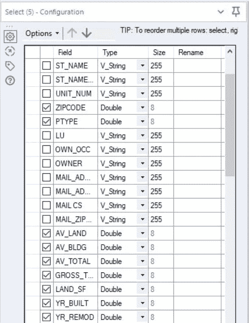*

*选择工具:取消选择分析不需要的列。*

*Alteryx 允许你创建“容器”,在这里你可以将一个函数的所有模块组合在一起，如上图所示。我创建了一个名为“查找缺少值的列”的容器来完成这个任务。我已经多次重复使用这个容器来检查是否所有缺失的值都被输入了*

*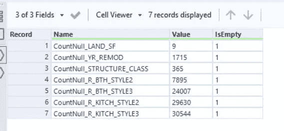*

*缺少值的列(容器的输出)*

## *第 2 步—探索:*

*这一阶段包括通过探索变量之间预期和未预期的关系来理解数据，并在[数据可视化](https://www.alteryx.com/solutions/analytics-need/bi-visualization)的帮助下发现任何异常。*

*在此阶段，我们将估算所有缺失的数据，为建模做准备。在最后一步中，我们确定了 7 个缺少值的列。在这一步，我们将估算这些列。*

*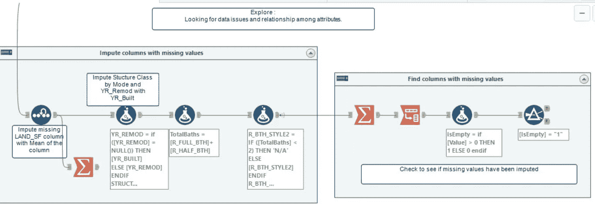*

***插补策略:***

*a) Land_SF:这是一个连续变量，我将用列的平均值来估算*

*b) YR_REMOD:这是房屋被改造的年份，如果这是空的，我们将替换为建造年份。*

*c) STRUCTURE_CLASS:这是分类变量。我们将用列的模式替换它。*

*d) R_BTH_STYLE2 和 R_BTH_STYLE3:我们将计算 total_bath(全浴池和半浴池的总数)参数。如果总浴池小于“2”，我将用“不适用”来估算 STYLE2。同样，如果总数小于“3”，STYLE3 将为“不适用”。*

*e) R_KITCH_STYLE2 和 R_KITCH_STYLE3:与浴室类似，如果厨房的数量少于 2 或 3，我们将用 N/A '来估算这些值。*

*所有这些都可以通过使用公式列轻松完成。*

*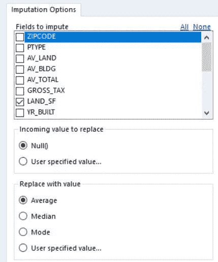**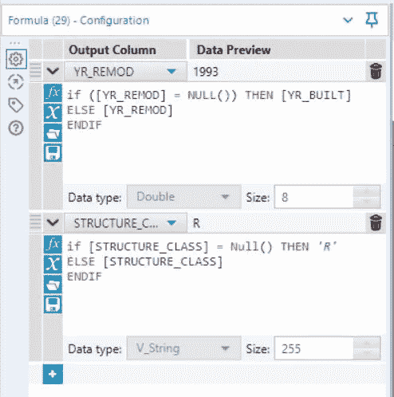**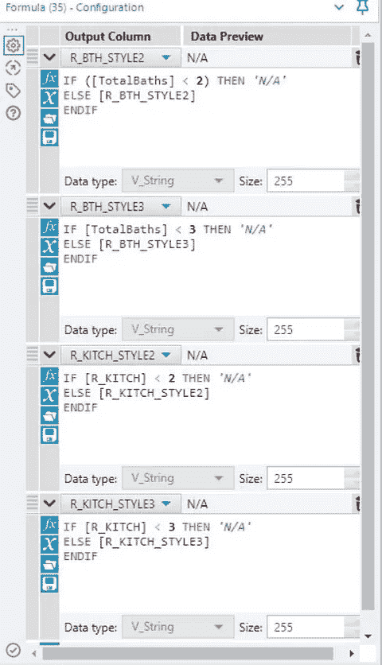*

*1)用平均值估算 LAND_SF。2)YR _ REMOD = YR _ build，STRUCTURE_CLASS 用 Mode 估算。3)估算浴室风格和厨房风格。*

## *第 3 步—修改:*

*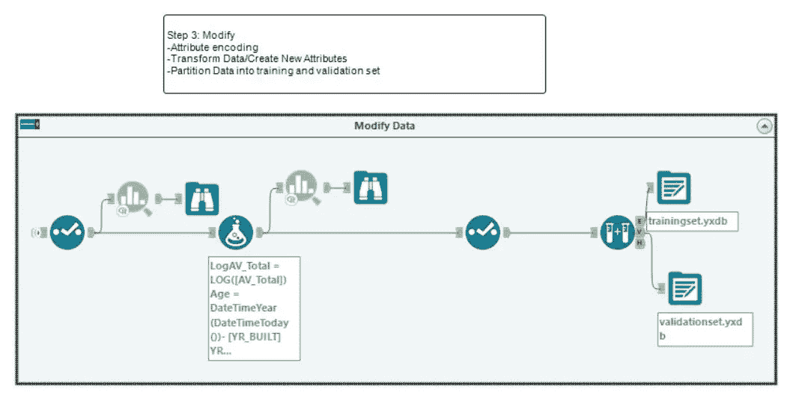*

*修改容器*

*在这一步中，我们将*

1.  ***转换数据/创建新属性:我们将为我们的分析创建几个新变量:***

*a.年龄:计算房子的年龄(当前年份-建造年份)*

*b.YR_Since_Remod:当前年度— YR_REMOD)*

*c.LogAV_Total =对数转换目标变量*

*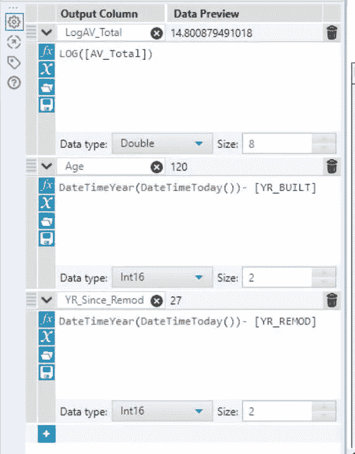*

*添加分析所需的新变量。*

***2。属性编码:***

*我们将检查所有变量，以确保数据类型是正确的，删除原始变量，如 YR_REMOD，YR _ BUILT(使用选择工具),因为我们已经计算了新的变量*

***3。将数据划分为训练集和验证集***

## *第 4 步—模型:*

***模型:**在模型阶段，重点是对准备好的变量应用各种建模(数据挖掘)技术，以创建可能提供期望结果的模型。*

*我们将在训练数据集上拟合 3 种不同的模型:决策树、线性回归和随机森林模型，并使用验证集来验证模型。*

*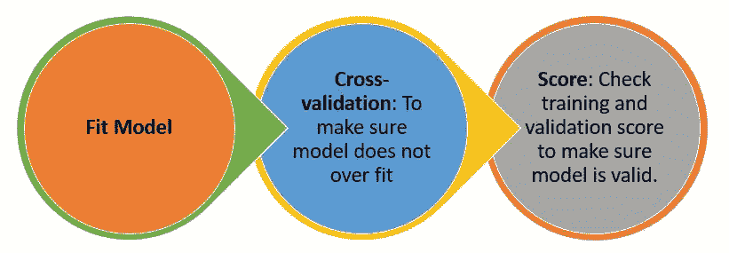*

*模型步骤*

*下图显示了交叉验证和评分块的设置。在交叉验证中，您必须选择折叠数和种子。分数块用于选择预测变量是否经过对数变换。*

*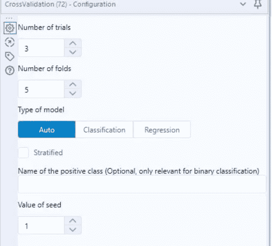***

*Alteryx 中的交叉验证和评分块*

***A)决策树模型***

*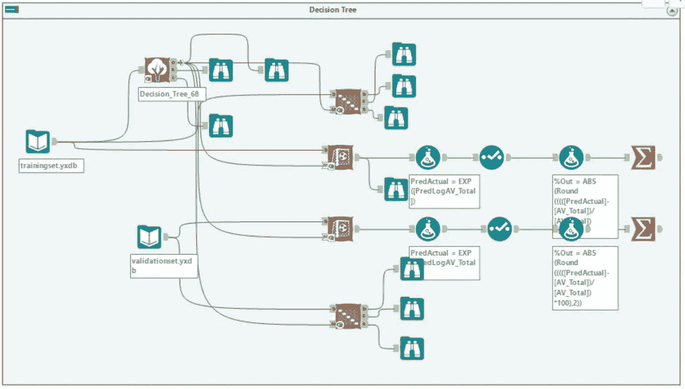*

*决策树容器，*

*我们将在训练数据上拟合一个决策树，然后在两个训练上使用交叉验证来比较“平均绝对误差”。为了适应决策树模型，我们将使用决策树块来选择目标变量和预测变量*

*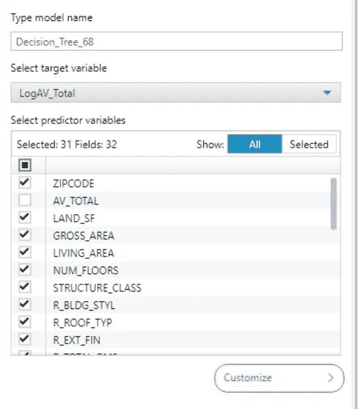*

*决策树配置*

*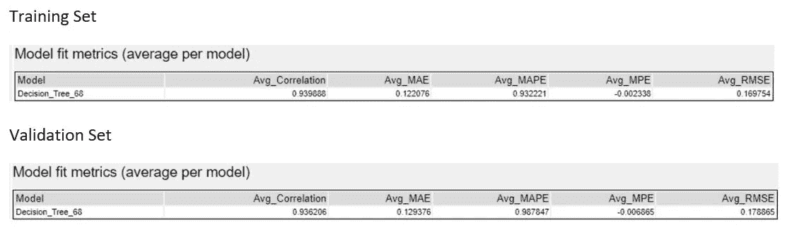**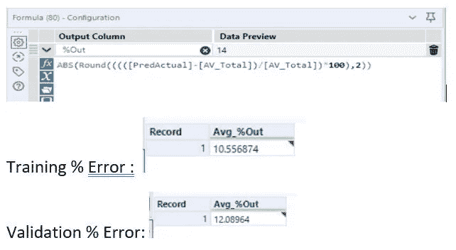*

*训练集和验证集的交叉验证和%误差。*

*交叉验证结果表明 Avg_MAE(平均绝对误差)具有可比性，因此该模型是有效的。决策树模型后添加的浏览有更多的信息和图形。*

***b)线性回归***

*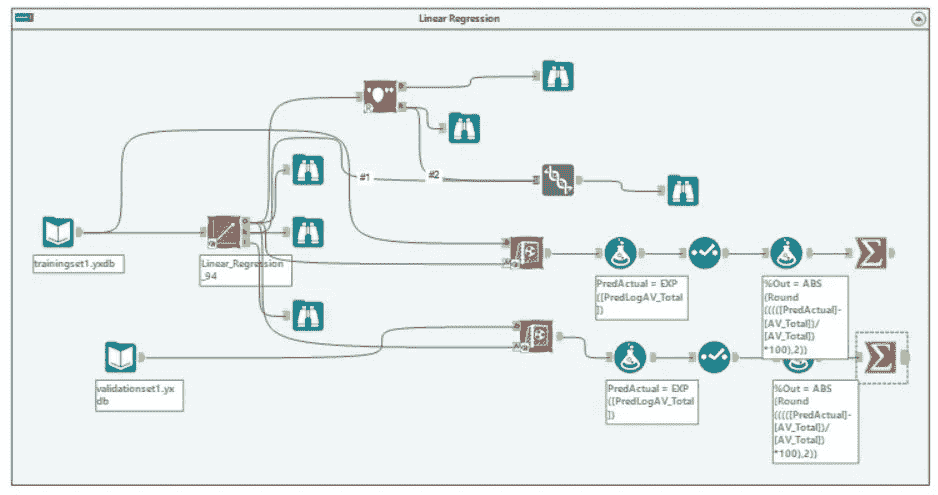*

*第一步是选择目标变量和预测变量。*

*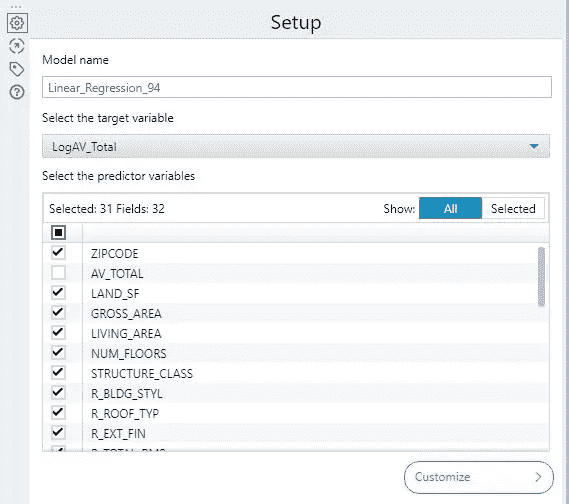*

*线性回归配置*

*一旦您运行线性回归模型，您将获得如下所示的结果:使用浏览工具，您可以获得各种其他图表，我在这里只显示了其中的一个。*

*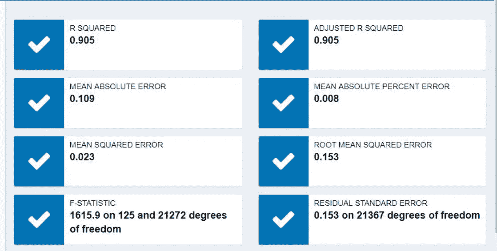*

*线性回归结果。*

*一旦我们有了线性回归模型，我们将对它进行评分，以计算训练和验证误差，如下所示。*

*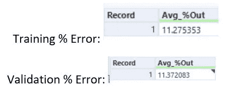*

*来自线性回归模型的训练和验证数据集分数*

***c)随机森林***

*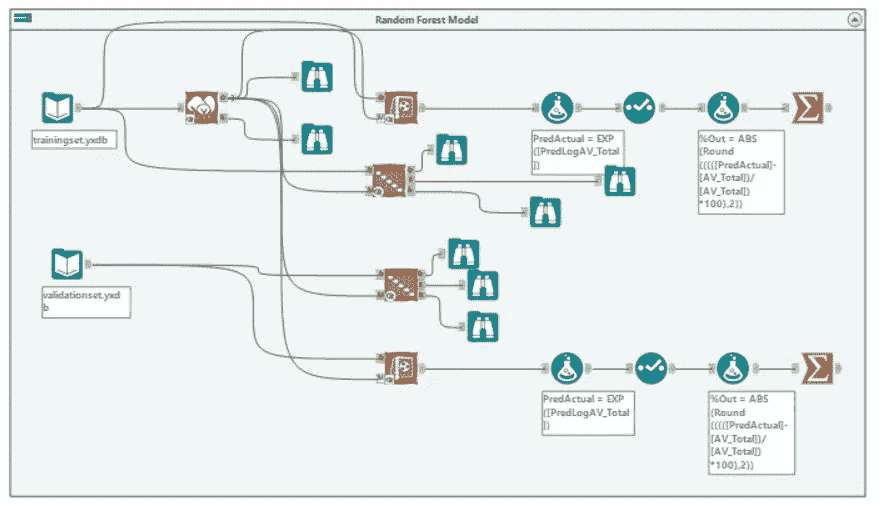*

*随机森林区块*

*随机森林建模的第一步是从工具配置中选择目标变量和预测变量。下一步是选择树的数量。我选择了“100 棵树”。如果不确定树的数量，可以添加多个随机森林块，测试不同的树深度，然后选择平均绝对误差最小的树深度。*

*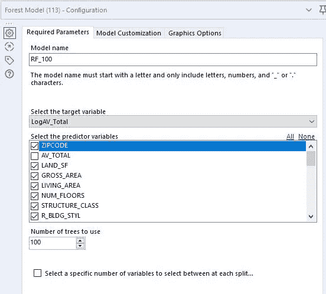*

*随机森林配置*

*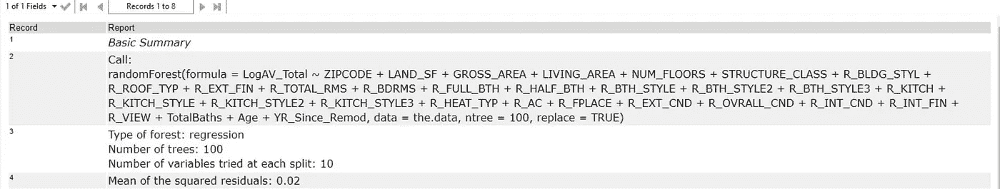*

*随机森林模型的结果*

*一旦我们有了最终的随机森林模型，我们将交叉验证训练和验证数据集的结果，并计算百分比误差。结果表明，训练集和验证集具有相似的平均绝对误差。该模型输出许多其他信息，这些信息可以用来判断该模型是否有效。*

*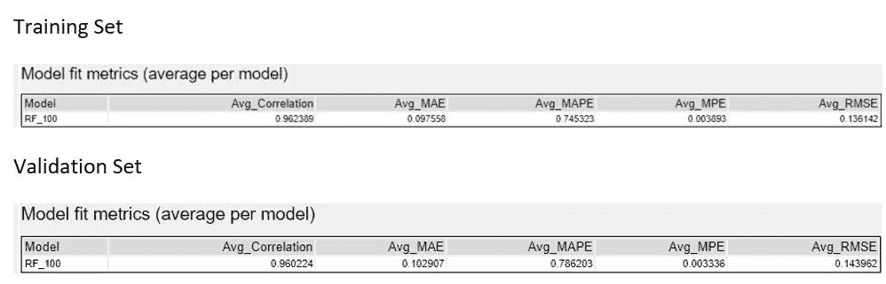**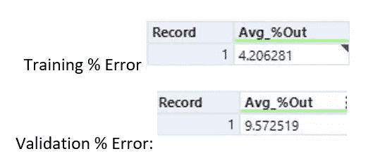*

*训练集和验证集的平均误差和%误差。*

## ***步骤 5 —评估:***

*在这一步中，我们将使用 Alteryx 模型比较工具来比较不同的模型。我们将比较培训和验证模型的“MAE ”,我们还将查看预测与实际图表。*

*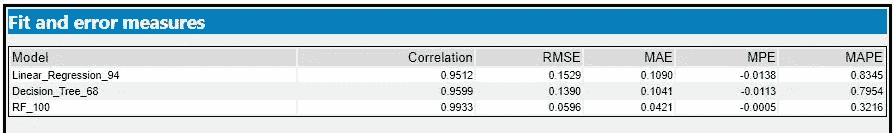*

*培训模式的模式比较*

*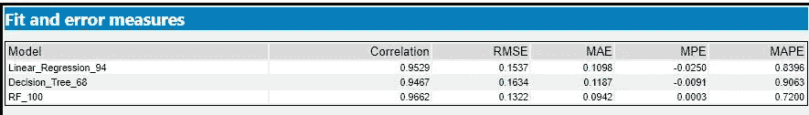*

*验证数据的模型比较*

*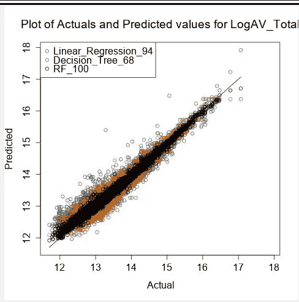**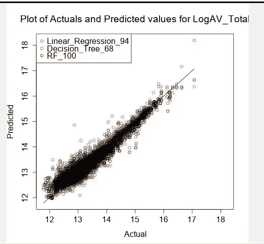

训练和验证数据的预测与实际。* 

*从图表中我们可以看出，随机森林模型的平均绝对误差最小，其次是线性回归模型。*

*此外，从交叉验证结果中，我们可以看到，训练和验证测试的平均绝对误差是相似的，因此不存在过拟合，该模型可用于预测。*

# *结论*

*Alteryx 为您提供了一种非常快速和强大的方法来准备数据，以进行分析和测试机器学习模型。根据数据大小，交叉验证可能需要更长的时间来执行。*

*为了加快 Alteryx 中的建模过程，一旦将数据分割并保存到训练集和验证集中，就要在不同的工作空间中运行每个模型。*

*你可以从 Alteryx 官方网站的 [*学习指南*](https://help.alteryx.com/learn/learningguide.html) 以及大量可用的教程和在线帮助论坛中了解更多关于 Alteryx 建模的知识。你可以在 [GITHUB](https://github.com/evjanaki/Alteryx.git) 上找到上面例子的代码。*