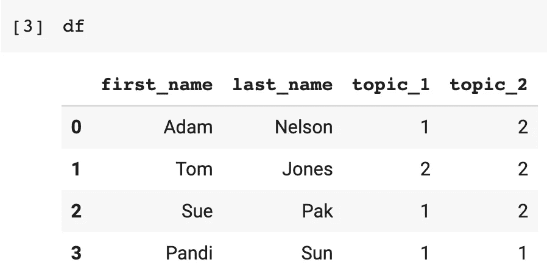
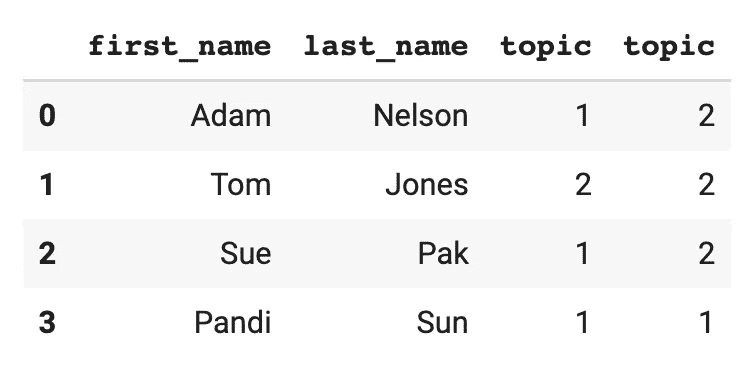
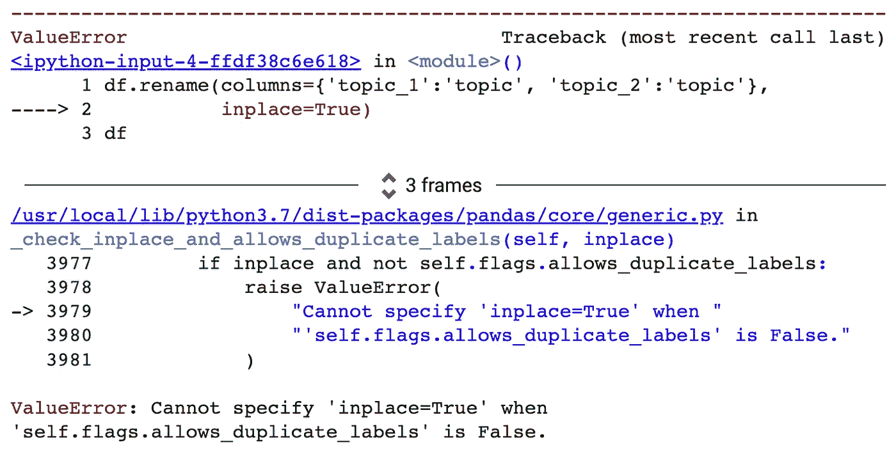
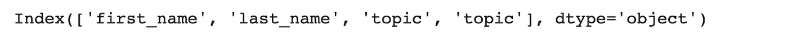
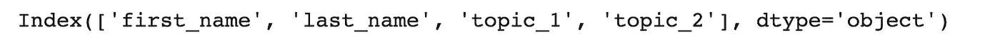

# Pandas 中的重复列名:已更新

> 原文：<https://pub.towardsai.net/duplicate-column-names-in-pandas-updated-c1cf80e95e12?source=collection_archive---------2----------------------->

## 熊猫仍然允许重复的列名，下面是你能做的

# 概观

本文展示了在 Pandas 中无意中生成一个具有重复列名但没有抛出错误的数据框是多么容易。在同一主题的上一篇文章之后的一次重要更新中，本文提供了两种管理有无重复列名的方法。

# 数据

考虑以下设置。

```
import pandas as pddata = {'first_name':['Adam','Tom','Sue','Pandi'],
        'last_name':['Nelson','Jones','Pak','Sun'],
        'topic_1':[1,2,1,1],
        'topic_2':[2,2,2,1]}df = pd.DataFrame(data)
```

生成以下数据:



图片来源:作者使用本文中的代码生成的数据表。

然后考虑在无意中创建了重复的列名时，您可能会如何决定更改列名。

```
df.rename(columns={'topic_1':'topic', 
                   'topic_2':'topic'}, inplace=True)df
```

令人惊讶的是，这里没有错误。你会得到下面的结果。



图片来源:作者使用本文中的代码生成的数据表

这不应该引起错误吗？

[](https://www.linkedin.com/posts/arnelson_datascience-advancedanalytics-github-activity-6744422877795229696-BLA7) [## 这个数据科学社区是一个社区:# data science # advanced analytics # GitHub

### 有几次我摔坏了熊猫…

www.linkedin.com](https://www.linkedin.com/posts/arnelson_datascience-advancedanalytics-github-activity-6744422877795229696-BLA7) 

## 第一个解决方案:不允许重复标签

在一次实验性更新中，熊猫社区增加了以下功能`.set_flags(allows_duplicate_labels=False)`。

为了避免破碎的熊猫(如下图所示),防止带有此标志的重复标签。例如:

```
import pandas as pddata = {'first_name':['Adam','Tom','Sue','Pandi'],
        'last_name':['Nelson','Jones','Pak','Sun'],
         'topic_1':[1,2,1,1],
         'topic_2':[2,2,2,1]}df = pd.DataFrame(data).set_flags(allows_duplicate_labels=False)
```


图片鸣谢:作者。“破熊猫。”图片来源:“Via Design Pickle”——更多关于属性的。

一旦你设置了`.set_flags(allows_duplicate_labels=False)`,下面的代码就会抛出一个错误。

```
df.rename(columns={'topic_1':'topic', 
                   'topic_2':'topic'}, inplace=True)
```



image Credit:value 尝试指定重复的列名后输出错误。

当进行依赖于唯一列名的分析时，这个`ValueError: Cannot specify 'inplace=True' when 'self.flags.allows_duplicate_lables' is False`消息很有帮助。

## 第二个解决方案:愚蠢的错误容易解决

当您发现有重复的标签时，最简单的解决方案是从头开始指定一组新的标签。

```
df.rename(columns={'topic_1':'topic', 
                   'topic_2':'topic'}, inplace=True)df.columns
```



Image Credit:作者用本文中的代码生成的输出。

```
df.columns = ['first_name', 'last_name',
              'topic_1', 'topic_2']
```



Image Credit:作者用本文中的代码生成的输出。

# 了解这些也很有用

在上面的数据帧中，通常会返回熊猫系列的代码`df['topic']`实际上返回了一个数据帧。

您可以使用`df.columns.is_unique`和`df.index.is_unique`来检测重复的列名。您可以使用`df.index.duplicated()`和`df.columns.duplicated()`来定位重复的列名(或索引条目)。

# 结论

本文展示了创建具有重复列名的 Pandas 数据框是多么容易。基于 Pandas 最近的一个重要更新，本文还展示了两个选项，这两个选项将帮助用户避免由于重复的列名而遇到问题——或者如何解决遇到的问题。

[](https://adamrossnelson.medium.com/membership) [## 加入我的介绍链接媒体-亚当罗斯纳尔逊

### 作为一个媒体会员，你的会员费的一部分会给你阅读的作家，你可以完全接触到每一个故事…

adamrossnelson.medium.com](https://adamrossnelson.medium.com/membership) 

# 感谢阅读

你准备好了解更多关于数据科学职业的信息了吗？我进行一对一的职业辅导，并有一份每周电子邮件列表，帮助专业求职者获取数据。联系我了解更多信息。

把你的想法和主意发给我。你可以写信只是为了说声嗨。如果你真的需要告诉我是怎么错的，我期待着尽快和你聊天。推特:[@ adamrossnelson](https://twitter.com/adamrossnelson)LinkedIn:[亚当罗斯尼尔森](https://www.linkedin.com/in/arnelson/)。