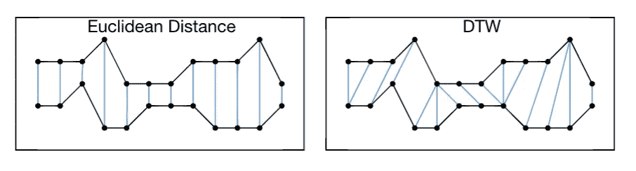
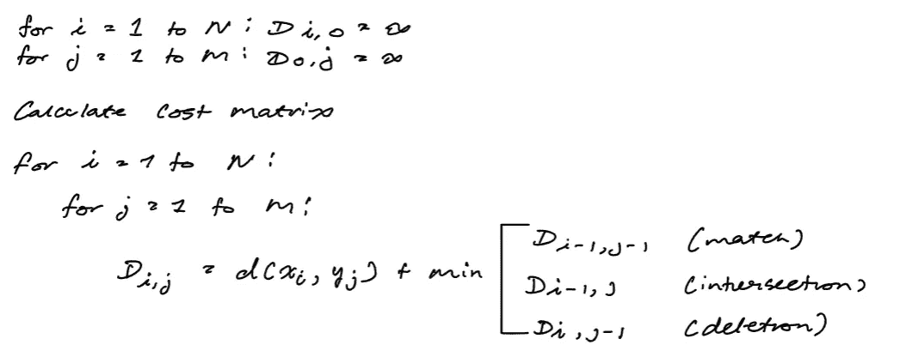
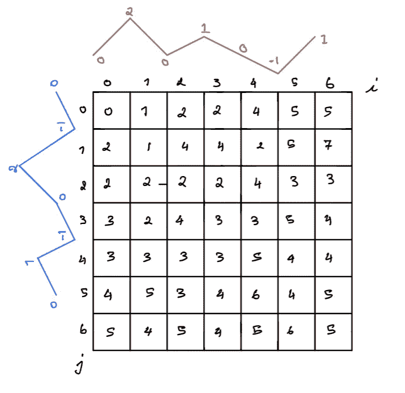
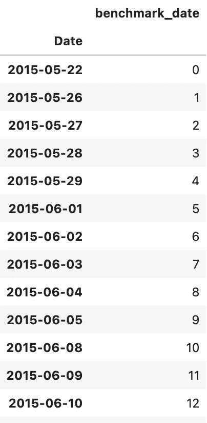

# 动态时间扭曲解释

> 原文：<https://pub.towardsai.net/dynamic-time-warping-explained-fbb24c1e079b?source=collection_archive---------0----------------------->

## [编程](https://towardsai.net/p/category/programming)

## 动态时间扭曲背后的直觉&股票数据的 Python 实现


图片来自 [Unsplash](https://unsplash.com/photos/rBPOfVqROzY) 由 [Agê Barros](https://unsplash.com/@agebarros) 拍摄

本文将讨论动态时间扭曲背后的直觉和数学。在为读者建立了坚实的理解之后，本文将继续在股票市场中应用 DTW 来寻找与其他表现非常好的股票具有相似表现的股票。如果你对此感兴趣，请继续阅读，因为目录概述了下面文章的结构。

**目录**

*   什么是动态时间扭曲(DTW)
    -算法
    -实现
    -库实现
*   问题陈述
    -数据
    -基准投资组合
    -识别相似股票
    -可视化
*   总结发言
*   资源

# 什么是动态时间扭曲(DTW)？

动态时间弯曲(DTW)是在 1968 年由 *Vintsyuk，T.K.* 在他的论文中介绍的，该论文讨论了通过动态编程进行*语音识别*【3】。该算法常用于时间序列分析。直观地说，该算法告诉你关于你正在处理的数据的两件关键事情。

1.  第一个时间序列中的哪个(些)点与另一个时间序列中的(些)点相对应(如图 1 所示)
2.  两个时间序列有多相似



图 1:两个时间序列相互比较，左边是通过欧几里德距离(1 对 1 匹配)，右边是通过 DTW (1 对多匹配)。(图片由作者提供)

现在，要了解两个时间序列有多相似，最简单的方法是采用每对对应点之间的欧几里德距离，如图 1 左侧所示。然而，动态时间扭曲考虑了每个点生成的时间，因此您可以将较高时间序列中的一个点映射到较低时间序列中的多个点，因为这是该时间步长中每个时间序列生成的点的数量。

如你所见，这个算法的美妙之处在于，你所比较的两个时间序列不一定需要同时开始或同时移动。即使这两个序列不同步，您仍然能够识别它们之间的相似性。每个时间序列也不需要相同数量的数据，它允许您将很少的信息与任何信息进行比较。

该算法适用于任何可以转化为线性序列的数据源，当您有多个线性序列时，您可以将这些序列相互比较，以查看它们有多相似。这种算法最常见的应用出现在处理音频/视频数据时。它在与语音和签名识别、形状匹配相关的问题中工作得非常好[1]。

## 算法

**输入**:大小为 n 和 m 的两个时间序列 x 和 y
规则:
1 .序列 x 中的每个索引必须与序列 y 中的一个或多个索引相匹配，反之亦然。
2。序列 x 的第一个索引必须至少与序列 y 的第一个索引匹配。序列 x 的最后一个索引必须至少与序列 y 的最后一个索引匹配。序列 x 中的索引到序列 y 中的索引的映射必须总是递增的。[1]

算法如下:



DTW 算法(图片由作者提供)



图 2: DTW 算法在两个样本时间序列 x 和 y 上运行；这是生成的成本矩阵(图片由作者提供)

## 履行

## 库实现

[快速 DTW](https://pypi.org/project/fastdtw/#description) 是由 [Slaypni](https://github.com/slaypni) 创建的开源库。这个库运行时间和空间复杂度为 O(N)的 DTW 算法，而上面的实现具有 O(N)的时间复杂度。因此它比使用这个库要慢很多。

# 问题陈述

就本文的目的而言，让我们在 DTW 的常规应用之外做一些更有趣的事情。让我们在一些股票数据上运行 DTW，而不是在语音和音频数据上。我们要解决的问题很简单:给定一家公司每日收盘价的趋势线，你能找到其他有类似趋势线的公司吗？

对于这种情况，让我们以 Shopify 这样的高绩效公司作为我们的基础公司。我们希望找到与 Shopify 有类似趋势的其他公司。正如你所看到的，这对于技术分析来说是一个非常有用的策略，因为它可以让你找到新的公司，这些公司的表现类似于那些强大和成熟的公司。最好将早期 IPO 的初创公司与 Shopify 这样的公司进行比较。现在有一些时髦的公司最近首次公开募股，为了这篇文章，让我们看看其中的 5 家[2]。

1.  比特币基地
    首日交易:2021 年 4 月 14 日
    参考价:250 美元
    估值:860 亿美元
2.  数字海洋
    IPO 日期:2021 年 3 月 23 日
    IPO 价格:47 美元
    IPO 估值:50 亿美元
3.  Bumble
    IPO 日期:2021 年 2 月 11 日
    IPO 价格:43 美元
    IPO 估值:82 亿美元
4.  Coursera
    IPO 日期:2021 年 3 月 31 日
    IPO 价格:33 美元
    IPO 估值:43 亿美元
5.  Duolingo
    首日交易:2021 年 7 月 28 日
    IPO 价格:102 美元
    估值:37 亿美元

如果你有兴趣研究其他的，你可以参考 Crunch-Base 的文章[2],我从[这里](https://news.crunchbase.com/news/heres-whos-gone-public-in-2021-so-far/)获取了这些信息。请注意，我们可能会得到这个实验的糟糕结果，我随机选择这些股票，它们与 Shopify 有相似趋势线的可能性很小。这个练习完全是出于对如何将 DTW 应用于现实世界的好奇心。

## 数据

**要求**

```
Python=3.8.8
pandas=1.2.4
numpy=1.20.1
scipy=1.6.2
matplotlib=3.3.4
fastdtw=0.3.4
yfinance=0.1.68
```

您可以在终端中通过以下命令安装 yahoo finance 库:

```
pip install yfinance
```

下面的代码将导入与上述股票相关的股票数据，并可视化它们的收盘趋势线。

## 以 Shopify 为基准，在股票上运行 DTW

因为我们很有把握地知道，将整个 Shopify 趋势线与这些股票中的任何一只进行比较都是不公平的，并且会产生很大的距离(意味着它们不相似)，所以让我们对数据集进行基准测试。我们可以通过简单地将日期映射到一个索引(本质上是一个序数编码)来做到这一点，这意味着每个人都将从同一日期开始。如下图所示。



应用于日期的顺序编码将每个日期映射到一个递增的索引(图片由作者提供)

现在，我们可以应用动态时间弯曲来比较从第 0 天到最大日的比较股票的 Shopify 趋势线。这将假设两种股票同时发行，并且每种股票都有相同数量的数据。

它应该产生以下结果:


与比较 Shopify 股票趋势线和其他最近 IPO 股票相关的结果距离矩阵(图片由作者提供)

这些是与最近 IPO 公司相关的股票趋势与 Shopify 在它们上市的同一初始时期相比的差距。如何解释这个结果很简单:距离字典中的值对应于与 Shopify 观察到的趋势和初创公司观察到的趋势之间的距离(也就是距离字典中的键)。值越低意味着趋势线越相似，值越高意味着趋势线越不同。显然，我们可以看到 COUR(又名 Course Era)与 Shopify 的趋势线最相似，但是仅仅因为它最相似，并不意味着它会像 Shopify 一样成功。很难衡量它，虽然 COUR 在这些数据中是最相似的，但它仍然离 Shopify 趋势线很远。

# 总结发言

DTW 告诉你关于你的数据的两件重要的事情。首先，它告诉您一个时间序列中的哪些点与另一个时间序列中的点相对应。其次，它告诉你两个时间序列有多相似。请注意，对于问题陈述，我相对随意地选择了股票，目标不是找到另一只与 Shopify 趋势线相似的股票，而是展示这种算法在非传统环境中的应用。

请注意，如果您试图重现这些结果，您可能会得到与本文中呈现的结果不同的结果，这是因为您可以获得的数据量会更大，因为最近的 IPO 股票会有更多的相关数据。你可以在这里找到本文[中的代码。](https://github.com/vatsal220/medium_articles/tree/main/dtw)

# 资源

*   [1]https://en.wikipedia.org/wiki/Dynamic_time_warping
*   [2][https://news . crunchbase . com/news/heres-whos-gone-public-in-2021-至今/](https://news.crunchbase.com/news/heres-whos-gone-public-in-2021-so-far/)
*   [3] Vintsyuk，T.K .通过动态规划进行语音识别。*赛博恩系统分析* **4，**52–57(1968)。[https://doi.org/10.1007/BF01074755](https://doi.org/10.1007/BF01074755)

如果你喜欢这篇文章，这里有一些我写的其他文章，你可能也会喜欢。

[](https://towardsdatascience.com/word2vec-explained-49c52b4ccb71) [## Word2Vec 解释道

### 解释 Word2Vec 的直观性&用 Python 实现它

towardsdatascience.com](https://towardsdatascience.com/word2vec-explained-49c52b4ccb71) [](/salary-analysis-comparison-of-the-us-canadian-markets-b6813839ca55) [## 美国和加拿大市场的薪资分析和比较

### 分析匿名提交的美国和加拿大经济的工资和人口统计数据

pub.towardsai.net](/salary-analysis-comparison-of-the-us-canadian-markets-b6813839ca55) [](https://towardsdatascience.com/markov-chain-explained-210581d7a4a9) [## 马尔可夫链解释道

### 在本文中，我将解释并提供马尔可夫链的 python 实现。这篇文章不会是一篇深刻的…

towardsdatascience.com](https://towardsdatascience.com/markov-chain-explained-210581d7a4a9) [](https://towardsdatascience.com/monte-carlo-method-explained-8635edf2cf58) [## 蒙特卡罗方法解释

### 在这篇文章中，我将向你介绍、解释和实现蒙特卡罗方法。这种模拟方法是一种…

towardsdatascience.com](https://towardsdatascience.com/monte-carlo-method-explained-8635edf2cf58) [](https://towardsdatascience.com/random-walks-with-restart-explained-77c3fe216bca) [## 带重启的随机漫步解释

### 理解带重启的随机游走算法及其在 Python 中的相关实现

towardsdatascience.com](https://towardsdatascience.com/random-walks-with-restart-explained-77c3fe216bca) [](https://towardsdatascience.com/identifying-tweet-sentiment-in-python-7c37162c186b) [## 在 Python 中识别推文情感

### 如何使用 Tweepy 和 Textblob 识别推文情感

towardsdatascience.com](https://towardsdatascience.com/identifying-tweet-sentiment-in-python-7c37162c186b) [](https://towardsdatascience.com/mining-modelling-character-networks-part-ii-a3d77de89638) [## 挖掘和模拟字符网络—第二部分

### 本文将介绍挖掘和建模字符网络的 Python 实现

towardsdatascience.com](https://towardsdatascience.com/mining-modelling-character-networks-part-ii-a3d77de89638)