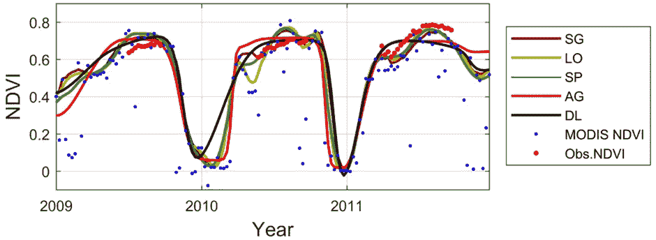
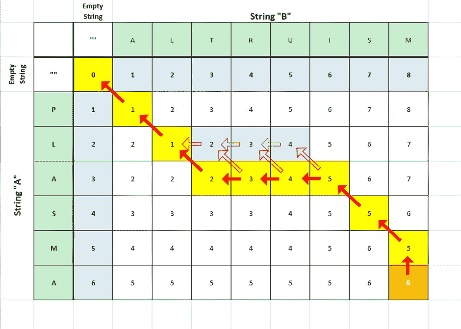
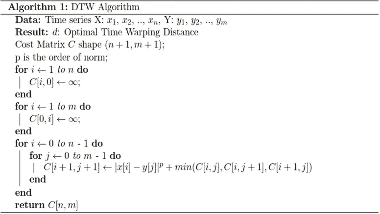
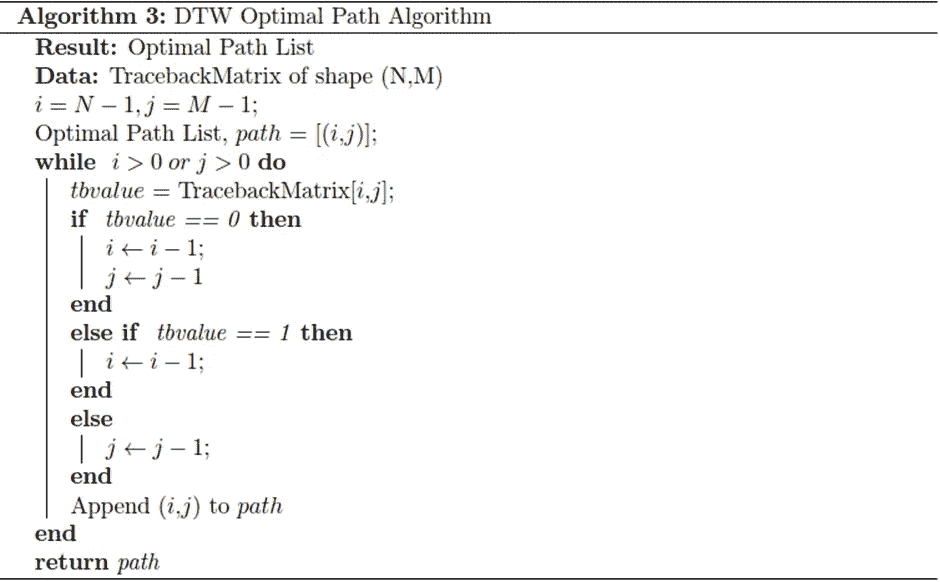
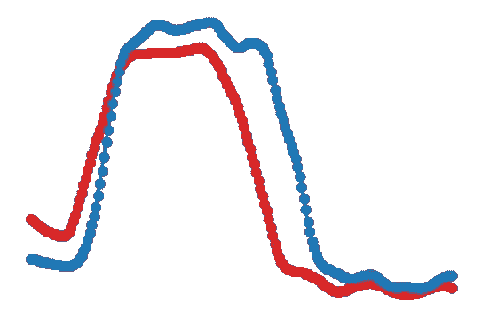
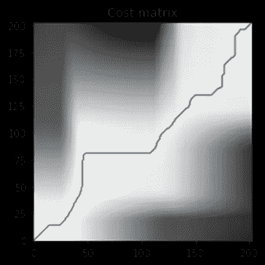
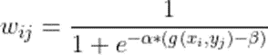
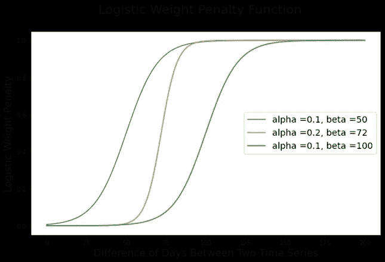
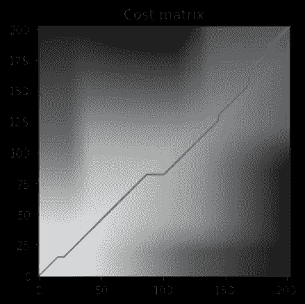
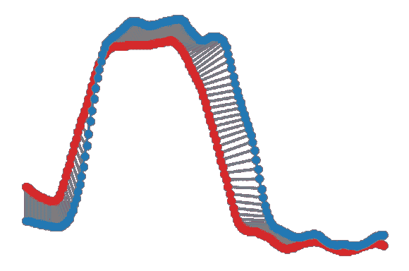

# 基于时间序列分析的动态时间弯曲

> 原文：<https://pub.towardsai.net/dynamic-time-warping-on-time-series-analysis-be1d0f0b40f7?source=collection_archive---------0----------------------->

NDVI 时间序列

# **简介**

农业在像印度这样的发展中国家起着非常重要的作用。它对国内生产总值的贡献约为 20%，58%的印度人口与农业有关。小麦是印度的主食之一。机器学习在农业的各个收获阶段发挥着重要作用，以提高作物产量，预测天气，识别疾病和害虫等。

研究了 2020 年 10 月至 2020 年 5 月印度三个地区(即 Karnal、Kaithal 和 Dewas)小麦的季节性生长。用于研究这一问题的度量是植被指数，该指数是归一化的(称为 NDVI ),并根据 Sentinel-2 卫星数据预先计算。训练数据包括该地区的地理信息，即纬度和经度，以及该地区是否能生产小麦的信息。它还包含该地区每个部门从发芽日期到收获日期的 NDVI 数据，这是前者的主键，也是后者的外键。

给定的问题涉及印度三个地区小麦季节性生长的 **NDVI** 时间序列。每个地区的数据构成了 **NDVI** 时间序列，可以有不同的开始和结束日期，即开始发芽和结束收获。因此，时间序列的长度有时是变化的。我们提出了一种使用动态时间弯曲来比较两个时间序列的方法。

使用动态时间弯曲(DTW)对各地区的 NDVI 时间序列进行相似性分析。DTW 被用作特征嵌入和 1NN 分类的度量。将这两种方法应用于测试数据，并比较评估指标。对于特征嵌入，使用了两种分类器，即支持向量机和基于树的集成方法。在基于树的集成方法的情况下，使用随机森林分类器。两个分类器的评估结果将针对单个和组合区进行检查，并针对一个分类器优于另一个分类器的情况进行分析和讨论。

# **工作动机**

使用动态时间弯曲作为特征嵌入以及用于 **1NN** 分类的度量的时间序列之间的相似性之前已经在 UCR 数据集以及音频和语音合成和信号分析领域中的时间序列上进行过分析，并且广泛用于时间序列分类。

我们分析了从 Landsat 和 Sentinel 2 卫星收集的**异相**时间序列数据的动态时间弯曲作为特征嵌入。通过使用动态时间弯曲作为 **1NN** 分类的度量和作为特征嵌入，对这些进行了分析，并对两者之间的有效性进行了比较。

# **工作结构**

DTW 遵循编辑距离算法，将时间序列视为子序列，并在时间序列的所有可能点之间计算变形。它基本上表示时间序列之间的对齐距离，其值表示将比较时间序列转换为参考时间序列所需的对齐。动态计算时间弯曲的详细算法及其属性将在接下来的章节中详细介绍。

动态时间弯曲距离可用于音频信号分析、卫星图像分析等。然而，它不可能是一个规范，因为规范的性质被违反了，这将在下一节中讨论。

# **相关工作**

作为该项目的一部分，该领域的一些引人注目的工作如下:

本文分析了具有异相时间序列的动态时间弯曲(Maus et al .，2016)，，其中通过引入时间加权的动态时间弯曲方法来处理不同长度的时间序列。这里使用动态时间弯曲作为度量。

在论文(Kate，2015)中分析了作为特征嵌入的动态时间弯曲。这里作者建议使用动态时间弯曲作为特征。

本文(Young-Seon，Jeong 和 Omitaomu，2011 年)讨论了异相时间序列和不同的惩罚函数，这些函数可应用于相同的时间序列，以限制它们之间的动态时间扭曲。

# 动态时间扭曲:

给定两个时间序列 X=x1，x2，x3…，xn 和 Y=y1，y2，y3…，ym，可以在两者之间计算的最简单的距离度量是欧几里德距离，假设 m=n

欧几里德距离度量使用起来非常简单和有效，因此它被广泛用于数据挖掘任务。然而，这种简单性在时间序列任务中有一个缺点，因为欧几里德距离度量对于时间序列之间由于平方项引起的距离的小变化惩罚更多。这种微小的变化可能是由于时间序列开始得稍早/稍晚或结束得稍早/稍晚。另一个缺点是时间序列需要有相等的长度来计算它。时间序列中的上述两个缺点都可以通过使用动态时间弯曲来克服。

动态时间扭曲试图找到时间序列 X=x1，x2，x3…，xn 和 Y=y1，y2，y3…，ym 之间的最佳对齐。为了对齐时间序列，使用了使用动态规划的编辑距离算法的概念。最佳的对齐将使时间序列上各点之间的总成本最小化。在这种情况下，成本是范数，或者是 1 范数，也称为曼哈顿距离，或者是 2 范数，也称为欧几里德距离。一般用 p 范数表示。

该算法描述如下。

DTW 算法

计算动态时间弯曲的总计算复杂度是 O(mn)，其中 m 和 n 是时间序列的长度。从上面可以得出结论，这是一个计算量很大的过程。已经引入了各种加速，如引入距离的下限或引入大小为 r 的窗口，这将扭曲路径限制为更靠近成本矩阵的对角线。这有助于提高计算动态时间弯曲的计算速度以及提高时间序列分类的准确性。
在我们的例子中，我们将使用的约束是时间加权的，这是一个依赖于时间序列的日期的惩罚成本函数，并对相同的动态时间扭曲进行惩罚，这将在下一节中讨论。

# 动态时间弯曲的性质

a)如果在计算从测试到参考点的对准时选择的步进模式是对称的，则动态时间弯曲是对称的，否则，它是不对称的。

b)两个相似序列之间的动态时间弯曲为 0。

c)动态时间弯曲不遵循三角不等式。

上面的第三个特性 c)告诉我们，动态时间弯曲违反了规范特性，因此不能被视为规范，因此不能被视为度量。因此，它可以被视为一种措施。在计算下一节讨论的参考点和测试点之间的动态时间弯曲矩阵时，将使用动态时间弯曲的前两个特性。

# **动态时间扭曲的最佳路径(DTW)**

在上面讨论的 DTW 算法中，为了回溯最优路径，维护回溯矩阵，该回溯矩阵存储在动态编程的中间步骤期间计算动态时间弯曲时做出的决定，即匹配、插入和删除。使用路径列表，该路径列表用时间序列的结束索引 X 和 Y 初始化。然后，基于回溯矩阵，将时间序列的其他索引 X 和 Y 附加到路径列表。基于给定索引处的追溯矩阵的值，索引被迭代地递增/递减。最佳路径的长度就是路径列表中元素的数量。

该算法描述如下。

DTW 最优路径算法

# 时间序列图(来自示例数据集)

时间序列图

# **原始 DTW 成本矩阵和时间序列比对(来自示例数据集)**

天真的 DTW 成本矩阵

从上面的成本矩阵图中，我们可以观察到不正确的对齐导致最佳路径远离对角线。我们将在下一章中观察时间加权动态时间扭曲如何通过惩罚不正确的扭曲来减少不正确的对齐，从而使最佳路径更接近对角线。

天真的 DTW 最优路径对齐

从上面的图中，我们观察到天真的 DTW 产生了不正确的比对，当我们使用下一章中描述的时间加权动态时间扭曲时，这将被校正。

# 时间加权动态时间弯曲；

前一章讨论了动态时间弯曲的原始实现。由此，我们可以得出结论，在计算测试点和参考点之间的距离时，它应用了相等的权重。但是，可能会出现测试点和参考点之间存在相位差的情况。最初的实现不处理它。在论文(Young-Seon，Jeong，& Omitaomu，2011) *中，提出了*权重成本函数来克服测试点和参考点之间的相位差问题。通过使用惩罚来防止序列中的点与另一个序列进一步匹配，这又降低了误分类率。我们的问题与 NDVI 时间序列有关，NDVI 是使用图像的像素来计算日期的。因此，这个问题属于时空分类范畴。如论文(Maus 等人，2016 年)中所提议的，我们将继续使用修正的加权逻辑成本函数，该函数具有中点β和陡度α。

逻辑权重罚函数

让我们通过上述等式来计算上述时间序列 X 和 Y 的罚值。 *wij* 表示罚值，α和β是表示逻辑函数的陡度和中点的超参数，可以通过在训练和测试数据上运行不同的实验来获得。 *g(xi，yj)* 是表示上述两个时间序列 X 和 Y 的 xi 和 yj 的日期之间的当天差异的函数。下图显示了不同超参数值(即α和β)的罚值 *wij* 。

为超参数中点β和陡度α的不同值绘制逻辑权重罚函数。

从上面计算的罚函数值被加到下面描述的动态时间弯曲距离计算算法中。

# α=0.001 和β=20 时的时间加权 DTW 成本矩阵和时间序列对齐(来自示例数据集)

时间加权 DTW 成本矩阵

从上面的图中，我们观察到时间加权动态时间扭曲通过惩罚不正确的扭曲来减少不正确的对齐，从而导致最佳路径更接近对角线。

时间加权 DTW 最优路径对齐

从上面的图中，我们观察到时间加权的动态时间扭曲通过惩罚不正确的扭曲而减少了不正确的比对，当与天真的 DTW 比较时。

# **结论**

作为该项目的一部分而开发的分类器模型能够单独或组合预测不同地区的小麦生长情况。此外，这项研究得出了以下重要结论:

a)每个地区的时间加权 DTW 个体模型比合并模型表现得更好。

b)使用时间加权 DTW 作为用于分类的特征嵌入，在测试数据上给出了比使用它作为用于 1NN 分类的度量时更好的评估结果。

c)当使用时间加权 DTW 作为特征嵌入时，使用 SVC 作为分类器，因为它处理预测器数量的问题，即特征数量>数据集中的观察数量。

# **参考文献**

1.凯特·j . r .(2015)。使用动态时间弯曲距离作为特征。*斯普林格*，28 岁。

2.Maus，v .，Camara，g .，Cartaxo，r .，Sanchez，a .，Ramos，M. F .，和 Ribeiro，Q. G. (2016 年)。一种用于土地利用和土地覆盖制图的时间加权动态时间弯曲方法。 *IEEE 应用地球观测和遥感专题期刊*，10。

3.Young-Seon，j .，Jeong，K. M .，& Omitaomu，A. O. (2011 年)。用于时间序列分类的加权动态时间弯曲。*爱思唯尔*，10。