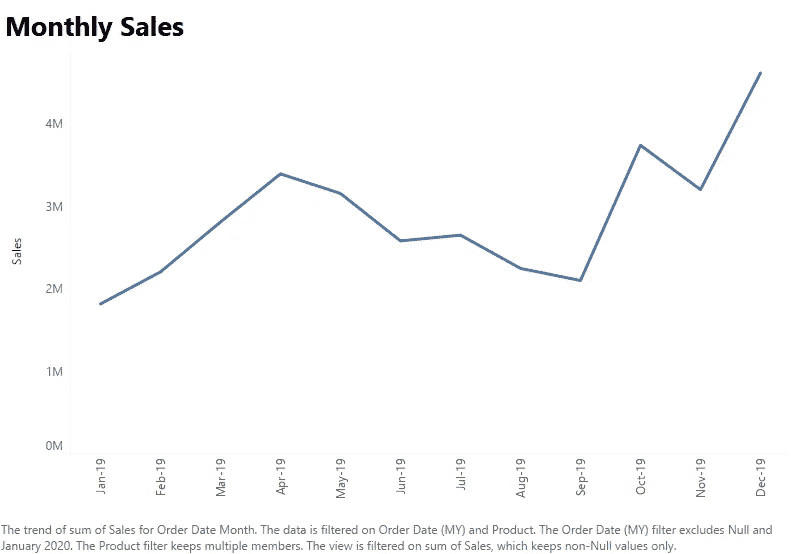
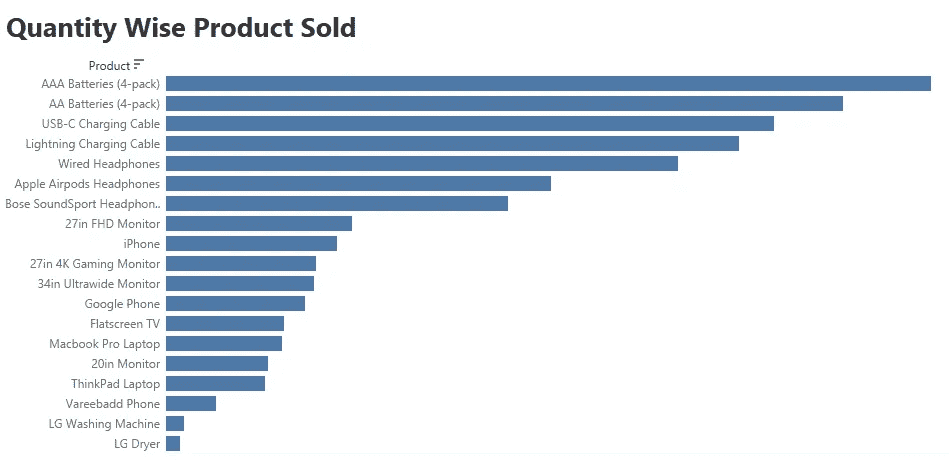
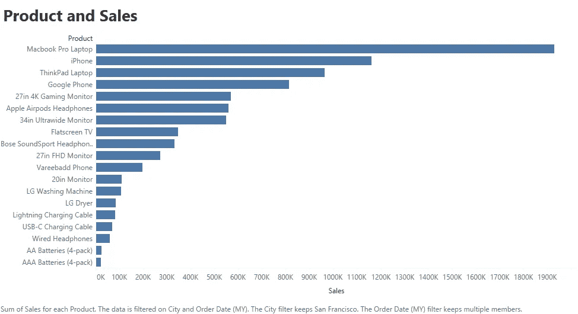
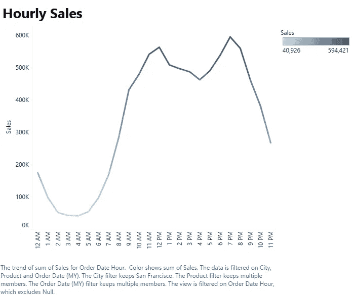
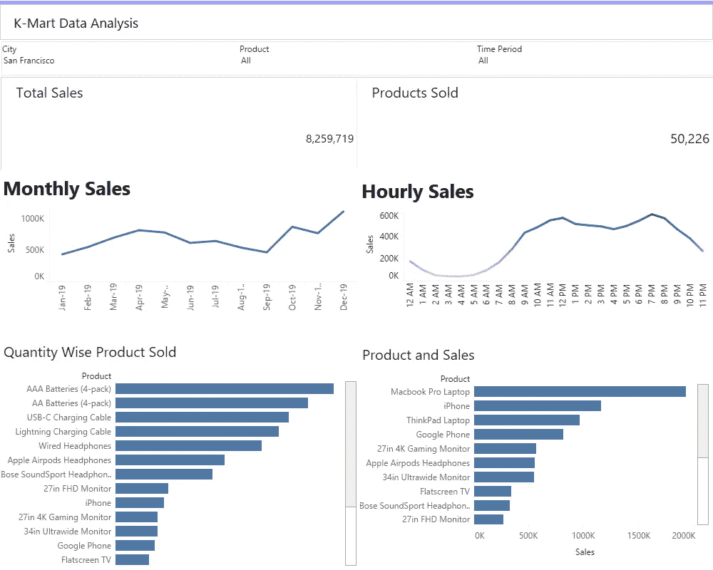

# 使用 Tableau 进行电子商务数据分析

> 原文：<https://pub.towardsai.net/e-commerce-sales-strategy-using-tableau-ca69a7c910a?source=collection_archive---------3----------------------->

## [数据分析](https://towardsai.net/p/category/data-analysis)

由[卢克·切瑟](https://unsplash.com/@lukechesser?utm_source=medium&utm_medium=referral)在 [Unsplash](https://unsplash.com?utm_source=medium&utm_medium=referral) 上拍摄的照片

基于对 2019 年销售数据的洞察，k-mart 2020 年销售战略。

# 介绍

凯马特是美国领先的在线零售商，作为其年度销售审查会议的一部分，他们需要根据 2019 年销售数据的见解，决定 2020 年的销售战略。

数据与 2019 年每个月的销售相关，任务是产生关键的见解，帮助凯马特的**销售团队**做出一些关键的商业决策，以微调他们的销售战略。

# 数据理解

1.数据属于美国领先的在线零售商 Kmart。

2.时间段—2019 年 1 月—2019 年 12 月

3.独特产品— 19

4.订单总数— 178437

5.城市— 9

6.KPI 总销售额、售出的产品总数

来源-作者

# Tableau 工作表

来源-作者

2019 年销量最好的月份是 12 月。12 月份的总销售额是 4619297 美元

来源-作者

2019 年售出 31017.0 节 AAA 电池(4 节装)。它卖得最多，因为它是最便宜的产品

来源-作者

Mackbook Pro 笔记本电脑的销量最高。

来源-作者

大约在晚上 7:00 销售是最大的。

# Tableau 仪表板

来源-作者

我们可以在仪表板上应用城市、产品和时间段过滤器。

# 基于分析的商业建议

1.公司应在 1 月和 9 月等月份提供优惠和折扣，以增加 2020 年的销售额，因为这些月份在 2019 年的销售额最低。

2.与其他城市相比，奥斯汀、波特兰和达拉斯的销售量较少。该公司应该寻找其背后的原因，以提高 2020 年的销量。

3.大约中午 12:00 和晚上 7:00 是展示广告的最合适时间，以最大化顾客购买产品的可能性。

4.AAA 电池(4 节装)在 2019 年销量最大。公司应保管好 AAA 电池(4 节装)的库存。

5.公司可以根据 2019 年的见解制定价格策略。

# 在你走之前

*感谢阅读！如果你想和我联系，请随时通过 jsc1534@gmail.com 联系我或者我的* [*LinkedIn 个人资料*](http://www.linkedin.com/in/juhi-sharma-ds) *。*