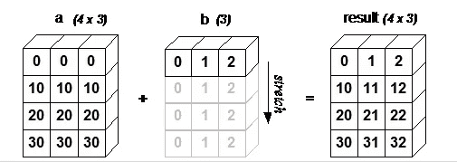

# 初学者最简单的数字指南第 2 部分

> 原文：<https://pub.towardsai.net/easiest-numpy-guide-for-beginners-part-2-6b94c1466b6d?source=collection_archive---------3----------------------->

## [编程](https://towardsai.net/p/category/programming)


这部分是我博客第一部分的延续。我呼吁你仔细阅读第一部分，以便更好地理解这个博客。

[](https://medium.com/towards-artificial-intelligence/easiest-numpy-guide-for-beginners-part-1-c031a21c4c90) [## 初学者最简单的数字指南第 1 部分

### 什么是 Numpy？

medium.com](https://medium.com/towards-artificial-intelligence/easiest-numpy-guide-for-beginners-part-1-c031a21c4c90) 

1.  Numpy 数组中的 Where 函数

其中 NumPy 数组中的函数用于查找满足上述条件的一组值。此方法返回值的索引，而不是值本身。

```
**Input:** import numpy as np
arr=np.array([8,94,8,56,7,3,2,1,0])
print(np.where(arr>10))**Output:                           #Returns the index not values** (array([1, 3], dtype=int64),)**Input:** val1= np.where(arr>10)
print(arr[val1])**Output:             #After passing index to array we can get values** [94 56] 
```

2.min()，max()，argmin()，argmax()

1.  min()-在 Numpy 数组中找到 ***的最小值*** 。
2.  max()-查找 Numpy 数组中的 ***最大值*** 。
3.  arg min()-在 Numpy 数组中查找最小值 的 ***索引。***
4.  arg max()-查找 Numpy 数组中最大值 的 ***索引。***

```
**Input:**
print(arr.min())
print(arr.max())
print(arr.argmax())
print(arr.argmin())**Output:** 0                       #Min Value
94                      #Max Value
1                       #Index of Min Value
8                       #Index of Max Value
```

3.使用 Numpy 读写文件

1.  savetxt()和 loadtxt()

savetxt()-用于将一些文本内容写入文件。我们可以使用 savetxt()来创建和写入文本文件或 CSV 文件。

CSV 文件是包含逗号分隔值的文件。这种类型的文件可以通过在 savetxt()中使用 delimiter 关键字来创建。

```
**Input:** import numpy as np
arr=np.array([8,94,8,56,7,3,2,1,0])
np.savetxt('arr_file.csv',arr,delimiter=',')**Output:**
```


```
**Input:** np.loadtxt('arr_file.csv',delimiter=',')**Output:** array([ 8., 94.,  8., 56.,  7.,  3.,  2.,  1.,  0.])
```

2.save()，load()，savez()

。npy -它是一个 NumPy 数组中的二进制文件，其中只能包含一个数组。

。npz——它就像一个包含多个。npy 文件在里面。

save()-保存文件。npy 扩展

load()-用。npy 和。npz 扩展

savez()-保存文件。npz 扩展

```
**Input:**
arr_1=np.array([8,94,8,56,7,3,2,1,0])
arr_2=np.array([2,3,4,5,6,7,8,9])
np.save(‘data1.npy’,arr_1)              #creation of .npy
np.save(‘data2.npy’,arr_2)              #creation of .npy
np.savez(‘both.npz’,arr_1,arr_2)        #creation of .npz
d=np.load(‘both.npz’)
print(d.files)                          #Arrays in zip folder
print(d[d.files[0]])                    #First Array
print(d[d.files[1]])                    #Second Array**Output:** ['arr_0', 'arr_1']
[ 8 94  8 56  7  3  2  1  0]
[2 3 4 5 6 7 8 9]
```

4.Numpy 数组中的连接和排序

1.  连接方法

**axis=0 -** 按行串联

**axis=1 -** 按列串联

```
**Input:**
arr_3=np.array([[1,2],[5,6],[7,8]])
np.concatenate([arr_3,arr_3],axis=0)**Output:** array([[1, 2],
       [5, 6],
       [7, 8],
       [1, 2],
       [5, 6],
       [7, 8]])**Input:** np.concatenate([arr_3,arr_3],axis=1)**Output:** array([[1, 2, 1, 2],
       [5, 6, 5, 6],
       [7, 8, 7, 8]])**For concatenation the dimensions of two arrays should be exactly the same otherwise it will give valueError.****Input:**
np.concatenate([arr_1,arr_3],axis=0)**Output:****ValueError**                                Traceback (most recent call last)
**<ipython-input-17-c9ceb2b572e7>** in <module>
**----> 1** np**.**concatenate**([**arr_1**,**arr_3**],**axis**=0)**

**<__array_function__ internals>** in concatenate**(*args, **kwargs)**

**ValueError**: all the input arrays must have same number of dimensions, but the array at index 0 has 1 dimension(s) and the array at index 1 has 2 dimension(s)
```

2.vstack()和 hstack()方法

v stack()-垂直堆叠元素。

hstack() —水平堆叠元素。

```
**Input:**
np.vstack([arr_3,arr_3])**Output:** array([[1, 2],
       [5, 6],
       [7, 8],
       [1, 2],
       [5, 6],
       [7, 8]])**Input:** np.hstack([arr_3,arr_3])**Output:** array([[1, 2, 1, 2],
       [5, 6, 5, 6],
       [7, 8, 7, 8]])
```

排序-

默认情况下，排序是按行进行的

```
**Input:**
npa=np.hstack([arr_3,arr_3])
print(npa)
npa.sort()
print(npa)**Output:**
[[1 2 1 2]           #Before sorting
 [5 6 5 6]
 [7 8 7 8]][[1 1 2 2]           #Sorted Rowwise
 [5 5 6 6]
 [7 7 8 8]]
```

5.以数字表示的日期和时间

特定日期和时间的创建

```
**Input:**
import numpy as np
d = np.datetime64(‘2020–12–01 23:34:56’)
print(d)**Output:** 2020-12-01T23:34:56**Input:** print(d+1)           #Extra second gets added**Output:** 2020-12-01T23:34:57**Adding a day into the date****Input:** oneday = np.timedelta64(1,'D')
print(oneday)
print(oneday+d)**Output:** 1 days
2020-12-02T23:34:56**Adding minute into time****Input:** tenminutes = np.timedelta64(10,'m')
print(tenminutes)
print(tenminutes+d)**Output:** 10 minutes
2020-12-01T23:44:56
```

6.数字广播

很多时候，当我们执行算术运算时，我们会面临一个维数问题，但由于 NumPy 的特殊性质，有可能自动解决这个问题。

在广播中，它所做的是将较小维度的数组扩展为较大数组的相似维度。因此现在它可以很容易地执行算术运算，因为两个数组的大小相似。

为了广播阵列，我们需要遵循一个条件。

***较小的数组至少有一个维度应该与较大的数组相同。***



数组 b 扩展自身以获得与数组 a 相似的大小。

```
**Input:**
a = np.array([[10.0,10.0,10.0],[20.0,20.0,20.0],[20.0,20.0,20.0],[40.0,40.0,40.0]]) 
b = np.array([1.0,2.0,3.0])
print(a)
print(b)
print(a+b)**Output:** [[10\. 10\. 10.]
 [20\. 20\. 20.]
 [20\. 20\. 20.]
 [40\. 40\. 40.]][1\. 2\. 3.][[11\. 12\. 13.]                  #10+1,10+2,10+3
 [21\. 22\. 23.]                  #20+1,20+2,20+3
 [21\. 22\. 23.]                  #20+1,20+2,20+3
 [41\. 42\. 43.]]                 #40+1,40+2,40+3
```

如果你真的喜欢这个博客，请鼓掌并关注它。

# 谢谢你。