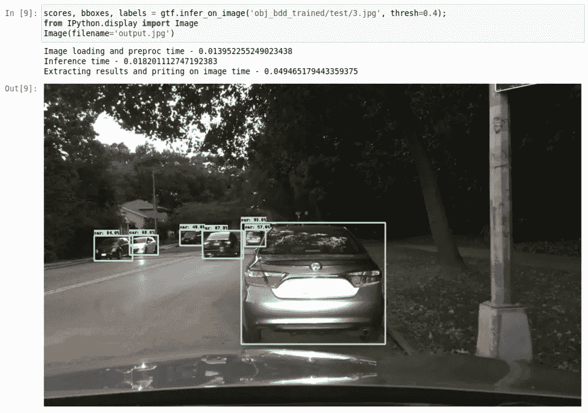
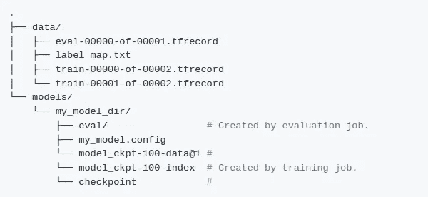
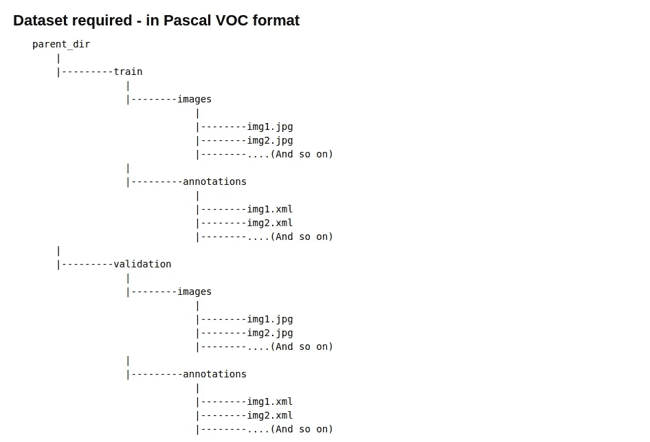
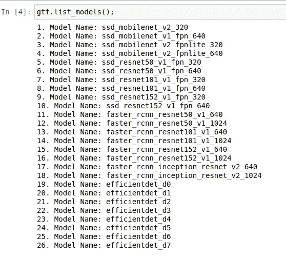
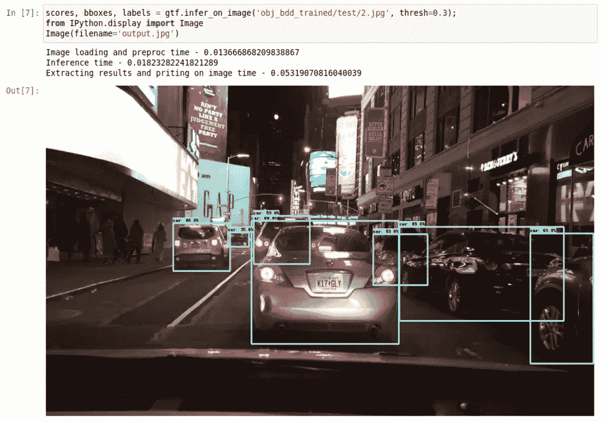
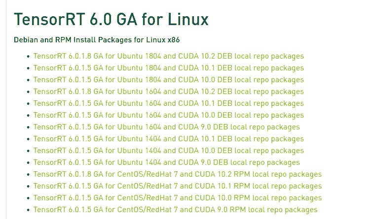
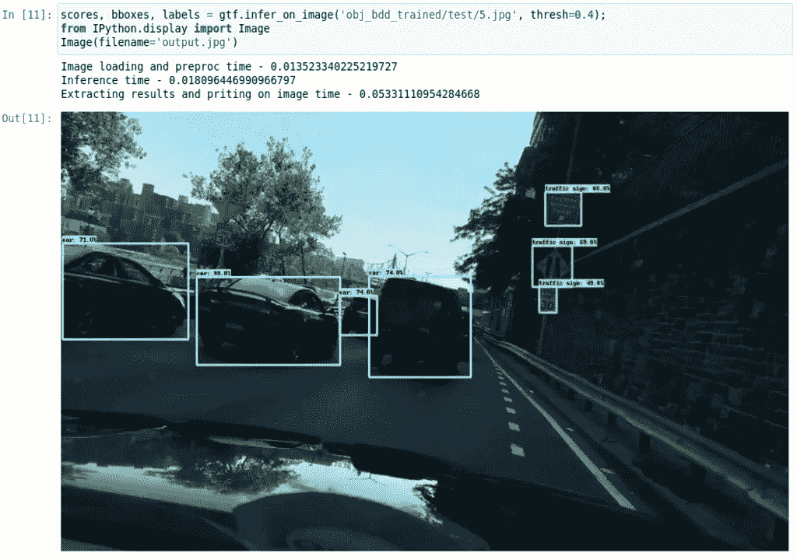

# 简化 Tensorflow 2.0 对象检测 API 和 TensorRT 的流程

> 原文：<https://pub.towardsai.net/easing-up-the-process-of-tensorflow-2-0-object-detection-api-and-tensorrt-fd2d790c12f3?source=collection_archive---------0----------------------->

## [计算机视觉](https://towardsai.net/p/category/computer-vision)

使用**蒙克的 TF-Object-Detection-API** 训练自己的物体探测器的详细步骤，在 GPU 系统上使用**tensort**和 **run** **推论**进行优化



**的全部代码可作为** [**jupyter 笔记本**](https://github.com/Tessellate-Imaging/Monk_Object_Detection/blob/master/application_model_zoo/Example%20-%20BDD100K%20dataset%20with%20TensorRT%20optimization.ipynb) **at** [**和尚物体探测库**](https://github.com/Tessellate-Imaging/Monk_Object_Detection)

每个计算机视觉工程师都使用开源库，目标是在自定义数据集上使用它。用于对象检测的最常用的库之一是 Tensorflow，用于其不断扩展的模型动物园。Tensorflow 最近增加了对 TF 2.0 对象检测 API 的支持。使用 TensorFlow 对象检测 API 进行自定义对象检测以及使用 TensorRT 进行进一步的模型优化**是一个冗长耗时的过程**并且**容易出错**。

**为了克服通常面临的问题并减少开发人员的工作量**
*修改 tfrecord 示例并以严格的格式排列数据以适应自定义数据
*更新配置文件
*使用正确的文件来训练引擎
*将训练好的检查点转换为其他格式以进行推理
*搜索运行推理的正确方式
*使用 TensorRT 等优化模型
我们**将 TF 对象检测 API 与低代码 monk 集成**

有了它，**开发人员可以轻松地**
★将自定义数据集转换为 tf 记录
★使用 pythonic 语法更新配置文件
★训练引擎并导出为不同的推理格式
★使用检查点或保存的模型格式进行推理
★使用 TensorRT 引擎优化模型以实现更快的推理

# 使用 TF 2.0 对象检测 API 训练自定义数据集时面临的问题

除了过程步骤，还提到了开发人员或研究人员通常面临的问题，以及为什么我们想到使用低代码开源库来简化这个过程。

**第一步**:安装先决条件，编译模型。

*使用旧版本 2.0.0 和 2.1.0 进行培训会导致错误

```
AttributeError: module ‘tensorflow_core.keras.utils’ has no attribute ‘register_keras_serializable’
```

*使用 2.2.0 版进行培训还会导致以下错误

```
AttributeError: 'CollectiveAllReduceExtended' object has no attribute '_cfer_fn_cache'
```

*版本 2.3.0 运行时没有任何错误，并且也与 colab 兼容。

因此选择了 V-2.3.0，V-2 . 4 . 0 发布后将很快升级到 V-2.3.0，因为在 V-2 . 3 . 0 中 tf-lite 转换容易出错

**第二步**:数据集设置

* TF 模型的 dataset_tools 提供了 COCO、VOC、OID 等公共数据集的例子；但并不是所有的公共数据集都用这些格式标注。

*一旦以这种格式进行了注释，就需要将它安排在一个数据结构中，该数据结构可以被馈送到 object _ detection/dataset _ tools/中存在的文件中；或者修改这些文件以接收管道中的定制数据

为了使这个过程更容易，我们添加了一个简单的解析器来将注释转换成 VOC 格式的数据，并进一步转换成 tfrecords。

**第三步**:模型和配置文件+训练

*权重和配置文件必须从模型动物园下载，数据结构必须以这种格式更新



数据格式。[演职员表](https://github.com/tensorflow/models/blob/master/research/object_detection/g3doc/tf2_training_and_evaluation.md)

*发布此消息后，必须更新配置文件元素。必须更改超过 25 个元素的集合，包括数据集详细信息、基本特征提取详细信息、检查点详细信息、优化器详细信息、tf 记录详细信息。

*更新配置详细信息后，即可进行培训

为了避免手动更改配置文件和文件夹结构格式，创建了 pythonic API 包装器。

**第四步**:将模型导出为已保存的模型格式并进行推理

*然后，检查点文件可以转换为“保存的模型”格式。

*这里的一般问题包括 ssd fpn 和 resnet 格式的转换。

*在检查点文件上运行推理需要对象检测模型生成器，而保存的模型”。pb”格式可以使用 tf 的 load_model 函数加载。

*在运行推理之前，在 saved_model 上创建一个图形函数通常会加快进程

**第五步**:tensort 模型转换和推理

*保存的模型可以进行优化，以便在不同的 NVidia GPU 机器上运行

TensorRT 的问题是开发系统(训练和转换模型的系统)和部署系统(部署模型的系统)的库版本必须相同。

* * The 的下一个问题是，它根据所用模型的[计算兼容性](https://developer.nvidia.com/cuda-gpus)来优化模型。简单来说，在 colab 上优化的模型不能在 [Jetson Nano](https://www.nvidia.com/en-in/autonomous-machines/embedded-systems/jetson-nano/) 板上运行。因此，模型需要在部署机器上的运行时进行转换和构建。

* TensorRT 模型只能从 saved_model(" .pb”)文件，它以类似的格式生成一个优化的模型，然后需要对其进行推断。

# 让我们开始这个过程

注意:完整的代码可以在[僧侣物体探测图书馆](https://github.com/Tessellate-Imaging/Monk_Object_Detection)的 [jupyter 笔记本](https://github.com/Tessellate-Imaging/Monk_Object_Detection/blob/master/application_model_zoo/Example%20-%20BDD100K%20dataset%20with%20TensorRT%20optimization.ipynb)中获得。这里，我只提到了整个工作中的重要步骤。

# 步骤 1 —安装

**对于本地或基于云的系统:**

这将安装
*先决条件库，如 numpy、scipy、opencv、pillow、lxml 等
* Tensorflow 2.3.0 和 tensor flow-models-python-2 . 2 . 0
* tensor flow 对象检测 API

同样，它也可以安装在 colab 上

# 步骤 2 —数据准备

如下所述，数据集需要采用简单的 pascal VOC 格式



PASCAL VOC 格式

要从 COCO 或任何其他格式转换数据集，请查看这些详细教程

对于本教程，我们使用 BDD100K 道路物体检测数据集— [信用](https://www.kaggle.com/solesensei/solesensei_bdd100k)

Github 上的这个 [jupyter 笔记本](https://github.com/Tessellate-Imaging/Monk_Object_Detection/blob/master/application_model_zoo/Example%20-%20BDD100K%20dataset%20with%20TensorRT%20optimization.ipynb)中提到了下载数据并将其转换为 Pascal VOC 格式的完整步骤

# 步骤 3-系统参数设置

★装载检测器

★列出所有型号。目前支持 26 种不同的型号



★用参数设置训练和验证数据

*根据可用的 GPU 内存设置批量大小。24 的大小非常适合带有 V100 GPU (16 GB VRAM)的 AWS p3.2x 实例

★创建 TF 记录！！！

*批量大小、类别数量、tf_record 详细信息都将自动保存在配置文件中

★从型号列表中选择型号

*在本例中，我们选择了带有[特征金字塔网络](https://www.google.com/url?sa=t&rct=j&q=&esrc=s&source=web&cd=&cad=rja&uact=8&ved=2ahUKEwiN26vOqtTrAhVTAXIKHR4tBdIQFjABegQIAxAB&url=https%3A%2F%2Ftowardsdatascience.com%2Freview-fpn-feature-pyramid-network-object-detection-262fc7482610&usg=AOvVaw3eJJIumHSndicBMkalNev1)的 [SSD](https://www.google.com/url?sa=t&rct=j&q=&esrc=s&source=web&cd=&cad=rja&uact=8&ved=2ahUKEwiQv_b9qtTrAhVBWX0KHaItBMYQFjAEegQIBRAB&url=https%3A%2F%2Fmedium.com%2Finveterate-learner%2Freal-time-object-detection-part-1-understanding-ssd-65797a5e675b&usg=AOvVaw2sMnVDScmyiKp-gEbaVVMO) [Resnet50](https://www.google.com/url?sa=t&rct=j&q=&esrc=s&source=web&cd=&cad=rja&uact=8&ved=2ahUKEwj-_I3xqtTrAhXEbn0KHa99BjAQFjABegQIBRAB&url=https%3A%2F%2Fblog.exxactcorp.com%2Fdeep-learning-with-tensorflow-training-resnet-50-from-scratch-using-the-imagenet-dataset%2F&usg=AOvVaw14ccFgXnzuWW2zf1cjm20M) ，它接收形状为 640x604x3 的输入图像(RGB 图像)

★设置所有其他超参数

*设置训练步数—对于大型数据集，理想值是训练 100K 步数

*所有模型的最佳初始学习率可以设置为 0.01 左右，而 ssd_mobilenet_v2 和 faster_rcnn_inception 模型可以采用更高的学习率。

★设置输出推理图路径和 TensorRT 参数

* TensorRT 优化是可选的

* TensorRT 优化支持 3 种类型的优化——FP32、FP16 和 INT8

*浮点量化对于像 Jetson Nano 这样的板很有用。

* INT8 优化在创建时构建，而其他两个优化在部署机器上构建。构建很容易被认为是对模型进行的实际优化。上面提到的 TensorRT 的一个问题是，它应该构建在您希望部署它的机器上，或者应该构建在具有相同 TensorRT 库和 Cuda 计算功能的机器上。

*因此，建议在部署计算机上运行 INT8 优化。

*因为，对于这个例子，我们在 AWS P3.2x 实例上训练和运行推理，所以我们采用 INT8 量化。

# 步骤 4—培训和模型导出

★要训练运行以下命令。

*由于它运行一个 TF 引擎，在 jupyter notebook 上作为一个包装运行它会导致系统退出。

*因此，提供了一个名为 train.py 的脚本。

*一旦训练完成，检查点文件将保存在您在 hyperparameter setup 命令中提到的 output_directory 中。

★将训练好的模型导出到 saved_model("。pb ")格式运行以下命令。

*由于它运行一个 TF 引擎，在 jupyter notebook 上作为一个包装运行它会导致系统退出。

*因此，提供了一个名为 export.py 的脚本。

*产出。pb 文件将保存在您在 export_params setup 命令中设置的 export_directory 中。

# 步骤 5 —优化前的推理和速度基准

★装载检测器

★加载训练好的模型

*在导出的目录中加载表单 saved_model

★对单个图像进行推理



★运行基准速度分析

*未经优化，这些是 AWS P3.2x 实例的结果

```
Average Image loading time : 0.0121 sec
Average Inference time     : 0.0347 sec
Result extraction time     : 0.0848 sec
total_repetitions          : 100
total_time                 : 3.4712 sec
images_per_sec             : 28
latency_mean               : 34.7123 ms
latency_median             : 34.9255 ms
latency_min                : 32.2594 ms
```

# 步骤 6 —使用 TensorRT-6 进行优化

★安装 TensorRT6

*访问 [Nvidia TensorRT](https://developer.nvidia.com/tensorrt) 页面下载 TRT6

*根据操作系统和 CUDA 版本，从 TensorRT 网站下载软件包。



★要使用 TensorRT 进行优化，请运行以下命令。

*由于它运行一个 TF 引擎，在 jupyter notebook 上作为一个包装运行它会导致系统退出。

*因此，提供了一个名为 optimize.py 的脚本。

*在导出的已保存模型上运行它

# 步骤 7—优化后的推理和速度基准

★装载检测器

★加载训练好的模型

*从优化的 saved_model 加载

★对单个图像进行推理



★运行基准速度分析

*未经优化，这些是 AWS P3.2x 实例的结果

```
Average Image loading time : 0.0117 sec
Average Inference time     : 0.0169 sec
Result extraction time     : 0.0822 sec
total_repetitions          : 100
total_time                 : 1.6907 sec
images_per_sec             : 59
latency_mean               : 16.9070 ms
latency_median             : 16.8167 ms
latency_min                : 16.2708 ms
```

# 结论

使用 Monk 对象检测库，您可以轻松地

★将自定义数据集转换为 tf 记录
★使用 pythonic 语法更新配置文件
★训练引擎并导出为不同的推理格式
★使用检查点或保存的模型格式进行推理
★使用 TensorRT 引擎优化模型以实现更快的推理
★ **每秒处理的优化后图像几乎翻了一番**

在 [Monk 对象检测库](https://github.com/Tessellate-Imaging/Monk_Object_Detection)的 [GitHub](https://github.com/Tessellate-Imaging/Monk_Object_Detection/blob/master/application_model_zoo/Example%20-%20BDD100K%20dataset%20with%20TensorRT%20optimization.ipynb) 上可以获得全部代码

编码快乐！！

# **附录— 1**

更多关于[**和尚对象检测库**](https://github.com/Tessellate-Imaging/Monk_Object_Detection)

