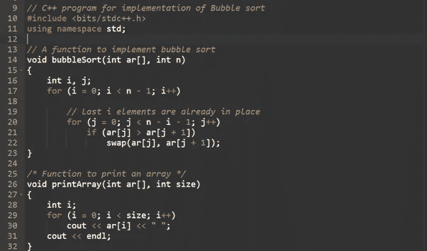
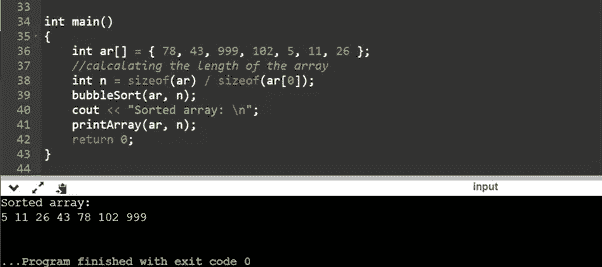
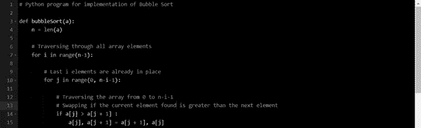
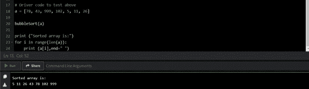
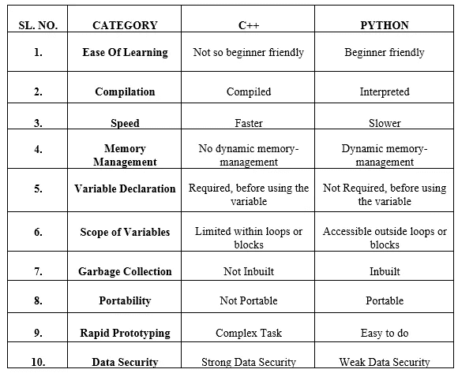

# C++和 Python 的简单讲解

> 原文：<https://pub.towardsai.net/easy-explanation-of-c-and-python-a385d9a16fd2?source=collection_archive---------6----------------------->

## 软件开发项目的解释

詹姆斯·哈里逊在 [Unsplash](https://unsplash.com?utm_source=medium&utm_medium=referral) 上拍摄的照片

C++是一种由比雅尼·斯特劳斯特鲁普引入的中级语言，这赋予了它编写低级(驱动程序、内核)和高级应用程序(GUI、桌面应用程序等)的优势。).通过添加面向对象的概念来扩展 C 编程语言，开发出了 C++。

它通常被认为是一种功能强大且易于理解的编程语言。在软件工程师和数学家、数据分析师、会计师和网络工程师中，它是世界上发展最快的编程语言，因为它对初学者非常友好。来自不同领域的人们使用 Python 完成各种任务，例如数据分析和可视化、自动化等。

使用 Python 可以开发 web、移动和桌面应用程序、测试，甚至黑客攻击，这意味着 Python 是一种多用途语言。利用 Python 简单而强大的语法，许多琐碎的事情都变得简单了。

从技术上来说，用 Python 可以实现的东西，其他编程语言也可以实现。

但是，需要记住以下几点差异:

*   ***易学性*** :这对于初学者来说是一个至关重要的问题。如果编程语言很复杂，就变得很难学。Python 的语法类似于英语，它使用缩进规则，这使得它非常容易学习。另一方面，与 Python 相比，C++有着复杂的语法，并且遵循一些规则，比如在需要的地方放上花括号和分号。这使得学习起来有点困难，从而降低了它的可读性。
*   ***编译*** : Python 是一种解释型编程语言，因此需要一个解释器在运行时处理它。尽管如此，C++是一种预编译语言，编译器处理起来更快，而且不需要解释器。
*   ***速度*** : Python 因为运行时数据类型和解释器结构的决定，速度较慢。C++速度更快，因为它是预编译的，并且由于健壮的 OOPs 架构和中级访问级别，可以快速执行复杂的代码片段。
*   ***内存管理*** : Python 提供了一种动态内存管理技术，即它可以根据需要自动分配和释放内存。C++不提供动态内存管理。在 C++中，我们需要为一个变量分配内存，当这个变量不在使用中时，我们需要释放它。如果不这样做，可能会导致内存泄漏，这是一种内存被阻塞但未被使用的状态。
*   ***变量声明*** : Python 是一种动态类型的编程语言，在使用变量之前不需要声明变量。但是 C++是一种静态类型语言，在使用变量之前，必须通过提供变量的名称和类型来声明变量。
*   ***变量的作用域*** :简单来说，变量的作用域定义了变量的生存期。它是程序中可以使用和修改变量的代码块。尽管在这两种编程语言中，全局和局部作用域的工作方式是相同的，但重要的区别是 Python 中的变量可以在循环或块之外访问。相比之下，C++中的变量被限制在循环或块中。
*   ***垃圾收集*** : Python 提供了内置的垃圾收集技术；它为简单的垃圾收集提供了自动化支持。C++不提供任何对垃圾收集的本机支持。例如，如果一个人获取一个变量并存储数据，它将占用一些内存空间。Python 可以自动释放数据不再使用的内存。在 C++中，内存空间不会被释放，除非使用 free()这样的命令。这在需要手动干预的情况下非常有用。
*   ***可移植性*** : C++不可移植；代码需要在每个不同的平台上重新编译。基本上就是，“编写一次，在任何地方编译。”Python 是可移植的。它是一种跨平台语言，可以在任何平台上执行 Python 程序。
*   ***快速原型制作*** :快速原型制作是一种不需要做太多工作，但必须在有限的时间内完成一个基本功能的应用程序或原型的情况。在这种情况下，Python 是专门为开发人员提供工具和选项来帮助快速构建原型的。然而，根据 C++的方法论，当涉及到用于快速原型的较大代码片段时，它在可行性方面有点复杂。
*   ***数据安全性*** : Python 在数据安全性方面比较弱，因为它的数据封装比较弱，因为 Python 中所有的类成员和方法都是默认公开的。另一方面，C++提供了强大的数据封装，因为所有默认的方法和类都是私有的，用户可以在访问说明符的帮助下根据它们的用途来更改它们。

下面是 C++和 Python 中冒泡排序的代码片段，展示了两者的区别。

**在 C++中实现冒泡排序:**

**Python 中冒泡排序的实现:**

**下表总结了 C++和 Python 的区别。**

## 结论

当一个人需要*快速的开发速度*和*一个管理良好的内存系统*时，Python 非常好用，而 C++擅长*更快地执行代码*，让一个人*完全控制内存*。

我希望你喜欢这篇文章。通过我的 [LinkedIn](https://www.linkedin.com/in/data-scientist-95040a1ab/) 和 [Twitter](https://twitter.com/amitprius) 联系我。

# 推荐文章

1.[8 Python 的主动学习见解收集模块](/8-active-learning-insights-of-python-collection-module-6c9e0cc16f6b)
2。 [NumPy:图像上的线性代数](/numpy-linear-algebra-on-images-ed3180978cdb?source=friends_link&sk=d9afa4a1206971f9b1f64862f6291ac0)3。[Python 中的异常处理概念](/exception-handling-concepts-in-python-4d5116decac3?source=friends_link&sk=a0ed49d9fdeaa67925eac34ecb55ea30)
4。[熊猫:处理分类数据](/pandas-dealing-with-categorical-data-7547305582ff?source=friends_link&sk=11c6809f6623dd4f6dd74d43727297cf)
5。[超参数:机器学习中的 RandomSeachCV 和 GridSearchCV](/hyper-parameters-randomseachcv-and-gridsearchcv-in-machine-learning-b7d091cf56f4?source=friends_link&sk=cab337083fb09601114a6e466ec59689)
6。[用 Python](https://medium.com/towards-artificial-intelligence/fully-explained-linear-regression-with-python-fe2b313f32f3?source=friends_link&sk=53c91a2a51347ec2d93f8222c0e06402)
7 全面讲解了线性回归。[用 Python](https://medium.com/towards-artificial-intelligence/fully-explained-logistic-regression-with-python-f4a16413ddcd?source=friends_link&sk=528181f15a44e48ea38fdd9579241a78)
充分解释了 Logistic 回归 8。[数据分发使用 Numpy 与 Python](/data-distribution-using-numpy-with-python-3b64aae6f9d6?source=friends_link&sk=809e75802cbd25ddceb5f0f6496c9803)
9。[机器学习中的决策树 vs 随机森林](/decision-trees-vs-random-forests-in-machine-learning-be56c093b0f?source=friends_link&sk=91377248a43b62fe7aeb89a69e590860)
10。[用 Python 实现数据预处理的标准化](/standardization-in-data-preprocessing-with-python-96ae89d2f658?source=friends_link&sk=f348435582e8fbb47407e9b359787e41)