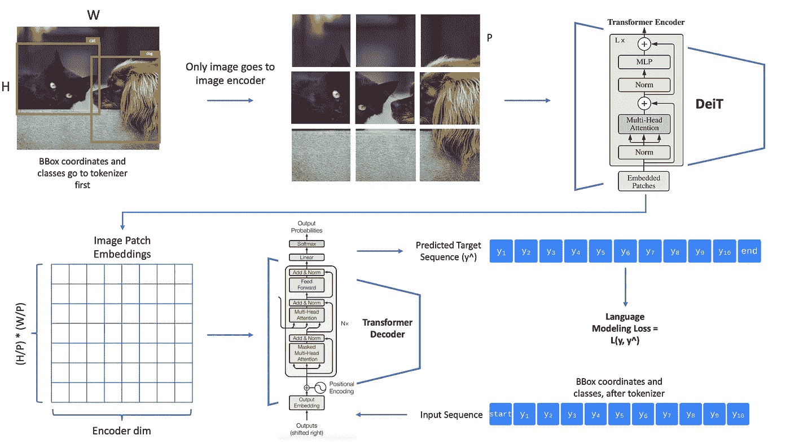
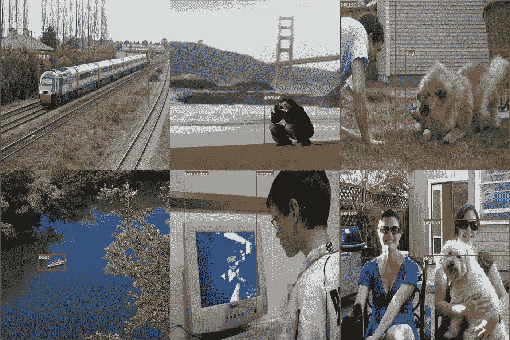
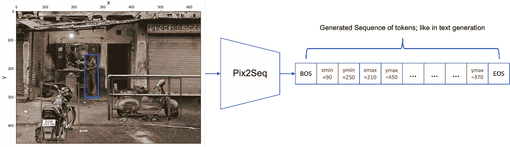
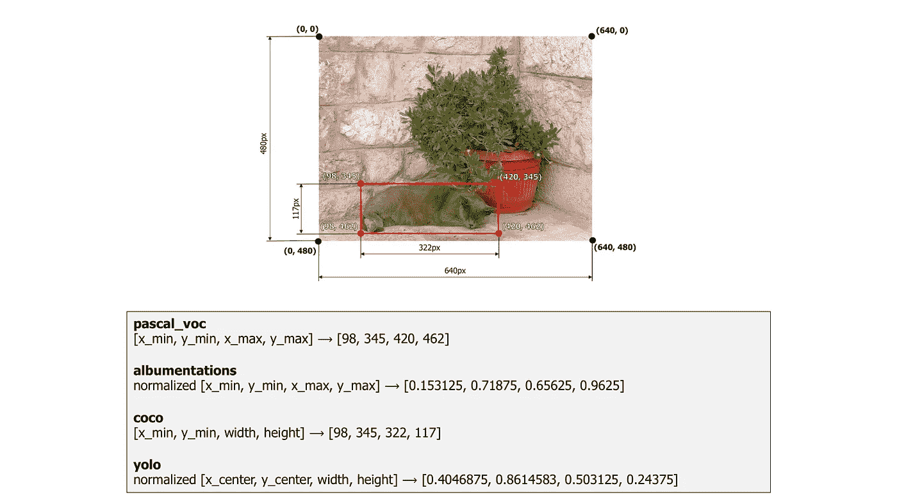
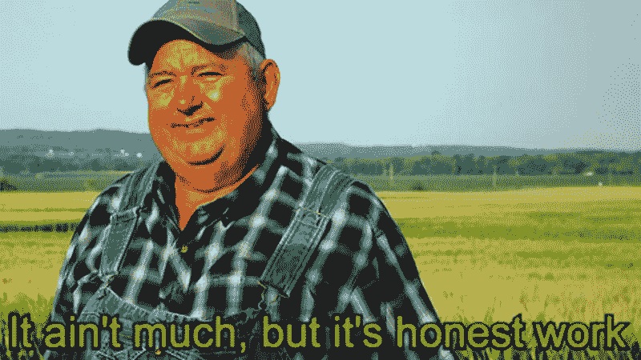
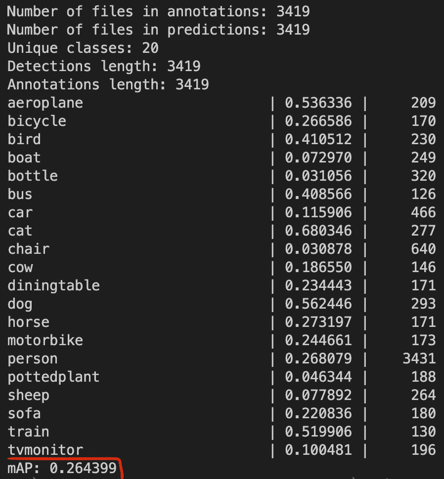
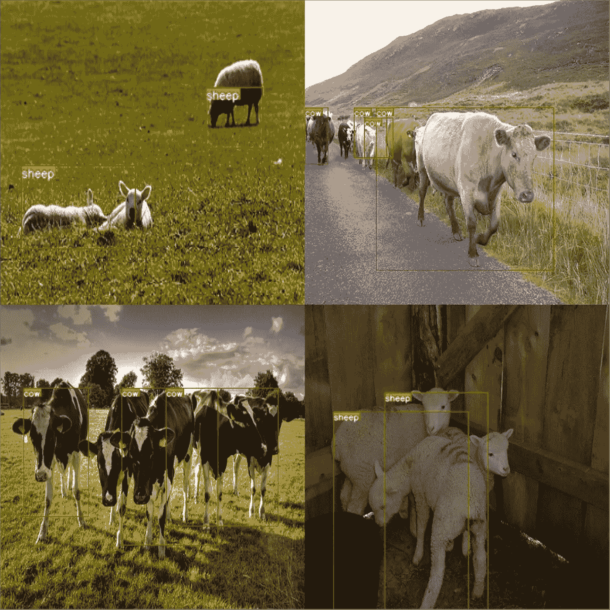

# 使用变压器实现简单的对象检测:PyTorch 中 Pix2Seq 模型的简单实现

> 原文：<https://pub.towardsai.net/easy-object-detection-with-transformers-simple-implementation-of-pix2seq-model-in-pytorch-fde3e7162ce7?source=collection_archive---------1----------------------->

我对作者的 Pix2Seq | Image 的简单实现

# 介绍

目标检测不一定是一项困难的任务！我清楚地记得我第一次从零开始实现 YOLO 的时候，理解它是如何工作的是一件痛苦的事情。对于计算机视觉应用的初学者来说，我相信**物体检测是分类、分割等中最难理解的**。

当我第一次听说来自 **ICLR 2022** 的论文“ [Pix2seq:用于对象检测的语言建模框架](https://arxiv.org/abs/2109.10852)”时，我变得相当兴奋，我确信我的下一篇博客文章将会是关于它的；所以，我写了这篇文章，希望你会喜欢，并发现 pix2seq 模型很容易理解和实现。

在本教程结束时，您将学习实现一个简单的对象检测模型，它会产生以下结果:

我们的最终模型在验证集上的预测|作者图片

我把我所有的代码都作为 [**Google Colab 笔记本**](https://colab.research.google.com/drive/1UeYIZ6_GHNwCHSi8nNV5dVc3oUrM5-BA?usp=sharing) 和 [**Kaggle 笔记本**](https://www.kaggle.com/code/moeinshariatnia/object-detection-w-transformers-pix2seq-pytorch/notebook) 提供。我还把整个项目和代码 [**放到了我的 GitHub**](https://github.com/moein-shariatnia/Pix2Seq) 上。

## 这篇论文的有趣之处在于

这个想法非常简单:将对象检测问题**重新定义为文本(令牌)生成任务**！我们希望模型"**告诉我们**"图像中存在哪些对象，以及它们的边界框(bboxes)的(x，y)坐标，所有这些都以特定的格式在生成的序列中显示，就像文本生成一样！

pix2seq 的工作原理:它生成一系列标记，告诉每个对象在哪里(BOS =句首，EOS =句尾)|作者图片

正如你所看到的，**物体检测**任务被转换成类似**图像字幕**的任务:在文本(序列)中描述图像，但这次告诉我们物体的确切位置。

# Pix2Seq:简单实现

## 所需模块

与 Pix2Seq 最接近的任务是图像字幕。因此，我们将需要一个**图像编码器**来将图像转换成隐藏表示的向量，然后需要一个**解码器**来获取图像表示和先前生成的标记的图像表示，并预测下一个标记。我们还需要一个记号化器来将对象类和坐标转换成形成它们的特殊词汇的记号，就像自然语言中的单词一样。

## 我对 Pix2Seq 的简单实现

我对作者的 Pix2Seq | Image 的简单实现

上图可以看到这个项目的高层管道。如你所见，我们需要一个图像数据集和它们的框，我们将使用 [**Pascal VOC 2012 数据集**](http://host.robots.ox.ac.uk/pascal/VOC/voc2012/) 。接下来，我们将从头开始编写自己的**记号赋予器**，将 bbox 类和坐标转换成一系列记号。然后，我们将使用 **DeiT** (来自这篇[论文](https://arxiv.org/abs/2012.12877))作为我们的**图像编码器**，并将图像嵌入馈送到一个普通的**变压器解码器**(来自这篇[论文](https://arxiv.org/abs/1706.03762?context=cs))。解码器的任务是根据前一个标记预测下一个标记。解码器的输出被提供给语言建模损失函数。

本教程的代码可在以下链接获得:
- [**Google Colab 笔记本**](https://colab.research.google.com/drive/1UeYIZ6_GHNwCHSi8nNV5dVc3oUrM5-BA?usp=sharing)
-[**ka ggle 笔记本**](https://www.kaggle.com/code/moeinshariatnia/object-detection-w-transformers-pix2seq-pytorch/notebook)
- [**我的 GitHub repo**](https://github.com/moein-shariatnia/Pix2Seq)

## **数据集**

正如我前面提到的，我们将使用 VOC 2012 数据集和来自 **20 类**的图像及其相应的对象。该论文使用 COCO 数据集，该数据集比 VOC 大一个数量级，并且他们还在 COCO 上训练之前在更大的数据集上预先训练模型。但是，为了简单起见，我将使用这个相当小的 VOC 数据集。

Pascal VOC 2012 课程

我们需要一个 PyTorch 数据集类，它以序列的形式为我们提供图像及其 bbox 坐标和类。

如您所见，这里的大部分代码都是您期望从简单的分类数据集得到的，但是也有一些小的差异。我们需要一个**记号赋予器**将我们的标签和 bbox 坐标(x 和 y)转换成一个序列，这样我们就可以为语言建模任务执行训练我们的模型(根据之前看到的记号预测下一个记号)。

## 标记器

我们如何将这些信息转换成一个序列？嗯，没那么难。为了表示图像中的对象，我们需要 5 个数字:4 个坐标数字和 1 个数字来表示它属于哪个类。

你实际上需要知道一个边界框的 2 个点的坐标，以便能够在图像中画出它；在 **pascal 格式**中，我们用 bbox 的**左上点**和**右下点**作为那两个临界点，每个点用它的 x 和 y 值来表示→所以，我们总共需要 4 个数来画一个包围盒。你可以看到下面的替代格式来表示一个边界框。另外，看看 x 和 y 轴的起点在哪里(0，0 点)。

用不同的格式来表示边界框及其坐标|来自[相册文档](https://albumentations.ai/docs/getting_started/bounding_boxes_augmentation/)的图像

正如您在数据集的代码中看到的，我们将 bbox 坐标和标签交给我们的标记器，并得到一个简单的标记列表。分词器需要完成以下任务:

1.  **标记 w/e 特殊令牌(BOS 和 EOS 令牌)序列的开始和结束**。
2.  **量化**坐标的连续值(我们可以将 x=34.7 作为一个点的坐标，但是我们需要像 34 这样的离散值作为我们的记号，因为我们最终是在一组有限的记号上进行分类)
3.  **将对象的标签**编码成相应的令牌
4.  **在最终序列中随机化对象的顺序**(更多信息见下文)

如果你熟悉 NLP 应用程序，这些步骤可能听起来很熟悉，因为我们在处理自然语言中的单词时也会用到它们；我们需要对它们进行标记，并将每个单词分配给它自己的离散标记，标记序列的开始和结束，等等。

关于这个列表中的数字 4，这就是这篇论文所做的，并且有一个关于它是否是一个好主意的广泛的消融研究。它说的是，每次我们向模型显示相同的图像(在不同的时期)，我们随机化对象在相应序列中出现的顺序，我们将该序列提供给模型(其中一个令牌被移位)和我们的损失函数。例如，如果图像中有“人”、“车”和“猫”，记号赋予器和数据集会将这些对象按随机顺序放入序列中:

*   BOS，car_xmin，car_ymin，car_xmax，car_ymax，car_label，person_xmin，person_ymin，person_xmax，person_ymax，person_label，cat_xmin，cat_ymin，cat_xmax，cat_ymax，cat_label，EOS
*   BOS，person_xmin，person_ymin，person_xmax，person_ymax，person_label，car_xmin，car_ymin，car_xmax，car_ymax，car_label，cat_xmin，cat_ymin，cat_xmax，cat_ymax，cat_label，EOS
*   …

关于坐标连续值如何量化的另一个注意事项:假设**图像大小为 224** 。这 4 个坐标(12.2，35.8，68.1，120.5)可以有一个 bbox。

你将需要至少 **224 个令牌** (num_bins)才能以 1 个像素的精度令牌化(量化)这 4 个数字(你将丢失 1 个像素以下的信息)。正如您在标记器代码中看到的，要将这些 bbox 坐标转换成它们的标记化版本，我们需要执行以下操作:

1.  标准化坐标(通过将它们除以最大值= 224，使它们在 0 和 1 之间)
2.  这样做: *int(x * (num_bins-1))*

所以，转换后的版本将是:(12，35，67，119)。请记住，Python **中的 int()函数不会将数字四舍五入到最接近的整数**，而是只保留数字的整数部分。如你所见，我们丢失了一些关于 bbox 确切位置的信息，但它仍然是一个非常好的近似值。我们可以使用更大数量的标记(如论文中所述的箱数)，并且我们将具有更精确的位置。我们的标记器也有 decode()函数，我们将使用它将序列转换成 bbox 坐标和标签。

## 校对功能

在这里，我们将实现一个自定义的 collate_function 来提供给我们的 PyTorch 数据加载器。这个函数将为我们处理填充:通过将 PAD_IDX 添加到较短的序列中，使所有的序列长度相同，以便能够用它们构建一个批处理。我们将填充序列到 300 个令牌的固定最大长度。

## 编码器

我终于到了对每个深度学习爱好者来说最酷的部分:**模型😍**

我们再来看一下本教程的[第一张图。首先，我们需要一个编码器来获取输入图像，并给我们一些嵌入(表示)。论文用的是 ResNet50(其他实验也用 ViT)，但我决定用](https://drive.google.com/file/d/19zuuskVKj4GM_9uGcA8a-FBPr1ykuiK6/view?usp=sharing) [**DeiT**](https://arxiv.org/abs/2012.12877) 。顾名思义，这是一个数据高效的视觉转换器，我认为它非常适合我们的小数据集。像 ViT 一样，它将图像分割成小块，并像处理句子中的单词一样处理它们，这对于我们的任务来说也是很好的，因为我们将为每个小块进行单独的嵌入，我们可以在下一部分将它们交给我们的解码器来预测目标序列(参见从英语到法语的**翻译**，其中我们的图像就像英语中的一个句子，而包含 bboxes 的坐标和标签的目标序列就像法语中的对应句子)。

我将使用 timm 库来实现一个预先训练好的 DeiT 模型。

瓶颈层是将这些嵌入的特征数量减少到解码器的特征数量。本文使用了 256 的解码器 dim，这就是我在这里使用**平均池**减少它的原因。此外，这个模型中的第一个令牌与 CLS 令牌相关，我将在 forward 方法中跳过它(features[:，1:])。

## 解码器

我们的解码器采用输入图像的补丁嵌入，并学习预测包含 bboxes 的序列。这里我用的是 PyTorch **nn。TransformerDecoder** 模块实现一个特征尺寸为 256 的 6 层解码器。我们还需要向嵌入中添加位置嵌入，以便模型知道每个标记在序列中的位置(我为编码器标记和解码器标记都添加了位置嵌入。虽然我们必须为解码器这样做，但我们可能不需要将它们添加到编码器标记中，因为 DeiT 模型知道补丁本身的顺序)。我就是靠那些 **nn 做到的。参数**模块将在每个标记位置学习 1 个参数。最后，我们将使用一个 **nn。线性**层来预测我们词汇表中的下一个标记。

**create_mask** 函数为我们提供了训练解码器所需的两个掩码:一个告诉模型忽略填充令牌并且不将它们合并到它的注意模块中，另一个屏蔽未来的令牌，以便使解码器仅通过查看当前令牌和先前令牌来预测令牌。

## 把它们放在一起

这是一个封装了编码器和解码器的简单类。它还有一个**预测**函数，调用解码器的预测函数(上面没有显示，我们稍后会看到)来检测图像中的对象。

## 培养

现在让我们看看如何训练这个模型。下面的大部分代码只是标准的 PyTorch 培训样板，但其中有一点很简单但很重要。如前所述，我们像训练语言模型一样训练模型(例如 GPT)，它是这样工作的→模型只需要通过看到前面的标记(左边的标记)来预测下一个标记。开始时，它只看到 BOS 语句，它需要预测下一个标记，以此类推。这可以通过这部分来实现:

*   y_input = y[:，:-1]
*   y_expected = y[:，1:]
*   preds =模型(x，y _ 输入)

我在 Kaggle 上使用单个 GPU 训练了这个模型，仅在 6 小时内进行了 25 次。这并不多，但足以在评估指标上获得不错的表现。

:)

物体检测最常见的度量是**平均精度(AP)** 你可以在这里阅读更多关于它的[。经过几个小时的大量数据训练，本文得到了一个 43 w/ ResNet50 骨干网的 AP。用这个小模型和短训练时间，我可以在我的验证集上得到 26.4 的 AP，这很酷，因为这是一个如何轻松实现本文的教程，我的目标不是用这个打败 SOTA！](https://jonathan-hui.medium.com/map-mean-average-precision-for-object-detection-45c121a31173)

我的模型在 Pascal VOC 数据集上的平均精度表现|图片由作者提供

## 推理

现在，让我们看看如何使用这个模型为测试图像生成检测序列。这是解码器类的预测方法。它获取先前生成的标记，将它们填充到 max_length，并预测批中每个序列的下一个标记，然后返回这些新标记。

下面的 **generate()** 函数显示了整个序列生成管道的简化版本→首先，我们将使用 shape (batch_size，1)创建一个批处理，该批处理只包含批处理中每个图像的 BOS 标记。该模型获取图像和这些 BOS 标记，然后预测每个图像的下一个标记。我们获取模型的预测，对其执行 softmax 和 argmax 以获得预测的标记，并将这个新预测的标记与之前的 batch_preds 张量连接，该张量具有 BOS 标记。然后我们重复这个循环 max_len 次。

最后，我们通过标记器的 decode()方法对预测的标记进行解码。你可以看看我的 GitHub、[Colab 笔记本](https://colab.research.google.com/drive/1UeYIZ6_GHNwCHSi8nNV5dVc3oUrM5-BA?usp=sharing)或者 [Kaggle 笔记本](https://www.kaggle.com/code/moeinshariatnia/object-detection-w-transformers-pix2seq-pytorch/notebook)上的具体实现。

## 结果

最后，让我们看看我们的模型到目前为止的一些结果。模型并不总是这么好(这些都是精心挑选的！)，但这些结果表明，实现已经足够好了，如果有更大的数据集和模型以及更长的训练时间，您可以很容易地获得论文中提到的那些完美的结果。

我们的最终模型在验证集上的预测|作者图片

当图像中有 1 到 2 个 bboxes 时，我们的模型工作得最好，当图像中有大量对象时，它的性能会下降。下图显示了我们模型的一些失败案例:

我们模型的一些失败案例|作者图片

## 最后的话

我希望你喜欢这个教程，并学到了一些新的东西。一如既往，我将很高兴听到你对本教程的评论，或者回答你对论文和模型的任何问题。

祝您愉快！

我把我所有的代码都作为 [**Google Colab 笔记本**](https://colab.research.google.com/drive/1UeYIZ6_GHNwCHSi8nNV5dVc3oUrM5-BA?usp=sharing) 和一个 [**Kaggle 笔记本**](https://www.kaggle.com/code/moeinshariatnia/object-detection-w-transformers-pix2seq-pytorch/notebook) 提供。我还把整个项目和代码 [**放到了我的 GitHub**](https://github.com/moein-shariatnia/Pix2Seq) 上。

> ***关于我***
> 
> 我是 Moein Shariatnia，一名医科学生，机器学习开发人员和研究员。在我的研究中，我对深度学习模型的泛化和迁移学习性能感兴趣。我也喜欢实现最先进的深度模型，并理解它们是如何工作的。
> 
> ***我的谷歌学术***:[*https://scholar.google.com/citations?user=YLHsTOUAAAAJ&HL = en*](https://scholar.google.com/citations?user=YLHsTOUAAAAJ&hl=en)
> *我的 GitHub*:[*https://github.com/moein-shariatnia*](https://github.com/moein-shariatnia)