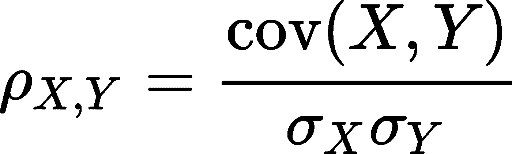

# Kydavra 易于使用的相关性特征选择

> 原文：<https://pub.towardsai.net/easy-to-use-correlation-feature-selection-with-kydavra-56a463b97b79?source=collection_archive---------6----------------------->

## [机器学习](https://towardsai.net/p/category/machine-learning)


几乎每个从事数据科学或机器学习的人都知道，找到预测值 y 的相关特征的最简单方法之一是找到与 y 最相关的特征。然而，很少有人(如果不是数学家)知道有许多类型的相关性。在本文中，我将简要介绍 3 种最流行的相关类型，以及如何将它们与 Kydavra 一起轻松应用于特性选择。

**皮尔逊相关。**

> 两个变量的协方差中的皮尔逊相关系数除以它们的标准偏差的乘积。



图一。计算两个特征之间的皮尔逊相关性的公式。

它的值在-1 和 1 之间，负值表示相反的关系，正值表示相反的情况。通常我们只取绝对值。因此，如果绝对值大于 0.5，则该系列可以具有(是的，可以具有)关系。但是，我们还设置了一个垂直限制，0.7 或 0.8，因为如果值过于相关，那么可能一个序列是从另一个序列派生出来的(例如月龄和年龄)，或者可能会使我们的模型过度拟合。

**使用 Kydavra PearsonCorrelationSelector。**

首先你应该安装 kydavra，如果你还没有安装的话。

```
pip install kydavra
```

接下来，我们应该创建一个对象，并将其应用于炉边疾病 UCI 数据集。

```
from kydavra import PearsonCorrelationSelectorselector = PearsonCorrelationSelector()selected_cols = selector.select(df, ‘target’)
```

在炉边疾病 UCI 数据集上应用选择器的默认设置将给出一个空列表。这是因为没有特征与目标特征的相关性高于 0.5。这就是为什么我们强烈建议您使用选择器的参数:

*   **min_corr** ( *float，在 0 和 1 之间，默认=0.5* )被选为重要特征的相关系数的最小值。
*   **max_corr** ( *float，在 0 和 1 之间，默认=0.5* )被选为重要特征的相关系数的最小值。
*   **erase _ corr**(*boolean，default=False* )如果设置为 True，则该算法将擦除仅保持 on 之间相关的列，如果为 False，则它将保持所有列。

实施最后一个要素是因为如果您正在构建一个具有两个高度相关的要素的模型，那么您实际上是在提供相同的信息，从而产生了多重线性问题。因此，将 min_corr 更改为 0.3 会得到以下各列:

```
['sex', 'cp', 'thalach', 'exang', 'oldpeak', 'slope', 'ca', 'thal']
```

交叉验证分数保持不变——0.81。很好的结果。

**斯皮尔曼相关。**

当皮尔逊相关是基于数据正态分布的假设时，斯皮尔曼秩系数不做这种假设。所以价值观不一样。然而，斯皮尔曼等级系数的范围也是-1 和 1。如何计算它的数学细节超出了本文的范围，所以下面是一些分析它的文章(以及更详细的下一种类型的相关性)。

所以现在让我们将 SpermanCorrelationSelector 应用于我们的数据集。

```
from kydavra import SpermanCorrelationSelectorselector = SpermanCorrelationSelector()selcted_cols = selector.select(df, ‘target’)
```

使用默认设置，选择器也返回一个空列表。但是将 min_corr 设置为 0.3 会给出与 PearsonCorrelation 相同的列。所有相关选择器的参数都是相同的。

**肯德尔等级相关。**

Kydavra 库中也实现了 Kendall 秩相关。我们让理论深入到文章中。因此，要使用 Kendall 等级相关性，请使用以下模板。

```
from kydavra import KendallCorrelationSelectorselector = KendallCorrelationSelector()selected_cols = selector.select(df, ‘target’)
```

测试其性能，我们也让你。下面是一些深入研究相关性指标的文章。


如果您使用或尝试过 Kyadavra，我们强烈邀请您填写这张[表格](https://vpapaluta.typeform.com/to/g1EXxlSf)并分享您的体验。

西格蒙德用❤做的。

## **资源**

*   [https://towards data science . com/Kendall-rank-correlation-explained-dee 01d 99 c 535](https://towardsdatascience.com/kendall-rank-correlation-explained-dee01d99c535)
*   [https://en . Wikipedia . org/wiki/Spearman % 27s _ rank _ correlation _ coefficient](https://en.wikipedia.org/wiki/Spearman%27s_rank_correlation_coefficient)
*   [https://en .维基百科. org/wiki/Pearson _ correlation _ coefficient](https://en.wikipedia.org/wiki/Pearson_correlation_coefficient)