# ECCV 2020 最佳论文奖|光流的新架构

> 原文：<https://pub.towardsai.net/eccv-2020-best-paper-award-a-new-architecture-for-optical-flow-3298c8a40dc7?source=collection_archive---------0----------------------->

## [计算机视觉](https://towardsai.net/p/category/computer-vision)，[研究](https://towardsai.net/p/category/research)

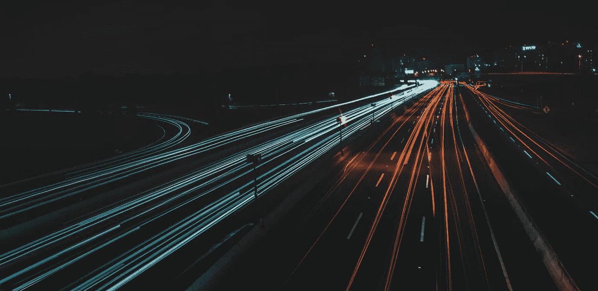

照片由[克里斯·奥瓦尔](https://unsplash.com/@crisovalle?utm_source=unsplash&utm_medium=referral&utm_content=creditCopyText)在 [Unsplash](https://unsplash.com/s/photos/movement?utm_source=unsplash&utm_medium=referral&utm_content=creditCopyText) 拍摄

普林斯顿团队获得 ECCV 2020 年最佳论文奖。
他们为光流开发了一种新的端到端可训练模型。
他们的方法在多个数据集上击败了最先进架构的准确性，并且更加高效。

他们甚至在 Github 上向所有人开放代码！让我们看看他们是如何做到的。

## 论文简介

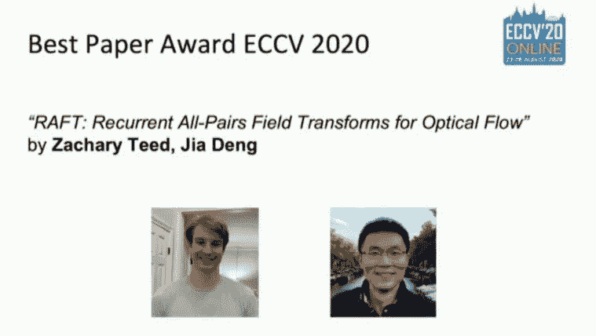

[https://github.com/princeton-vl/RAFT](https://arxiv.org/pdf/2003.12039.pdf)

ECCV2020 大会于上周举行。为了这次会议，计算机视觉领域的大量新研究论文问世。
在这里，我将报道他们授予普林斯顿团队的“最佳论文奖”。

简而言之，他们为光流开发了一种新的端到端可训练模型，称为“RAFT:光流的循环所有对场变换”
他们的方法在多个数据集上实现了最先进的准确性，并且效率更高。

## 什么是光流？

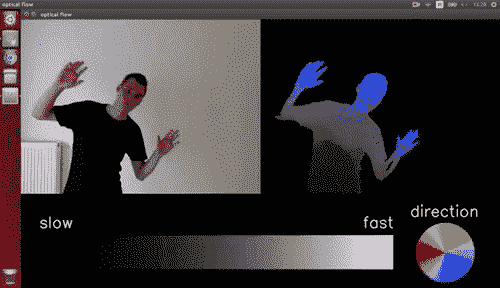

Gif 作者:[https://gfycat.com/fr/wetcreepygecko](https://gfycat.com/fr/wetcreepygecko)

首先，我将快速解释什么是光流。
定义为视频中物体的表观运动模式。
换句话说，这意味着物体在一个序列的连续帧之间的运动。它计算物体和场景之间的相对运动。
它通过使用视频中的时间结构和每帧中的空间结构来实现。

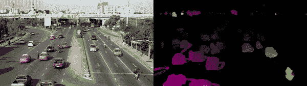

Gif 作者:[https://nanonets.com/blog/optical-flow/](https://nanonets.com/blog/optical-flow/)

如您所见，您可以使用 OpenCV 的函数轻松计算视频的光流:

```
import cv2
import numpy as np
cap = cv2.VideoCapture("vtest.avi")

ret, frame1 = cap.read()
prvs = cv2.cvtColor(frame1,cv2.COLOR_BGR2GRAY)
hsv = np.zeros_like(frame1)
hsv[...,1] = 255

while(1):
    ret, frame2 = cap.read()
    next = cv2.cvtColor(frame2,cv2.COLOR_BGR2GRAY)

    flow = cv2.calcOpticalFlowFarneback(prvs,next, None, 0.5, 3, 15, 3, 5, 1.2, 0)

    mag, ang = cv2.cartToPolar(flow[...,0], flow[...,1])
    hsv[...,0] = ang*180/np.pi/2
    hsv[...,2] = cv2.normalize(mag,None,0,255,cv2.NORM_MINMAX)
    rgb = cv2.cvtColor(hsv,cv2.COLOR_HSV2BGR)

    cv2.imshow('frame2',rgb)
    k = cv2.waitKey(30) & 0xff
    if k == 27:
        break
    elif k == ord('s'):
        cv2.imwrite('opticalfb.png',frame2)
        cv2.imwrite('opticalhsv.png',rgb)
    prvs = next

cap.release()
cv2.destroyAllWindows()
```

只需要几行代码就可以在实时提要中生成它。以下是使用此短代码从普通视频帧中获得的结果:

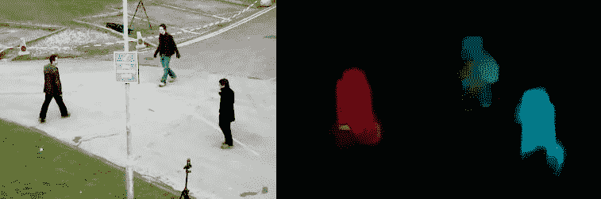

代码和图片作者:[https://opencv-python-tutro als . readthedocs . io/en/latest/py _ tutorials/py _ video/py _ Lucas _ kanade/py _ Lucas _ kanade . html](https://opencv-python-tutroals.readthedocs.io/en/latest/py_tutorials/py_video/py_lucas_kanade/py_lucas_kanade.html)

它非常酷，对许多应用程序非常有用。


Gif 作者:【https://nanonets.com/blog/optical-flow/ 

例如交通分析、车辆跟踪、对象检测和跟踪、机器人导航等等。唯一的问题是它相当慢，需要大量的计算资源。

这篇新论文有助于解决这两个问题，同时产生更准确的结果！

## 这是什么纸？研究人员到底做了什么？

现在，让我们更深入地了解这篇文章的内容，以及它如何改进了当前最先进的方法。
他们从四个方面改进了最先进的方法。

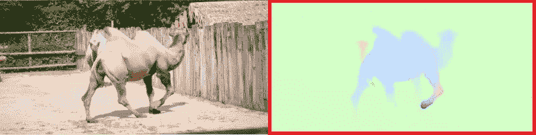

图片作者:[https://arxiv.org/pdf/2003.12039.pdf](https://arxiv.org/pdf/2003.12039.pdf)

首先，它可以直接在光流上训练，而不需要使用像素之间的嵌入损失来训练网络，这使得它更加有效。
然后，关于流量预测，当前的方法直接在一对帧之间进行预测。
相反，他们通过维护和更新单个高分辨率流场来优化计算时间。

对于这个流场，他们不得不使用类似于 LSTM 块的 GRU 块，以便像当前最好的方法一样迭代地改进他们的光流。

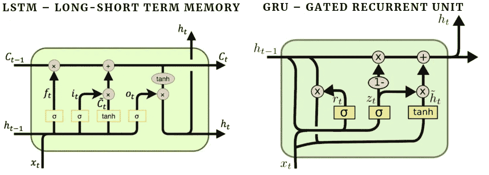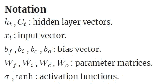

图片作者:[http://dprogrammer.org/rnn-lstm-gru](http://dprogrammer.org/rnn-lstm-gru)

该块允许它们在这些迭代之间共享权重，同时允许在训练时使用它们的固定流场进行收敛。

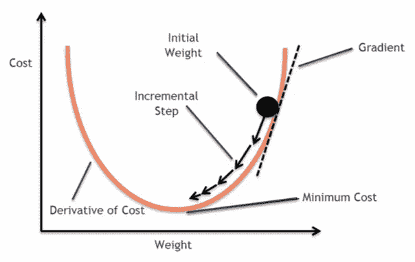

图片来自:[https://blog . clairvoyantsoft . com/the-ascent-of-gradient-descent-23356390836 f？gi=9b683d504450](https://blog.clairvoyantsoft.com/the-ascent-of-gradient-descent-23356390836f?gi=9b683d504450)

他们的技术与其他方法之间的最后一个区别是，他们不是明确定义关于优化目标的梯度，而是使用反向传播，从相关体积中检索特征以提出下降方向。

## 他们是如何做到的？

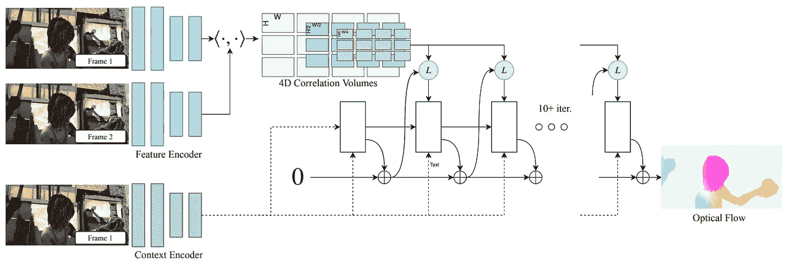

图片作者:[https://arxiv.org/pdf/2003.12039.pdf](https://arxiv.org/pdf/2003.12039.pdf)

所有这些改进都是使用他们的新架构实现的。
它基本上由 3 个主要部件组成。

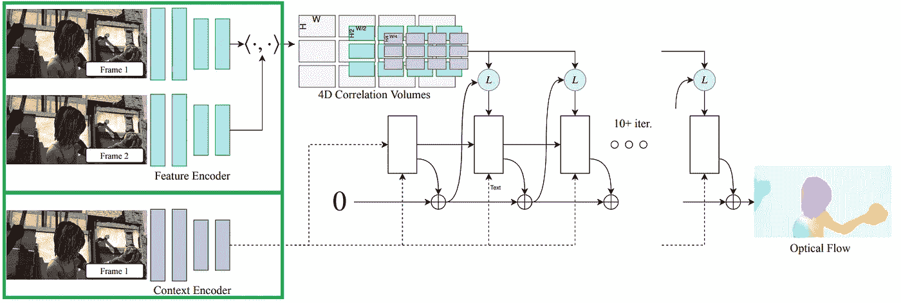

图片作者:[https://arxiv.org/pdf/2003.12039.pdf](https://arxiv.org/pdf/2003.12039.pdf)

首先，一个编码器从两个不同的帧中提取每像素特征，另一个编码器仅从第一帧中提取特征，以便理解

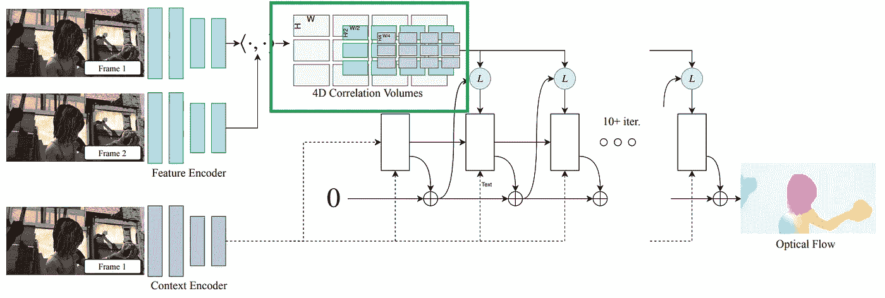

图片作者:【https://arxiv.org/pdf/2003.12039.pdf 

形象。
然后，使用所有的特征向量对，他们使用两帧的宽度和高度生成一个四维体积。

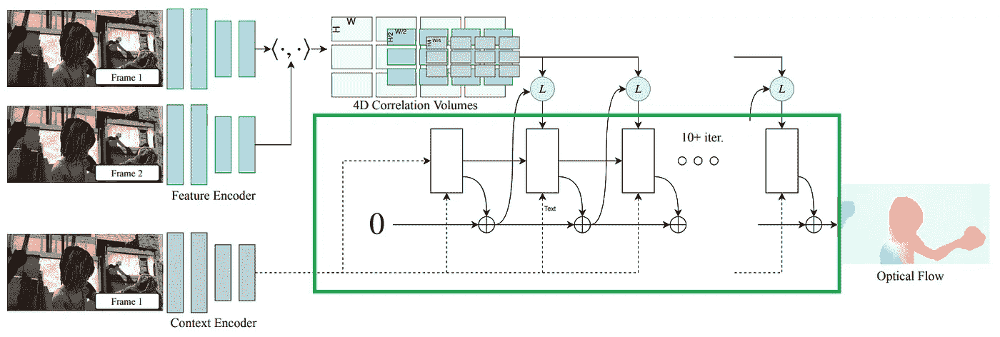

图片作者:[https://arxiv.org/pdf/2003.12039.pdf](https://arxiv.org/pdf/2003.12039.pdf)

最后，他们使用一个更新算子循环更新光流。这就是 GRU 街区所在的地方。
它从以前的相关体积中检索值，并迭代更新流场。

## 结果

看看结果有多尖锐就知道了。同时比当前的方法更快！

**观看显示结果的视频:**

[https://www.youtube.com/watch?v=OSEuYBwOSGI](https://www.youtube.com/watch?v=OSEuYBwOSGI)

他们甚至在 Github 上向所有人开放代码！如果你想试试，我把它链接在下面。

当然，这只是对 ECCV2020 最佳论文奖得主的简单概述。
我强烈推荐阅读下面链接的论文以获取更多信息。

> **OpenCV 光流教程**:[https://OpenCV-python-tutro als . readthedocs . io/en/latest/py _ tutorials/py _ video/py _ Lucas _ kanade/py _ Lucas _ kanade . html](https://opencv-python-tutroals.readthedocs.io/en/latest/py_tutorials/py_video/py_lucas_kanade/py_lucas_kanade.html)
> **论文**:[https://arxiv.org/pdf/2003.12039.pdf](https://arxiv.org/pdf/2003.12039.pdf)
> **GitHub，代码**:[https://github.com/princeton-vl/RAFT](https://github.com/princeton-vl/RAFT)

如果你喜欢我的工作并想支持我，我会非常感谢你在我的社交媒体频道上关注我:

*   支持我最好的方式就是在 [**中**](https://medium.com/@whats_ai) 关注我。
*   订阅我的 [**YouTube 频道**](https://www.youtube.com/channel/UCUzGQrN-lyyc0BWTYoJM_Sg) 。
*   在 [**LinkedIn**](https://www.linkedin.com/company/what-is-artificial-intelligence) 上关注我的项目
*   一起学习 AI，加入我们的 [**Discord 社区**](https://discord.gg/SVse4Sr) ，*分享你的项目、论文、最佳课程、寻找 kaggle 队友等等！*