# 基于 Python 的销售策略电子商务数据分析

> 原文：<https://pub.towardsai.net/ecommerce-data-analysis-for-sales-strategy-using-python-5b026fd36a6e?source=collection_archive---------0----------------------->

## [数据分析](https://towardsai.net/p/category/data-analysis)


来源——【https://www.wvgazettemail.com/ 

基于对 2019 年销售数据的洞察，k-mart 2020 年销售战略。

# 介绍

凯马特是美国领先的在线零售商，作为其年度销售审查会议的一部分，他们需要根据 2019 年销售数据的见解，决定 2020 年的销售战略。

数据与 2019 年每个月的销售相关，任务是产生关键的见解，帮助凯马特的**销售团队**做出一些关键的商业决策，以微调他们的销售战略。

# 数据理解

1.数据属于美国领先的在线零售商 Kmart。

2.时间段—2019 年 1 月—2019 年 12 月

3.独特产品— 19

4.订单总数— 178437

5.城市— 9

6.KPI 总销售额、售出的产品总数

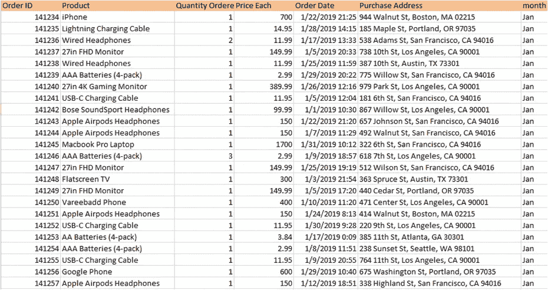

来源—按作者

# 业务问题陈述

1.销售最好的月份是哪个月？那个月赚了多少？

2.哪个城市的销售量最高？

3.推荐展示广告的最合适时间，以最大化顾客购买产品的可能性？

4.什么产品卖得最多？为什么你认为它卖得最多？

# 使用 Python 进行数据分析

1.加载每个月的数据，并使用 pandas 制作数据框

2.串联数据集以生成 2019 年销售的一个数据集。

3.处理空值和垃圾数据。

4.预处理数据后生成过滤数据集

5.商业问题的分析和解答。(使用 matplot 和 seaborn 库的可视化)

## 1.导入库

```
import pandas as pd
```

## 2.加载数据集并制作数据框

```
df1=pd.read_csv("Sales_January_2019.csv")
df1["month"]="Jan"
df2=pd.read_csv("Sales_February_2019.csv")
df2["month"]="feb"
df3=pd.read_csv("Sales_March_2019.csv")
df3["month"]="mar"
df4=pd.read_csv("Sales_April_2019.csv")
df4["month"]="apr"
df5=pd.read_csv("Sales_May_2019.csv")
df5["month"]="may"
df6=pd.read_csv("Sales_June_2019.csv")
df6["month"]="june"
df7=pd.read_csv("Sales_July_2019.csv")
df7["month"]="july"
df8=pd.read_csv("Sales_August_2019.csv")
df8["month"]="aug"
df9=pd.read_csv("Sales_September_2019.csv")
df9["month"]="sep"
df10=pd.read_csv("Sales_October_2019.csv")
df10["month"]="oct"
df11=pd.read_csv("Sales_November_2019.csv")
df11["month"]="nov"
df12=pd.read_csv("Sales_December_2019.csv")
df12["month"]="dec"list=[df1,df2,df3,df4,df5,df6,df7,df8,df9,df10,df11,df12]
```

## 3.每月数据集的形状

```
for i in list:
    print(i.shape)
```

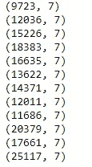

来源-作者

## 4.串联数据集

```
frame=pd.concat(list)
```

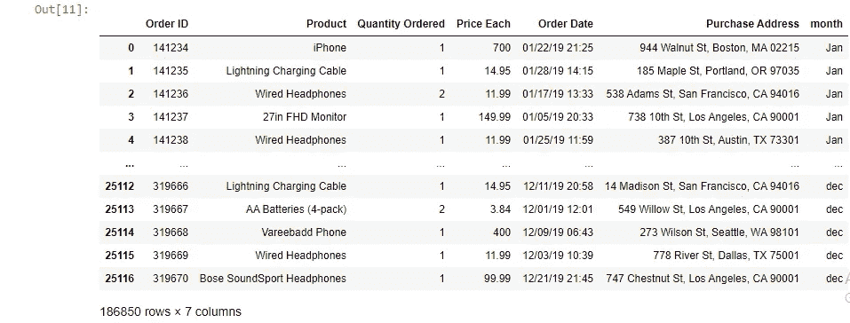

来源-作者

## 5.最终数据集的列

```
frame.columns
```

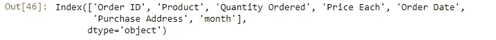

来源-作者

## 6.数据帧信息

```
frame.info()
```

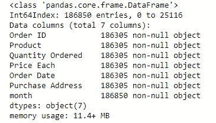

来源-作者

## 7.数据集中的空值

```
frame.isnull().sum() # there are 545 null values in each column except month
```

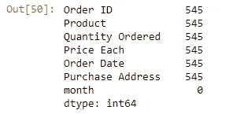

来源-作者

```
(frame.isnull().sum().sum())/len(frame)*100  # we have 1.75 percent null values , so we can drop them
```

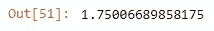

来源-作者

## 8.删除空值

```
frame=frame.dropna()
frame.isnull().sum()
```

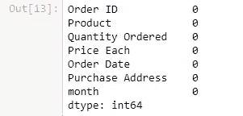

来源-作者

## 9.删除垃圾数据

我们观察到有 355 列的行中的值与标题中的值相同。因此创建一个新的数据框，其中这些值将被排除。

```
frame[frame['Quantity Ordered'] == "Quantity Ordered"]
```

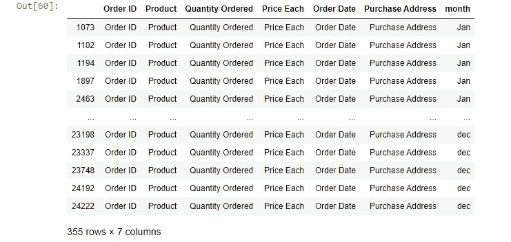

```
df_filtered = frame[frame['Quantity Ordered'] != "Quantity Ordered"] 
df_filtered.head(15) 
df_filtered.shape
```

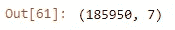

来源-作者

# 商业问题的解决方案

**Qs 1。销售最好的月份是哪个月？那个月赚了多少？**

```
df_filtered["Quantity Ordered"]=df_filtered["Quantity Ordered"].astype("float")
df_filtered["Price Each"]=df_filtered["Price Each"].astype("float")# Creating Sales Column By multiplying Quantity Ordered and Price of Each Productdf_filtered["sales"]=df_filtered["Quantity Ordered"]*df_filtered["Price Each"]
```

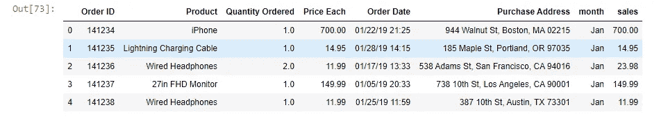

来源-作者

```
month=["dec","oct","apr","nov","may","mar","july","june","aug",'feb',"sep","jan"] 
df["month"]=monthfrom matplotlib import pyplot as plt
a4_dims = (11.7, 8.27)
fig, ax = pyplot.subplots(figsize=a4_dims)
import seaborn as sns
sns.barplot(x = "sales",
            y = "month",
            data = df)
plt.title("Month wise Sale")
plt.show()
```

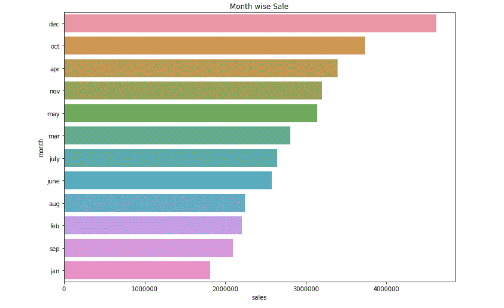

来源-作者

销售最好的月份是 12 月
12 月的总销售额是 4619297 美元

**Qs 2。哪个城市的销售量最高？**

```
dftemp = df_filtered
list_city = []
for i in dftemp['Purchase Address']:
    list_city.append(i.split(",")[1])
dftemp['City'] = list_city
dftemp.head()
```

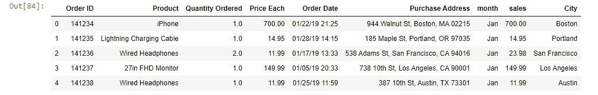

来源-作者

```
df_city=df_filtered.groupby(["City"])['sales'].sum().sort_values(ascending=False)
df_city=df_city.to_frame()
df_city
```

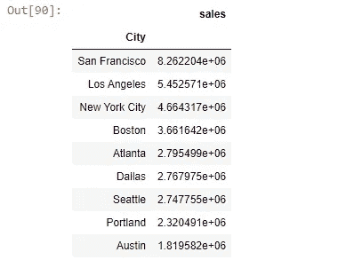

来源-作者

```
city=["San Francisco","Los Angeles","New York City","Boston","Atlanta","Dallas","Seattle","Portland","Austin"]
df_city["city"]=cityfrom matplotlib import pyplot
a4_dims = (11.7, 8.27)
fig, ax = pyplot.subplots(figsize=a4_dims)
sns.barplot(x = "sales",
            y = "city",
            data = df_city)
plt.title("City wise Sales")
plt.show()
```

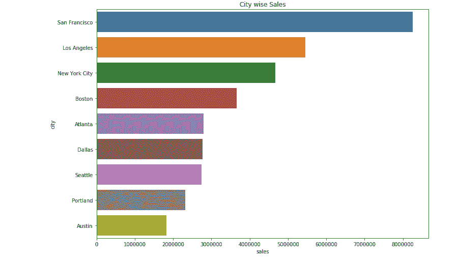

来源-作者

旧金山的销售额最高，约为 8262204 美元。

**Qs 3 什么产品卖得最多？**

```
print(df_filtered["Product"].unique())
print(df_filtered["Product"].nunique())
```

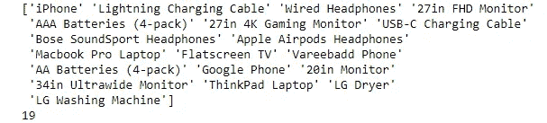

来源-作者

```
df_p=df_filtered.groupby(['Product'])['Quantity Ordered'].sum().sort_values(ascending=False).head()
df_p=df_p.to_frame()
df_p
```

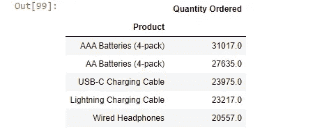

来源-作者

```
product=["AAA Batteries (4-pack)","AA Batteries (4-pack)","USB-C Charging Cable","Lightning Charging Cable","Wired Headphones"]
df_p["Product"]=productfrom matplotlib import pyplot
a4_dims = (11.7, 8.27)
fig, ax = pyplot.subplots(figsize=a4_dims)
sns.barplot(x = "Quantity Ordered",
            y = "Product",
            data = df_p)
plt.title("Prouct and Quantity Ordered")
plt.show()
```

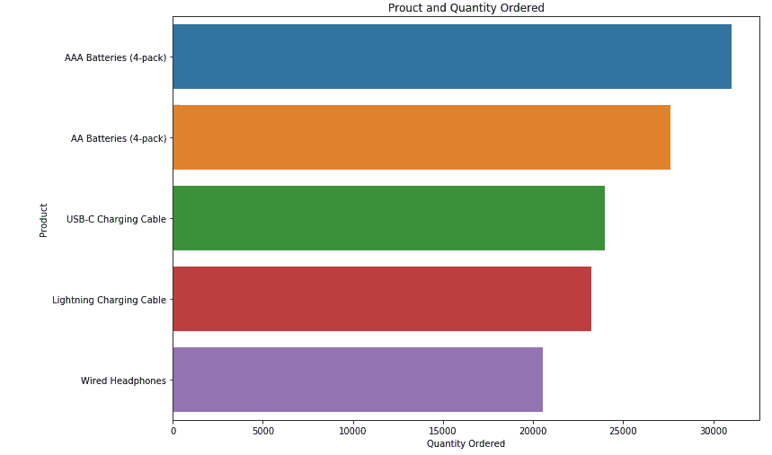

来源-作者

一年售出 31017.0 节 AAA 电池(4 节装)。它卖得最多，因为它是最便宜的产品。

Qs 4 推荐展示广告的最合适时间，以最大化顾客购买产品的可能性？

```
dftime = df_filtered
list_time = []
for i in dftime['Order Date']:
    list_time.append(i.split(" ")[1])
dftime['Time'] = list_time
dftime.head()
```

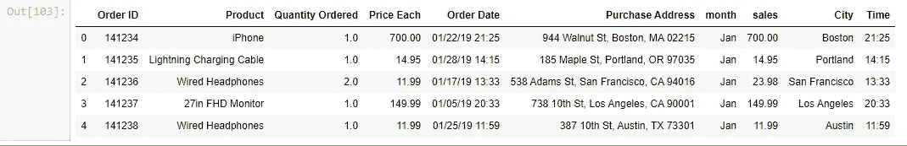

来源-作者

```
df_t=df_filtered.groupby(['Time'])['sales'].sum().sort_values(ascending=False).head()
df_t=df_t.to_frame()
df_t
```

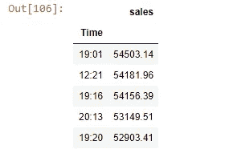

来源-作者

```
df_t.columns
```

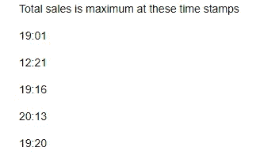

来源-作者

# 在你走之前

*感谢阅读！如果你想与我取得联系，请随时通过 jsc1534@gmail.com 联系我或我的* [*LinkedIn 个人资料*](http://www.linkedin.com/in/juhi-sharma-ds) *。另外，你可以在我的*[*GitHub*](https://github.com/jsc1535/K-Mart-Data-Analysis)*账号上找到这篇文章的代码和一些真正有用的数据科学项目。*