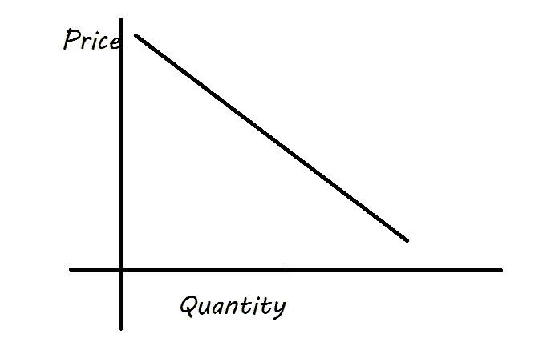
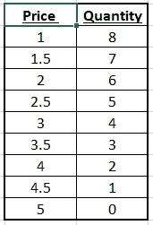
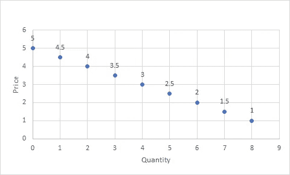
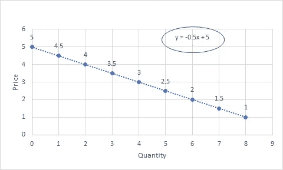
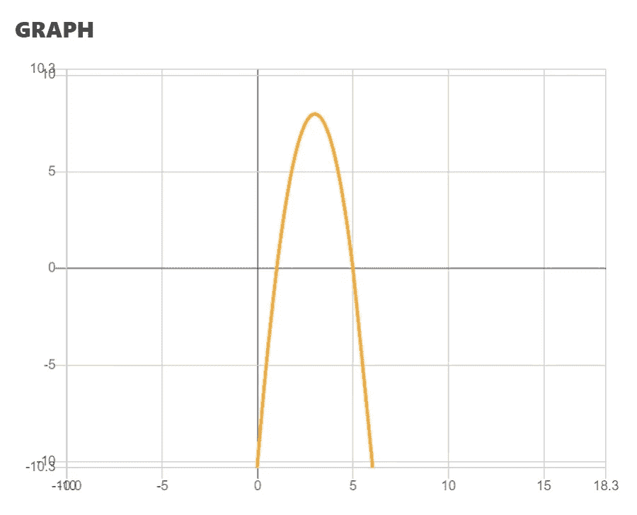

# 计量经济学——如何进行价格优化

> 原文：<https://pub.towardsai.net/econometrics-how-to-perform-price-optimization-166732b110be?source=collection_archive---------1----------------------->

Artem Beliaikin 在 [Unsplash](https://unsplash.com/s/photos/price?utm_source=unsplash&utm_medium=referral&utm_content=creditCopyText) 上拍摄的照片

## [数学](https://towardsai.net/p/category/mathematics)

## 计量经济学

# 目录:

## 一.需求曲线

## 二。了解价格优化

## 一.需求曲线

需求曲线是价格和数量关系的图形表示。

作者图片

在大多数情况下，这是一个相反的关系。这种现象的直观原因是，随着产品价格的上涨，消费者倾向于购买较少数量的产品。

线性需求曲线将遵循 y=mx+b。

曲线的斜率是弹性的倒数。这个特征告诉我们需求量对价格变化的敏感程度。

## 二。了解价格优化

让我们看一个什么是价格优化的例子。

以下是一些销售数据:

需求

如果我们用这张散点图画一条线穿过它:

我们可以看到，需求曲线方程是 y=-0.5x+5。

在经济学中，标准的做法是用需求量作为 X 轴，价格作为 Y 变量。

用简单的英语来说，这个图表为每个数据点提供了如下信息:

*   如果一个企业把价格定在 5 美元，需求数量将是 0，也就是说没有人想要这个产品
*   如果一个企业把价格定在 3 美元，需求量就会上升到 4 美元
*   在 1 美元的价格上，这是图上最便宜的价格，需求量将会急剧上升到 8

虽然价格不是消费者是否想要一种产品的唯一函数，但这种图形/需求曲线是计量经济学中理解价格和数量之间关系的主要工具。本质上，虽然等式可能会改变，但关系通常是相反的，即当产品价格越来越高时，人们愿意购买的产品越来越少。

(免责声明:关系不是既定的。例如，如果一种产品对价格没有弹性，那就意味着消费者对价格变化不敏感。在现实世界中，缺乏弹性是一种罕见的关系，大多数产品不会有完全缺乏弹性的曲线)

## 二。了解价格优化

既然我们理解了需求曲线，我们的下一步就是能够优化价格本身。我们应该怎么做呢？

嗯，本质上，我们必须问什么是商业环境下的价格优化。我们希望优化的到底是什么？嗯，一个企业想尽可能地获取最大利润。

企业可以收取的能产生最大可能利润的价格是“最优价格”。

> 企业可以收取的能带来最大可能利润的价格是“最优价格”。

所以，让我们用一些数学等式来写出来。

让我们先来定义利润:

利润=(价格-成本)*销售数量

好的，我们知道价格和数量在需求曲线中，即

价格= -.5(数量)+ 5

因此，我们可以将需求曲线方程代入利润方程。为了代入需求曲线，我们首先要求解数量:

数量=(价格-5)/-0.5

→数量=(-价格+5)/.5

→数量=(5-价格)/.5

→数量=(5-价格)* 1/.5

→数量=(5-价格)* 2

→数量= 10–2 *价格

这是我们求解数量时的需求曲线:

q = 10–2P

所以如果我们把上面的代入我们的利润方程

利润=(价格-成本)*销售数量

我们得到了

利润=(P-C)*(10–2P)

既然公司知道成本，我们可以用一个常数来表示它。在我们的例子中，我们将使用 1 美元作为成本:

利润=(P-1)*(10–2P)

利润= 10 便士-2P -10 英镑+2P

利润= -2P +12P -10

现在让我们来看看上面这个等式的图表。下方抛物线顶部的点将是产生最高利润的最佳点，即我们希望收取的最佳价格。

(*数学解题器&计算器*

为了做到这一点，我们可以使用一些基本的微积分。

求导并将其设为 0:

DPR of/DP price =-4P+12

将导数设为 0，以找到抛物线的交点

-4p+12 = 0

→ -4p=-12

→ **p = 3 →这是最优价格**

或者，你可以使用[wolframalpha.com](http://wolframalpha.com)得到导数。

1.  "数学问题求解器和计算器."*微软数学求解器*，mathsolver.microsoft.com/en.