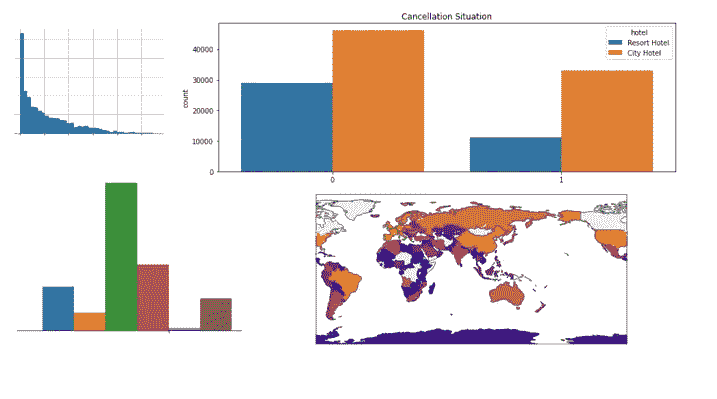
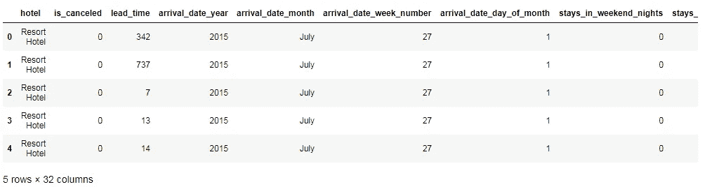
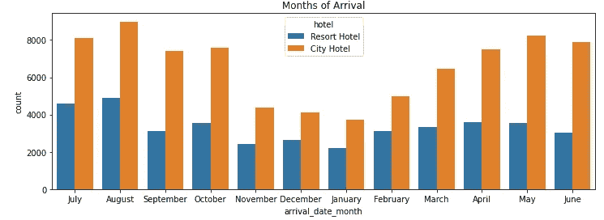
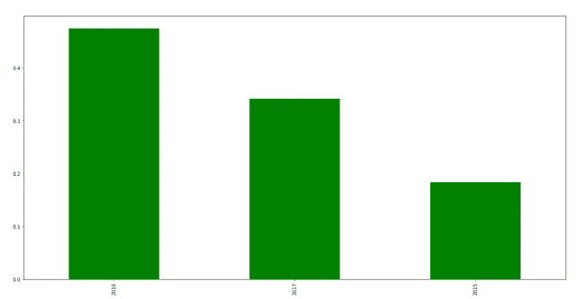
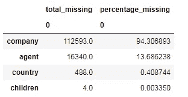
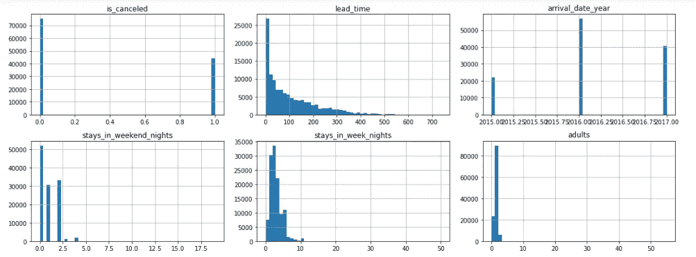
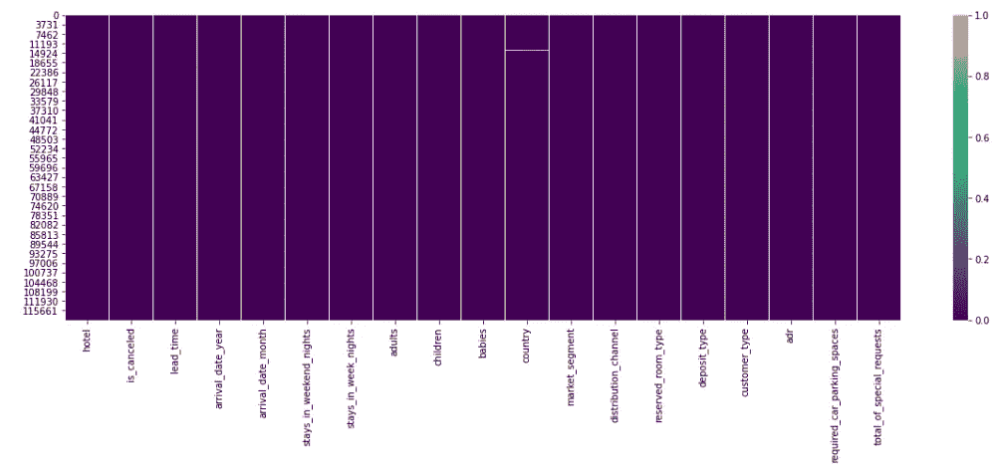
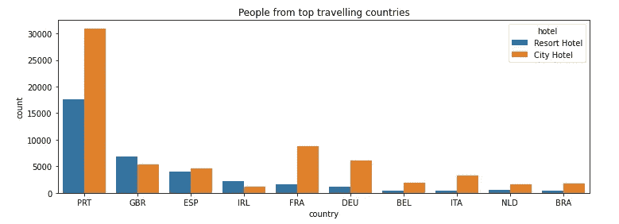

# 酒店预订项目的 EDA 及 Python 可视化

> 原文：<https://pub.towardsai.net/eda-and-visualization-of-hotel-booking-project-in-python-d810e7a88d30?source=collection_archive---------0----------------------->

## [数据分析](https://towardsai.net/p/category/data-analysis)

## 数据清理和分析图



数据可视化。作者的照片

在本文中，我们将讨论酒店预订数据集的探索性数据分析和数据可视化。在这个项目中，我们需要找到酒店的平均费用，并探索数据。

数据集包含诸如酒店、is_canceled、lead_time 等列名。列信息如下所示:

```
**1\. hotel:** type of hotels
**2.** **is_canceled:** canceled or not **3\. lead_time:** no. of days before actual arrival in the hotel **4\. arrival_date_year:** year of booking **5\. arrival_date_month:** month of booking **6\. arrival_date_week_number:** week number of the year in which
   booking **7.arrival_date_day_of_month:** arrival month date **8\. stays_in_weekend_nights:** no. of weekends guest stayed **9\. stays_in_week_nights:** no. of weekdays guest stayed **10\. adults                                 
11\. children                               
12\. babies                                 
13\. meal:** BB – Bed & Breakfast
            HB – only two meals including breakfast meal
            FB – breakfast, lunch, and dinner
**14\. country                              
15\. market_segment:** TA: Travel agents
                      TO: Tour operators **16\. distribution_channel                 
17\. is_repeated_guest                    
18\. previous_cancellations:** cancellation in past **19\. previous_bookings_not_canceled:** not cancelled in past **20\. reserved_room_type                     
21\. assigned_room_type                     
22\. booking_changes                        
23\. deposit_type                           
24\. agent                              
25\. company                           
26\. days_in_waiting_list                   
27\. customer_type                          
28\. adr:** average daily rate **29\. required_car_parking_spaces            
30\. total_of_special_requests              
31\. reservation_status                     
32\. reservation_status_date**
```

[](/machine-learning-16c8ccc2c7b8) [## 无监督学习中不同类型的聚类方法

pub.towardsai.net](/machine-learning-16c8ccc2c7b8) 

让我们用 python 来探索数据。

导入项目中需要的库。

```
import pandas as pd
import numpy as np
import seaborn as sns
import matplotlib.pyplot as plt
import plotly 
import plotly.express as px
```

借助熊猫 read_csv 方法读取和查看酒店预订需求的数据。

```
df=pd.read_csv('hotel_bookings.csv')
df.head()
```



作者的照片

检查训练数据集中数据类型的数量:

```
df.dtypes.value_counts()
```

我们看到有 4 个 float64 列、16 个 int64 列和 12 个 object 列。我们必须根据数据找到酒店预订需求。首先，我们需要找到人们预订较多的酒店类型。

```
df1 = df.copy()
df1['hotel'].value_counts()#output:
City Hotel      79330
Resort Hotel    40060
Name: hotel, dtype: int64
```

人们预订城市酒店多于度假酒店。现在我们想知道人们在哪个月预订酒店。

```
df1['arrival_date_month'].value_counts()#output:
August       13877
July         12661
May          11791
October      11160
April        11089
June         10939
September    10508
March         9794
February      8068
November      6794
December      6780
January       5929
Name: arrival_date_month, dtype: int64
```

用 seaborn library 绘制酒店类型的月份。

```
plt.figure(figsize=(12,4))
sns.countplot(x='arrival_date_month', hue = 'hotel', data= df1)
plt.title('Months of Arrival')
plt.show()
```



作者的照片

现在，找出酒店预订最多的年份。

```
df1['arrival_date_year'].value_counts()
```

用条形图绘制年份列。

```
plt.figure(figsize=(20,10))
df.arrival_date_year.value_counts(normalize=True).plot(kind="bar",
                                                         color='g')
plt.show()
```



作者的照片

现在，我们将计算数据中 nan 值的百分比。

```
# missing value against each columns.total_missing = df1.isnull().sum().sort_values(ascending=False)
total_missing_df = pd.DataFrame(total_missing)percentage_miss = (df1.isnull().sum()/df1.isnull().count()*100).sort_values
                                                (ascending=False)missing_data = pd.concat([total_missing_df, percentage_miss],
         axis=1, keys=['total_missing', 'percentage_missing'])#missing_datamissing_data_withoutnan = missing_data[missing_data > 0].dropna()missing_data_withoutnan
```



作者的照片

我们看到 company 列有最大数量的缺失数据。因此，我们可以删除该列，但在数据浏览中许多列是不需要的。也删除那些列。

```
#After reading the task file, there are some columns that not need in the master frame datadf1 = df1.drop(['company', 'agent',  'meal',
           'arrival_date_week_number','arrival_date_day_of_month',
                'is_repeated_guest', 'previous_cancellations',
                'previous_bookings_not_canceled',
                'assigned_room_type','reservation_status',
                'reservation_status_date','days_in_waiting_list',
               'booking_changes'], axis = 1)
```

我们可以绘制柱特征的直方图。

```
# a histogram plot for each numerical attribute
df1.hist(bins=50, figsize=(20,15))
plt.tight_layout()
plt.show()
```



作者的照片

[](/understand-time-series-components-with-python-4bc3e2ba1189) [## 用 Python 理解时间序列组件

### 机器学习中预测模型的基本概念及实例

pub.towardsai.net](/understand-time-series-components-with-python-4bc3e2ba1189) [](/data-preprocessing-concepts-with-python-b93c63f14bb6) [## Python 中的数据预处理概念

### 一种为机器学习估值器准备数据的稳健方法

pub.towardsai.net](/data-preprocessing-concepts-with-python-b93c63f14bb6) 

我们也可以通过热图看到空值。

```
plt.figure(figsize=(20,6))
sns.heatmap(df1.isnull(),cmap='viridis')
```



作者的照片

让我们把取消栏和酒店栏核对一下，并计算出取消的百分比。

```
df1['is_canceled'].value_counts()/df1['hotel'].shape[0]*100#output:
0    62.958372
1    37.041628
Name: is_canceled, dtype: float64
```

城市酒店更多的是取消预订。现在，用条形图画出同样的图。

```
plt.figure(figsize=(12,4))
sns.countplot(x='is_canceled', hue = 'hotel', data= df1)
plt.title('Cancellation Situation')
plt.show()
```

现在，我们将找出预订酒店人数最多的前 10 个国家。

```
df1['country'].value_counts().head(10)#output:
PRT    48590
GBR    12129
FRA    10415
ESP     8568
DEU     7287
ITA     3766
IRL     3375
BEL     2342
BRA     2224
NLD     2104
Name: country, dtype: int64
```

制作仅包含前 10 个国家/地区的行的数据框。

```
#making data frame of top 10 countriestop10 = 
df1[df1['country'].isin(["PRT","GBR","FRA","ESP","DEU","ITA","IRL",
                         "BEL","BRA","NLD"])]
```

绘制前 10 个国家的柱状图。

```
plt.figure(figsize=(12,4))
sns.countplot(x='country', hue = 'hotel', data= top10)
plt.title('People from top travelling countries')
plt.show()
```



作者的照片

来自前 10 个国家的人选择城市酒店而不是度假酒店。我们将制作国家位置图，包括国家的数量。

```
# show on maptemp = df['country'].value_counts().reset_index().rename(columns={'index':'country','country':'count'})guest_map = px.choropleth(temp,
                          locations=temp['country'],
                          color=np.log(temp['count']), 
                          hover_name=temp['country'], 
                          color_continuous_scale=px.colors.sequential.Plasma,
                          title="Home country of guests")guest_map.show()
```


现在，我们将计算酒店的平均费用。

```
# selecting all the rows without zero values
df1 = df1.loc[(df1.children != 0)|(df1.babies != 0)|(df1.adults != 0), :]# Average hotel fees per person
df1['adr_per_person'] = df1['adr']/(df1['adults'] + df1['children'])resort_mean = df1.loc[(df1.is_canceled == 0) & (df1.hotel == 'Resort
                       Hotel'), 'adr_per_person'].mean()city_mean = df1.loc[(df1.is_canceled == 0) & (df1.hotel == 'City
                       Hotel'), 'adr_per_person'].mean()print("The mean price of Resort hotel is
      {:.2f}".format(resort_mean))print ("The mean price of city hotel is {:.2f}".format(city_mean))
```

度假酒店均价 **47.49** 。城市酒店均价 **59.27。**

## 结论:

在本文中，我们讨论了 EDA 的基本思想和数据科学项目中的可视化过程。

我希望你喜欢这篇文章。通过我的 [LinkedIn](https://www.linkedin.com/in/data-scientist-95040a1ab/) 和 [twitter](https://twitter.com/amitprius) 联系我。

# 推荐文章

[1。NLP —零到英雄用 Python](https://medium.com/towards-artificial-intelligence/nlp-zero-to-hero-with-python-2df6fcebff6e?sk=2231d868766e96b13d1e9d7db6064df1)
2。 [Python 数据结构数据类型和对象](https://medium.com/towards-artificial-intelligence/python-data-structures-data-types-and-objects-244d0a86c3cf?sk=42f4b462499f3fc3a160b21e2c94dba6)
3。[Python 中的异常处理概念](/exception-handling-concepts-in-python-4d5116decac3?source=friends_link&sk=a0ed49d9fdeaa67925eac34ecb55ea30)
4。[用 Python 进行主成分分析降维](/principal-component-analysis-in-dimensionality-reduction-with-python-1a613006d531?source=friends_link&sk=3ed0671fdc04ba395dd36478bcea8a55)
5。[用 Python 全面讲解 K-means 聚类](https://medium.com/towards-artificial-intelligence/fully-explained-k-means-clustering-with-python-e7caa573176a?source=friends_link&sk=9c5c613ceb10f2d203712634f3b6fb28)
6。[用 Python 充分解释了线性回归](https://medium.com/towards-artificial-intelligence/fully-explained-linear-regression-with-python-fe2b313f32f3?source=friends_link&sk=53c91a2a51347ec2d93f8222c0e06402)
7。[用 Python](https://medium.com/towards-artificial-intelligence/fully-explained-logistic-regression-with-python-f4a16413ddcd?source=friends_link&sk=528181f15a44e48ea38fdd9579241a78)
充分解释了 Logistic 回归 8。[concat()、merge()和 join()与 Python](/differences-between-concat-merge-and-join-with-python-1a6541abc08d?source=friends_link&sk=3b37b694fb90db16275059ea752fc16a)
9 的区别。[与 Python 的数据角力—第一部分](/data-wrangling-with-python-part-1-969e3cc81d69?source=friends_link&sk=9c3649cf20f31a5c9ead51c50c89ba0b)10。[机器学习中的混淆矩阵](https://medium.com/analytics-vidhya/confusion-matrix-in-machine-learning-91b6e2b3f9af?source=friends_link&sk=11c6531da0bab7b504d518d02746d4cc)