# Python 中梯度下降算法的学习速率分析

> 原文：<https://pub.towardsai.net/effect-of-learning-rate-in-gradient-descent-algorithm-using-python-bb45eb0f26bf?source=collection_archive---------0----------------------->

## [机器学习](https://towardsai.net/p/category/machine-learning)

## 在本教程中，您将通过尝试不同的学习率值集来学习、实现和可视化梯度下降的性能。

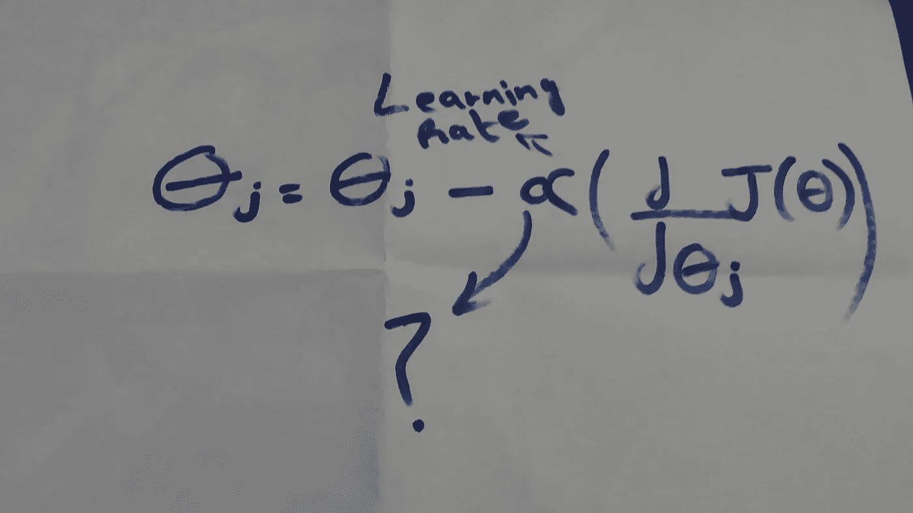

图片作者。梯度下降方程

# 你会学到什么

1.  什么是线性回归？
2.  什么是梯度下降？
3.  学习率(α)不同值之间的比较。
4.  用 Python 编程语言实现

# 介绍

我猜你可能从 Andrew ng 的 Coursera 机器学习课程中听说过梯度下降的学习率。初学者打造机器学习基础的最佳课程之一。

因此，我开始学习 ML 已经一个多月了，相信我，你可以在诸如**线性、逻辑回归、神经网络**等主题中学到很多东西……为了更好地理解这些主题，你需要**边做边学**。

> 我的目标是实现和演示每个初学者都应该知道的机器学习算法的概念。

那么就让我们从做 ML 开始学习之旅吧！

首先，让我简单地告诉你线性回归和梯度下降，然后我们将很快进入学习率的分析。

# **线性回归**

为了理解线性回归，让我们首先处理回归，然后我们将回到线性项。

# **什么是回归？**

简单来说，输出值连续的问题称为回归问题。

示例:

1.  预测房子的价格。
2.  预测特定地点的降雨量。
3.  预测某种生意的利润。等等

嗯，我有一个问题👇

# **我们如何使用机器学习来预测上述例子？**

机器学习算法需要特征作为输入，并基于该输入/特征进行一些处理并给出输出。

特性在获得期望的输出中起着非常重要的作用，根据您正在解决的问题的领域，特性可能不止一个，甚至可能有数百万个。

为了使事情更简单和更容易理解，我们将处理一个简单的线性回归问题，这意味着我们将尝试从单个特征预测单个输出，这就是线性项的含义。

# **我们将预测什么？**

以下场景摘自 Andrew ng 的机器学习课程。

假设你是一家特许经营餐厅的首席执行官，正在考虑在不同的城市开设新的分店。该连锁店已经在各个城市有了卡车，而且你有了这些城市的利润和人口数据。

您希望使用这些数据来帮助您选择将
扩展到下一个城市。

上面提到的是一个现实世界的问题，我们需要预测城市人口的利润。

**产量**/目标变量是**利润**。

**输入**/特征变量是**人口。**

让我们将数据集可视化

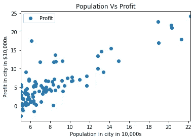

图片作者。散点图

数据的趋势几乎是线性的。现在，如果我们能够用一个线性模型来拟合数据，我们就能够从该城市的人口中预测出任何一家商店的利润。所以下一个问题是

# **如何才能拟合线性模型？**

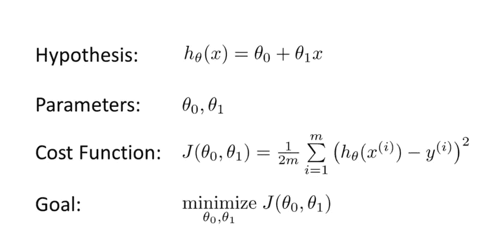

图片作者。线性方程和成本函数

等式就像 **y=mx+c**

我们的数据集中有一个“x”列，但是我们没有θ0 和θ1。所以梯度下降的作用来了。

# **梯度下降**

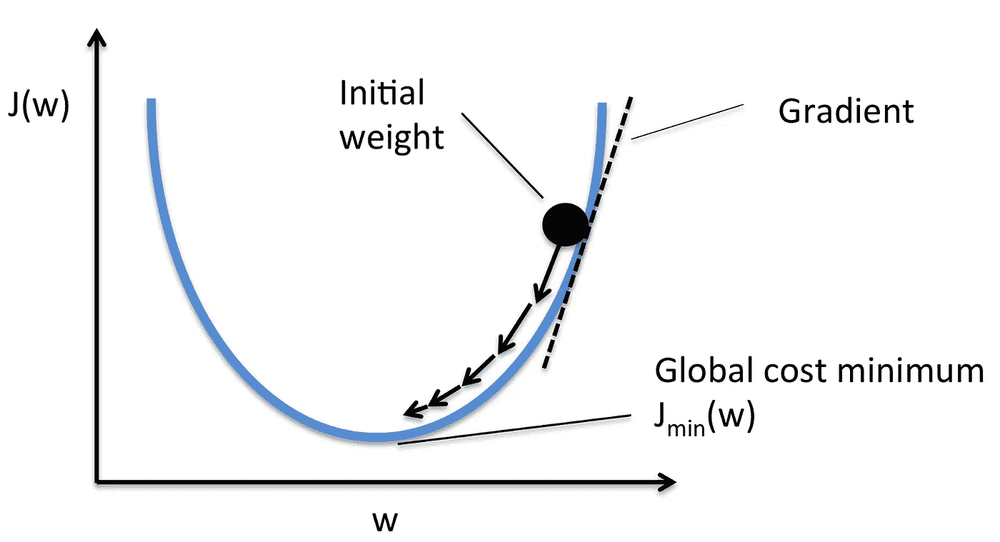

最小化成本函数的可视化并找到有效参数‘w’。图片由 [mlxtend](http://rasbt.github.io/mlxtend/user_guide/general_concepts/gradient-optimization/) 根据(CC BY-SA 4.0)授权。

θ0 和θ1 可以有许多值，但您知道我们只需要最小化成本函数的那些θ0 和θ1 的值，以便我们的模型能够以最小的误差拟合数据。

因此，梯度下降是众多优化算法中的一种，它可以以最小的成本给出θ0 和θ1 的值。

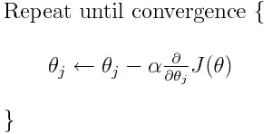

图片作者。梯度下降算法方程

# **学习率(α)的较小值和较大值之间的比较**

下面是我最喜欢的部分，我想实现它，最后在 python 中搜索不同的语法操作。目标完成:)

学习率理论

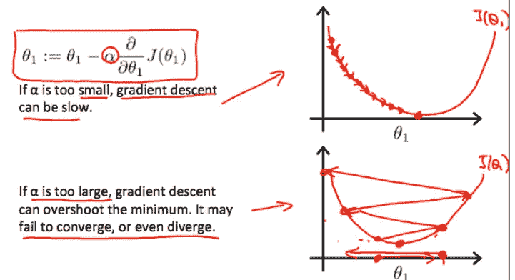

学习率的较小值和较大值对梯度下降性能的影响(图片由 Coursera 上的机器学习课程提供)

# 收敛和发散的可视化

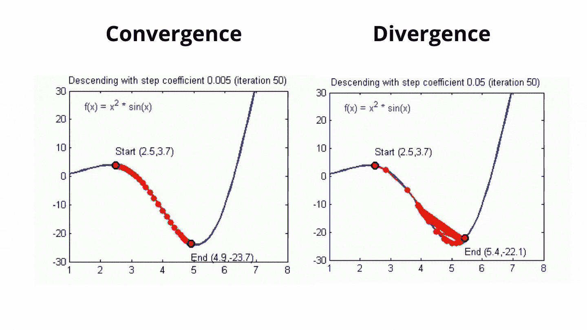

收敛和发散的直观可视化。图片由[亚当·哈利](https://www.cs.ryerson.ca/~aharley/neural-networks/)

现在让我们想象α的**更小的值**

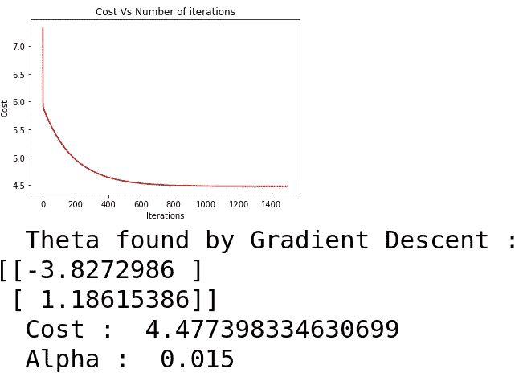

作者图片

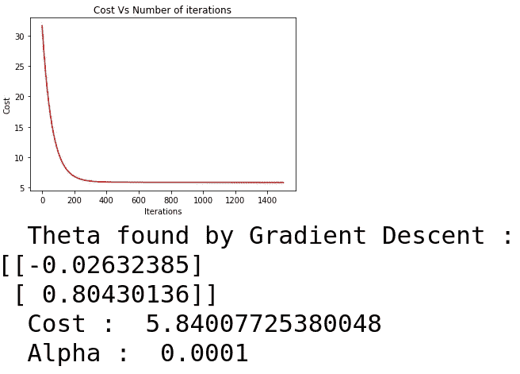

作者图片

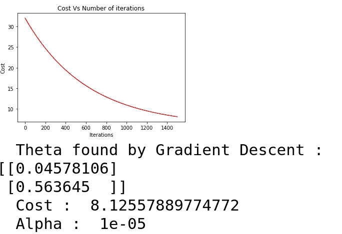

作者图片

因此，随着学习率的值变得越来越小，成本增加，梯度下降无法获得具有最小值的θ0 和θ1 的值。

现在让我们来看看学习率(α)的一个大值

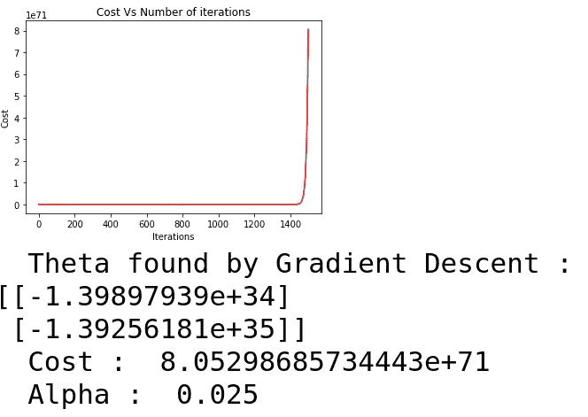

作者图片

因此，在大值时，梯度下降超过最小值。

# **用 Python 编程实现**语言

**主文件**

下面的文件是从 **scratch** 渐变下降的实现！

将下面的代码保存到一个新文件中，命名为 **kit.py** 。

## 资料组

您可以从👇环

 [## ex1data1.csv

### Dropbox 是一项免费服务，可以让你将照片、文档和视频带到任何地方，并轻松分享。从不发电子邮件…

www.dropbox.com](https://www.dropbox.com/s/6jdtzwoncvp3ay1/ex1data1.csv?dl=0) 

感谢您的阅读！

皮特·佩德罗萨在 [Unsplash](https://unsplash.com/) 上的照片

# 如果你觉得这个教程很有帮助，并且对从头开始制作机器学习项目感兴趣，可以看看下面的教程👇

 [## 如何以神经网络的思维方式使用逻辑回归构建图像分类应用程序

### 在这一步一步的教程中，您将学习使用…

towardsdatascience.com](https://towardsdatascience.com/how-to-build-an-image-classification-app-using-logistic-regression-with-a-neural-network-mindset-1e901c938355)  [## 初学者指南:让我们使用 Streamlit 制作一个交互式鸢尾花分类 app

### 学习使用 streamlit 制作互动、美观的机器学习应用程序:)

towardsdatascience.com](https://towardsdatascience.com/beginners-guide-lets-make-an-interactive-iris-flower-classification-app-using-streamlit-42e1026d2167) 

# 结论

在本教程中，您将了解👇

*   线性回归和梯度下降算法
*   学习率的较小值和较大值对梯度下降性能的影响
*   梯度下降算法中收敛和发散的可视化

我希望你喜欢从本教程中学习！

如果您在本教程中遇到任何问题或有任何疑问，请随时联系我们！

Gmail:jalalmansoori19@gmail.com
Twitter:[https://twitter.com/JalalMansoori19](https://twitter.com/JalalMansoori19)LinkedIn:[https://www.linkedin.com/in/jalal-mansoori-44584a177/](https://www.linkedin.com/in/jalal-mansoori-44584a177/)Github:[https://github.com/jalalmansoori19](https://github.com/jalalmansoori19)

# **参考文献**

1.  GeeksforGeeks，Python 中的矢量化，
    [https://www.geeksforgeeks.org/vectorization-in-python/](https://www.geeksforgeeks.org/vectorization-in-python/)
2.  斯坦福大学的机器学习课程，
    [https://www.coursera.org/learn/machine-learning](https://www.coursera.org/learn/machine-learning)
3.  揭秘深度卷积神经网络，【https://www.cs.ryerson.ca/~aharley/neural-networks/】T22
4.  梯度下降和随机梯度下降，
    [http://rasbt . github . io/mlx tend/user _ guide/general _ concepts/Gradient-optimization/](http://rasbt.github.io/mlxtend/user_guide/general_concepts/gradient-optimization/)