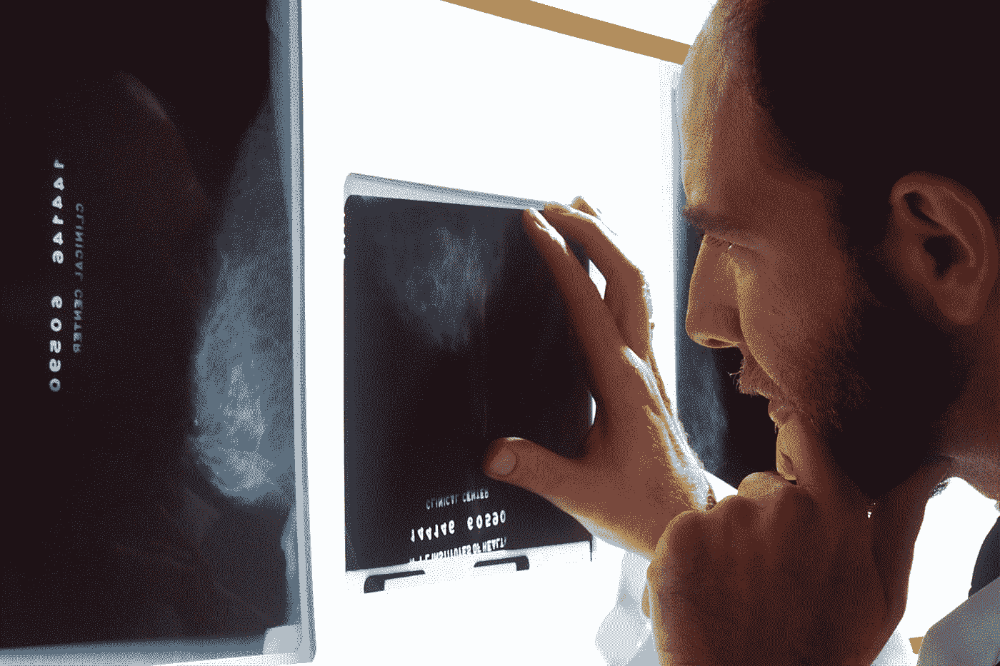
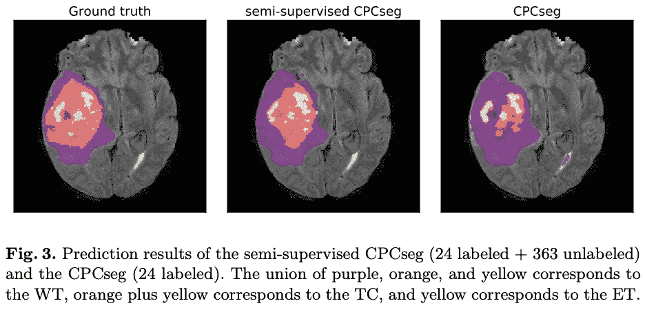
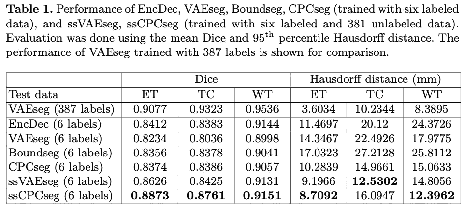
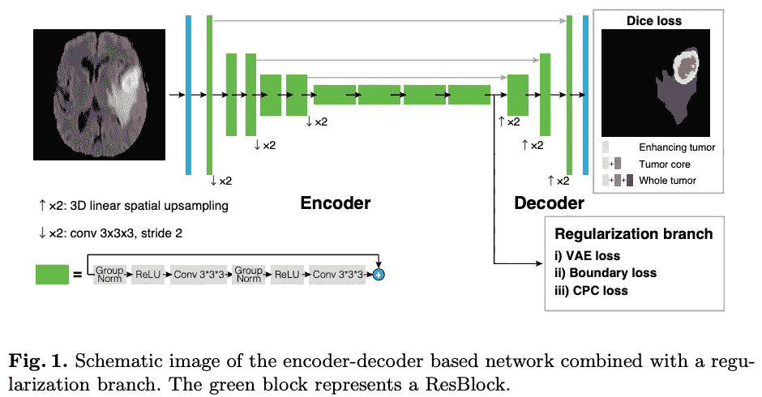
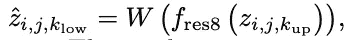
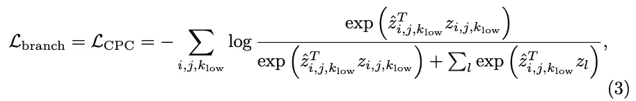
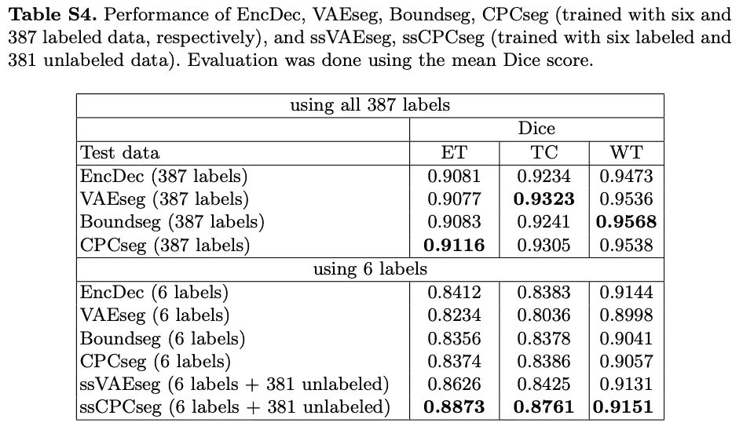
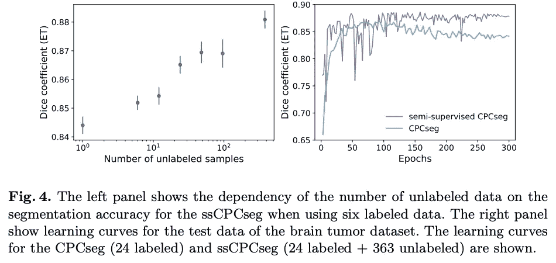

# 只有少量标签图像可用时的高效生物医学分割@MICCAI2020

> 原文：<https://pub.towardsai.net/efficient-biomedical-segmentation-when-only-a-few-label-images-are-available-2e0b2513703d?source=collection_archive---------1----------------------->

## 计算机视觉

## 一种使用对比学习的最新无监督分割方案

MICCAI 2020

[国家癌症研究所](https://unsplash.com/@nci?utm_source=medium&utm_medium=referral)在 [Unsplash](https://unsplash.com?utm_source=medium&utm_medium=referral) 上拍摄的照片

在这个故事中，标签有效的多任务分割使用对比学习，由东京大学和首选网络，提出。这是作为 MICCAI BrainLes 2020 研讨会的技术论文发表的。针对只有少量标记数据的精确医学图像任务，提出了一种多任务分割模型，并使用对比学习来训练分割模型。我们首次通过实验展示了对比预测编码[Oord 等人，2018 年和 H enaff 等人，2019 年]作为使用标记和未标记图像进行图像分割的正则化任务的有效性，结果为标记高效分割提供了新的方向。结果表明，当标注数据量有限时，它优于其他多任务方法，包括最先进的完全监督模型。实验表明，当标注的数据量有限时，使用未标记的数据可以提供最先进的性能。

让我们看看他们是如何做到的。我只解释 ssCPCseg 的精髓，所以如果你有兴趣阅读我的博客，请点击 [**ssCPCseg 论文**](https://arxiv.org/pdf/2009.11160.pdf) **和** [**Github。**](https://github.com/pfnet-research/label-efficient-brain-tumor-segmentation)

# 这篇论文说了什么？

获取诸如临床数据的 3D 医学图像的注释通常是昂贵的。另一方面，通常存在大量未标记的图像。因此，半监督学习方法在医学图像分割任务中有着广泛的应用。

自监督学习是一种表示学习方法，它从剩余输入数据中的未标记输入数据中预测缺失的输入数据。对比预测编码(CPC)已被提出作为一种自监督学习的方法，它可以应用于数据域中的小标签图像网络分类任务，它已被提出优于完全学习方法[H enaff 等人，2019]，但 CPC 在分割任务中的有效性尚未得到研究。

由于可以通过共享主分割任务和正则化子任务的参数来降低过拟合的风险，因此多任务学习被认为是用于小数据的有效方法。

当标记数据量较小时，半监督 CPCseg (ssCPCseg)优于所有其他正则化方法，包括 VAEseg，一种完全监督的最新模型(表 1)。因此，基于对比学习(CPC)的方法被整合到多任务分割模型任务中。

# 方法学

如图 1 所示，本文中的医学图像分割网络是一个编码器/解码器结构，其中对比预测编码(CPC)分支在编码器块的末端与解码器块分支。编码器和解码器由类 ResNet 块(ResBlocks)组成，在编码器和解码器之间有跳跃连接。除了党支部之外，不同类型的正规化党支部，VAE 支部和边界关注支部，都在本文中得到了实施，但我的博客只关注党支部。

## 对比预测编码分支

首先，输入图像被分成 16 个 32×32×32 体素的重叠片。使用编码器-解码器架构中的编码器对每个分割的小块分别进行编码，进行空间平均，并聚合成单个特征向量 *z_i，j，k* 。

然后将第八层 ResBlock *f_res8* 和线性层 *W* 应用于这个特征向量的上半部分，预测特征向量的下半部分 *z_i，j，k_low* 。此外，负样本 *z_l* 随机取自同一图像的不同块中编码的其他特征向量。

*z^* 由以下等式表示。

从上面可以看出，CPC 损失可以表示如下。

# 结果

在实验中，测量了四种模型的分割性能，以便比较不同的正则化效果:单独的编码器-解码器(EncDec)、具有 VAE 分支的 enc dec(VAEseg)、具有边界注意分支的 enc dec(Boundseg)和具有 CPC 分支的 enc dec(CPC seg)。

表 4s 中的结果表明，当标记数据量较小时，具有标记数据的正则化分支对分割性能的影响有限。半监督 CPCseg (ssCPCseg)的分割结果显示，半监督方法优于完全监督方法(图 4)，半监督 CPCseg 从标记和未标记数据中学习表示。此外，ssCPCseg 在具有小标记数据的区域中优于所有其他正则化方法，包括完全监督的最新模型 VAEseg。

这些结果表明，当标注数据量有限时，使用 CPC 分支的半监督方法可以提供最先进的性能。

## 参考

【Oord et al .，2018】范·登·奥尔德，a .，李，y .，Vinyals，`:使用对比预测编码的表征学习，“arXiv e-prints arXiv:1807.03748(2018)

【H enaff et al .，2019】H enaff，O.J .，Srinivas，a .，德法乌，j .，Razavi，a .，Doersch，c .，Eslami，S.M.A .，van den Oord，`:使用对比预测编码的数据高效图像识别，“arXiv e-prints arXiv:1905.09272(2019)

[[ssCPCseg](https://arxiv.org/pdf/2009.11160.pdf)][[Github](https://github.com/pfnet-research/label-efficient-brain-tumor-segmentation)]j . Iwas awa，Y. Hirano 和 Y. Sugawara，“使用对比学习的标签高效多任务分割”，MICCAI BrainLes 2020 研讨会

# 过去论文摘要列表

## 深度学习方法

**2020:[**[**DCTNet**](https://medium.com/towards-artificial-intelligence/lets-compress-the-cnn-training-like-a-jpeg-compression-ca8237c56f3c)**】**

## 不确定性学习

**2020:****[**DUL**](https://mako95.medium.com/cvpr2020-paper-summary-data-uncertainty-in-face-recognition-1f17547473a2)**

## ****异常检测****

******2020 年:【**[**FND**](https://medium.com/towards-artificial-intelligence/for-safety-reasons-self-driving-cars-must-not-miss-detecting-the-signs-bb26e65e721)****

## ******一级分类******

********2019:【**[**DOC**](https://medium.com/swlh/paper-summary-deep-one-class-classification-doc-adc4368af75c)******

********2020:【**[**DROC**](https://medium.com/the-shadow/exploring-important-feature-repressions-in-deep-one-class-classification-droc-d04a59558f9e)******

## ******图象分割法******

********2018:**[**【UOLO】**](https://medium.com/swlh/paper-summary-biomedical-image-segmentation-and-object-detection-uolo-c1175ba5c8c4)******

******2020:【**[**ssCPCseg**](https://medium.com/towards-artificial-intelligence/efficient-biomedical-segmentation-when-only-a-few-label-images-are-available-2e0b2513703d)****

## ******图像聚类******

********2020:**[**【DTC】**](https://medium.com/swlh/paper-deep-transfer-clustering-dtc-learning-to-discover-novel-visual-categories-ec5a26aea075)******