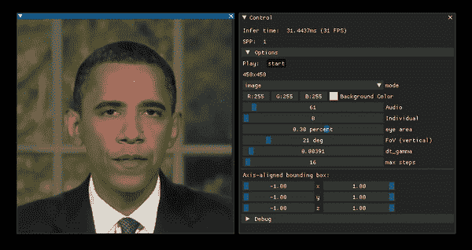
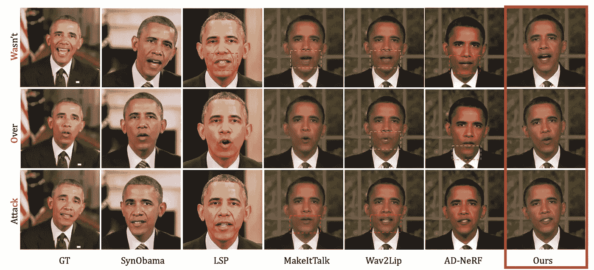
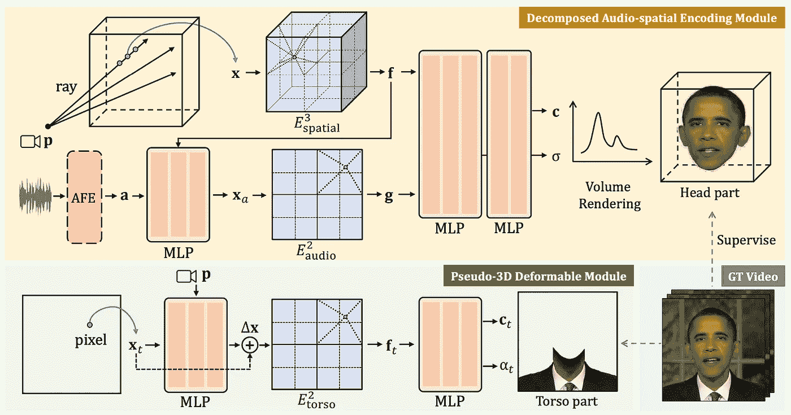
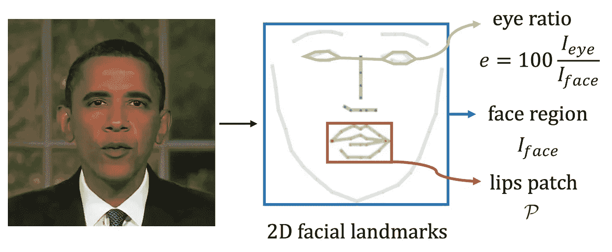
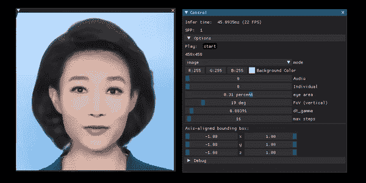

# 用于实时人像合成的高效 NeRF

> 原文：<https://pub.towardsai.net/efficient-nerfs-for-real-time-portrait-synthesis-rad-nerf-8a20adc72395?source=collection_archive---------2----------------------->

## 从音频到人工智能实时对话头！

> 最初发表于 [louisbouchard.ai](https://www.louisbouchard.ai/rad-nerf/) ，前两天在[我的博客上读到的！](https://www.louisbouchard.ai/rad-nerf/)

## 观看视频

我们听说过 deepfakes，我们听说过 NeRFs，我们也看到过这类应用程序允许你重建某人的脸，并让他说出你想说的任何话。

你可能不知道这些方法的效率有多低，以及它们需要多少计算和时间。另外，我们只看到最好的结果。请记住，我们在网上看到的是与我们可以找到的大多数例子的脸相关的结果，所以基本上，互联网人物和产生这些结果的模型是使用大量计算训练的，这意味着像许多图形卡这样的昂贵资源。尽管如此，结果确实令人印象深刻，而且只会越来越好。

肖像操纵示例来自[项目页面](https://me.kiui.moe/radnerf/)。

幸运的是，一些人，比如唐家贤和他的同事，正在研究一种叫做 RAD-NeRF 的新模型，使这些方法变得更加可行和有效。

从一个单独的视频中，他们可以以更好的质量实时合成人所说的几乎任何单词或句子。您可以实时制作跟随任何音频轨道的正在说话的头部动画。这既酷又吓人。

不同方法的质量比较，方法在最后一栏。图片来自报纸。

想象一下如果我们能让你说任何话会有什么结果。至少，他们仍然需要获得你在摄像机前讲话五分钟的视频，所以在你不知情的情况下很难做到这一点。尽管如此，只要你出现在网上，任何人都可以使用这样的模型，创建你谈论任何他们想要的东西的无限视频。他们甚至可以用这种方法托管直播流，这甚至更危险，也更难说出真假。不管怎样，尽管这很有趣，我也很想在评论中听到你们的想法，并继续讨论下去，但在这里我想涵盖一些积极和令人兴奋的东西:科学。更准确地说，他们是如何做到仅用面部视频就能从任何音频中实时激活说话的头部的…

正如他们所说，他们的 RAD-NeRF 模型可以比以前的作品快 500 倍，具有更好的渲染质量和更多的控制。你可能会问这怎么可能？我们通常以质量换取效率，然而他们却难以置信地同时提高了质量和效率。

这些巨大的进步之所以成为可能，主要归功于三点。

前两个与模型的架构有关。更具体地说，他们如何调整 NeRF 方法，使其更有效，并改善躯干和头部的运动。

RAD-NeRF 概述。图片来自报纸。

第一步是提高 NeRFs 的效率(模型概述中的黄色矩形)。我不会深究神经系统是如何工作的，因为我们已经在[讨论过无数次了](https://youtu.be/ZkaTyBvS2w4)。基本上，它是一种基于神经网络的方法，用于从一组 2D 图像(即常规图像)中重建 3D 立体场景。这就是为什么他们会将视频作为输入，因为它基本上从许多不同的角度给你一个人的许多图像。

因此，它通常使用一个网络来预测您正在可视化的相机视点的所有像素颜色和密度，并在围绕主题旋转时对您想要显示的所有视点进行预测，这是非常消耗计算的，因为每次学习预测所有参数时，您都要预测图像中每个坐标的多个参数。另外，在他们的情况下，它不仅仅是一个产生 3D 场景的 NeRF。它还必须匹配音频输入，并使嘴唇、嘴巴、眼睛和动作与人所说的相匹配。

他们将使用两个独立的新的压缩空间，称为网格空间，或基于网格的 NeRF，而不是预测特定帧的所有像素密度和颜色与音频匹配。他们将把他们的坐标转换到一个更小的 3D 网格空间，把他们的音频转换到一个更小的 2D 网格空间，然后把它们发送到渲染头部。这意味着他们永远不会将音频数据与空间数据合并，这将成倍增加大小，为每个坐标添加二维输入。因此，减少音频特征的大小以及保持音频和空间特征分离是使该方法更加有效的原因。

但是如果他们使用具有更少信息的压缩空间，结果怎么会更好呢？与以前的方法相比，在我们的网格 NeRF 中添加一些可控的功能，如眨眼控制，该模型将学习更真实的眼睛行为。对现实主义来说非常重要的东西。

他们所做的第二个改进(模型概述中的绿色矩形)是使用相同的方法用另一个 NeRF 建模躯干，而不是试图用用于头部的同一 NeRF 建模躯干，这将需要更少的参数和不同的需求，因为这里的目标是动画移动的头部而不是整个身体。由于躯干在这些情况下几乎是静态的，他们使用了一个更简单、更有效的基于 NeRF 的模块，该模块只在 2D 工作，直接在图像空间中工作，而不是像我们通常使用 NeRF 那样使用相机光线来生成许多不同的角度，这对于躯干是不需要的。因此，这基本上是更有效的，因为他们修改了这种非常具体的刚性躯干和移动头部视频用例的方法。然后，他们将头部和躯干重新组合，制作出最终的视频。

瞧！这就是你如何在任何音频输入上高效地制作有声视频！

当然，这只是这个令人兴奋的新研究出版物的概述，他们在训练他们的算法期间做了其他修改，以使其更有效，这是我在文章开头提到的第三点。我邀请你阅读他们的论文以获得更多信息。链接在下面的参考资料中。

在你离开之前，我只想感谢那些最近通过 [Patreon](https://www.patreon.com/whatsai) 支持这个频道的人。这是不必要的，并严格支持我在这里做的工作。

非常感谢 Artem Vladykin、Leopoldo Altamirano、Jay Cole、Michael Carychao、Daniel Gimness 和一些匿名的慷慨捐助者。如果你也想并能负担得起在经济上支持我在[帕特里翁](https://www.patreon.com/whatsai)的工作，我将不胜感激。但如果没有也不用担心。对这篇文章真诚的反馈是我快乐所需要的！

我希望你喜欢这篇文章，下周我会带着另一篇精彩的文章来看你！

## 参考

唐军，王，周，陈，陈，何，胡，刘，曾，王，2022。通过音频-空间分解的实时神经辐射说话人像合成。 *arXiv 预印本 arXiv:2211.12368* 。
结果/项目页面:[https://me.kiui.moe/radnerf/](https://me.kiui.moe/radnerf/)